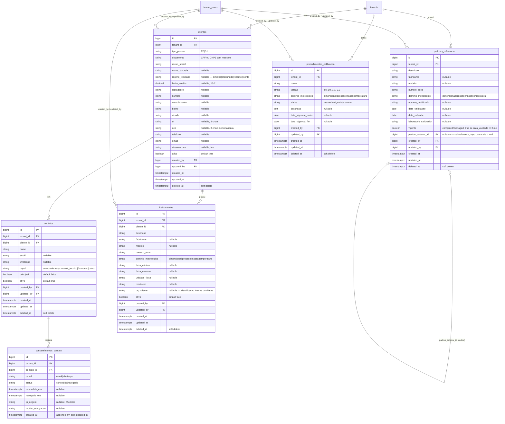

# ERD — E03 Cadastro Core

> **Status:** draft
> **Data:** 2026-04-15
> **Épico:** E03 — Cadastro Core
> **Dependência:** E02 (tenants, companies, tenant_users, consent_subjects, consent_records)

---

## 1. Diagrama

---

## 2. Tabelas detalhadas

### 2.1 clientes

| Coluna | Tipo PostgreSQL | Nullable | Default | Constraint | Índice | Nota |
|---|---|---|---|---|---|---|
| id | bigserial | não | auto | PK | — | |
| tenant_id | bigint | não | — | FK tenants(id) RESTRICT | btree | |
| tipo_pessoa | varchar(2) | não | — | CHECK in ('PF','PJ') | — | |
| documento | varchar(18) | não | — | — | btree composto | Unicidade: (tenant_id, documento) |
| razao_social | varchar(255) | não | — | — | btree (tenant_id, razao_social) | Busca por nome |
| nome_fantasia | varchar(255) | sim | null | — | — | |
| regime_tributario | varchar(20) | sim | null | CHECK in ('simples','presumido','real','mei','isento') | — | |
| limite_credito | numeric(15,2) | sim | null | CHECK >= 0 | — | |
| logradouro | varchar(255) | sim | null | — | — | |
| numero | varchar(20) | sim | null | — | — | |
| complemento | varchar(100) | sim | null | — | — | |
| bairro | varchar(100) | sim | null | — | — | |
| cidade | varchar(100) | sim | null | — | — | |
| uf | char(2) | sim | null | — | — | |
| cep | varchar(8) | sim | null | — | — | Armazenado sem máscara |
| telefone | varchar(20) | sim | null | — | — | |
| email | varchar(254) | sim | null | — | — | |
| observacoes | text | sim | null | — | — | |
| ativo | boolean | não | true | — | btree (tenant_id, ativo) | |
| created_by | bigint | não | — | FK tenant_users(id) RESTRICT | — | |
| updated_by | bigint | não | — | FK tenant_users(id) RESTRICT | — | |
| created_at | timestamptz | não | now() | — | — | |
| updated_at | timestamptz | não | now() | — | — | |
| deleted_at | timestamptz | sim | null | — | btree | Soft delete |

**Índices compostos:**
- `UNIQUE (tenant_id, documento) WHERE deleted_at IS NULL` — unicidade de documento por tenant (não conflita com inativos deletados)
- `btree (tenant_id, razao_social)` — listagem e busca
- `btree (tenant_id, ativo)` — filtro de ativos
- `btree (deleted_at)` — queries de soft delete

**RLS:** `tenant_id = current_setting('app.current_tenant_id')::bigint`

**Audit:** trait `OwenIt\Auditing\Auditable` no Model — registra CREATE, UPDATE, DELETE (soft).

---

### 2.2 contatos

| Coluna | Tipo PostgreSQL | Nullable | Default | Constraint | Índice | Nota |
|---|---|---|---|---|---|---|
| id | bigserial | não | auto | PK | — | |
| tenant_id | bigint | não | — | FK tenants(id) RESTRICT | btree | |
| cliente_id | bigint | não | — | FK clientes(id) RESTRICT | btree | |
| nome | varchar(255) | não | — | — | — | |
| email | varchar(254) | sim | null | — | — | |
| whatsapp | varchar(20) | sim | null | — | — | Dígitos apenas |
| papel | varchar(30) | não | — | CHECK in ('comprador','responsavel_tecnico','financeiro','outro') | btree (tenant_id, papel) | |
| principal | boolean | não | false | — | — | Apenas 1 por cliente — enforçado na app |
| ativo | boolean | não | true | — | btree (tenant_id, ativo) | |
| created_by | bigint | não | — | FK tenant_users(id) RESTRICT | — | |
| updated_by | bigint | não | — | FK tenant_users(id) RESTRICT | — | |
| created_at | timestamptz | não | now() | — | — | |
| updated_at | timestamptz | não | now() | — | — | |
| deleted_at | timestamptz | sim | null | — | btree | Soft delete |

**Índices compostos:**
- `btree (cliente_id, ativo)` — listagem de contatos por cliente
- `btree (tenant_id, cliente_id)` — isolamento

**RLS:** `tenant_id = current_setting('app.current_tenant_id')::bigint`

---

### 2.3 consentimentos_contato

> Tabela append-only. Trigger PostgreSQL bloqueia UPDATE e DELETE. Sem `updated_at`.
> Consentimento LGPD é imutável após registro — nova linha para revogação.

| Coluna | Tipo PostgreSQL | Nullable | Default | Constraint | Índice | Nota |
|---|---|---|---|---|---|---|
| id | bigserial | não | auto | PK | — | |
| tenant_id | bigint | não | — | FK tenants(id) RESTRICT | btree | |
| contato_id | bigint | não | — | FK contatos(id) RESTRICT | btree | |
| canal | varchar(20) | não | — | CHECK in ('email','whatsapp') | — | |
| status | varchar(20) | não | — | CHECK in ('concedido','revogado') | — | |
| concedido_em | timestamptz | sim | null | — | — | |
| revogado_em | timestamptz | sim | null | — | — | |
| ip_origem | varchar(45) | sim | null | — | — | IPv6 compatível |
| motivo_revogacao | varchar(100) | sim | null | — | — | |
| created_at | timestamptz | não | now() | — | — | Apenas created_at |

**Índices compostos:**
- `btree (contato_id, canal, created_at DESC)` — consulta do consentimento atual por canal
- `btree (tenant_id, contato_id, canal, status)` — isolamento e filtros

**RLS:** `tenant_id = current_setting('app.current_tenant_id')::bigint`

**Trigger append-only:** bloqueia `UPDATE`, `DELETE`, `TRUNCATE` (padrão de `consent_records`).

---

### 2.4 instrumentos

| Coluna | Tipo PostgreSQL | Nullable | Default | Constraint | Índice | Nota |
|---|---|---|---|---|---|---|
| id | bigserial | não | auto | PK | — | |
| tenant_id | bigint | não | — | FK tenants(id) RESTRICT | btree | |
| cliente_id | bigint | não | — | FK clientes(id) RESTRICT | btree | |
| descricao | varchar(255) | não | — | — | — | Nome do instrumento |
| fabricante | varchar(100) | sim | null | — | — | |
| modelo | varchar(100) | sim | null | — | — | |
| numero_serie | varchar(100) | não | — | — | btree composto | Unicidade: (tenant_id, numero_serie) |
| dominio_metrologico | varchar(20) | não | — | CHECK in ('dimensional','pressao','massa','temperatura') | btree (tenant_id, dominio) | |
| faixa_minima | varchar(50) | sim | null | — | — | Valor como string — unidade em unidade_faixa |
| faixa_maxima | varchar(50) | sim | null | — | — | |
| unidade_faixa | varchar(20) | sim | null | — | — | ex: mm, bar, kg, °C |
| resolucao | varchar(50) | sim | null | — | — | ex: 0.001 mm |
| tag_cliente | varchar(100) | sim | null | — | — | Código interno do cliente |
| ativo | boolean | não | true | — | btree (tenant_id, ativo) | |
| created_by | bigint | não | — | FK tenant_users(id) RESTRICT | — | |
| updated_by | bigint | não | — | FK tenant_users(id) RESTRICT | — | |
| created_at | timestamptz | não | now() | — | — | |
| updated_at | timestamptz | não | now() | — | — | |
| deleted_at | timestamptz | sim | null | — | btree | Soft delete |

**Índices compostos:**
- `UNIQUE (tenant_id, numero_serie) WHERE deleted_at IS NULL` — unicidade de número de série por tenant
- `btree (tenant_id, dominio_metrologico)` — filtro por domínio
- `btree (cliente_id, ativo)` — listagem por cliente
- `btree (tenant_id, ativo)` — listagem geral

**RLS:** `tenant_id = current_setting('app.current_tenant_id')::bigint`

**Audit:** trait `Auditable` — registra CREATE, UPDATE, DELETE (soft).

---

### 2.5 padroes_referencia

| Coluna | Tipo PostgreSQL | Nullable | Default | Constraint | Índice | Nota |
|---|---|---|---|---|---|---|
| id | bigserial | não | auto | PK | — | |
| tenant_id | bigint | não | — | FK tenants(id) RESTRICT | btree | |
| descricao | varchar(255) | não | — | — | — | |
| fabricante | varchar(100) | sim | null | — | — | |
| modelo | varchar(100) | sim | null | — | — | |
| numero_serie | varchar(100) | não | — | — | btree composto | Unicidade: (tenant_id, numero_serie) |
| dominio_metrologico | varchar(20) | não | — | CHECK in ('dimensional','pressao','massa','temperatura') | btree (tenant_id, dominio) | |
| numero_certificado | varchar(100) | sim | null | — | — | |
| data_calibracao | date | sim | null | — | — | |
| data_validade | date | sim | null | — | btree (tenant_id, data_validade) | Usado por Job de vencimento |
| laboratorio_calibrador | varchar(255) | sim | null | — | — | Nome do lab que calibrou o padrão |
| vigente | boolean | não | true | — | btree (tenant_id, vigente) | Gerenciado pelo Job de vencimento |
| padrao_anterior_id | bigint | sim | null | FK padroes_referencia(id) RESTRICT | btree | Self-reference; null = topo da cadeia |
| created_by | bigint | não | — | FK tenant_users(id) RESTRICT | — | |
| updated_by | bigint | não | — | FK tenant_users(id) RESTRICT | — | |
| created_at | timestamptz | não | now() | — | — | |
| updated_at | timestamptz | não | now() | — | — | |
| deleted_at | timestamptz | sim | null | — | btree | Soft delete |

**Índices compostos:**
- `UNIQUE (tenant_id, numero_serie) WHERE deleted_at IS NULL`
- `btree (tenant_id, data_validade)` — Job de vencimento usa `WHERE data_validade <= hoje + 30`
- `btree (tenant_id, vigente)` — filtro de padrões vigentes
- `btree (padrao_anterior_id)` — navegação da cadeia de rastreabilidade

**RLS:** `tenant_id = current_setting('app.current_tenant_id')::bigint`

**Anti-ciclo:** validado na camada de aplicação (Model `PadraoReferencia`) antes de salvar `padrao_anterior_id`. A validação percorre a cadeia recursivamente até encontrar null ou detectar um ciclo.

**Evento de domínio:** `PadraoReferencia.vencido` — disparado pelo Job quando `data_validade < hoje`. Bloqueia uso do padrão em novas OS.

**Audit:** trait `Auditable`.

---

### 2.6 procedimentos_calibracao

| Coluna | Tipo PostgreSQL | Nullable | Default | Constraint | Índice | Nota |
|---|---|---|---|---|---|---|
| id | bigserial | não | auto | PK | — | |
| tenant_id | bigint | não | — | FK tenants(id) RESTRICT | btree | |
| nome | varchar(255) | não | — | — | btree (tenant_id, nome) | |
| versao | varchar(20) | não | — | — | — | ex: 1.0, 2.1 |
| dominio_metrologico | varchar(20) | não | — | CHECK in ('dimensional','pressao','massa','temperatura') | btree (tenant_id, dominio) | |
| status | varchar(20) | não | 'rascunho' | CHECK in ('rascunho','vigente','obsoleto') | btree (tenant_id, status) | |
| descricao | text | sim | null | — | — | |
| data_vigencia_inicio | date | sim | null | — | — | |
| data_vigencia_fim | date | sim | null | — | — | |
| created_by | bigint | não | — | FK tenant_users(id) RESTRICT | — | |
| updated_by | bigint | não | — | FK tenant_users(id) RESTRICT | — | |
| created_at | timestamptz | não | now() | — | — | |
| updated_at | timestamptz | não | now() | — | — | |
| deleted_at | timestamptz | sim | null | — | btree | Soft delete |

**Índices compostos:**
- `UNIQUE (tenant_id, nome, versao) WHERE deleted_at IS NULL` — uma versão por nome por tenant
- Partial unique index para status vigente:
  `CREATE UNIQUE INDEX proc_calibracao_vigente_unico ON procedimentos_calibracao (tenant_id, nome, dominio_metrologico) WHERE status = 'vigente' AND deleted_at IS NULL`
- `btree (tenant_id, status)` — listagem por status
- `btree (tenant_id, dominio_metrologico)` — filtro por domínio

**RLS:** `tenant_id = current_setting('app.current_tenant_id')::bigint`

**Audit:** trait `Auditable`.

---

### 2.7 audits (owen-it/laravel-auditing)

> Tabela gerenciada pelo pacote. Listada aqui apenas para referência de consulta.
> Não há migration manual — o pacote publica sua própria migration.

| Coluna relevante | Tipo | Nota |
|---|---|---|
| id | bigint PK | |
| user_type / user_id | string / bigint | quem fez a ação |
| event | string | created, updated, deleted, restored |
| auditable_type / auditable_id | string / bigint | polymorphic — aponta para clientes, instrumentos, etc. |
| old_values / new_values | json | campos antes e depois |
| ip_address / user_agent | string | rastreabilidade |
| created_at | timestamp | |

**Isolamento:** a tabela `audits` não tem `tenant_id` direto. Consulta segura: join com a tabela auditável filtrando pelo `tenant_id` desta. O policy de RLS da tabela auditável protege o acesso indireto.

---

## 3. Resumo de relacionamentos

| Relacionamento | Cardinalidade | Tipo FK | ON DELETE |
|---|---|---|---|
| tenants → clientes | 1:N | bigint | RESTRICT |
| tenants → padroes_referencia | 1:N | bigint | RESTRICT |
| tenants → procedimentos_calibracao | 1:N | bigint | RESTRICT |
| clientes → contatos | 1:N | bigint | RESTRICT |
| clientes → instrumentos | 1:N | bigint | RESTRICT |
| contatos → consentimentos_contato | 1:N | bigint | RESTRICT |
| padroes_referencia → padroes_referencia (self) | 0..1:N | bigint nullable | RESTRICT |
| tenant_users → clientes (created_by/updated_by) | N:1 | bigint | RESTRICT |
| tenant_users → instrumentos (created_by/updated_by) | N:1 | bigint | RESTRICT |
| tenant_users → padroes_referencia (created_by/updated_by) | N:1 | bigint | RESTRICT |
| tenant_users → procedimentos_calibracao (created_by/updated_by) | N:1 | bigint | RESTRICT |

**ON DELETE RESTRICT** em todas as FKs: nenhum dado regulatório pode ser destruído em cascata.
