# ERD E02 — Multi-tenancy, Auth e Planos

> **Status:** draft — aguardando revisão do PM e do gate técnico.
> **Data:** 2026-04-13.
> **Epico:** E02 — Multi-tenancy, Auth e Planos.
> **Documento do gate:** D.2 — Data Model Visual (ERD).
> **Base:** ADR-0001, ADR-0004, `epics/E02/epic.md`, `docs/architecture/foundation-constraints.md`.

---

## 1. Decisões de modelo

- Banco compartilhado com `tenant_id` e RLS para dados do tenant.
- Autenticação do MVP via Laravel Fortify + Sanctum.
- RBAC com papéis canônicos: `gerente`, `tecnico`, `administrativo`, `visualizador`.
- Suporte interno Kalibrium fica fora do tenant e usa log auditável.
- Planos e limites ficam modelados desde E02, mesmo que cobrança real continue fora do MVP.

---

## 2. ERD

```mermaid
erDiagram
    tenants ||--o{ companies : owns
    tenants ||--o{ branches : owns
    tenants ||--o{ tenant_users : scopes
    tenants ||--o{ subscriptions : has
    tenants ||--o{ tenant_entitlements : has
    tenants ||--o{ lgpd_categories : declares
    tenants ||--o{ consent_records : stores
    tenants ||--o{ support_audit_logs : audited_by

    users ||--o{ tenant_users : belongs_to
    users ||--o{ login_audit_logs : generates
    users ||--o{ personal_access_tokens : owns
    users ||--o{ sessions : owns

    companies ||--o{ branches : has
    companies ||--o{ tenant_users : limits_scope
    branches ||--o{ tenant_users : limits_scope

    roles ||--o{ tenant_user_roles : assigned
    permissions ||--o{ role_permissions : granted
    roles ||--o{ role_permissions : includes
    tenant_users ||--o{ tenant_user_roles : has

    plans ||--o{ subscriptions : selected
    plans ||--o{ plan_entitlements : defines
    features ||--o{ plan_entitlements : limits
    features ||--o{ tenant_entitlements : overrides

    consent_subjects ||--o{ consent_records : gives
    lgpd_categories ||--o{ consent_records : classifies

    tenants {
        uuid id PK
        string name
        string legal_name
        string document_number
        string status
        string operational_profile
        boolean emits_metrological_certificate
        jsonb accreditation_settings
        timestamps timestamps
    }

    companies {
        uuid id PK
        uuid tenant_id FK
        string legal_name
        string document_number
        string trade_name
        timestamps timestamps
    }

    branches {
        uuid id PK
        uuid tenant_id FK
        uuid company_id FK
        string name
        string document_number
        string city
        string state
        timestamps timestamps
    }

    users {
        uuid id PK
        string name
        string email
        timestamp email_verified_at
        string password
        text two_factor_secret
        text two_factor_recovery_codes
        timestamp two_factor_confirmed_at
        timestamps timestamps
    }

    tenant_users {
        uuid id PK
        uuid tenant_id FK
        uuid user_id FK
        uuid company_id FK
        uuid branch_id FK
        string status
        boolean requires_2fa
        timestamp invited_at
        timestamp accepted_at
        timestamps timestamps
    }

    roles {
        uuid id PK
        string name
        string guard_name
        timestamps timestamps
    }

    permissions {
        uuid id PK
        string name
        string guard_name
        timestamps timestamps
    }

    tenant_user_roles {
        uuid tenant_user_id FK
        uuid role_id FK
    }

    role_permissions {
        uuid role_id FK
        uuid permission_id FK
    }

    plans {
        uuid id PK
        string code
        string name
        boolean active
        timestamps timestamps
    }

    subscriptions {
        uuid id PK
        uuid tenant_id FK
        uuid plan_id FK
        string status
        date trial_ends_on
        date current_period_ends_on
        timestamps timestamps
    }

    features {
        uuid id PK
        string code
        string name
        string module
        timestamps timestamps
    }

    plan_entitlements {
        uuid id PK
        uuid plan_id FK
        uuid feature_id FK
        integer limit_value
        boolean enabled
        timestamps timestamps
    }

    tenant_entitlements {
        uuid id PK
        uuid tenant_id FK
        uuid feature_id FK
        integer limit_value
        boolean enabled
        timestamps timestamps
    }

    lgpd_categories {
        uuid id PK
        uuid tenant_id FK
        string code
        string name
        string legal_basis
        string retention_policy
        timestamps timestamps
    }

    consent_subjects {
        uuid id PK
        uuid tenant_id FK
        string subject_type
        uuid subject_id
        string email
        string phone
        timestamps timestamps
    }

    consent_records {
        uuid id PK
        uuid tenant_id FK
        uuid consent_subject_id FK
        uuid lgpd_category_id FK
        string channel
        string status
        timestamp granted_at
        timestamp revoked_at
        string ip_address
        string user_agent_hash
        string revocation_reason
        timestamps timestamps
    }

    revocation_tokens {
        uuid id PK
        uuid tenant_id FK
        uuid consent_subject_id FK
        string channel
        string token_hash
        timestamp expires_at
        timestamp used_at
        timestamps timestamps
    }

    login_audit_logs {
        uuid id PK
        uuid user_id FK
        uuid tenant_id FK
        string event
        string ip_address
        string user_agent_hash
        timestamps timestamps
    }

    support_audit_logs {
        uuid id PK
        uuid tenant_id FK
        uuid support_user_id FK
        string action
        text justification
        jsonb metadata
        timestamps timestamps
    }

    personal_access_tokens {
        bigint id PK
        string tokenable_type
        uuid tokenable_id
        string name
        string token
        timestamp last_used_at
        timestamp expires_at
        timestamps timestamps
    }

    sessions {
        string id PK
        uuid user_id FK
        string ip_address
        text user_agent
        text payload
        integer last_activity
    }
```

---

## 3. Regras de isolamento

| Entidade | Tenant scoped? | Regra |
|---|---|---|
| `tenants` | não | tabela raiz, acesso restrito a suporte e bootstrap |
| `companies`, `branches` | sim | `tenant_id` obrigatório + RLS |
| `tenant_users` | sim | usuário só enxerga vínculo do tenant ativo |
| `subscriptions`, `tenant_entitlements` | sim | gerente lê, suporte audita |
| `lgpd_categories`, `consent_records`, `consent_subjects` | sim | `tenant_id` obrigatório + RLS |
| `login_audit_logs` | parcialmente | inclui `tenant_id` quando login ocorreu em tenant |
| `support_audit_logs` | sim | leitura apenas suporte, append-only |
| `roles`, `permissions`, `plans`, `features` | não | catálogo global versionado |

---

## 4. Índices mínimos

| Tabela | Índice | Motivo |
|---|---|---|
| `tenants` | unique `document_number` | evitar duplicidade de laboratório raiz |
| `users` | unique `email` | login |
| `tenant_users` | unique `tenant_id,user_id,company_id,branch_id` | evitar vínculo duplicado |
| `tenant_users` | `tenant_id,status` | listagem por tenant |
| `subscriptions` | `tenant_id,status` | plano atual |
| `tenant_entitlements` | unique `tenant_id,feature_id` | override de feature |
| `consent_records` | `tenant_id,consent_subject_id,channel,status` | consulta de consentimento |
| `login_audit_logs` | `user_id,created_at` | auditoria de login |
| `support_audit_logs` | `tenant_id,created_at` | auditoria de suporte |

---

## 5. Perguntas deixadas para slice

- Se o convite de usuário será por tabela própria `user_invitations` ou por `tenant_users.status=invited`.
- Se `subscriptions` será suficiente sem entidade de cobrança real no MVP.
- Se `support_user_id` referencia a mesma tabela `users` ou uma tabela separada de operadores Kalibrium.
