# Master ERD — Kalibrium V2

> **Última atualização:** 2026-04-15 — E03 Cadastro Core adicionado
> **Épicos cobertos:** E02 (Multi-tenancy, Auth e Planos), E03 (Cadastro Core)
> **Próxima atualização:** ao iniciar E04 (Ordens de Serviço)

---

## Diagrama global

```mermaid
erDiagram
    %% ── CORE INFRA (E02) ──────────────────────────────────────────
    tenants ||--o{ companies : "owns"
    tenants ||--o{ branches : "owns"
    tenants ||--o{ tenant_users : "scopes"
    tenants ||--o{ subscriptions : "has"
    tenants ||--o{ tenant_entitlements : "has"
    tenants ||--o{ lgpd_categories : "declares"
    tenants ||--o{ consent_subjects : "stores"
    tenants ||--o{ support_audit_logs : "audited_by"

    users ||--o{ tenant_users : "belongs_to"
    users ||--o{ login_audit_logs : "generates"
    users ||--o{ personal_access_tokens : "owns"
    users ||--o{ sessions : "owns"

    companies ||--o{ branches : "has"
    companies ||--o{ tenant_users : "limits_scope"
    branches ||--o{ tenant_users : "limits_scope"

    roles ||--o{ tenant_user_roles : "assigned"
    permissions ||--o{ role_permissions : "granted"
    roles ||--o{ role_permissions : "includes"
    tenant_users ||--o{ tenant_user_roles : "has"

    plans ||--o{ subscriptions : "selected"
    plans ||--o{ plan_entitlements : "defines"
    features ||--o{ plan_entitlements : "limits"
    features ||--o{ tenant_entitlements : "overrides"

    consent_subjects ||--o{ consent_records : "gives"
    lgpd_categories ||--o{ consent_records : "classifies"

    %% ── CADASTRO CORE (E03) ───────────────────────────────────────
    tenants ||--o{ clientes : "tem"
    tenants ||--o{ padroes_referencia : "possui"
    tenants ||--o{ procedimentos_calibracao : "define"

    clientes ||--o{ contatos : "tem"
    clientes ||--o{ instrumentos : "possui"

    contatos ||--o{ consentimentos_contato : "registra"

    padroes_referencia }o--o| padroes_referencia : "padrao_anterior_id"

    tenant_users ||--o{ clientes : "created_by/updated_by"
    tenant_users ||--o{ instrumentos : "created_by/updated_by"
    tenant_users ||--o{ padroes_referencia : "created_by/updated_by"
    tenant_users ||--o{ procedimentos_calibracao : "created_by/updated_by"

    %% ── ENTIDADES ─────────────────────────────────────────────────
    tenants {
        bigint id PK
        string name
        string legal_name
        string document_number
        string status
        string operational_profile
        boolean emits_metrological_certificate
        jsonb accreditation_settings
        timestamps timestamps
    }

    companies {
        bigint id PK
        bigint tenant_id FK
        string legal_name
        string document_number
        string trade_name
        boolean is_root
        timestamps timestamps
    }

    branches {
        bigint id PK
        bigint tenant_id FK
        bigint company_id FK
        string name
        string document_number
        string city
        string state
        timestamps timestamps
    }

    users {
        bigint id PK
        string name
        string email
        timestamp email_verified_at
        string password
        text two_factor_secret
        text two_factor_recovery_codes
        timestamp two_factor_confirmed_at
        timestamps timestamps
    }

    tenant_users {
        bigint id PK
        bigint tenant_id FK
        bigint user_id FK
        bigint company_id FK
        bigint branch_id FK
        string status
        boolean requires_2fa
        timestamp invited_at
        timestamp accepted_at
        timestamps timestamps
    }

    roles {
        bigint id PK
        string name
        string guard_name
        timestamps timestamps
    }

    permissions {
        bigint id PK
        string name
        string guard_name
        timestamps timestamps
    }

    plans {
        bigint id PK
        string code
        string name
        boolean active
        timestamps timestamps
    }

    subscriptions {
        bigint id PK
        bigint tenant_id FK
        bigint plan_id FK
        string status
        date trial_ends_on
        date current_period_ends_on
        timestamps timestamps
    }

    features {
        bigint id PK
        string code
        string name
        string module
        timestamps timestamps
    }

    lgpd_categories {
        bigint id PK
        bigint tenant_id FK
        string code
        string name
        string legal_basis
        string retention_policy
        bigint created_by_user_id FK
        timestamps timestamps
    }

    consent_subjects {
        bigint id PK
        bigint tenant_id FK
        string subject_type
        bigint subject_id
        string email
        string phone
        timestamps timestamps
    }

    consent_records {
        bigint id PK
        bigint tenant_id FK
        bigint consent_subject_id FK
        bigint lgpd_category_id FK
        string channel
        string status
        timestamptz granted_at
        timestamptz revoked_at
        string ip_address
        string user_agent_hash
        string revocation_reason
        timestamp created_at
    }

    revocation_tokens {
        bigint id PK
        bigint tenant_id FK
        bigint consent_subject_id FK
        string channel
        string token_hash
        timestamp expires_at
        timestamp used_at
        timestamps timestamps
    }

    login_audit_logs {
        bigint id PK
        bigint user_id FK
        bigint tenant_id FK
        string event
        string ip_address
        string user_agent_hash
        timestamps timestamps
    }

    support_audit_logs {
        bigint id PK
        bigint tenant_id FK
        bigint support_user_id FK
        string action
        text justification
        jsonb metadata
        timestamps timestamps
    }

    clientes {
        bigint id PK
        bigint tenant_id FK
        string tipo_pessoa "PF|PJ"
        string documento
        string razao_social
        string nome_fantasia
        string regime_tributario
        decimal limite_credito
        string logradouro
        string numero
        string complemento
        string bairro
        string cidade
        char uf
        string cep
        string telefone
        string email
        text observacoes
        boolean ativo
        bigint created_by FK
        bigint updated_by FK
        timestamptz created_at
        timestamptz updated_at
        timestamptz deleted_at
    }

    contatos {
        bigint id PK
        bigint tenant_id FK
        bigint cliente_id FK
        string nome
        string email
        string whatsapp
        string papel
        boolean principal
        boolean ativo
        bigint created_by FK
        bigint updated_by FK
        timestamptz created_at
        timestamptz updated_at
        timestamptz deleted_at
    }

    consentimentos_contato {
        bigint id PK
        bigint tenant_id FK
        bigint contato_id FK
        string canal
        string status
        timestamptz concedido_em
        timestamptz revogado_em
        string ip_origem
        string motivo_revogacao
        timestamptz created_at
    }

    instrumentos {
        bigint id PK
        bigint tenant_id FK
        bigint cliente_id FK
        string descricao
        string fabricante
        string modelo
        string numero_serie
        string dominio_metrologico
        string faixa_minima
        string faixa_maxima
        string unidade_faixa
        string resolucao
        string tag_cliente
        boolean ativo
        bigint created_by FK
        bigint updated_by FK
        timestamptz created_at
        timestamptz updated_at
        timestamptz deleted_at
    }

    padroes_referencia {
        bigint id PK
        bigint tenant_id FK
        string descricao
        string fabricante
        string modelo
        string numero_serie
        string dominio_metrologico
        string numero_certificado
        date data_calibracao
        date data_validade
        string laboratorio_calibrador
        boolean vigente
        bigint padrao_anterior_id FK
        bigint created_by FK
        bigint updated_by FK
        timestamptz created_at
        timestamptz updated_at
        timestamptz deleted_at
    }

    procedimentos_calibracao {
        bigint id PK
        bigint tenant_id FK
        string nome
        string versao
        string dominio_metrologico
        string status
        text descricao
        date data_vigencia_inicio
        date data_vigencia_fim
        bigint created_by FK
        bigint updated_by FK
        timestamptz created_at
        timestamptz updated_at
        timestamptz deleted_at
    }
```

---

## Tabelas por épico

| Tabela | Épico criador | Tenant-scoped | RLS | Soft delete | Audit |
|---|---|---|---|---|---|
| `tenants` | E02 | não (raiz) | não | não | não |
| `companies` | E02 | sim | sim | não | não |
| `branches` | E02 | sim | sim | não | não |
| `users` | E02 | não (global) | não | não | não |
| `tenant_users` | E02 | sim | sim | não | não |
| `roles` | E02 | não (catálogo) | não | não | não |
| `permissions` | E02 | não (catálogo) | não | não | não |
| `tenant_user_roles` | E02 | via tenant_user | sim | não | não |
| `role_permissions` | E02 | não (catálogo) | não | não | não |
| `plans` | E02 | não (catálogo) | não | não | não |
| `subscriptions` | E02 | sim | sim | não | não |
| `features` | E02 | não (catálogo) | não | não | não |
| `plan_entitlements` | E02 | não (catálogo) | não | não | não |
| `tenant_entitlements` | E02 | sim | sim | não | não |
| `lgpd_categories` | E02 | sim | sim | não | não |
| `consent_subjects` | E02 | sim | sim | não | não |
| `consent_records` | E02 | sim | sim | não (append-only) | não |
| `revocation_tokens` | E02 | sim | sim | não | não |
| `login_audit_logs` | E02 | parcial | não | não | não |
| `support_audit_logs` | E02 | sim | não (suporte) | não | não |
| `personal_access_tokens` | E02 | não (Sanctum) | não | não | não |
| `sessions` | E02 | não (global) | não | não | não |
| `clientes` | **E03** | sim | sim | sim | sim (owen-it) |
| `contatos` | **E03** | sim | sim | sim | não |
| `consentimentos_contato` | **E03** | sim | sim | não (append-only) | não |
| `instrumentos` | **E03** | sim | sim | sim | sim (owen-it) |
| `padroes_referencia` | **E03** | sim | sim | sim | sim (owen-it) |
| `procedimentos_calibracao` | **E03** | sim | sim | sim | sim (owen-it) |
| `audits` | **E03** | global/poly | não | não | — (é o audit) |

---

## Tabelas reservadas para épicos futuros

| Tabela prevista | Épico | Referencia tabelas E03 |
|---|---|---|
| `ordens_servico` | E04 | `clientes`, `instrumentos`, `padroes_referencia`, `procedimentos_calibracao` |
| `itens_os` | E04 | `ordens_servico`, `instrumentos` |
| `calibracoes` | E05 | `ordens_servico`, `padroes_referencia`, `procedimentos_calibracao` |
| `certificados` | E05 | `calibracoes`, `instrumentos` |
| `documentos` | E10 | `clientes`, `instrumentos`, `padroes_referencia` |
