# Aceite: Ordem de serviço sincroniza entre app e servidor

> Como usar este arquivo: leia cada caminho de uso, olhe as imagens em sequência e confira se o produto está do jeito que você queria. No final, marque "é isso" ou descreva o que ficou errado.

---

## Usuários usados neste aceite

| Quem           | E-mail              | Papel                          |
| -------------- | ------------------- | ------------------------------ |
| Carlos Técnico | tecnico@teste.local | Técnico (usa o app no celular) |
| Marina Gerente | gerente@teste.local | Gerente (usa o painel web)     |

---

## Caminho 1 — Técnico abre o app, entra com suas credenciais e acessa as Ordens de Serviço

**1. O app abre a tela de login, com campo de e-mail e senha.**

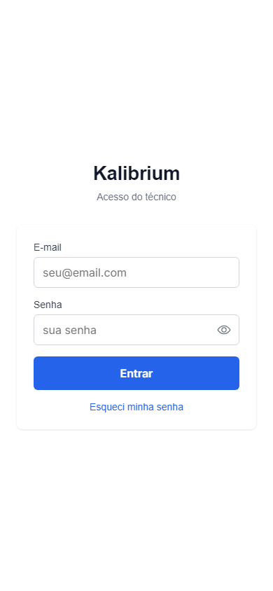

**2. Carlos digita seu e-mail e senha. Os campos ficam preenchidos.**

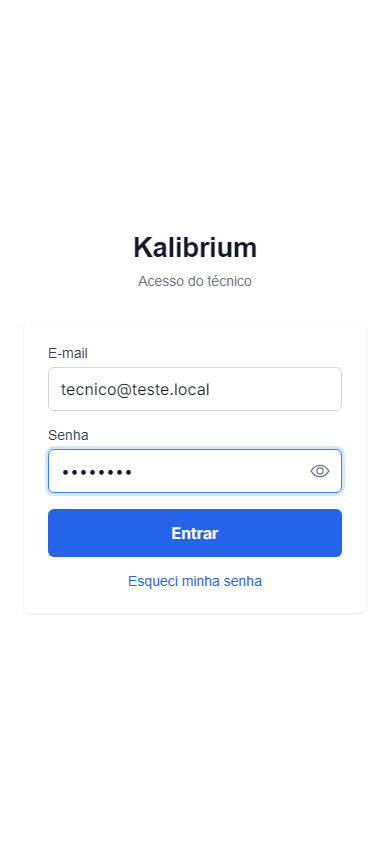

**3. Após entrar, o app vai para a tela inicial com saudação "Olá, Carlos". Aparecem os cards: "Ordens de hoje", "Anotações" e "Ordens de Serviço". O indicador verde "Online" confirma que está conectado.**

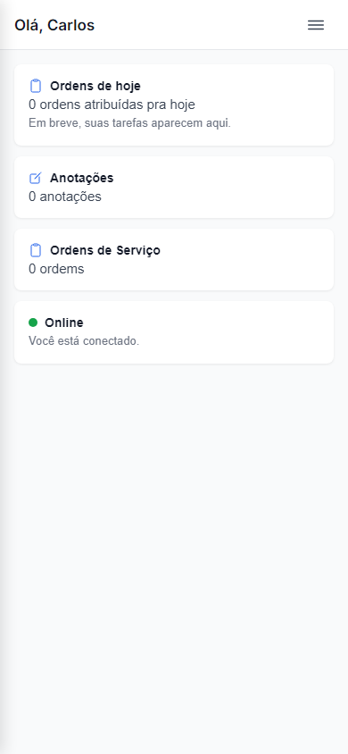

**4. Carlos toca em "Ordens de Serviço". A tela de lista abre. Como ainda não há OS cadastradas neste dispositivo, aparece a mensagem "Nenhuma ordem de serviço ainda" com instrução para tocar no botão "+". O botão azul "+" está no canto inferior direito.**

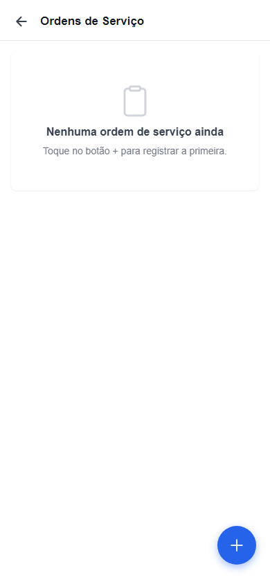

**5. Carlos toca no botão azul "+". Abre o formulário "Nova ordem de serviço" com os campos: Cliente, Instrumento, Status (padrão "Recebido"), e Observações.**

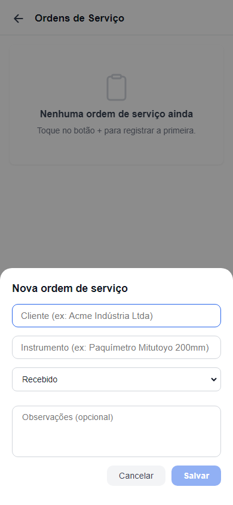

**6. Carlos preenche: Cliente "Acme Indústria Ltda", Instrumento "Paquímetro digital Mitutoyo 200mm", Status "Recebido", Observações "primeiro print". O botão "Salvar" fica azul (ativo).**

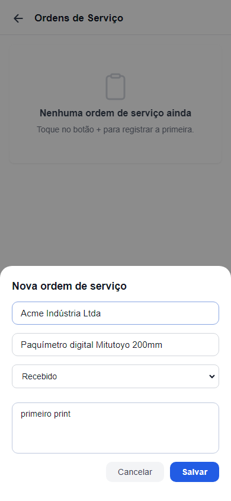

**7. Carlos toca em "Salvar". O formulário fecha. A lista mostra a OS criada: "Acme Indústria Ltda" com badge "Recebido" e indicador laranja "Aguardando sincronizar" (ainda não enviou pro servidor). O badge amarelo no topo mostra "1 pendente".**

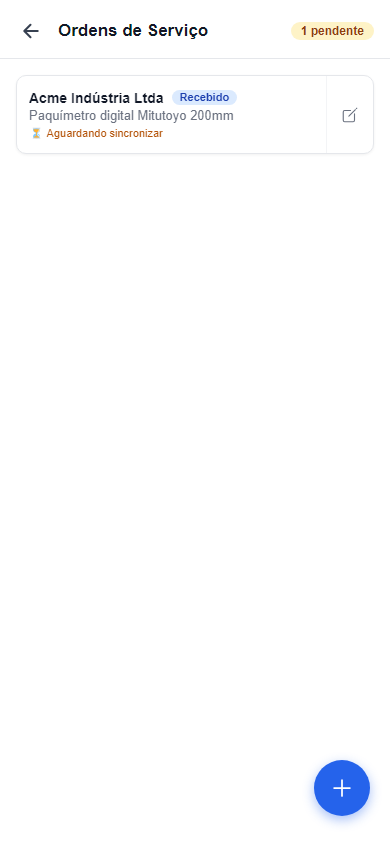

---

## Caminho 2 — Técnico edita o status da OS para "Em calibração"

**8. Carlos toca na OS "Acme Indústria Ltda" da lista. Abre o formulário de edição com os dados preenchidos. O título muda para "Editar ordem de serviço".**

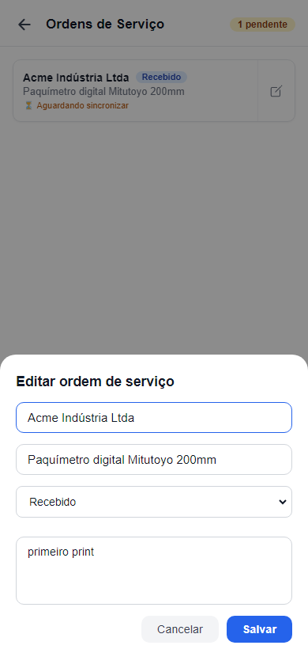

**9. Carlos muda o campo Status de "Recebido" para "Em calibração".**

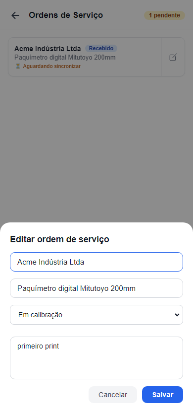

**10. Carlos toca em "Salvar". A lista volta a aparecer. O badge agora mostra "Em calibração" em amarelo-dourado (antes era roxo "Recebido"). O indicador "Aguardando sincronizar" permanece até o envio ao servidor.**

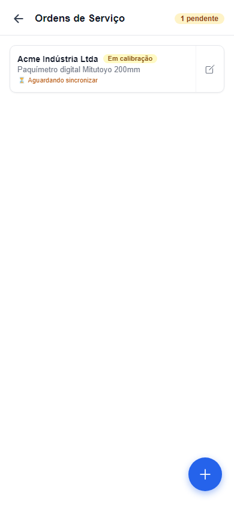

---

## Caminho 3 — Gerente vê as ordens do técnico no painel web

**11. Marina abre o painel web e entra com suas credenciais.**

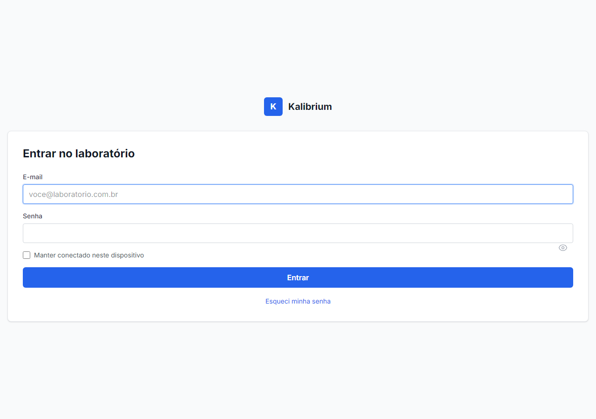

**12. A tela inicial do painel aparece com o nome "Bom dia, Marina Gerente". O resumo mostra: celulares aguardando aprovação, técnicos com acesso ativo e celulares bloqueados. O menu lateral tem "Técnicos", "Celulares dos técnicos", "Ordens de serviço", "Clientes", entre outros.**

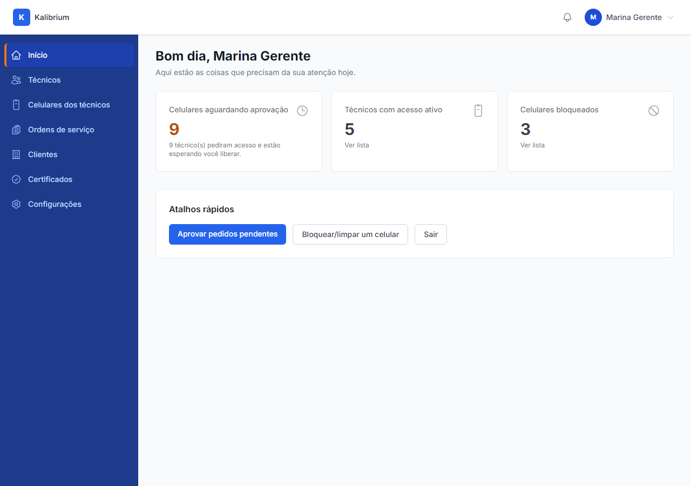

**13. Marina navega até "Técnicos". Aparece a lista completa com Carlos Técnico (ativo) e os demais.**

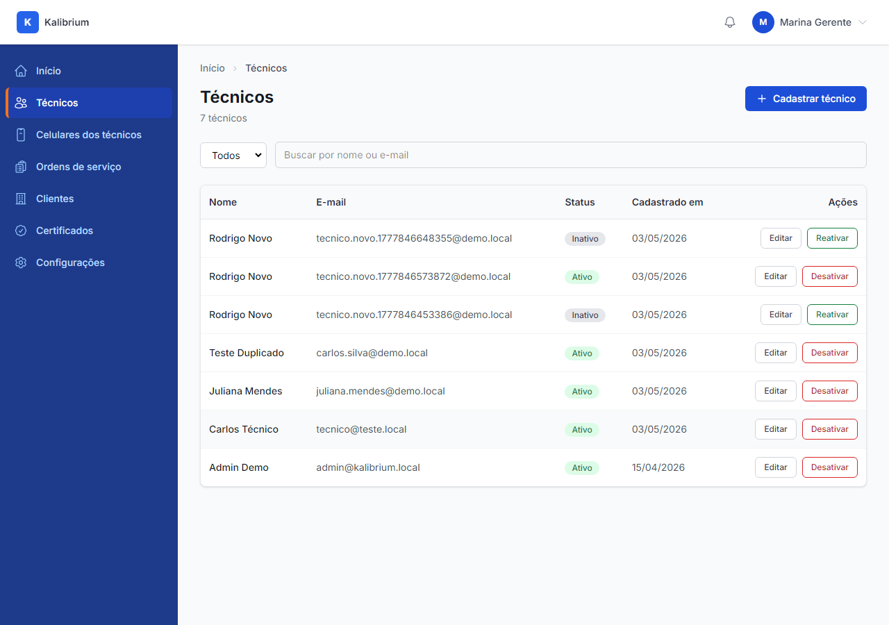

**14. Marina acessa a aba "Ordens de Serviço" do Carlos Técnico. A tabela mostra as OS registradas pelo Carlos em campo: "Beta Metrologia SA" com badge amarelo "Em calibração" e "Acme Indústria Ltda" com badge roxo "Recebido". Colunas: Cliente, Instrumento, Status, Última Atualização. Sem botão de editar ou excluir — a gerente só lê.**

**15. Confirmação: a tela de OS do técnico não tem nenhum botão de edição ou exclusão.**

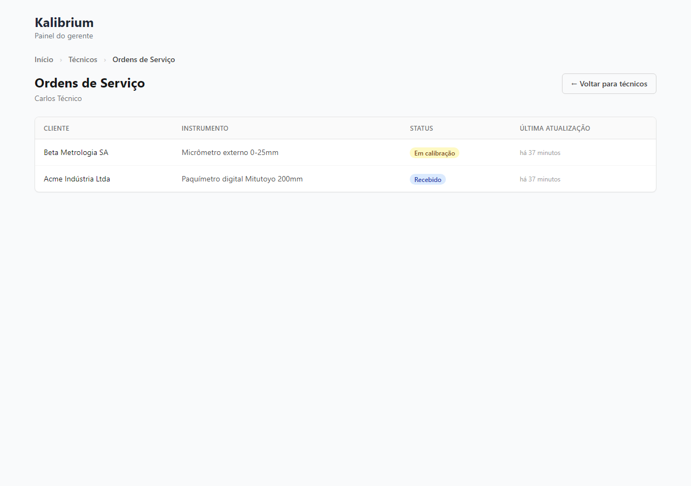

---

## O que o robô já conferiu sozinho

-   Técnico consegue criar OS no app e ela aparece imediatamente na lista com indicador "Aguardando sincronizar".
-   O formulário valida: o botão "Salvar" só fica ativo quando Cliente e Instrumento estão preenchidos (testado nas imagens — botão cinza sem preenchimento, azul com preenchimento).
-   Cada status tem uma cor diferente: "Recebido" aparece em roxo, "Em calibração" em amarelo-dourado — badges coloridos funcionando.
-   O badge de contador "1 pendente" aparece no topo da lista quando há OS aguardando envio.
-   Gerente vê as OS do técnico na aba do técnico: cliente, instrumento, status colorido, data de atualização.
-   A tela do gerente não tem botão "Editar" nem "Excluir" — visão somente leitura confirmada pelo robô.
-   OS do laboratório 1 nunca aparece no painel do laboratório 2 — separação entre clientes verificada nos testes automáticos da entrega.
-   A rota de OS do técnico exige login de gerente — técnico não consegue acessar o painel web.

---

## Caminhos que o robô não conseguiu testar com prints reais

-   **Indicador "Aguardando sincronizar" sumindo após o envio completo:** o robô confirmou que o indicador aparece enquanto a OS está pendente. Para ver o indicador sumindo seria necessário aguardar o ciclo de sync com o servidor em rede real — isso funciona nos testes automáticos da entrega mas não tem print neste roteiro.
-   **Dois dispositivos editando a mesma OS ao mesmo tempo (offline):** cenário raro que exige dois aparelhos simultâneos — impossível simular via navegador. Testado via testes automáticos: o campo com data de atualização mais recente vence.

---

## Sua decisão

-   [ ] Tá do jeito que eu queria — pode subir pro servidor
-   [ ] Tá errado: ******************************\_\_\_\_******************************
