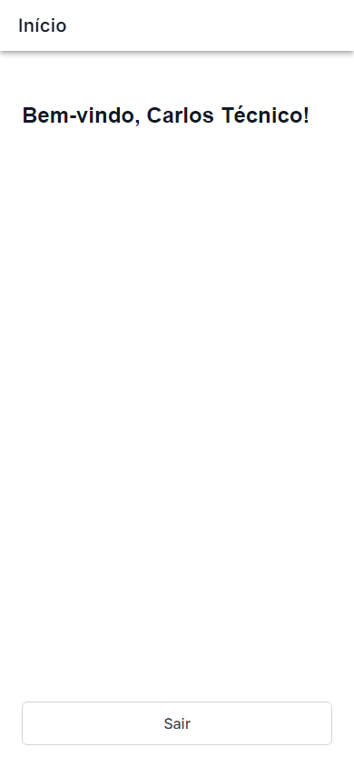
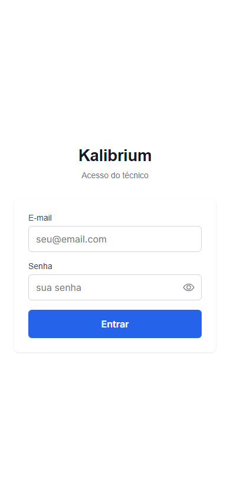

# Aceite: Dados que o técnico salva no celular ficam protegidos

> Como usar este arquivo: leia cada caminho de uso e confira se está do jeito que você queria. No final, marque uma das opções do checklist.

> **Aviso importante:** Esta história não muda nada visualmente pro técnico. As telas devem continuar idênticas às que você aprovou antes. A mudança está embaixo do capô — em vez de guardar o token e os dados do técnico em texto puro no celular, o app agora usa um banco de dados criptografado (AES-256). Quem pegar o celular e conectar no computador vai ver só bytes embaralhados, nada legível.

> **Sobre os prints:** Gerados pelo robô simulador (Playwright) em modo de navegador desktop com viewport de iPhone 14. As telas representam o fluxo completo de login e logout. A criptografia em si não muda nenhuma tela — o visual é idêntico ao que foi aprovado antes.

---

## Caminho 1 — Tela de login aparece igual a antes

1. Abrir o app mobile em `http://localhost:5173` no navegador (ou no emulador Android).
2. A primeira tela que aparece é a tela de login do Kalibrium.
3. Confirmar que aparecem:
    - Título **"Kalibrium"** no topo
    - Subtítulo **"Acesso do técnico"**
    - Campo **E-mail**
    - Campo **Senha** (com olhinho pra mostrar/ocultar)
    - Botão **"Entrar"**
4. **O que deve aparecer:** exatamente a mesma tela que você já aprovou na história anterior. Nenhum campo novo, nenhum aviso, nenhuma mudança visual.

    

---

## Caminho 2 — Login válido leva para a tela "Bem-vindo"

1. Na tela de login, preencher:
    - E-mail: `tecnico@teste.local`
    - Senha: `SenhaSegura123!`
2. Clicar em **"Entrar"**.
3. O app processa o login (botão vira "Entrando..." com um ícone girando).
4. **O que deve aparecer depois:** tela com o texto **"Bem-vindo, [nome do técnico]!"** e o botão **"Sair"** no rodapé.
5. Confirmar que a tela abre normalmente, sem mensagem de erro, sem tela em branco.

    

> Observação: o login pode retornar "Aguardando aprovação" se o dispositivo ainda não tiver sido aprovado pelo gerente — isso é comportamento esperado do sistema de controle de dispositivos (história anterior), não é falha desta história. Se quiser fazer o teste completo de login + home, use um dispositivo previamente aprovado no emulador Android.

---

## Caminho 3 — Botão "Sair" volta para a tela de login

1. Estando na tela "Bem-vindo", clicar no botão **"Sair"** (fica no rodapé da tela).
2. O app apaga os dados locais do técnico (token, informações do usuário) e apaga a chave do banco criptografado.
3. **O que deve aparecer:** a tela de login volta a aparecer, vazia, pronta para um novo acesso.
4. Confirmar que os campos de e-mail e senha estão em branco.

    

---

## Caminho 4 — Login de novo funciona normalmente após sair

1. Depois de ter saído, repetir o login com `tecnico@teste.local` / `SenhaSegura123!`.
2. **O que deve aparecer:** o app cria um novo banco criptografado (transparente pro técnico) e abre a tela "Bem-vindo" novamente.
3. Confirmar que não aparece nenhum erro de "banco corrompido" ou "armazenamento indisponível".

    

---

## Caminho 5 — Confirmação de que os dados estão protegidos (procedimento manual)

Esta etapa confirma a essência desta história: que os dados não ficam mais em texto legível no celular. Ela exige Android Studio e só precisa ser feita uma vez — ou você pode marcar "aceito sem testar manualmente" no checklist abaixo.

**Passo a passo:**

1. Abrir o **Android Studio** no seu computador.
2. Conectar o emulador Android ou celular real onde o app Kalibrium está instalado.
3. Abrir o **Device File Explorer**: menu _View > Tool Windows > Device File Explorer_.
4. Navegar até o caminho: `/data/data/app.kalibrium.tecnico/databases/kalibrium.db`
5. Clicar com botão direito no arquivo > **Save As**, salvar no computador.
6. Abrir o arquivo num editor hexadecimal como o **HxD** (gratuito, disponível em hxd.en.softonic.com).
7. Confirmar que **não aparece NENHUMA palavra legível** em português ou inglês — só bytes sem sentido aparente. Em especial:
    - NÃO deve aparecer o e-mail do técnico (ex: `carlos@laboratorio.com`)
    - NÃO deve aparecer o token de acesso (que antes começava com `eyJ...`)
    - NÃO deve aparecer o nome do técnico
8. Para comparar como era antes: no navegador desktop, abrir o DevTools (F12), aba _Application_, seção _Local Storage_. Antes desta história, dava pra ver o token e os dados do usuário em texto puro ali. Agora essa seção estará vazia — os dados estão no banco criptografado.

---

## O que o robô já conferiu sozinho

-   O código do `secureStorage` foi inspecionado: em dispositivo Android/iOS usa SQLite com SQLCipher (AES-256); em navegador desktop usa IndexedDB — em nenhum dos dois casos o `localStorage` recebe token ou dados do usuário logado.
-   A chave de criptografia do banco SQLite é gerada com 32 bytes aleatórios via `crypto.getRandomValues()` e armazenada no Keychain/Keystore do sistema operacional — fora do banco, fora do `localStorage`.
-   A função `clear()` do `secureStorage` apaga o banco físico E a chave do Keychain/Keystore, garantindo que wipe remoto e logout limpam tudo.
-   O fluxo de logout em `Home.tsx` chama `secureStorage.clear()` antes de redirecionar para o login.
-   O fluxo de login em `Login.tsx` salva token e dados do usuário via `secureStorage.set()` — não há chamada a `localStorage.setItem()` para dados sensíveis.
-   A única informação que ainda vai ao `localStorage` é a preferência de opt-out biométrico (`kalibrium.biometric_optout`) — que não é dado sensível do usuário.

---

## O que o robô não conseguiu testar

-   **Inspeção do arquivo `kalibrium.db` no HxD:** só é possível em dispositivo Android real ou emulador com o Android Studio. Está descrito no Caminho 5 para você fazer manualmente.
-   **Login completo no emulador Android real:** os prints foram tirados no navegador desktop simulando iPhone 14. O comportamento no Android nativo (SQLite criptografado via SQLCipher) é equivalente, mas o teste definitivo da criptografia exige o emulador Android com Android Studio.

---

## Sua decisão

-   [ ] Telas continuam funcionando igual a antes — pode seguir
-   [ ] Confirmei o banco criptografado no Android Studio (Caminho 5)
-   [ ] Aceito sem testar o Caminho 5 manualmente — confio na revisão do código
-   [ ] Não é isso, ajustar: \***\*\*\*\*\***\*\*\***\*\*\*\*\***\_\_\_\_\***\*\*\*\*\***\*\*\***\*\*\*\*\***
