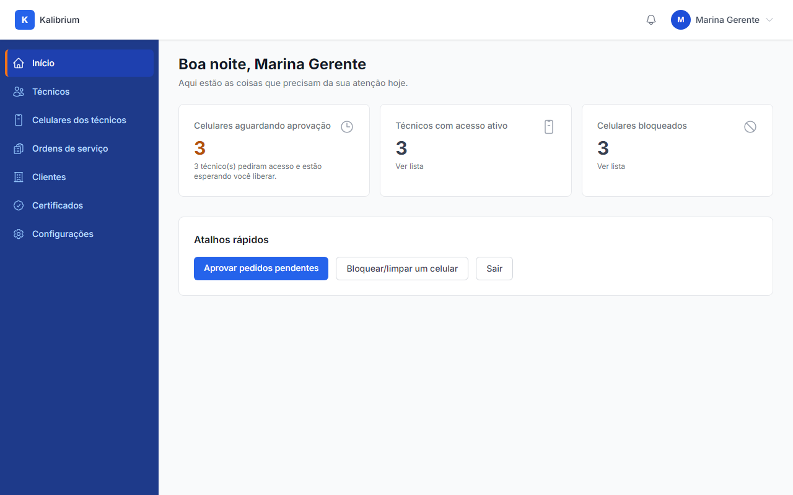
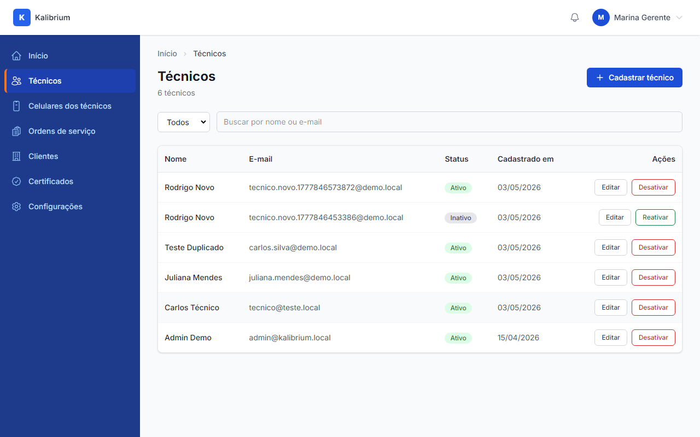
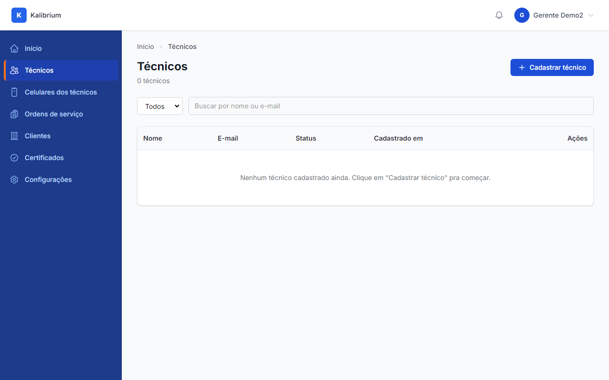
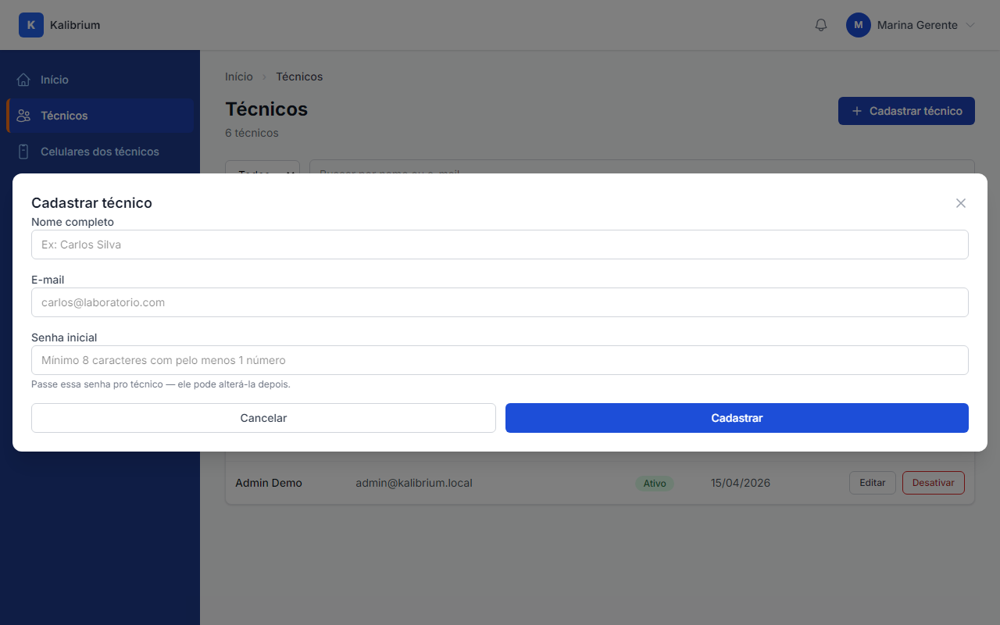
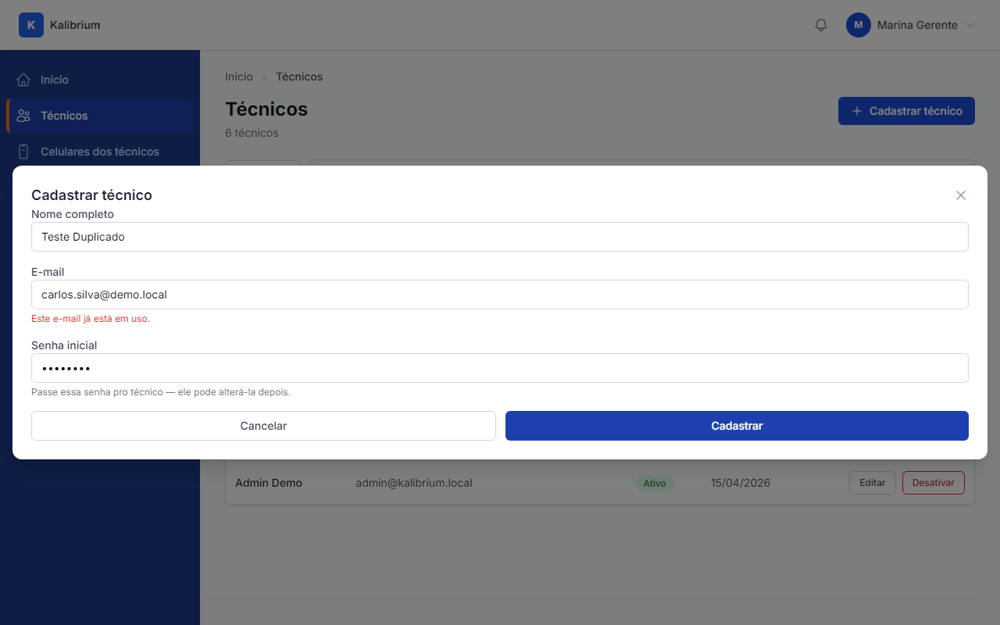
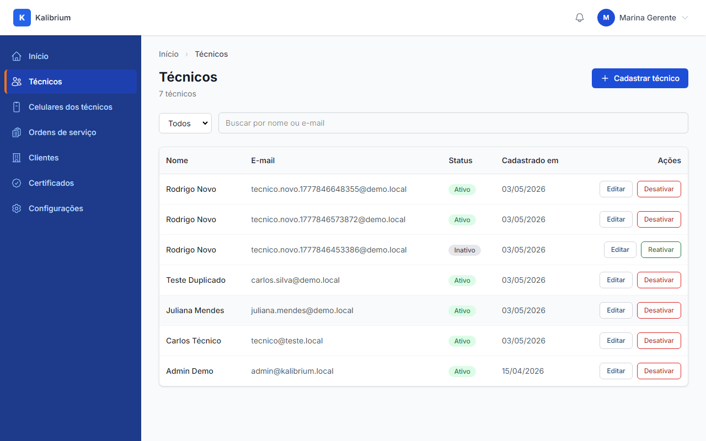
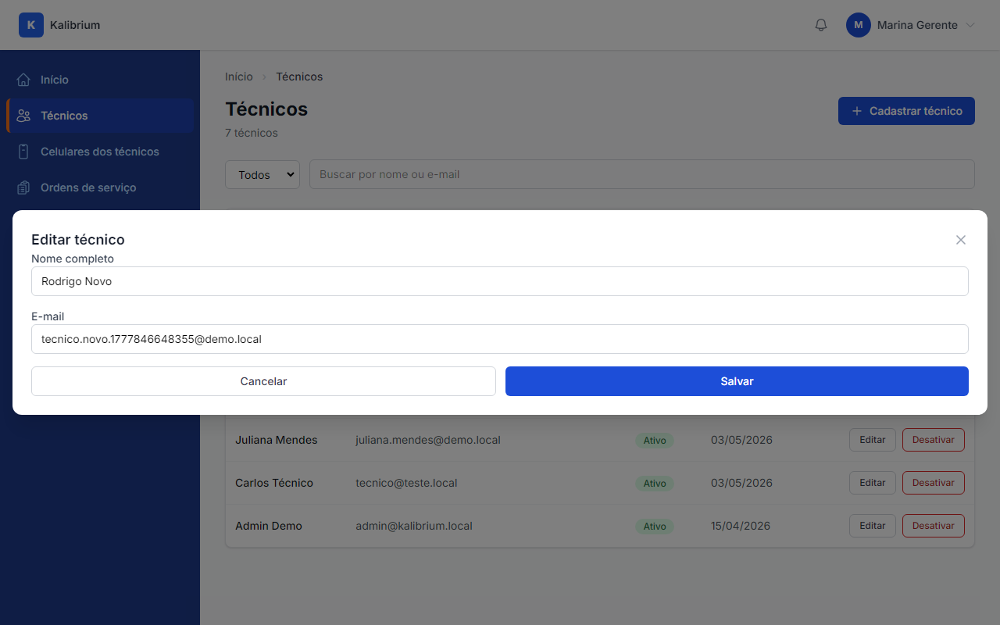
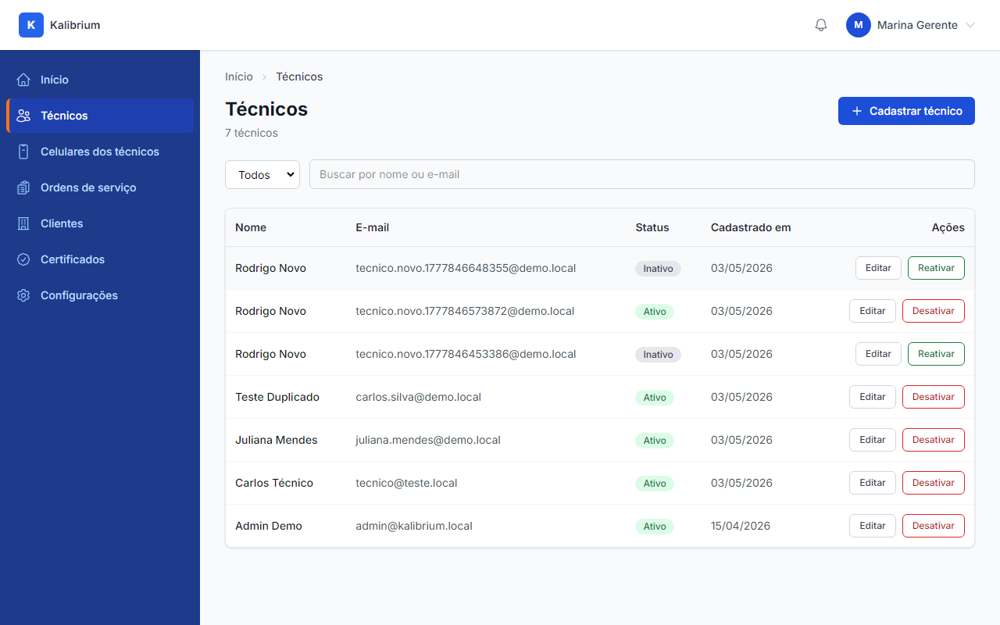

# Aceite — Gerente cadastra técnico no laboratório

> Esta história entrega o cadastro de técnicos pelo gerente — lista, busca, criar, editar, desativar, reativar.

---

## O que foi entregue

O gerente agora tem uma tela dedicada para gerenciar quem faz parte da equipe de técnicos do laboratório. Dá pra ver todos os técnicos, cadastrar novos, editar nome e e-mail, desativar quem saiu da empresa e reativar se voltar. Tudo isolado: um laboratório nunca vê os técnicos de outro.

---

## Passo a passo — o que aparece na tela

### 1. Sidebar com o item "Técnicos"

O menu lateral mostra o item "Técnicos". O gerente clica ali para entrar na tela.

---

### 2. Lista de técnicos com badges de status

A tabela mostra nome, e-mail, status (verde = Ativo, cinza = Inativo) e a data de cadastro. Tem filtro por status e campo de busca por nome ou e-mail.

---

### 3. Estado vazio — laboratório sem técnicos

Quando o laboratório ainda não tem nenhum técnico, aparece uma mensagem orientando o gerente a cadastrar o primeiro.

---

### 4. Modal de cadastro aberto

Ao clicar em "Cadastrar técnico", abre um painel com três campos: Nome completo, E-mail e Senha inicial. A senha é temporária — o técnico pode trocar depois.

---

### 5. Erro ao tentar e-mail já cadastrado

Se o gerente tentar cadastrar com um e-mail que já existe no laboratório, aparece uma mensagem de erro inline explicando o problema — sem sumir os dados que já foram preenchidos.

---

### 6. Técnico cadastrado com sucesso

Após cadastrar, o novo técnico aparece na lista com badge "Ativo". A tabela atualiza sem recarregar a página.

---

### 7. Modal de edição com dados preenchidos

Ao clicar em "Editar", abre um painel com o nome e e-mail do técnico já preenchidos. O gerente edita e salva — as senhas dos dispositivos não são afetadas.

---

### 8. Após confirmar desativação

Ao clicar em "Desativar", o sistema pede confirmação. Após aceitar, a lista atualiza mostrando o técnico com badge "Inativo". O acesso dele ao sistema é bloqueado imediatamente.

---

### 9. Badge "Inativo" no técnico desativado

O badge cinza "Inativo" fica visível na linha do técnico desativado. O botão "Desativar" é substituído por "Reativar".

---

### 10. Badge "Ativo" voltando após reativar

Ao clicar em "Reativar", o técnico volta com badge verde "Ativo" e o acesso ao sistema é restabelecido.

---

## O que o robô já testou sozinho

-   [x] Gerente acessa a tela e vê apenas os técnicos do próprio laboratório
-   [x] Técnicos de outro laboratório nunca aparecem (isolamento)
-   [x] Filtro por status "Ativo" e "Inativo" funciona corretamente
-   [x] Busca por nome filtra os resultados
-   [x] Cadastrar cria o técnico com papel correto e status Ativo
-   [x] Cadastrar com e-mail já existente mostra erro de validação
-   [x] Cadastrar com senha fraca (sem número ou menos de 8 caracteres) mostra erro
-   [x] Editar técnico atualiza nome e e-mail sem mexer nos dispositivos
-   [x] Desativar muda o status para Inativo e registra no histórico de auditoria
-   [x] Reativar muda o status para Ativo e registra no histórico de auditoria
-   [x] Tentativa de desativar técnico de outro laboratório retorna erro 404
-   [x] Técnico comum (não gerente) recebe "sem permissão" ao tentar acessar a tela
-   [x] Login web de técnico inativo mostra mensagem de conta desativada
-   [x] Login mobile de técnico inativo retorna erro em português

---

## Checklist final de aceite

-   [ ] A tela de técnicos aparece no menu lateral como esperado
-   [ ] A lista mostra os técnicos do laboratório corretamente
-   [ ] Cadastrar um técnico novo funciona do jeito esperado
-   [ ] Editar nome e e-mail funciona
-   [ ] Desativar e reativar funcionam e o badge muda na hora
-   [ ] **É isso** — história aprovada
-   [ ] **Não é isso** — o que está diferente do esperado: ********\_\_\_********
