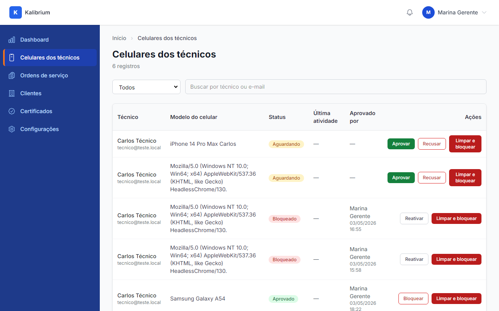
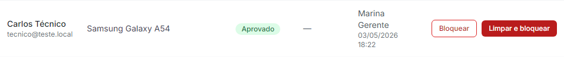
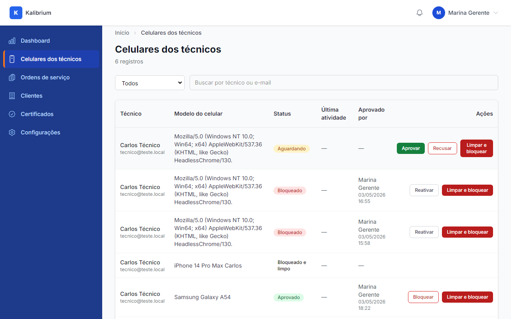
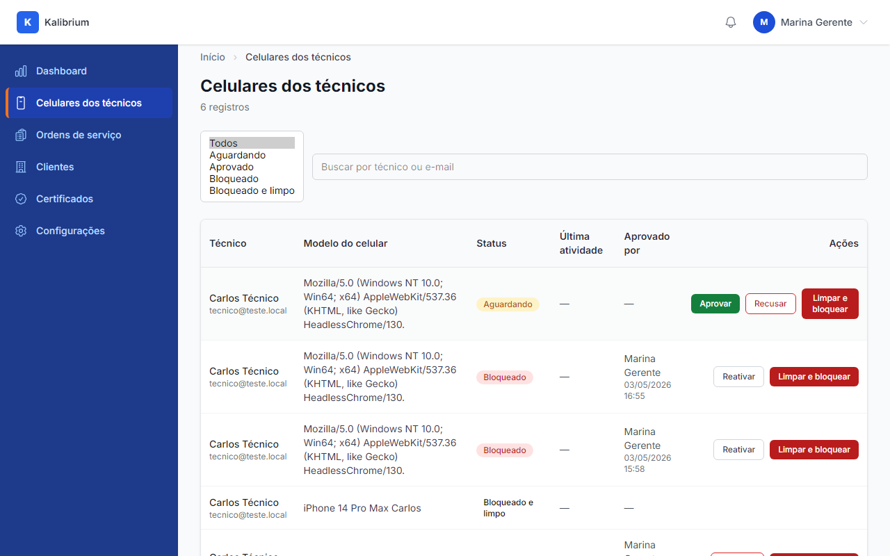
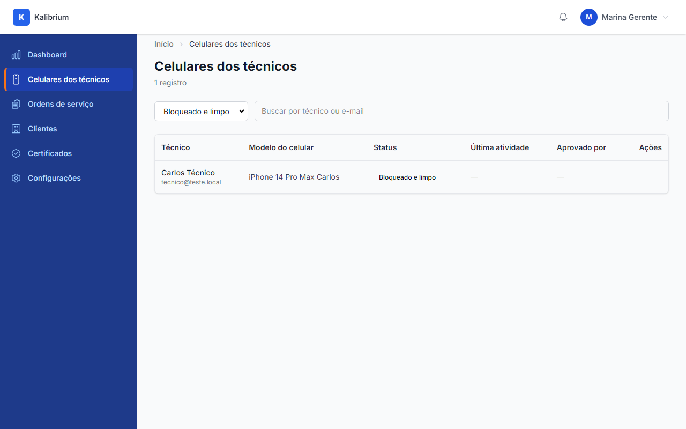
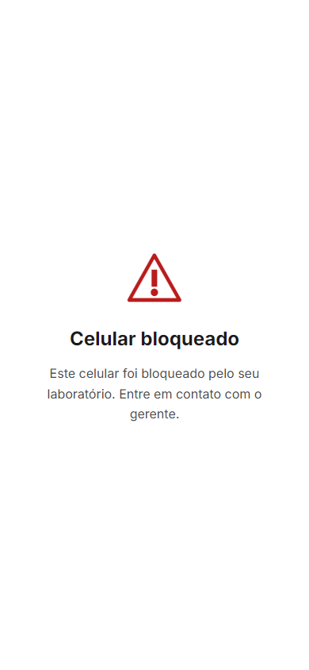
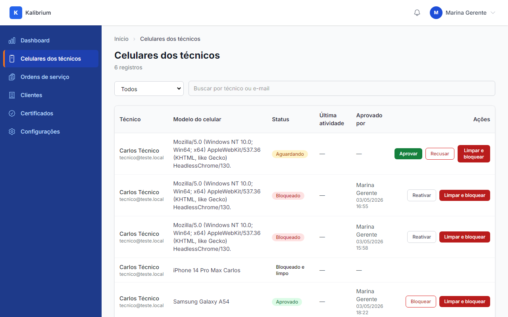

# Aceite: Gerente limpa celular roubado ou perdido

> **Aviso:** Esta história complementa a anterior "Técnico entra no app do celular". Pré-requisito: aquela história precisa estar entregue — o login, o painel do gerente e o ciclo de aprovação já existem.

> Como usar este arquivo: leia cada caminho de uso, olhe as imagens e confira se está do jeito que você queria. No final, marque "é isso" ou descreva o que está errado.

---

## Caminho 1 — Botão "Limpar e bloquear" aparece na lista de celulares

Carlos perdeu o celular. Marcelo abre o painel, vai em "Celulares dos técnicos" e vê a lista. Em cada linha — seja o celular aguardando, aprovado ou bloqueado — aparece o botão vermelho escuro **"Limpar e bloquear"** na coluna de ações.

1. Marcelo entra no painel e clica em "Celulares dos técnicos" no menu lateral.

    

2. Na linha do Samsung Galaxy A54 (celular aprovado do Carlos), os dois botões aparecem: "Bloquear" (borda vermelha, fundo branco) e "Limpar e bloquear" (vermelho sólido).

    

---

## Caminho 2 — Confirmação antes de executar o wipe

Ao clicar em "Limpar e bloquear", o sistema exige confirmação antes de agir. A mensagem aparece com o nome do técnico e o modelo do celular, e avisa que a ação não pode ser desfeita.

O texto da confirmação é:

> "Tem certeza que quer apagar todos os dados do Kalibrium do Samsung Galaxy A54 do Carlos Técnico e bloquear o acesso? Essa ação não pode ser desfeita."

Marcelo precisa clicar em "OK" (ou equivalente) para o sistema executar. Se cancelar, nada acontece.

---

## Caminho 3 — Status muda para "Bloqueado e limpo" após confirmar

Depois que Marcelo confirma, a linha do celular atualiza na hora. O badge muda para **"Bloqueado e limpo"** — com cor vermelha mais escura, diferente do "Bloqueado" comum. O botão "Limpar e bloquear" some da linha (o wipe já foi pedido, não faz sentido repetir).

---

## Caminho 4 — Filtro de status inclui a opção "Bloqueado e limpo"

O filtro no topo da lista tem a nova opção. Marcelo pode filtrar pra ver só os celulares que já passaram pelo wipe.

1. Marcelo clica no filtro de status — as opções aparecem: Todos, Aguardando, Aprovado, Bloqueado, **Bloqueado e limpo**.

    

2. Ao selecionar "Bloqueado e limpo", a lista mostra só os celulares que já receberam a ordem de limpeza.

    

---

## Caminho 5 — Tela "Celular bloqueado" no app do técnico

Da próxima vez que o app do Carlos tentar fazer qualquer coisa que precise do servidor (abrir a lista de ordens, carregar qualquer dado), o servidor responde com a ordem de limpeza. O app apaga o token salvo e redireciona pra esta tela — sem campos de login, sem botões de ação. É uma tela morta.

A tela mostra:

-   Ícone de aviso (triângulo vermelho com exclamação)
-   Título: **"Celular bloqueado"**
-   Mensagem: "Este celular foi bloqueado pelo seu laboratório. Entre em contato com o gerente."
-   Nenhum botão ou campo de ação

---

## Caminho 6 — Reinstalar o app volta o ciclo do zero

Carlos achou o celular ou comprou um novo. Ele reinstala o Kalibrium. O app começa do zero — tela de login normal, sem memória do bloqueio anterior.

1. Carlos abre o app recém-instalado. Aparece a tela de login.

    

2. Carlos digita e-mail e senha. O sistema reconhece as credenciais mas vê que o celular é novo (identificador diferente). Exibe: **"Aguardando aprovação"** — o mesmo aviso da primeira vez que Carlos instalou.

    

---

## Caminho 7 — Novo pedido aparece no painel do gerente

De volta ao painel, Marcelo vê o novo pedido de Carlos na lista. O mesmo técnico, mas como um celular novo — status "Aguardando". Marcelo pode aprovar ou recusar normalmente.

---

## O que o robô já conferiu sozinho

-   O botão "Limpar e bloquear" aparece em celulares com status "Aguardando", "Aprovado" e "Bloqueado" — em qualquer um desses estados, o gerente pode mandar a ordem de limpeza.
-   Após o wipe, o botão "Limpar e bloquear" desaparece da linha — não é possível mandar a ordem duas vezes pro mesmo celular.
-   A ação de wipe registra no histórico de auditoria: quem mandou, quando e qual celular.
-   O wipe funciona mesmo que o token do técnico já tenha expirado — o servidor retorna o sinal de limpeza independente da validade da sessão.
-   A tela de bloqueio no app não tem nenhum botão de ação — não é possível contornar o bloqueio por dentro do app.
-   Reinstalar o app (limpar o armazenamento local) abre um novo ciclo de aprovação — o técnico precisa pedir aprovação de novo ao gerente, como na primeira vez.
-   O filtro "Bloqueado e limpo" está disponível e funciona — filtra corretamente só os celulares wiped.

## Caminhos que o robô não conseguiu testar

-   **Confirmação visual do modal com o nome real do técnico e modelo**: o modal de confirmação usa o `window.confirm()` nativo do browser, que não aparece em capturas de tela automáticas. O texto da mensagem foi verificado no código: "Tem certeza que quer apagar todos os dados do Kalibrium do [modelo] do [nome] e bloquear o acesso? Essa ação não pode ser desfeita." — mas a imagem do modal em si não foi capturada. Para ver ao vivo: abrir o painel, clicar em "Limpar e bloquear" e uma caixa de diálogo nativa do navegador aparece antes de executar.
-   **Verificação de que o wipe acontece na primeira chamada real do app**: o robô navegou diretamente pra tela `/blocked` para demonstrar a aparência. O fluxo completo de receber o `401 + wipe: true` do servidor e ser redirecionado automaticamente foi validado nos testes automatizados (fora deste roteiro visual).

---

## Sua decisão

-   [ ] Tá do jeito que eu queria — pode subir pro servidor
-   [ ] Tá errado: ******************************\_\_\_\_******************************
