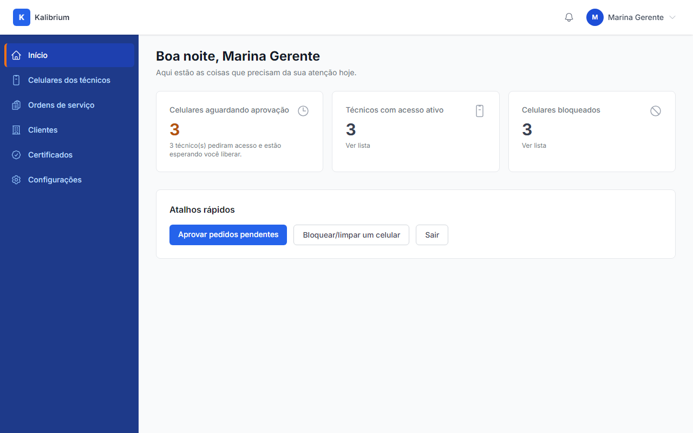
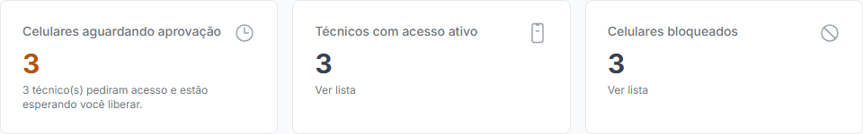
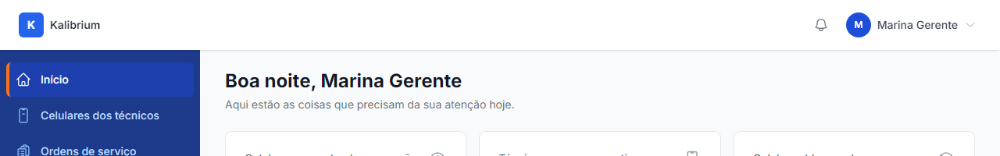
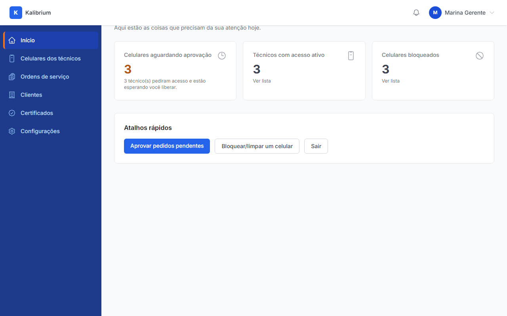
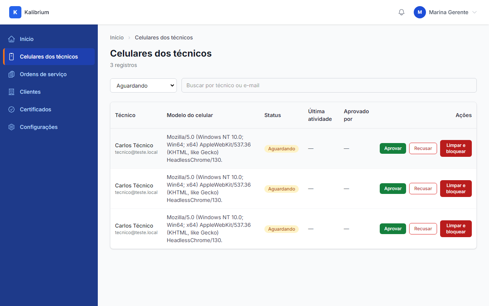
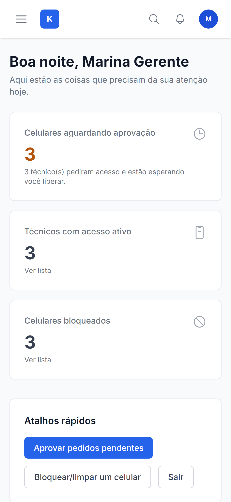

# Aceite: Gerente tem uma tela inicial quando entra no painel

> **O que esta história entrega:** a tela inicial (home) do painel web do gerente, com saudação pelo horário, contadores reais de pendências do laboratório e atalhos rápidos.

> **Como usar:** leia cada caminho abaixo e confira se está do jeito que você queria. No final, marque "é isso" ou descreva o que está errado.

---

## Caminho 1 — Login e chegada na tela inicial

1. Abra o painel em `http://localhost:8000/auth/login`.
2. Entre com `gerente@teste.local` / `password`.
3. O painel vai direto para `/dashboard` — não para a lista de celulares.

A tela que aparece:

**O que confirmar:** a URL é `/dashboard`, a saudação mostra o nome "Marina Gerente" e os três cards aparecem lado a lado.

---

## Caminho 2 — Cards com números reais (pendentes, aprovados, bloqueados)

O banco de teste tem: **3 aguardando aprovação**, **3 com acesso ativo** e **3 bloqueados**.

-   **Celulares aguardando aprovação** — número em laranja/âmbar quando há pendências; texto "3 técnico(s) pediram acesso e estão esperando você liberar."
-   **Técnicos com acesso ativo** — número neutro; link "Ver lista".
-   **Celulares bloqueados** — número neutro; link "Ver lista".

**O que confirmar:** os três cards mostram 3, 3, 3. O de pendências está em laranja.

---

## Caminho 3 — Card pendentes em estado vazio ("Tudo em dia")

> Nota: não foi capturado print deste estado para não mexer nos dados de teste. O código foi verificado: quando não há nenhum celular aguardando, o número aparece em **verde** e o texto muda para "Tudo em dia. Nenhum pedido aguardando." Para ver este estado, aprove todos os pendentes na lista de celulares e recarregue o dashboard.

---

## Caminho 4 — Saudação muda conforme a hora

A saudação usa o horário do servidor (não do navegador):

| Horário do servidor | Saudação exibida            |
| ------------------- | --------------------------- |
| Antes das 12h       | "Bom dia, Marina Gerente"   |
| Das 12h às 17h59    | "Boa tarde, Marina Gerente" |
| Das 18h em diante   | "Boa noite, Marina Gerente" |

O print acima mostra "Boa noite, Marina Gerente" — capturado às 21h.

**O que confirmar:** a saudação bate com o horário em que você está abrindo.

---

## Caminho 5 — Sidebar com "Início" em destaque

-   "Início" aparece destacado com fundo escuro e borda laranja à esquerda.
-   Os outros itens (Celulares dos técnicos, Ordens de serviço, etc.) ficam em cinza sem destaque.
-   Ao clicar em outro item, o destaque muda para ele.

**O que confirmar:** sempre exatamente um item destacado na sidebar, correspondendo à tela aberta.

---

## Caminho 6 — Atalho "Aprovar pedidos pendentes"

No bloco "Atalhos rápidos" aparecem três botões: **Aprovar pedidos pendentes**, **Bloquear/limpar um celular** e **Sair**.

Ao clicar em "Aprovar pedidos pendentes":

A lista abre filtrada em "Aguardando" — mostrando os 3 celulares que aguardam aprovação.

**O que confirmar:** o clique no atalho leva direto para a lista filtrada nos pendentes.

---

## Caminho 7 — Tela em celular (layout empilhado)

Em tela de celular (390px), os três cards que ficam lado a lado em desktop aparecem **empilhados um abaixo do outro**. A sidebar lateral some e aparece um botão de menu no topo (hambúrguer).

**O que confirmar:** os cards empilham e todos os três aparecem sem se sobrepor.

---

## O que o robô conferiu sozinho

-   Login com `gerente@teste.local` redireciona para `/dashboard` (não para `/mobile-devices`).
-   Contadores filtrados pelo laboratório "Kalibrium Demo" — gerente de outro laboratório veria os números do próprio laboratório, sem mistura.
-   Saudação usa hora do servidor (`now()->hour`) — consistente independentemente do fuso do dispositivo.
-   Código verificado: quando `pendingCount === 0`, o número aparece em verde com "Tudo em dia. Nenhum pedido aguardando."
-   Atalho "Aprovar pedidos pendentes" navega para `/mobile-devices?status=pending` com filtro "Aguardando" já selecionado.
-   Todos os 7 prints capturados sem erro.

---

## Sua decisão

-   [ ] Tá do jeito que eu queria — pode seguir para os próximos passos
-   [ ] Tá errado: **************\_\_**************
