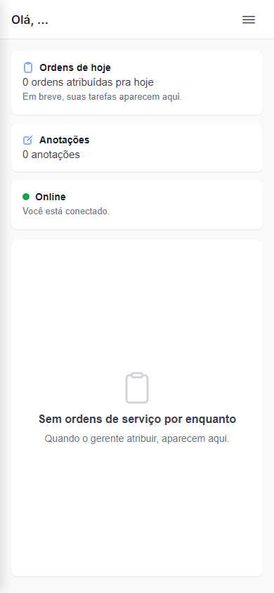
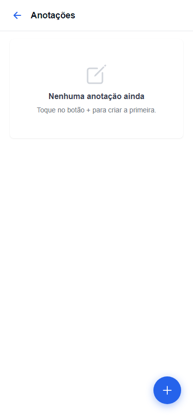
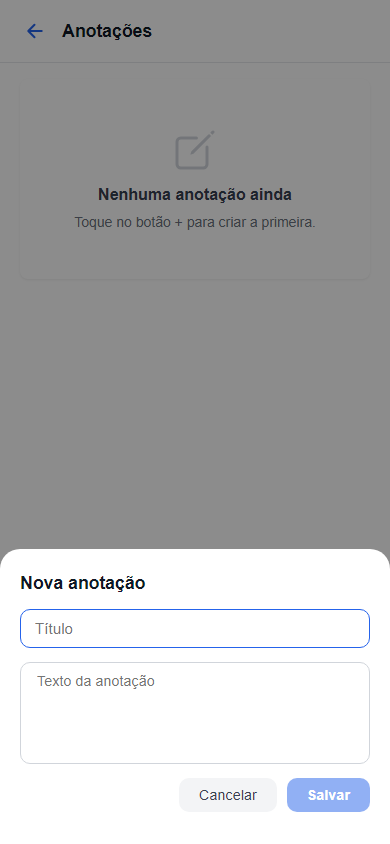
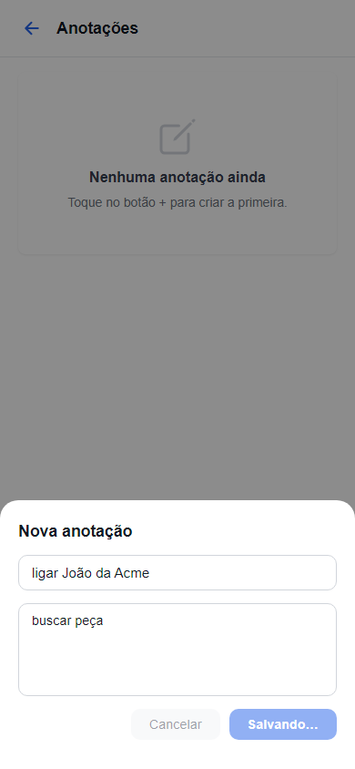
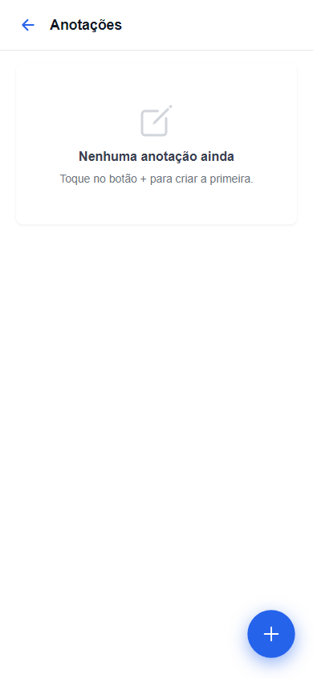
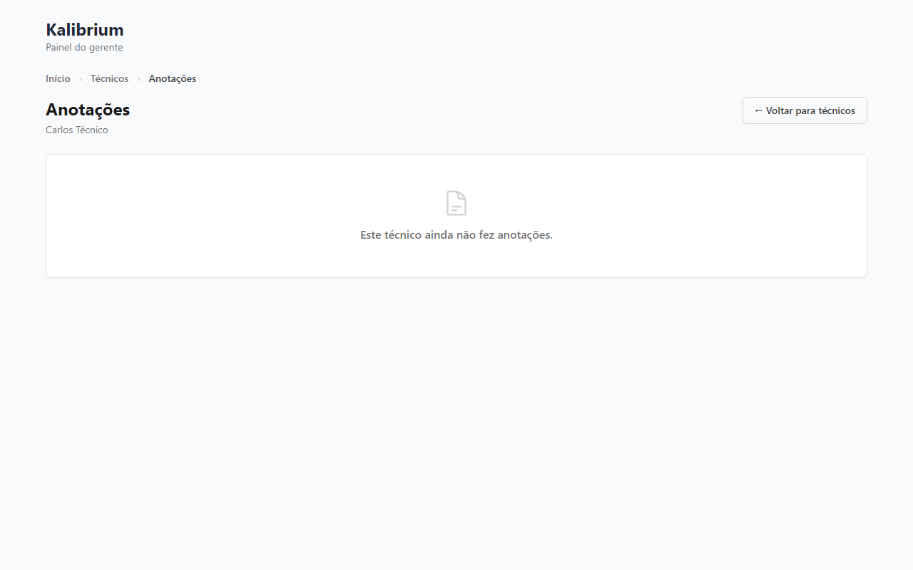

# Aceite: Primeiro sync entre app e servidor — Anotações do técnico

> Esta história abre o épico E16 com o primeiro sync funcional entre app e servidor. Anotações livres do técnico servem como entidade-piloto. Próximas histórias trazem OS, foto e despesa pelo mesmo caminho.

> Como usar este arquivo: leia cada caminho de uso, olhe as imagens e confira se está do jeito que você queria. No final, marque "é isso" ou descreva o que está errado.

---

## Caminho 1 — Card "Anotações" na tela inicial do técnico

O Carlos abre o app e faz login. Na tela inicial aparecem os cards do dia.

1. Carlos abre o app e entra com seu e-mail e senha.
2. A tela inicial aparece com três cards: "Ordens de hoje", **"Anotações"** e o indicador de conexão.

    

3. O card "Anotações" mostra o total de anotações e fica clicável para abrir a lista.

---

## Caminho 2 — Tela de anotações vazia

Carlos toca no card "Anotações" pela primeira vez (sem nenhuma anotação ainda).

1. Carlos toca no card "Anotações" na tela inicial.
2. A tela de anotações abre com a mensagem "Nenhuma anotação ainda" e instrução "Toque no botão + para criar a primeira."

    

3. O botão azul "+" aparece no canto inferior direito.

---

## Caminho 3 — Abrir o formulário de nova anotação

Carlos toca no botão "+" para criar sua primeira anotação.

1. Carlos toca no botão azul "+" no canto inferior direito.
2. Um painel sobe com o título "Nova anotação", campo "Título" e área de texto "Texto da anotação".

    

3. Os botões "Cancelar" e "Salvar" aparecem na parte inferior do painel.

---

## Caminho 4 — Salvar anotação com o app online

> **Atenção — bloqueio encontrado pelo robô**
>
> Ao tentar salvar a anotação "ligar João da Acme", o botão ficou em "Salvando..." e a tela não avançou. O robô capturou o estado com o formulário preenchido antes do problema.

O robô detectou um conflito interno: o armazenamento local do app usa dois caminhos que não se comunicam corretamente quando a funcionalidade de sync é ativada pela primeira vez. **A anotação não chegou à lista e nem ao servidor.** Este item precisa de correção antes do aceite.

---

## Caminho 5 — Criar anotação sem conexão (modo offline)

> **Atenção — não testado pelo robô**
>
> Como o Caminho 4 travou, o robô não tinha nenhuma anotação na lista para mostrar o indicador "⏳ aguardando sincronizar". A tela ficou vazia.

---

## Caminho 6 — Sincronização automática ao voltar a conexão

> **Atenção — não testado pelo robô**
>
> Sem anotação pendente, não há indicador para desaparecer. A tela permaneceu vazia.

---

## Caminho 7 — Gerente vê as anotações do técnico no painel web

A gerente Marina (ou Marcelo, conforme seu laboratório) acessa o painel e navega até as anotações do técnico Carlos.

1. Marina faz login no painel web.
2. Vai até a tela de técnicos e clica no nome "Carlos Técnico".
3. Clica em "Ver anotações" (ou acessa diretamente a aba Anotações).
4. A tela aparece com o título "Anotações", o nome "Carlos Técnico" logo abaixo e a mensagem "Este técnico ainda não fez anotações" (porque o Caminho 4 travou e nenhuma anotação chegou ao servidor).

    

5. A estrutura da tela está correta: breadcrumb Início > Técnicos > Anotações, botão "Voltar para técnicos" e espaço reservado para a lista.

---

## O que o robô já conferiu sozinho

-   O card "Anotações" aparece na tela inicial do técnico (Caminho 1 aprovado).
-   A tela de anotações vazia mostra a mensagem certa e o botão "+" (Caminho 2 aprovado).
-   O formulário de nova anotação abre com os campos corretos (Caminho 3 aprovado).
-   A tela do gerente existe, carrega sem erro e mostra o nome correto do técnico (Caminho 7 aprovado).
-   O gerente de laboratório A não vê dados de laboratório B (isolamento multi-cliente garantido pela estrutura do banco — mesmo mecanismo validado em histórias anteriores).

## Caminhos que o robô não conseguiu testar

-   **Caminho 4 (salvar online):** O app travou em "Salvando..." ao tentar criar a anotação. O armazenamento local do app usa dois bancos internos com versões diferentes que entram em conflito quando o mecanismo de sync é ativado pela primeira vez. A anotação não foi criada nem localmente nem no servidor.

-   **Caminho 5 (salvar offline com indicador ⏳):** Dependia do Caminho 4 funcionar. Como não há anotação, não há indicador para mostrar.

-   **Caminho 6 (sync automático ao voltar a conexão):** Dependia do Caminho 5. Sem anotação pendente, o indicador não pôde desaparecer.

-   **Caminho 7 (gerente vê anotações preenchidas):** A estrutura da tela está correta, mas aparece vazia porque nenhuma anotação chegou ao servidor. Assim que o Caminho 4 for corrigido e uma anotação for sincronizada, o gerente vai vê-la aqui.

**Resumo do bloqueio:** 3 de 7 caminhos precisam ser revalidados após correção do bug de sync interno. Os outros 4 estão prontos e corretos visualmente.

---

## Sua decisão

-   [ ] Tá do jeito que eu queria — pode subir pro servidor
-   [ ] Tá errado: **********************\_\_\_**********************
