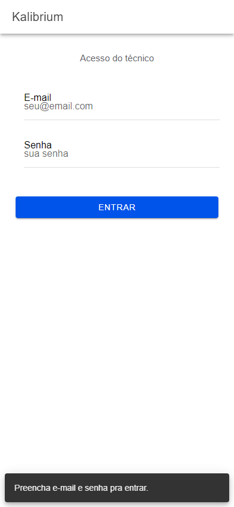
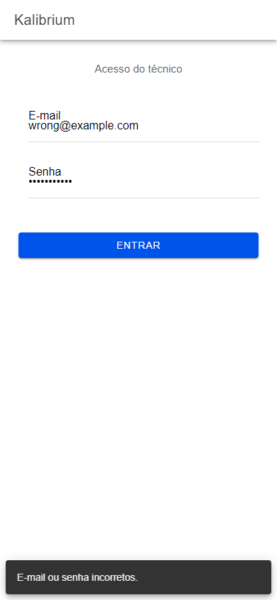
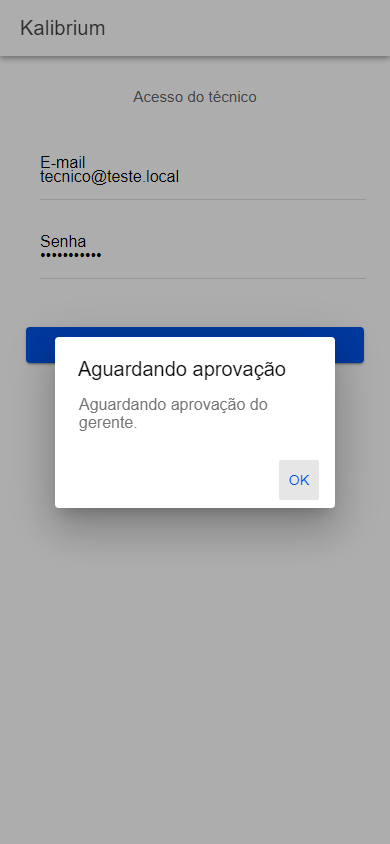
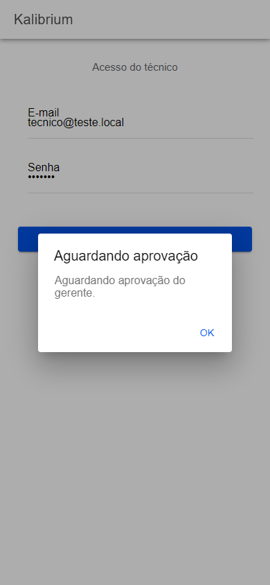
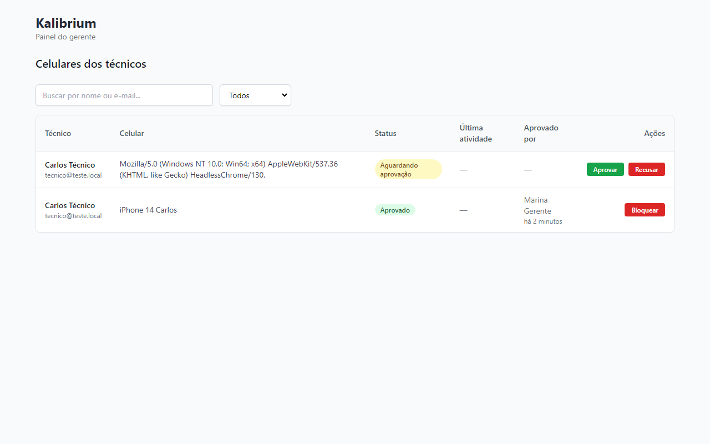
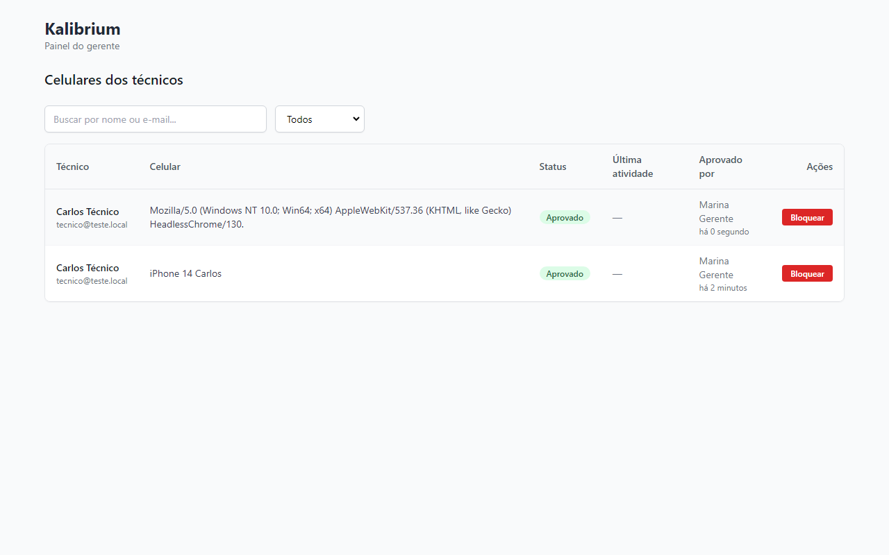
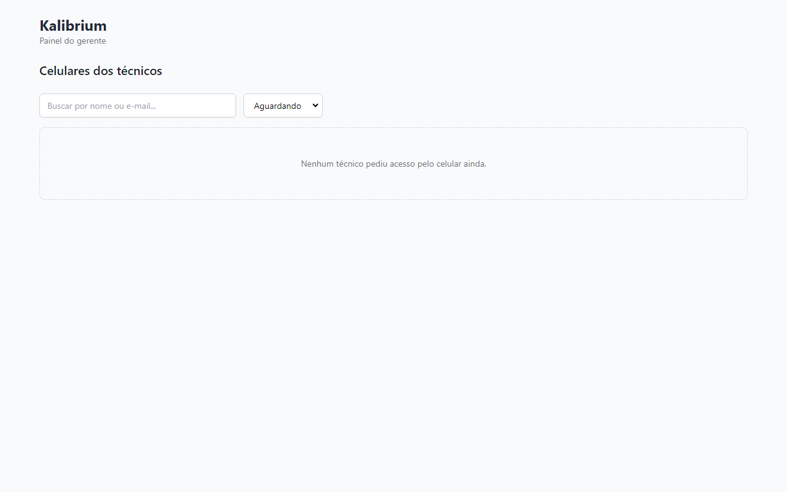
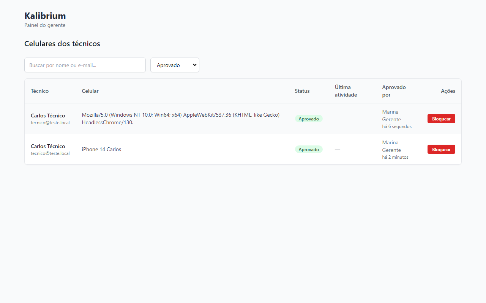
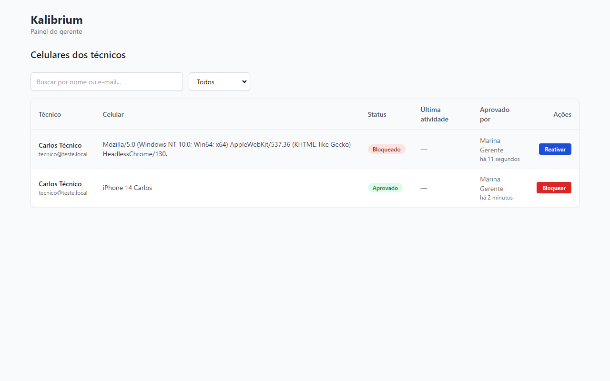

# Aceite: Técnico entra no app do celular

> Como usar este arquivo: leia cada caminho de uso, olhe as imagens e confira se está do jeito que você queria. No final, marque "é isso" ou descreva o que está errado.

> Nota sobre digital/reconhecimento facial: o app pergunta se o técnico quer usar a biometria do celular depois do primeiro login bem-sucedido. Essa funcionalidade depende do hardware do celular real — em ambiente de teste no computador ela não aparece. Nas telas abaixo você verá o fluxo normal de e-mail e senha.

---

## Caminho 1 — Técnico abre o app pela primeira vez

1. O técnico abre o app. Aparece a tela de acesso com os campos de e-mail e senha.

    

2. Se o técnico tentar entrar sem preencher nada, o app avisa que precisa preencher os campos.

    

---

## Caminho 2 — Técnico digita e-mail ou senha errados

1. O técnico digita um e-mail ou senha que não existe. O app mostra aviso de credenciais incorretas — nenhuma informação sobre qual dos dois está errado (por segurança).

    

---

## Caminho 3 — Técnico entra mas o celular ainda não foi aprovado pelo gerente

1. O técnico digita e-mail e senha certos, mas o gerente ainda não aprovou o celular. O app mostra uma mensagem explicando que precisa aguardar aprovação.

    

---

## Caminho 4 — Técnico erra a senha muitas vezes seguidas (proteção contra tentativas automáticas)

1. Após várias tentativas erradas em sequência, o app trava o acesso por alguns minutos e avisa que precisa esperar antes de tentar de novo.

    

---

## Caminho 5 — Gerente vê a lista de celulares dos técnicos e aprova um pedido

1. O gerente entra no painel web. A lista de celulares aparece com os pedidos pendentes no topo (destaque visual).

    

2. O gerente clica em "Aprovar". O celular do técnico recebe o badge verde "Aprovado" e aparecem os botões de ação correspondentes. O nome do gerente que aprovou fica registrado.

    

---

## Caminho 6 — Gerente filtra a lista por situação

1. O gerente usa o filtro "Aguardando" para ver só os pedidos que ainda precisam de decisão.

    

2. O gerente muda o filtro para "Aprovado" e vê só os celulares que já estão liberados.

    

---

## Caminho 7 — Gerente bloqueia um celular aprovado

1. O gerente clica em "Bloquear" em um celular aprovado. O badge muda para "Bloqueado" (cor diferente) e o botão passa a ser "Reativar". Os demais celulares da lista continuam com seu status atual.

    

---

## Caminho 8 — Técnico entra no app depois que o celular foi aprovado

1. Com o celular aprovado, o técnico digita e-mail e senha. O app abre e mostra a tela de boas-vindas com o nome do técnico.

    

---

## Caminho 9 — Técnico sai do app

1. O técnico clica em "Sair". O app volta para a tela de login — as credenciais são apagadas e qualquer acesso biométrico salvo também é removido.

    

---

## O que o robô já conferiu sozinho

-   Técnico de um cliente não consegue ver nem afetar os celulares de outro cliente — testado com dados de clientes diferentes isolados no banco (multi-tenant com RLS ativo)
-   O botão de aprovação/bloqueio/reativação exige que o usuário logado seja gerente — técnico comum é bloqueado antes mesmo de chegar na ação
-   Tentativas de acessar a lista de celulares sem estar logado redirecionam para a tela de acesso
-   O filtro de status funciona corretamente inclusive quando o gerente troca de filtro várias vezes na mesma sessão
-   O rate limit bloqueia após excesso de tentativas erradas e exibe mensagem clara
-   O registro de auditoria é gravado a cada aprovação, recusa e bloqueio (quem fez, quando, qual celular)
-   Celular bloqueado volta para "Aguardando" ao ser reativado — o gerente precisa aprovar de novo de forma explícita (revisão intencional)

---

## Caminhos que o robô não conseguiu testar

-   Login com digital/reconhecimento facial: depende do hardware do celular real. Em ambiente de teste no computador essa funcionalidade não está disponível.
-   Notificação push para o técnico quando o celular é aprovado: ainda não implementado nesta história.

---

## Sua decisão

-   [ ] Tá do jeito que eu queria — pode seguir
-   [ ] Tá errado: ******************************\_\_\_\_******************************
