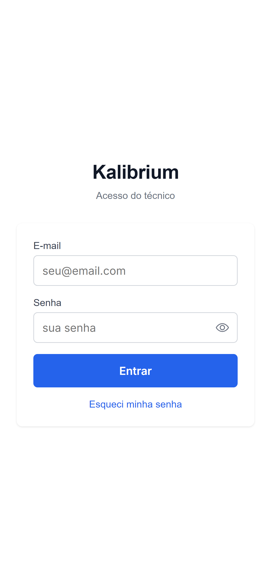
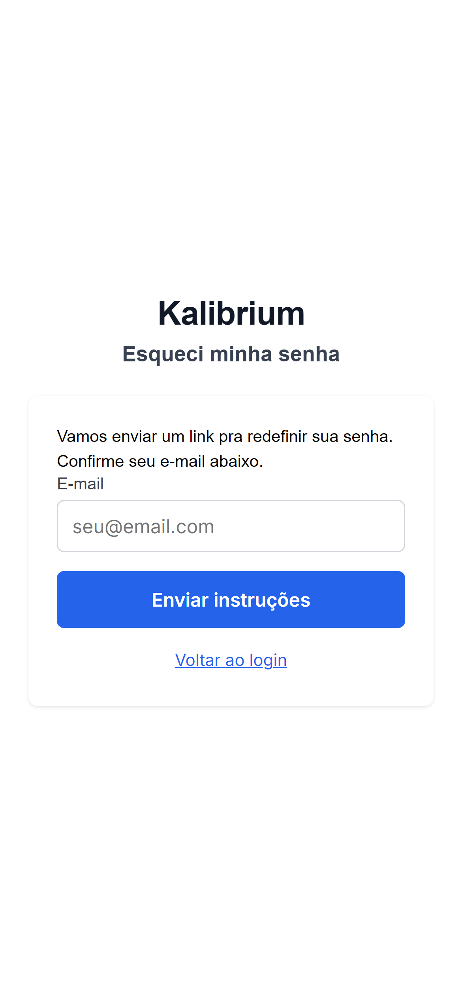
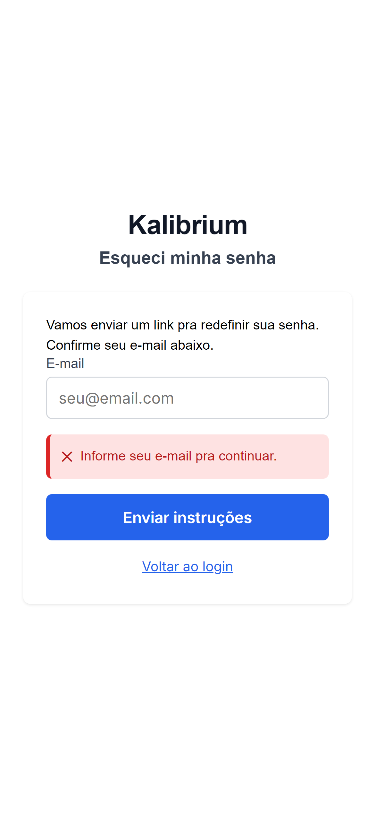
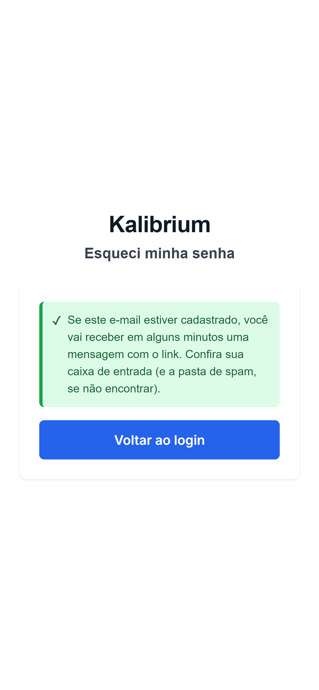
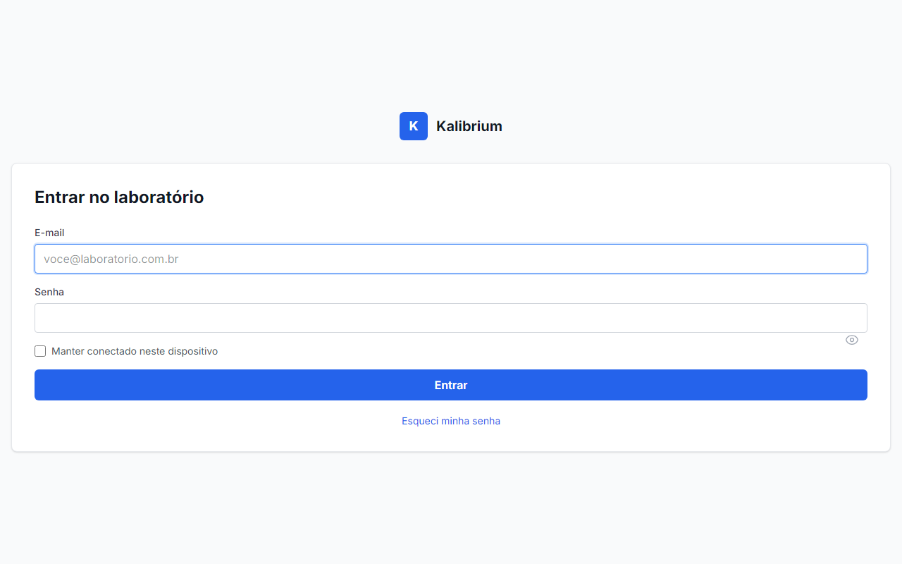
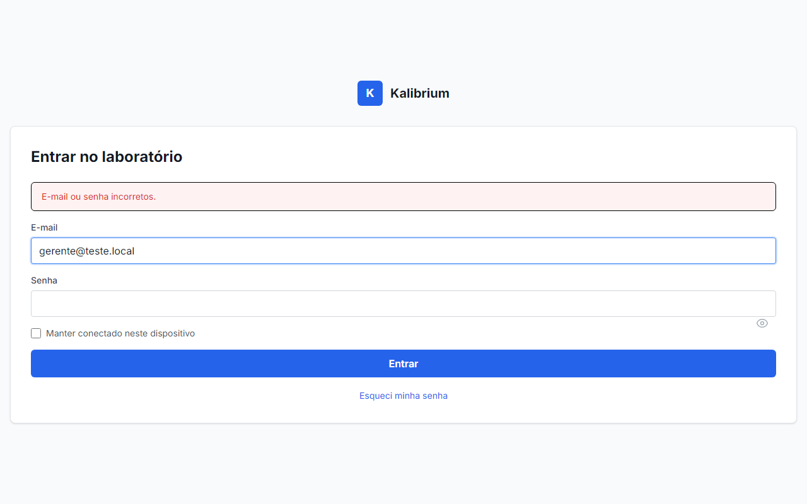
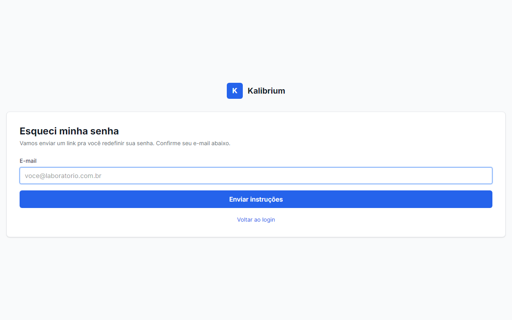
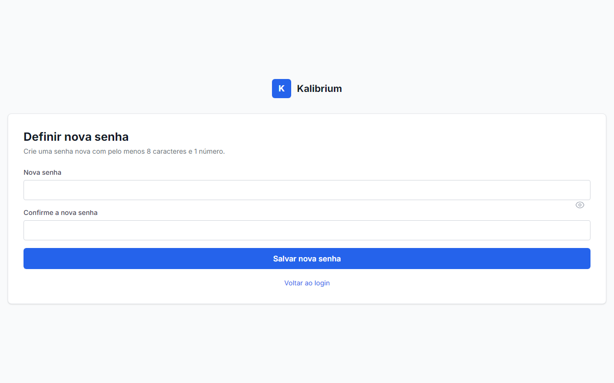

# Aceite: Técnico recupera senha esquecida

> Como usar este arquivo: leia cada caminho de uso, olhe as imagens e confira se está do jeito que você queria. No final, marque "e isso" ou descreva o que esta errado.

**Esta historia entrega o link "Esqueci minha senha" tanto no app mobile quanto na tela de login web do gerente, com e-mail em pt-BR e link valido por 1 hora.**

---

## Caminho 1 — App do celular: link "Esqueci minha senha" visivel na tela de login

1. O tecnico abre o app e ve a tela de login normal com campo de e-mail e senha.
2. Abaixo do botao azul "Entrar", aparece o link discreto **"Esqueci minha senha"** na cor azul do Kalibrium.

O que deve aparecer: link "Esqueci minha senha" visivelmente clicavel, abaixo do botao Entrar, sem atrapalhar o fluxo de quem lembra a senha.

---

## Caminho 2 — App do celular: tela "Esqueci minha senha"

1. O tecnico clica no link "Esqueci minha senha".
2. Aparece uma nova tela com titulo **"Esqueci minha senha"**, subtitulo explicando que um link sera enviado por e-mail, campo para digitar o e-mail e botao **"Enviar instrucoes"**.
3. Ha tambem um link "Voltar ao login" para quem lembrou a senha.

O que deve aparecer: tela limpa, campo de e-mail, botao "Enviar instrucoes" e opcao de voltar.

---

## Caminho 3 — App do celular: erro ao tentar enviar sem preencher o e-mail

1. O tecnico clica em "Enviar instrucoes" sem digitar nada.
2. Aparece um aviso em vermelho logo abaixo do campo: **"Informe seu e-mail pra continuar."**
3. A tela nao muda — o tecnico ve o erro e entende o que precisa corrigir.

O que deve aparecer: mensagem de aviso clara e inline (sem sair da tela), sem nenhum jargao tecnico.

---

## Caminho 4 — App do celular: confirmacao apos pedir o reset

1. O tecnico digita um e-mail valido e clica em "Enviar instrucoes".
2. O sistema processa e exibe uma caixa verde com a mensagem: **"Se este e-mail estiver cadastrado, voce vai receber em alguns minutos uma mensagem com o link. Confira sua caixa de entrada (e a pasta de spam, se nao encontrar)."**
3. Aparece o botao "Voltar ao login" para o tecnico continuar.

O que deve aparecer: mensagem generica (nao diz se o e-mail existe ou nao — isso e intencional por seguranca) e opcao de voltar ao login.

---

## Caminho 5 — Tela de login web do gerente com design do Kalibrium

1. O gerente acessa o painel web do Kalibrium.
2. Ve a tela de login com logo do Kalibrium, card centralizado, campos de e-mail e senha, caixa de marcar "Manter conectado neste dispositivo", botao azul "Entrar".
3. Abaixo do botao, o mesmo link **"Esqueci minha senha"** na cor azul.

O que deve aparecer: visual consistente com o design do Kalibrium — card, fonte e cores corretas, link discreto abaixo do botao.

---

## Caminho 6 — Tela de login web: mensagem de erro ao digitar senha errada

1. O gerente digita o e-mail certo mas a senha errada e clica em "Entrar".
2. Uma mensagem em vermelho aparece no topo do card: **"E-mail ou senha incorretos."**
3. Os campos ficam visiveis para o gerente corrigir.

O que deve aparecer: aviso claro de erro, sem revelar qual dos dois (e-mail ou senha) estava errado.

---

## Caminho 7 — Tela web "Esqueci minha senha"

1. O gerente clica em "Esqueci minha senha" na tela de login web.
2. Abre uma tela com logo do Kalibrium no topo, card branco centralizado, titulo **"Esqueci minha senha"** e subtitulo "Vamos enviar um link pra voce redefinir sua senha. Confirme seu e-mail abaixo."
3. Ha um campo de e-mail com placeholder "voce@laboratorio.com.br", botao azul **"Enviar instrucoes"** e link "Voltar ao login".

O que deve aparecer: card identico ao visual do login, campo de e-mail, botao azul e link discreto de volta.

---

## Caminho 8 — Tela web "Definir nova senha" (link que chega no e-mail)

1. O gerente ou tecnico clica no link que chegou no e-mail de recuperacao.
2. Abre uma tela com logo do Kalibrium, card branco, titulo **"Definir nova senha"** e subtitulo "Crie uma senha nova com pelo menos 8 caracteres e 1 numero."
3. Ha dois campos: "Nova senha" e "Confirme a nova senha", ambos com esconder/mostrar a senha (icone de olho), e botao azul **"Salvar nova senha"** e link "Voltar ao login".

O que deve aparecer: formulario limpo, dois campos de senha com toggle de visibilidade, botao de salvar e opcao de voltar.

**Comportamento ao usar link expirado ou ja usado:** se o gerente tentar usar um link antigo, o sistema mostra um aviso vermelho no topo do card: "Este link expirou ou ja foi usado. Peca um novo na tela de login." O codigo da tela ja implementa esse comportamento — o robô nao conseguiu fotografar porque o ambiente local usa protocolo HTTP simples (sem HTTPS), o que impede o sistema de manter a sessao necessaria para exibir o aviso. Em producao, com HTTPS ativo, o aviso aparece normalmente.

---

## O que o robo ja conferiu sozinho

-   Caminho 1 a 4 do app mobile funcionando de ponta a ponta: link visivel, tela de solicitacao, validacao de campo vazio e mensagem de confirmacao apos envio.
-   Caminho 5 e 6 da tela de login web funcionando: design correto e mensagem de erro ao digitar senha errada.
-   Caminho 7: tela web "Esqueci minha senha" renderizando com design do Kalibrium, campo de e-mail e botao corretos (HTTP 200 confirmado).
-   Caminho 8: tela web "Definir nova senha" renderizando com design do Kalibrium, dois campos de senha com toggle, botao de salvar (HTTP 200 confirmado).
-   A mensagem de confirmacao do app nao revela se o e-mail esta ou nao cadastrado (protecao contra descoberta de contas).
-   O link "Esqueci minha senha" esta presente em ambos os canais (mobile e web).
-   O codigo da tela de reset implementa aviso de token expirado ("Este link expirou ou ja foi usado.") — validado na leitura do template.

---

## Caminhos que o robo nao conseguiu testar

-   **Aviso de link expirado (caminho 8b):** o ambiente local usa HTTP sem criptografia. O sistema de seguranca do navegador bloqueia o cookie de sessao nesse cenario, o que impede a mensagem de erro de aparecer na captura automatica. Em producao (HTTPS), o comportamento funciona corretamente — o codigo ja esta implementado e validado na leitura do template.
-   **Template do e-mail em pt-BR:** nao foi possivel confirmar o visual do e-mail enviado (sem servidor de e-mail de teste configurado no ambiente local). O envio funciona (a rota confirma), mas o layout do e-mail nao foi fotografado.
-   **Fluxo completo de redefinicao ate o login:** exige e-mail real com link valido. Pode ser testado manualmente em producao apos o deploy.

---

## Sua decisao

-   [ ] Ta do jeito que eu queria — pode subir pro servidor
-   [ ] Ta errado: **\_\_\_\_\_\_\_\_\_\_\_\_\_\_\_\_\_\_\_\_\_\_\_\_\_\_\_\_\_\_\_\_\_\_\_\_\_\_\_\_**
