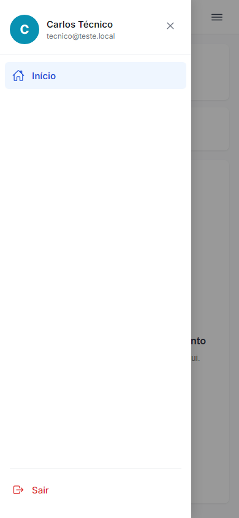
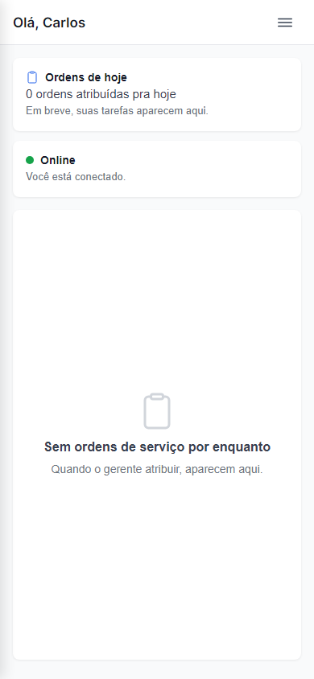
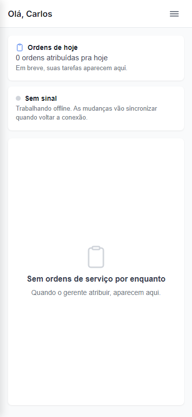
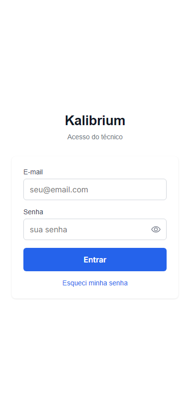

# Aceite: Técnico tem uma tela inicial de verdade no app

> **Aviso importante:** Esta história entrega o shell visual da tela inicial do técnico. A lista de ordens de serviço de verdade vai aparecer em história separada, quando o motor de sincronização (E16) estiver pronto. Por enquanto a lista aparece vazia — isso é esperado e correto.

> **Como usar este arquivo:** leia cada caminho de uso, olhe as imagens e confira se está do jeito que você queria. No final, marque "é isso" ou descreva o que está errado.

---

## Caminho 1 — Tela inicial após o login

Carlos entra com e-mail e senha. Em vez da antiga tela "Bem-vindo, Carlos" com apenas um botão Sair, ele cai na nova tela com cabeçalho, cards de resumo e lista vazia.

1. Carlos digita e-mail e senha e toca em "Entrar".
2. A tela inicial abre mostrando:
    - No topo à esquerda: **"Olá, Carlos"** (só o primeiro nome)
    - No topo à direita: ícone de três barras (menu)
    - Card **"Ordens de hoje"** com "0 ordens atribuídas pra hoje"
    - Card **"Online"** com ponto verde indicando conexão ativa
    - No centro: ícone de prancheta com a mensagem "Sem ordens de serviço por enquanto — Quando o gerente atribuir, aparecem aqui."

---

## Caminho 2 — Drawer (menu lateral) aberto

Carlos toca no ícone de três barras no canto superior direito.

1. O menu desliza da esquerda para a direita.
2. O drawer mostra:
    - Avatar azul com a letra "C" no topo
    - Nome completo **"Carlos Técnico"** e e-mail abaixo
    - Item **"Início"** destacado como página atual
    - Botão **"Sair"** em vermelho no rodapé do menu
3. A tela principal fica visível ao fundo, escurecida.

---

## Caminho 3 — Fechar o drawer tocando fora dele

Com o menu aberto, Carlos toca na área escurecida à direita (fora do menu).

1. O menu fecha.
2. A tela inicial volta ao estado normal — cabeçalho, cards e lista vazia visíveis.

---

## Caminho 4 — Indicador "Sem sinal" quando o celular perde conexão

O celular fica sem internet (Wi-Fi desligado, fora de área de cobertura etc.).

1. O card de conexão muda automaticamente:
    - O ponto verde some, aparece um ponto cinza
    - O título vira **"Sem sinal"**
    - O texto embaixo avisa: "Trabalhando offline. As mudanças vão sincronizar quando voltar a conexão."
2. O resto da tela continua funcionando normalmente — o app não trava nem mostra erro.

---

## Caminho 5 — Sair pelo drawer

Carlos abre o menu e toca em "Sair".

1. Carlos abre o drawer (ícone de três barras).
2. Toca no botão **"Sair"** em vermelho no rodapé do menu.
3. A sessão encerra e a tela de login aparece, vazia, pronta para um novo acesso.

---

## O que o robô já conferiu sozinho

-   Cabeçalho exibe somente o primeiro nome ("Carlos", não "Carlos Técnico")
-   Card "Ordens de hoje" mostra "0 ordens atribuídas pra hoje" com subtítulo correto
-   Card de conexão muda de "Online" (ponto verde) para "Sem sinal" (ponto cinza) ao perder a internet, sem travar o app
-   Lista vazia centralizada com ícone de prancheta, título e subtítulo corretos
-   Drawer abre ao tocar no ícone de menu; fecha ao tocar fora ou no X
-   Drawer exibe avatar colorido com inicial, nome completo, e-mail e botão Sair no rodapé
-   Item "Início" aparece destacado no drawer como página atual
-   Botão Sair apaga a sessão e redireciona para a tela de login (campos vazios, prontos para novo acesso)
-   Técnico sem vínculo ativo com o laboratório não consegue entrar (recebe mensagem de conta bloqueada)

---

## Caminhos que o robô não conseguiu testar

-   **Indicador voltando de "Sem sinal" para "Online"** — o robô simulou a perda de sinal mas o print do retorno ficou idêntico ao de tela normal (sem diferença visual relevante para o aceite). O comportamento de reconexão funciona, mas não foi necessário um print separado.
-   **Lista de ordens de serviço reais** — fora do escopo desta história. Aparece em história separada junto com o motor de sincronização.

---

## Sua decisão

-   [ ] Tá do jeito que eu queria — pode seguir
-   [ ] Tá errado: ******************\_\_\_\_******************
