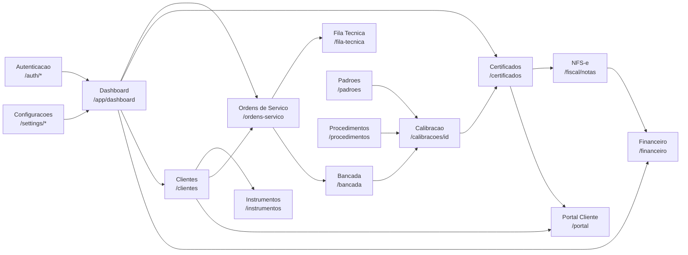

# UI Flows — Kalibrium V2

> **Status:** ativo
> **Versao:** 1.0.0
> **Data:** 2026-04-15
> **Documento:** A.2
> **Dependencias:** `docs/product/sitemap.md`, `docs/product/journeys.md`, `docs/product/personas.md`, `docs/design/screen-inventory.md`, `docs/design/layout-master.md`

---

## 1. Objetivo

Este documento mapeia os fluxos de tela do Kalibrium V2 para as jornadas principais. Cada fluxo descreve:
- A sequencia de telas (origem → destino)
- O gatilho da transicao (acao do usuario ou evento do sistema)
- Os dados carregados em cada tela
- Os caminhos de erro e redirecionamento

Os fluxos refletem a **Jornada 1** (pedido novo, da entrada ao pagamento) e as jornadas complementares.

---

## 2. Indice de Fluxos

| # | Fluxo | Personas | Epico(s) |
|---|---|---|---|
| F-01 | Autenticacao | Marcelo, Juliana | E02 |
| F-02 | Cadastro de cliente | Marcelo (admin) | E03 |
| F-03 | Cadastro de instrumento | Marcelo (admin) | E03 |
| F-04 | Cadastro de padrao de referencia | Marcelo | E03 |
| F-05 | Cadastro de procedimento | Marcelo | E03 |
| F-06 | Abertura de ordem de servico | Marcelo (admin) | E04 |
| F-07 | Execucao tecnica (bancada) | Juliana | E05 |
| F-08 | Revisao e aprovacao de certificado | Marcelo | E06 |
| F-09 | Entrega ao cliente via portal | Rafael | E09 |
| F-10 | Administracao do tenant | Marcelo | E02, E03 |

---

## 3. Fluxos Detalhados

---

### F-01 — Autenticacao

**Personas:** Marcelo, Juliana
**Epico:** E02

#### Diagrama

```mermaid
flowchart TD
    A([Acessa /]) --> B{Sessao ativa?}
    B -- Sim --> C[/app/dashboard]
    B -- Nao --> D[/auth/login]

    D --> E{Credenciais validas?}
    E -- Invalidas --> F[Login — erro inline\nCampos: e-mail, senha\nMensagem: 'E-mail ou senha incorretos']
    F --> D

    E -- Validas, sem 2FA --> G[/app/dashboard]
    E -- Validas, com 2FA --> H[/auth/two-factor-challenge]

    H --> I{Codigo OTP correto?}
    I -- Incorreto --> J[2FA — erro inline\nMensagem: 'Codigo invalido ou expirado']
    J --> H
    I -- Correto --> G

    D --> K[/auth/forgot-password]
    K --> L{E-mail encontrado?}
    L -- Nao encontrado --> M[Forgot — estado neutro\nNao revelar se e-mail existe LGPD]
    L -- Encontrado --> M
    M --> N[E-mail enviado com token]
    N --> O[/auth/reset-password/token]
    O --> P{Token valido?}
    P -- Expirado/invalido --> Q[Reset — erro page-level\nLink: 'Solicitar novo link']
    Q --> K
    P -- Valido --> R[Formulario nova senha]
    R --> S{Senha valida e confirmada?}
    S -- Invalida --> T[Erro inline por campo]
    T --> R
    S -- Valida --> G
```

#### Transicoes detalhadas

| Origem | Destino | Gatilho | Dados carregados |
|---|---|---|---|
| `/` | `/auth/login` | Sem sessao ativa (middleware) | — |
| `/` | `/app/dashboard` | Sessao ativa (middleware) | Usuario, Tenant, Permissoes |
| `/auth/login` | `/app/dashboard` | Submit com credenciais validas | Usuario, Tenant, Nav RBAC |
| `/auth/login` | `/auth/two-factor-challenge` | Credenciais validas + 2FA habilitado | Usuario (parcial) |
| `/auth/two-factor-challenge` | `/app/dashboard` | OTP correto | Usuario, Tenant, Nav RBAC |
| `/auth/forgot-password` | Mensagem de confirmacao | Submit e-mail | — |
| `/auth/reset-password/{token}` | `/app/dashboard` | Nova senha salva | Sessao iniciada |

#### Estados de erro

| Tela | Erro | Apresentacao |
|---|---|---|
| Login | Credenciais invalidas | Alert inline abaixo do form (`variant: danger`) |
| Login | Conta bloqueada (muitas tentativas) | Alert banner topo da pagina |
| 2FA | Codigo invalido | Alert inline, campo limpo |
| Reset senha | Token expirado | Alert banner + link para nova solicitacao |
| Reset senha | Senha fraca | Erro inline por campo |

---

### F-02 — Cadastro de Cliente

**Personas:** Marcelo (admin), Juliana (leitura)
**Epico:** E03

#### Diagrama

```mermaid
flowchart TD
    A([Sidebar: Clientes]) --> B[/clientes\nListagem de clientes]

    B --> C[Busca por CNPJ/nome\nFiltros: status, cidade]
    C --> D{Encontrou?}
    D -- Sim --> E[/clientes/cliente\nDetalhe do cliente]
    D -- Nao --> F[Empty state\n'Nenhum cliente encontrado'\n+ botao Novo Cliente]

    B --> G[Botao + Novo Cliente]
    G --> H[/clientes/novo\nFormulario passo 1: Dados da empresa]

    H --> I{CNPJ valido?}
    I -- Invalido --> J[Erro inline no campo CNPJ]
    J --> H
    I -- CNPJ ja cadastrado --> K[Alerta: 'Cliente ja existe'\nLink para o cadastro existente]
    I -- Valido e novo --> L[Auto-preenche via Receita Federal\nou exibe campos em branco]

    L --> M[Preenche: razao social, endereco,\nregime tributario, limite credito]
    M --> N[Salvar Dados da Empresa]
    N --> O{Campos obrigatorios ok?}
    O -- Faltando --> P[Erros inline por campo]
    P --> M
    O -- OK --> Q[/clientes/cliente/editar ou detalhe\nPasso 2: Adicionar contato]

    Q --> R[/clientes/contatos/novo ou modal\nFormulario de contato]
    R --> S[Nome, e-mail, WhatsApp, papel\n+ Consentimentos LGPD por canal]
    S --> T[Salvar Contato]
    T --> U{Valido?}
    U -- Invalido --> V[Erros inline]
    V --> S
    U -- Valido --> W[Toast: 'Contato salvo'\nLista atualizada]

    E --> X[Botao Editar]
    X --> Y[/clientes/cliente/editar]
    Y --> Z[Formulario pre-preenchido]
    Z --> AA[Salvar]
    AA --> AB{Valido?}
    AB -- Invalido --> AC[Erros inline]
    AC --> Z
    AB -- Valido --> AD[Toast: 'Cliente atualizado'\nRedireciona para detalhe]
```

#### Transicoes detalhadas

| Origem | Destino | Gatilho | Dados carregados |
|---|---|---|---|
| `/clientes` | `/clientes/novo` | Clique em [+ Novo Cliente] | — |
| `/clientes/novo` | `/clientes/{cliente}` | Salvar com sucesso | Cliente recém-criado |
| `/clientes/{cliente}` | `/clientes/{cliente}/editar` | Clique em [Editar] | Cliente completo, Contatos |
| `/clientes/{cliente}/editar` | `/clientes/{cliente}` | Salvar com sucesso | Cliente atualizado |
| Qualquer form | Mesma tela | Erro de validacao | Campos com erro destacados |

#### Estados de erro

| Situacao | Apresentacao |
|---|---|
| CNPJ invalido | Erro inline no campo, mensagem clara |
| CNPJ ja cadastrado | Alert banner com link para o cadastro existente |
| Receita Federal indisponivel | Toast warning, campos manuais habilitados |
| E-mail de contato duplicado | Erro inline no campo e-mail |
| Falha ao salvar (500) | Toast de erro, dados nao perdidos (form mantido) |

---

### F-03 — Cadastro de Instrumento

**Personas:** Marcelo (admin), Juliana (leitura)
**Epico:** E03

#### Diagrama

```mermaid
flowchart TD
    A([Sidebar: Clientes ou busca global]) --> B[/instrumentos\nListagem de instrumentos]
    B --> C{Acao do usuario}

    C -- Novo --> D[/instrumentos/novo\nFormulario de instrumento]
    C -- Clique em instrumento --> E[/instrumentos/instrumento\nDetalhe do instrumento]
    C -- Busca por NS --> F[Resultado filtrado na tabela]

    D --> G[Campos: modelo, numero serie,\ndominio metrologico, faixa, resolucao,\nclienteId obrigatorio]
    G --> H{Numero de serie\nja existe no tenant?}
    H -- Sim, mesmo cliente --> I[Alerta: 'Instrumento ja cadastrado'\nLink para o cadastro]
    H -- Sim, cliente diferente --> J[Alerta: 'NS vinculado a outro cliente'\nPode ser transferencia de propriedade]
    H -- Novo --> K[Salvar]
    K --> L{Valido?}
    L -- Invalido --> M[Erros inline]
    M --> G
    L -- Valido --> N[Toast: 'Instrumento cadastrado'\nRedireciona para detalhe]

    E --> O[Aba: Dados\nAba: Historico de calibracoes\nAba: Certificados]
    O --> P[/instrumentos/instrumento/calibracoes\nHistorico tecnico]
```

#### Transicoes detalhadas

| Origem | Destino | Gatilho | Dados carregados |
|---|---|---|---|
| `/instrumentos` | `/instrumentos/novo` | Clique em [+ Novo Instrumento] | — |
| `/instrumentos/novo` | `/instrumentos/{instrumento}` | Salvar com sucesso | Instrumento criado |
| `/instrumentos/{instrumento}` | `/instrumentos/{instrumento}/calibracoes` | Aba Historico | Calibracoes do instrumento |

---

### F-04 — Cadastro de Padrao de Referencia

**Personas:** Marcelo (gerente), Juliana (leitura)
**Epico:** E03

#### Diagrama

```mermaid
flowchart TD
    A([Sidebar: Laboratorio > Padroes]) --> B[/padroes\nListagem de padroes]

    B --> C{Status do padrao}
    C -- Vigente --> D[Badge verde 'Vigente']
    C -- Vencendo em 30 dias --> E[Badge amarelo 'Vencendo']
    C -- Vencido --> F[Badge vermelho 'Vencido'\nAlerta banner no topo da listagem]

    B --> G[Botao + Novo Padrao]
    G --> H[/padroes/novo\nFormulario de padrao]

    H --> I[Campos: modelo, NS, dominio,\ncertificado vigente, data validade,\nlab calibrador, padrao anterior rastreabilidade]
    I --> J[Upload certificado PDF GED]
    J --> K[Salvar]
    K --> L{Valido?}
    L -- Invalido --> M[Erros inline]
    M --> I
    L -- Valido --> N[Toast: 'Padrao cadastrado']
    N --> O[/padroes/padrao\nDetalhe com cadeia de rastreabilidade]

    O --> P{Padrao esta vencido?}
    P -- Sim --> Q[Alert banner vermelho\n'Este padrao esta vencido e bloqueado\npara uso em novas calibracoes']
    P -- Nao --> R[Exibe dados normalmente]

    O --> S[Cadeia de rastreabilidade\nPadrao atual → Padrao anterior → Ref primaria RBC]
```

---

### F-05 — Cadastro de Procedimento

**Personas:** Marcelo (gerente), Juliana (leitura/uso)
**Epico:** E03

#### Diagrama

```mermaid
flowchart TD
    A([Sidebar: Laboratorio > Procedimentos]) --> B[/procedimentos\nListagem de procedimentos]

    B --> C[Filtros: dominio metrologico, versao, status]
    B --> D[Botao + Novo Procedimento]

    D --> E[/procedimentos/novo\nFormulario de procedimento]
    E --> F[Campos: nome, codigo, versao,\ndominio metrologico, validade,\ndescricao, padrao associado]
    F --> G[Salvar]
    G --> H{Valido?}
    H -- Invalido --> I[Erros inline]
    I --> F
    H -- Valido --> J[Toast: 'Procedimento cadastrado v1']
    J --> K[/procedimentos/procedimento\nDetalhe com versoes]

    K --> L[Nova versao do procedimento]
    L --> M[Form pre-preenchido com versao anterior]
    M --> N[Salvar como nova versao]
    N --> O[Versao anterior arquivada\nNova versao ativa]
```

---

### F-06 — Abertura de Ordem de Servico

**Personas:** Marcelo (admin)
**Epico:** E04

#### Diagrama

```mermaid
flowchart TD
    A([Dashboard ou menu OS]) --> B[/ordens-servico\nListagem de OS]

    B --> C[Botao + Nova OS]
    C --> D[/ordens-servico/nova\nStep 1: Selecionar cliente]

    D --> E[Campo CNPJ/nome — combobox\nBusca cliente existente]
    E --> F{Cliente encontrado?}
    F -- Sim --> G[Preenche dados do cliente\nStep 2: Instrumentos]
    F -- Nao --> H[Botao: 'Cadastrar novo cliente'\nAbre modal ou redireciona]
    H --> I[/clientes/novo\nCadastro rapido]
    I --> G

    G --> J[Adicionar instrumento a OS\nBusca por NS ou selecao da lista do cliente]
    J --> K{Instrumento ja cadastrado?}
    K -- Sim --> L[Seleciona da lista]
    K -- Nao --> M[Botao: 'Cadastrar novo instrumento'\nModal inline]
    M --> L

    L --> N[Vincular procedimento ao instrumento\nSistema sugere pelo dominio metrologico]
    N --> O[Step 3: Prazo e observacoes]
    O --> P[Data prevista, observacoes do cliente]
    P --> Q[Confirmar e criar OS]
    Q --> R{Valido?}
    R -- Invalido --> S[Erros por step]
    S --> D
    R -- Valido --> T[OS criada com status 'Recebido']
    T --> U[/ordens-servico/os\nDetalhe da OS]
    U --> V[Agendamento na fila]
    V --> W[/agenda\nDistribuicao por tecnico]
```

---

### F-07 — Execucao Tecnica (Bancada)

**Personas:** Juliana (tecnica)
**Epico:** E05

#### Diagrama

```mermaid
flowchart TD
    A([Login Juliana no tablet]) --> B[/fila-tecnica\nFila de OS da tecnica]

    B --> C[Cards de OS ordenadas por prazo]
    C --> D[Clique na OS]
    D --> E[/ordens-servico/os\nDetalhe da OS]

    E --> F[Botao: Iniciar Calibracao]
    F --> G[/ordens-servico/os/calibracao\nSelecao de padrao]

    G --> H[Lista de padroes vigentes\nfiltrada pelo dominio do instrumento]
    H --> I{Algum padrao necessario vencido?}
    I -- Sim --> J[Bloqueio com alert banner vermelho\n'Padrao X vencido — substitua antes de prosseguir']
    I -- Nao --> K[Selecionar padrao(s) usados]

    K --> L[/calibracoes/calibracao\nBancada de execucao]
    L --> M[Registrar condicoes ambientais\nTemperatura, Umidade]
    M --> N[Lancar pontos de medicao\nCampos numericos grandes]
    N --> O[Sistema calcula incerteza em tempo real]
    O --> P{Todos os pontos lancados?}
    P -- Parcial --> N
    P -- Completo --> Q[Botao: Finalizar Calibracao]
    Q --> R[Assinatura digital do tecnico]
    R --> S[Status OS: 'Aguardando aprovacao']
    S --> T[Notificacao enviada para Marcelo]
    T --> B
```

---

### F-08 — Revisao e Aprovacao de Certificado

**Personas:** Marcelo (gerente/responsavel tecnico)
**Epico:** E06

#### Diagrama

```mermaid
flowchart TD
    A([Notificacao: OS pronta para aprovacao]) --> B[/certificados/certificado/revisao\nRevisao de certificado]

    B --> C[Split view: dados tecnicos + preview PDF]
    C --> D{Decisao do Marcelo}

    D -- Aprovar --> E[Confirmacao modal\n'Voce esta prestes a emitir\num certificado imutavel']
    E --> F[Certificado emitido\nNumeracao atomica]
    F --> G[PDF gerado + hash registrado]
    G --> H[NFS-e disparada automaticamente]
    H --> I{NFS-e autorizada?}
    I -- Sim --> J[Titulo a receber criado\nE-mail para Rafael]
    I -- Falha --> K[Toast warning: 'Falha fiscal'\nStatus OS: aguardando resubmissao fiscal\nCertificado entregue mesmo assim]

    D -- Reprovar com retrabalho --> L[Modal: Campo observacao obrigatorio\n'Descreva o motivo do retrabalho']
    L --> M[Status OS: 'Retrabalho'\nNotificacao para Juliana]
    M --> N[/ordens-servico/os\nDetalhe com observacao]

    J --> O[/certificados/certificado\nDetalhe do certificado emitido]
    O --> P[Aba: Dados\nAba: PDF Preview\nAba: Audit Log]
```

---

### F-09 — Entrega ao Cliente via Portal

**Personas:** Rafael (cliente final)
**Epico:** E09

#### Diagrama

```mermaid
flowchart TD
    A([E-mail recebido: certificado emitido]) --> B{Rafael tem conta no portal?}
    B -- Nao --> C[Link unico assinado\nAcesso direto ao PDF sem login]
    B -- Sim --> D[/portal/login\nLogin do portal]

    D --> E{Credenciais validas?}
    E -- Invalidas --> F[Erro inline\n'E-mail ou senha incorretos']
    F --> D
    E -- Validas --> G[/portal\nHome do portal]

    G --> H[KPIs: certificados vigentes,\ninstrumentos, proximas validades]
    H --> I[/portal/certificados\nLista de todos os certificados do CNPJ]

    I --> J[Busca por instrumento ou data]
    J --> K[/portal/certificados/certificado\nDetalhe do certificado]
    K --> L[Preview PDF inline + Download]

    G --> M[/portal/instrumentos\nLista de instrumentos do cliente]
    M --> N[/portal/instrumentos/instrumento\nHistorico de calibracoes do instrumento]

    C --> O[Pagina publica do certificado\nDownload + QR code de autenticidade]
```

---

### F-10 — Administracao do Tenant

**Personas:** Marcelo (gerente)
**Epico:** E02, E03

#### Diagrama

```mermaid
flowchart TD
    A([Sidebar: Configuracoes]) --> B[/settings/tenant\nDados do tenant]
    B --> C[Editar: razao social, logo, dados fiscais]

    A --> D[/settings/users\nUsuarios e papeis]
    D --> E[Convidar novo usuario]
    E --> F[Modal: e-mail + papel]
    F --> G[E-mail de convite enviado]

    D --> H[Editar papel de usuario existente]
    H --> I[Select de papel no modal]
    I --> J[Salvar — permissoes atualizadas]

    D --> K[Desativar usuario]
    K --> L[Modal confirmacao: 'Desativar usuario?'\nImpacto: sessoes encerradas]
    L --> M[Usuario desativado\nSessoes invalidadas]

    A --> N[/settings/privacy\nBase legal e consentimentos]
    N --> O[Gerenciar categorias LGPD\nBase legal por finalidade]

    A --> P[/settings/plans\nPlanos e limites]
    P --> Q[Visualizar uso atual\nLimites do plano]
    Q --> R{Limite atingido?}
    R -- Sim --> S[CTA: Upgrade de plano]
    R -- Nao --> T[Uso normal]
```

---

## 4. Regras Transversais de Navegacao

### 4.1. Redirecionamentos por role

| Situacao | Comportamento |
|---|---|
| Usuario sem permissao acessa rota diretamente | Redireciona para `/app/dashboard` com toast `danger`: "Sem permissao" |
| Sessao expirada durante uso | Modal de re-login (nao sai da pagina, preserva dados do form) |
| Recurso de outro tenant na URL | 404 (nao 403 — nao revelar existencia) |
| Feature fora do plano (gerente) | Tela com CTA de upgrade visivel; outros roles: item oculto na sidebar |

### 4.2. Estado imutavel

| Objeto | Estado imutavel | O que aparece |
|---|---|---|
| Certificado emitido | `emitido`, `revogado` | Modo leitura; acoes: "Revogar" (gerente), "Download" |
| OS fechada | `fechada` | Modo leitura; acao: "Reabrir como incidente" (gerente) |
| NFS-e autorizada | `autorizada` | Modo leitura; sem edicao |

### 4.3. Feedback de acoes

| Acao | Feedback |
|---|---|
| Salvar com sucesso | Toast `success` (3s, auto-dismiss) |
| Salvar com erro de validacao | Erros inline por campo; sem toast |
| Salvar com erro de servidor (5xx) | Toast `danger` permanente; dados do form preservados |
| Acao destrutiva (excluir, revogar) | Modal de confirmacao com descricao do impacto |
| Operacao longa (gerar PDF, enviar NFS-e) | Progress indicator ou spinner com mensagem |

### 4.4. Navegacao por teclado

- `Tab` / `Shift+Tab`: navegacao entre campos e botoes
- `Ctrl+K`: abre search global (qualquer tela autenticada)
- `Esc`: fecha modais, dropdowns, popovers
- `Enter` em campo de busca: submete busca
- `Arrow Up/Down`: navega em dropdowns e comboboxes

---

## 5. Mapa de Transicoes por Modulo


