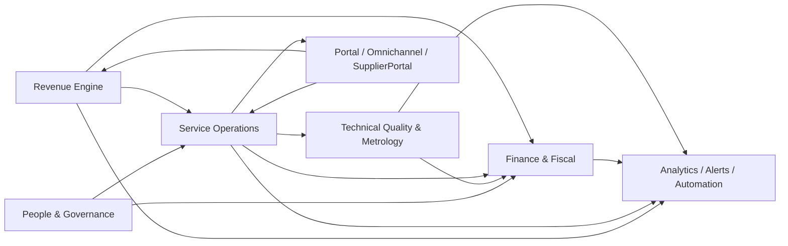

# Kalibrium — Product Requirements Document (PRD)

> **Diretrizes editoriais deste PRD:** [`docs/governance/prd-editorial-guide.md`](../governance/prd-editorial-guide.md) — mapa de canonicalidade, regras de resolução de conflitos, matriz de rastreabilidade e consolidações obrigatórias de leitura.
> **Backup do PRD compactado anterior:** [`docs/product/PRD-compactado-backup-2026-04-11.md`](PRD-compactado-backup-2026-04-11.md).
> **Origem do conteúdo canônico:** `ideia.md` movido para o repo em 2026-04-11 (commit `c320505`).
> **Auditoria de consistência vigente:** [`docs/audits/internal/prd-consistency-audit-2026-04-11.md`](../audits/internal/prd-consistency-audit-2026-04-11.md).

---
## Sumário Executivo

O **Kalibrium** é uma plataforma SaaS B2B multi-tenant para empresas de serviços técnicos, calibração, metrologia, inspeção e operação de campo. Substitui a combinação disfuncional de ERP genérico + CRM desacoplado + planilhas + sistemas setoriais isolados por uma única plataforma que integra comercial, operação técnica, laboratório, financeiro, fiscal, RH e qualidade em fluxos orientados a eventos.

O produto é dirigido a organizações com operação técnica complexa que sofrem com fragmentação sistêmica: dados espalhados, retrabalho de conciliação, baixa rastreabilidade, dificuldade de auditoria e incapacidade de escalar sem multiplicar sistemas. O Kalibrium resolve esse problema ao tratar as integrações entre domínios como core do produto — não como integrações acessórias.

### O Que Torna o Kalibrium Especial

O diferencial central do Kalibrium não é ter mais módulos — é que eventos de negócio atravessam módulos e geram efeitos controlados automaticamente. Quando uma OS é fechada em campo, mesmo após execução offline, o faturamento, o certificado de calibração e a cobrança avançam sem reentrada de dados. Esse fluxo contínuo, com rastreabilidade de cada etapa, é o que empresas do segmento não encontram em ERPs genéricos nem em sistemas setoriais isolados.

Diferenciais estruturais:
- **Profundidade vertical nativa:** ISO 17025, ISO 9001, INMETRO, Portaria 671/2021, CLT e eSocial como parte do core, não como complementos
- **Mobilidade com evidência:** operação móvel offline, localização, assinatura, foto e controle de presença como capacidades centrais
- **Propagação de eventos entre domínios:** mudanças de estado em campo refletem em financeiro, fiscal, qualidade e analytics automaticamente
- **Visão contínua do cliente:** do lead à renovação, expansão e retenção em um único sistema

### Guia de Navegação do Documento

| Seção | Conteúdo | Linha aproximada |
|---|---|---|
| Contexto e Oportunidade | Problema, oportunidade, timing estratégico | §2 |
| Personas e Jornadas | Perfis canônicos internos, externos e de operação SaaS, com jornadas end-to-end rastreadas a FRs, CAPs e fluxos | §Jornadas |
| Escopo do Produto | Produto-alvo completo, capacidades core, expansão funcional e visão avançada | §Escopo |
| Modelo de Pricing e GTM | Planos, go-to-market, programa de parceiros | §Pricing |
| Requisitos de Domínio | ISO 17025, LGPD, eSocial, INMETRO, RBAC | §Domínio |
| Requisitos Funcionais | 122 FRs principais em 11 domínios + capacidades complementares canônicas mapeadas por macrodomínio | §FRs |
| Requisitos Não Funcionais | 55 NFRs + SLOs por módulo (segurança, performance, confiabilidade, i18n) | §NFRs |
| Arquitetura Funcional | Módulos, eventos de domínio, ownership, integrações funcionais e governança entre domínios | §Arquitetura |
| Governança e Operação | Modelo de operação SaaS, onboarding, suporte, customer success | §Governança |


## Contexto e Oportunidade

### Problema Estrutural

O mercado-alvo do Kalibrium opera com alta complexidade processual, mas frequentemente depende de ERP financeiro genérico, CRM desacoplado da operação, controles em planilha, sistemas setoriais isolados e trabalho manual para conciliar status e documentos. Esse modelo provoca atraso, erro operacional, perda de margem, baixa previsibilidade, dificuldade de auditoria e baixa capacidade de expansão controlada.

### Oportunidade

Existe uma oportunidade clara para uma plataforma que una profundidade vertical, fluidez operacional, inteligência de negócio, rastreabilidade de compliance e padronização escalável por tenant.

### Timing Estratégico

O produto torna-se especialmente relevante em organizações que já passaram do estágio inicial de operação e sofrem com crescimento desorganizado: aumento de equipe, aumento de tickets, aumento de contratos, aumento de exigências regulatórias e aumento de canais de atendimento sem backbone sistêmico equivalente.

### Perfil de Cliente (ICP)

O ICP do Kalibrium inclui organizações que combinam ao menos parte dos seguintes fatores:
- operação técnica em campo ou laboratório
- necessidade de rastreabilidade documental e evidencial
- dependência de contratos recorrentes, SLAs ou ordens de serviço
- exigência de integração entre comercial, execução e financeiro
- exposição a requisitos regulatórios, trabalhistas, fiscais ou de qualidade
- dificuldade atual com sistemas fragmentados e reconciliação manual

### Patrocinadores e Compradores Internos

O Kalibrium é tipicamente comprado por coalizão interna:

| Decisor | O que busca |
|---|---|
| CEO / Direção Geral | Previsibilidade operacional, escala e visibilidade da empresa como um todo |
| COO / Operações | Padronização de processo, produtividade, SLA e governança de execução |
| CFO / Financeiro | Faturamento disciplinado, cobrança, margem, reconciliação e controle |
| Diretoria Técnica / Qualidade | Rastreabilidade, conformidade, certificação e controle de evidências |
| TI / Engenharia | Redução de acoplamento entre sistemas, governança de contratos e sustentabilidade tecnológica |

### Alavancas Econômicas

O Kalibrium gera valor por cinco alavancas principais:
1. Redução de retrabalho administrativo e operacional
2. Redução do tempo entre execução e faturamento
3. Redução de perdas por erro, esquecimento, atraso ou inconsistência documental
4. Aumento de conversão, renovação e expansão de receita
5. Aumento da previsibilidade de caixa, produtividade e capacidade gerencial

---


## Princípios de Produto

| Princípio | Descrição |
|---|---|
| Fluxo acima de tela | Cada tela existe para servir um fluxo de negócio real. O produto privilegia jornadas completas, não funcionalidades isoladas. |
| Multi-tenant por desenho | O isolamento entre tenants é requisito estrutural. Segurança, filtragem de dados, permissões e configurabilidade devem nascer sensíveis ao contexto do tenant. |
| Compliance como produto | Regras fiscais, trabalhistas, laboratoriais e de qualidade fazem parte do core do valor entregue — não são acessórios. |
| Operação assistida por eventos | Mudanças de estado relevantes devem propagar ações e sincronizações para os módulos dependentes com previsibilidade e auditabilidade. |
| Mobilidade real | A experiência do técnico em campo e do operador fora do desktop é tratada como requisito principal, incluindo coleta de evidências, uso offline e sincronização. |
| Lead eterno e cliente contínuo | O relacionamento comercial não termina na venda. O cliente permanece em jornadas estruturadas de retenção, renovação, expansão e valor recorrente. |
| Verdade única e consistente | O produto reduz duplicidade de origem de dados e impede divergências entre áreas por meio de contratos claros, modelos consistentes e integração entre camadas. |
| Produto como sistema de decisão | O Kalibrium serve não apenas para registrar o passado, mas para orientar a próxima ação operacional, comercial, técnica ou executiva. |

---


## Classificação do Projeto

- **Tipo:** SaaS B2B — plataforma multi-tenant modular com tiers de assinatura, RBAC e integrações
- **Domínio:** Metrologia / Serviços Técnicos de Campo — com compliance metrológico, laboratorial, fiscal e trabalhista
- **Complexidade:** Alta — múltiplos regimes regulatórios simultâneos, operação offline, 6 macrodomínios integrados
- **Contexto:** Greenfield — produto novo; este PRD é a fonte canônica única da visão de produto


## Trilhas Permanentes de Evolução do Produto

O Kalibrium se organiza em cinco trilhas permanentes de evolução do produto, aplicadas continuamente ao ciclo de maturidade do sistema completo:

### Trilha 1 — Excelência Operacional

Mais automação, menor retrabalho, mais previsibilidade de agenda, campo e faturamento.

### Trilha 2 — Profundidade Vertical

Expansão continua de recursos técnicos, laboratoriais, fiscais e regulatórios aderentes ao segmento de metrologia, calibração e serviços técnicos.

### Trilha 3 — Experiência Conectada

Melhor integração entre portal, mobile, omnichannel, fornecedores, clientes e parceiros.

### Trilha 4 — Inteligência e Prevencao

Mais analytics, deteccao de anomalias, alertas proativos e suporte a decisão baseado em dados.

### Trilha 5 — Escala e Governanca

Maior configurabilidade por tenant, maior robustez arquitetural e menor custo de evolução do produto.

### Critérios de Priorização Continua

Iniciativas devem ser priorizadas quando contribuirem, em ordem decrescente de importancia:

1. Proteção de receita
2. Proteção de compliance e risco regulatório
3. Redução de trabalho manual recorrente
4. Aumento de fluidez em fluxos end-to-end críticos
5. Aumento de capacidade analitica e de decisão
6. Preservação da coerência arquitetural da plataforma

### Hierarquia de Decisão sob Conflito

Quando houver conflito entre conveniência operacional local e coerência sistêmica do produto, a decisão correta deve respeitar a seguinte ordem:

1. Proteção de segurança, isolamento tenant e identidade
2. Proteção de compliance, obrigação legal e rastreabilidade regulatória
3. Preservação de evidência, causalidade e integridade documental
4. Continuidade operacional controlada com fallback explícito
5. Proteção de receita, cobrança e previsibilidade financeira
6. Ergonomia de uso, velocidade local e conveniência de interface

Essa hierarquia existe para evitar que ganhos locais de curto prazo degradem os fundamentos estruturais do sistema.

### Gestão de Mudança e Operação Assistida

O produto deve ser operado como mudança de sistema operacional da empresa, e não apenas como substituição de telas. Cada frente funcional deve contemplar: onboarding, treinamento, revisão de papeis, desativação de controles paralelos, suporte assistido, estabilização operacional e critérios claros de uso consistente entre areas internas e canais externos.

---


## Métricas de Sucesso, KPIs e Critérios

### Métrica Norte

A métrica norte do Kalibrium é o **percentual de fluxos operacionais críticos concluídos ponta a ponta dentro do sistema, com evidência e sem reconciliação manual externa**. Esta seção é a fonte canônica para métricas, KPIs, health score e critérios de sucesso; seções subordinadas apenas detalham uso, owner e método de medição.

### Por Eixo

| Eixo | Métricas |
|---|---|
| **Receita e Comercial** | Taxa de conversão lead→proposta; taxa de aprovação de orçamento; receita recorrente ativa; renovação, expansão e churn; tempo de ciclo comercial |
| **Operação** | Tempo médio de resposta e resolução; % de SLA cumprido; produtividade por técnico, equipe e rota; tempo entre abertura e faturamento |
| **Financeiro** | Prazo médio de recebimento; inadimplência; margem por serviço, contrato, projeto ou cliente; previsibilidade de caixa |
| **Qualidade e Compliance** | Número de NCs e reincidências; vencimentos críticos monitorados; violações trabalhistas detectadas e tratadas; instrumentos bloqueados, certificados emitidos e rastreabilidade completa |
| **Produto e Plataforma** | Adoção por módulo; frequência de uso por persona; tempo para completar fluxos críticos; incidentes operacionais por tenant; cobertura de automações e alertas acionáveis |

### Sinais de Valor Econômico

- Redução do tempo médio entre execução e faturamento
- Redução de horas gastas em reconciliação manual
- Redução de perdas operacionais por esquecimento, atraso ou inconsistência
- Aumento de previsibilidade de renovação e cobrança
- Redução de risco operacional em auditorias e fiscalizações

### Cobertura Operacional por Tenant

- % de módulos operados com uso recorrente
- % de fluxos críticos sem apoio de planilhas ou canais paralelos
- Taxa de autosserviço em portal e canais externos
- Tempo de ativação até primeira operação ponta a ponta concluída com evidência

### Saúde Operacional da Plataforma

- Tempo de detecção e resolução de incidentes por severidade
- Taxa de reprocessamento bem-sucedido em filas, notificações de eventos e integrações críticas
- % de rotinas e sincronizações concluídas sem intervenção manual
- Volume de exceções recorrentes por fluxo crítico
- % de tenants operando sem regressão de evidência, compliance ou faturamento após ciclo de evolução do produto

---


## KPIs de Produto — Matriz Subordinada

> **Seção subordinada a `§Métricas de Sucesso, KPIs e Critérios`.** Esta seção é a matriz operacional de indicadores e não cria uma segunda métrica norte. Em caso de conflito de valor, baseline, owner ou meta, prevalece a seção canônica.

Cada indicador usado em dashboards, QBRs, health score ou prova de valor deve declarar owner, método de medição, baseline e meta antes de ser tratado como compromisso de produto ou contrato.

### Métrica Norte

**Percentual de fluxos operacionais críticos concluídos ponta a ponta dentro do sistema, com evidência e sem reconciliação manual externa.**

Definição operacional: fluxo crítico concluído conta apenas quando o estado final, evidências mínimas, efeito financeiro/operacional aplicável e trilha de auditoria existem no Kalibrium sem correção manual externa. Fluxos parcialmente executados fora do sistema, em planilhas, mensagens soltas ou retrabalho administrativo não contam como conclusão plena.

### Matriz Canônica de KPIs

| Dimensão | KPI | Owner funcional | Método de medição | Meta orientativa |
|---|---|---|---|---|
| Receita e Comercial | Conversão lead → proposta → cliente | Comercial / CS | Funil de CRM por origem, vendedor, segmento e período | Aumentar conversão qualificada sem elevar churn precoce |
| Receita e Comercial | Renovação, expansão e churn | CS / Diretoria | Contratos renovados, expansão de ARR/MRR, cancelamentos e motivos | Reduzir churn e aumentar expansão em contas com adoção alta |
| Receita e Comercial | Ciclo lead-to-cash | Comercial / Financeiro | Dias entre lead qualificado, proposta aceita, OS/contrato, faturamento e recebimento | Reduzir tempo total do ciclo e gargalos entre áreas |
| Operação | SLA cumprido por OS, técnico, equipe e canal | Operações | Status de chamados/OS, primeira resposta, execução, entrega e exceções | Aumentar cumprimento por canal sem mascarar reagendamentos |
| Operação | Tempo abertura → faturamento | Operações / Financeiro | Data de abertura, conclusão, aprovação, pré-fatura, emissão fiscal e cobrança | Reduzir atraso entre execução e faturamento |
| Operação | Produtividade técnica com qualidade | Operações / Qualidade | OS concluídas, receita, retrabalho, garantia, avaliação e NC por técnico | Crescer produtividade sem aumentar retrabalho |
| Financeiro | PMR, inadimplência e aging | Financeiro | Títulos emitidos, vencidos, renegociados, baixados e conciliados | Reduzir inadimplência e tempo de baixa |
| Financeiro | Margem por OS, contrato, projeto e cliente | Financeiro / Operações | Receita, custo direto, custo indireto, comissão, deslocamento e retrabalho | Tornar margem real visível e acionável |
| Qualidade e Compliance | NCs, CAPAs e reincidência | Qualidade | Abertura, causa, prazo, eficácia, reabertura e recorrência | Reduzir reincidência e pendências vencidas |
| Qualidade e Compliance | Vencimentos críticos tratados | Qualidade / RH / Fiscal | Certificados, padrões, ASO, EPI, obrigações fiscais, documentos e seguros | Tratar itens críticos antes do vencimento |
| Produto e Plataforma | Adoção por módulo e persona | Produto / CS | Uso recorrente, fluxos concluídos, usuários ativos e funcionalidades nunca usadas | Aumentar cobertura operacional por tenant |
| Produto e Plataforma | Exceções recorrentes por fluxo | Produto / Operações | Filas de exceção, reprocessamento, owner, causa raiz e tempo de resolução | Reduzir recorrência e MTTR |
| SaaS Operations | Health score do tenant | CS / TenantOps | Adoção, uso, exceções, suporte, NPS, limites e risco de churn | Antecipar risco e orientar expansão |

### Regras de Medição

- Métricas devem ser filtráveis por tenant, plano, segmento, filial, período, módulo e persona quando o contexto permitir.
- Métricas usadas para cobrança, SLA, comissão, ranking, penalidade ou prova contratual exigem trilha de cálculo e versão da regra aplicada.
- Métricas de adoção não devem expor dados pessoais além do necessário; visões internas da Kalibrium devem respeitar escopo, mascaramento e justificativa de acesso.
- Qualquer meta numérica pública ou contratual deve ser validada contra baseline real de tenants comparáveis antes de entrar em contrato, proposta comercial ou material de venda.

### Dicionário Canônico de Uso das Métricas

Para evitar duplicidade entre `Métricas de Sucesso`, `KPIs de Produto`, health score, QBR, dashboards e provas comerciais, cada métrica deve ser classificada antes de uso operacional:

| Uso da métrica | Exige | Pode virar compromisso contratual? | Exemplo |
|---|---|---|---|
| Métrica de produto | Owner, método, evento de origem e segmentação por tenant/plano | Não, até ter baseline real | Adoção por módulo e persona |
| Métrica de operação do tenant | Fila ou ação operacional associada | Sim, se ligada a SLA do tenant | Tempo de primeira resposta por canal |
| Métrica financeira/comercial | Fórmula, regra de competência/caixa e fonte de verdade | Sim, quando usada em comissão, cobrança ou QBR | Margem por OS ou contrato |
| Métrica de compliance | Evidência, retenção, regra de cálculo e trilha de decisão | Sim, quando vinculada a auditoria ou contrato Enterprise | Vencimentos críticos tratados no prazo |
| Métrica de plataforma | Severidade, SLO, período de apuração e exclusões | Sim, conforme plano e NFR canônico | Disponibilidade e tempo de recuperação |
| Métrica de health score | Peso, causa acionável, owner e playbook | Não isoladamente; serve para CS e expansão | Tenant em risco por queda de uso e exceções recorrentes |

Regra de produto: indicador sem ação associada é informação; indicador com owner, prazo, decisão e evidência vira governança. Dashboards executivos devem priorizar o segundo tipo.

---


## Critérios de Sucesso — Leitura Derivada

Os critérios abaixo traduzem a métrica norte e a matriz de KPIs em sinais observáveis de uso, negócio e operação. Eles não criam novas métricas concorrentes.

### User Success

- Técnico de campo conclui OS ponta a ponta (checklist, assinatura, foto, geolocalização, sincronização) sem reconciliação manual
- Coordenador técnico monitora SLA, agenda e produtividade por equipe em tempo real sem planilhas paralelas
- Analista financeiro emite NF-e e registra cobrança diretamente a partir do fechamento da OS, sem reentrada de dados
- Gestor de qualidade acessa trilha de evidências completa de qualquer calibração sem pesquisa forense manual
- Cliente acompanha serviços, documentos e certificados pelo portal com autosserviço, sem depender de e-mail
- Liderança decide com base em indicadores vivos, não em reconciliações tardias

### Business Success

**Métrica Norte:** percentual de fluxos operacionais críticos concluídos ponta a ponta dentro do sistema, com evidência e sem reconciliação manual externa.

- **Comercial:** taxa de conversão lead→proposta, taxa de aprovação de orçamento, receita recorrente ativa, renovação/expansão/churn e tempo de ciclo comercial
- **Operação:** percentual de SLA cumprido, produtividade por técnico/equipe/rota, tempo médio entre abertura e faturamento
- **Financeiro:** prazo médio de recebimento, inadimplência, margem por serviço/contrato/cliente, previsibilidade de caixa
- **Qualidade:** não conformidades e reincidências, vencimentos críticos monitorados, instrumentos bloqueados e certificados emitidos com rastreabilidade completa
- **Produto:** adoção por módulo, frequência de uso por persona, cobertura de automações e alertas acionáveis

### Technical Success

- Disponibilidade ≥99,5% para operações críticas (emissão fiscal, fechamento de OS, certificação)
- Sincronização offline→online sem perda de dados em até 60 segundos após reconexão
- Isolamento total entre tenants — zero vazamento de dados entre organizações
- ISO 17025, INMETRO, eSocial e NF-e como requisito de coerência do produto completo
- Mudança de estado crítica em qualquer fluxo relevante gera efeitos consistentes nos módulos dependentes
- Percentual de rotinas e sincronizações concluídas sem intervenção manual ≥99%
- Tenants operando sem regressão de evidência, compliance ou faturamento após cada ciclo de evolução do produto

### Measurable Outcomes

- Redução do tempo médio entre execução e faturamento
- Redução de horas gastas em reconciliação manual
- Redução de perdas operacionais por esquecimento, atraso ou inconsistência documental
- Aumento de previsibilidade de renovação e cobrança
- Redução de risco operacional em auditorias e fiscalizações


## Critérios de Excelência do Produto

O Kalibrium será considerado excelente quando:

- O fluxo comercial ao financeiro operar sem rupturas manuais
- A execução em campo e em laboratório produzir evidência confiável por padrão
- Compliance deixar de ser atividade reativa e passar a ser comportamento nativo da plataforma
- Clientes, fornecedores e equipes internas conseguirem operar em canais dedicados sem perda de contexto
- O backoffice enxergar impacto financeiro, fiscal, operacional e humano a partir de uma mesma verdade de dados
- A liderança conseguir decidir com base em indicadores vivos, não em reconciliações tardias
- Uma mudança de estado crítica em qualquer fluxo relevante gerar efeitos consistentes nos módulos dependentes
- A plataforma sustentar crescimento de complexidade sem perder clareza de operação

### Critério Objetivo

Quatro condições simultâneas: fluxos críticos operando com evidência; baixa dependência de reconciliação manual; canais externos coerentes com o backoffice; governança suficiente para troubleshooting e auditoria sem pesquisa forense artesanal.

### Matriz de Excelência por Macrodomínio

| Macrodomínio | Excelência quando | Evidências mínimas |
|---|---|---|
| Revenue Engine | Aquisição, proposta, contratação, cobrança, retenção e expansão operam sobre a mesma visão de cliente e receita | Histórico comercial íntegro, proposta rastreável, contrato coerente, título financeiro vinculado, sinais de retenção |
| Service Operations | Toda demanda relevante entra classificada, recebe SLA, percorre execução rastreável e fecha com efeito sistêmico consistente | Ticket identificado, timeline da OS, checklist, assinatura, fotos, geolocalização, status final e reflexos derivados |
| Technical Quality & Metrology | Processos técnicos produzem certificado, conformidade, bloqueios e rastreabilidade sem ambiguidade documental | Leituras, cálculos, aprovações, certificado verificável, validade, vínculo com equipamento e trilha regulatória |
| People, Governance & Corporate Backbone | Identidade, jornada, compliance, segurança e ownership corporativo operam sem zonas cinzentas | Permissões auditáveis, ponto e folha coerentes, trilha de consentimento, sessão controlada, owners nomeados |
| Digital Experience & Relationship Channels | Clientes e parceiros operam com autonomia sem perda de contexto interno | Autenticação segregada, tickets coerentes, autosserviço documental, links rastreáveis, feedback retornando ao core |
| Intelligence, Automation & Decision Layer | Alertas, dashboards e automações orientam ação e não apenas expõem dados | Indicadores vivos, owners de alerta, automações mensuráveis, drill-down por fluxo, recomendação acionável |

---


## Prioridades Estruturais do Produto (subordinada a §Trilhas Permanentes de Evolução do Produto)

> **Seção subordinada a `§Trilhas Permanentes de Evolução do Produto`.** As 5 trilhas, os 6 critérios de priorização contínua e a hierarquia de decisão sob conflito estão integralmente detalhados na seção canônica (com subseções H3 explicativas). Esta seção existia como resumo executivo em tabela e foi consolidada para eliminar duplicação estrutural. Em caso de conflito de formulação, prevalece a seção canônica.

---


## Gates Permanentes de Operação

Todo fluxo ou feature deve passar por seis gates antes de ir a produção:

| Gate | Critério |
|---|---|
| **Funcional** | Fluxos críticos operam ponta a ponta sem ruptura manual relevante, com contratos entre módulos preservados e estados coerentes entre origem, processamento e resultado |
| **Evidência** | Estados, documentos, logs, assinaturas, fotos, geolocalização, XMLs, comprovantes e artefatos exigíveis estão disponíveis com autoria e contexto |
| **Operacional** | Observabilidade, filas, reprocessamento, fallback, parametrização por tenant, monitoramento de integrações e recuperação de exceções estão definidos para todos os fluxos críticos |
| **Uso consistente** | Owners funcionais, permissões, treinamento, critérios de uso e suporte assistido garantem operação consistente entre áreas internas, clientes, técnicos e parceiros |
| **Ativação por tenant** | Dados mestres reconciliados, usuários e permissões validados, integrações indispensáveis configuradas, fluxos críticos executados com evidência e governança para estabilização |
| **Fallback operacional** | Todo fluxo dependente de terceiro, conectividade, processamento assíncrono ou canal externo possui degradação controlada, auditável e reversível — explicitando o que continua, o que aguarda e quem é owner da recuperação |

---


## Score de Saúde Compliance e Maturidade Regulatória

Dashboard interno que calcula a "nota de conformidade" da empresa em multiplas dimensoes:

### Dimensoes Avaliadas

| Dimensão | Indicadores |
|---|---|
| Metrologia | % padrões de calibração com certificado vigente, % instrumentos internos calibrados, padrões vencidos em uso |
| RH / Trabalhista | Eventos eSocial pendentes ou com erro, ASOs a vencer, técnicos com habilitações vencidas, espelhos com inconsistências |
| Fiscal | Guias de imposto vencidas não pagas, obrigações atrasadas (DCTF, PGDAS-D), NF-e com rejeicao SEFAZ não reprocessadas |
| Documental | Documentos ISO com revisão vencida, alvaras proximos do vencimento, apolices de seguro vencidas |
| Segurança | Usuários sem 2FA, acessos de ex-colaboradores não revogados, backups do período executados |

- Nota de 0 a 100 por dimensão com semáforo (verde/amarelo/vermelho)
- Nota geral com pesos configuráveis
- Lista de pendências com link direto para a ação corretiva
- Histórico da nota ao longo do tempo para demonstrar evolução em auditorias
- Relatório exportável para apresentar em auditorias ISO, revisões gerenciais e due diligence de clientes corporativos

---


## Personas e Jobs To Be Done

| Persona | Job principal | Como o Kalibrium ajuda |
|---|---|---|
| Diretoria / Gestão Executiva | Entender saúde do negócio e decidir rápido | Painéis, KPIs, margem, risco, governança e visibilidade entre domínios |
| Produto / Operações | Padronizar processos e aumentar eficiência | Configuração, automações, observabilidade, desenho de fluxo |
| Comercial / CRM | Converter, renovar e expandir receita | Pipeline, propostas, contratos, forecast e campanhas |
| Atendimento / Helpdesk | Organizar demanda e cumprir SLA | Triagem, priorização, escalonamento, histórico e omnichannel |
| Coordenação Técnica | Planejar agenda e garantir execução | Roteirização, despacho, visibilidade de equipe, backlog e SLA |
| Técnico de Campo | Executar com velocidade e comprovação | Operação móvel offline, checklist, assinatura, foto, localização, evidência e sincronização |
| Laboratório / Metrologia | Garantir confiabilidade técnica e documental | Medições, cálculos, incerteza, certificados e rastreabilidade |
| Financeiro / Fiscal | Controlar caixa, cobrança e obrigação fiscal | AR/AP, faturamento, reconciliação, emissão fiscal e comissões |
| RH / DP | Cumprir regras trabalhistas com prova | Ponto, jornada, violações, férias, eSocial e espelho |
| Qualidade / Compliance | Detectar desvios e garantir aderência | CAPA, auditorias, vencimentos, documentos e trilha de evidências |
| Compras / Suprimentos | Homologar fornecedores e garantir abastecimento | Requisições, cotações, pedidos, recebimento, divergências e score de fornecedor |
| Cliente Final | Acompanhar serviços e documentos | Portal, chamados, contratos, certificados e status |
| Fornecedor / Parceiro | Responder e operar com menos atrito | Portal B2B, cotações, uploads, logística e documentos |
| CS / ProductOps Kalibrium | Manter tenants saudáveis e governados | Health score, quotas, incidentes, suporte assistido, rollout e evidências enterprise |

### Condições de Adoção Bem-Sucedida

Para gerar impacto real, a adoção do produto depende de:
- Patrocínio executivo claro com owner funcional por macrodomínio
- Comprometimento com substituição de controles paralelos (planilhas, sistemas legados)
- Disciplina de processo e uso do sistema como fonte de verdade
- Onboarding progressivo por ondas — não ativação caótica de tudo ao mesmo tempo

### Perfis Externos e Operacionais SaaS

Perfis externos e de operação SaaS que não cabem na tabela resumida acima devem aparecer como jornadas ou superfícies de trabalho com escopo mínimo, owner, entradas, saídas, evidências e métricas. Isso inclui comprador externo do cliente, auditor, contador, fornecedor, subcontratado, parceiro de canal, CS, ProductOps, TenantOps, SupportOps e Billing SaaS.

---


## Jornadas do Usuário

### Jornada 1 — Carlos, Técnico de Campo (Caminho de Sucesso)

**Situação:** Carlos chega às 7h30 numa indústria no interior de SP para calibrar 14 instrumentos de pressão. O sinal de celular é instável na área fabril.

**Cena de abertura:** Carlos abre a experiência móvel do Kalibrium no seu dispositivo de campo. As OSs do dia já estão sincronizadas offline — lista de instrumentos, procedimentos, histórico de calibrações anteriores e selos INMETRO disponíveis. Sem sinal, sem problema.

**Ação crescente:** Para cada instrumento, Carlos registra as leituras diretamente no app. O sistema calcula a incerteza de medição em tempo real. Para dois instrumentos que reprovam, ele aplica os lacres correspondentes, fotografa, registra os números de série e indica os selos de reparo INMETRO consumidos. O app guia o fluxo sem deixar campo obrigatório vazio.

**Clímax:** Ao final do dia, ao chegar na área de escritório com Wi-Fi, Carlos toca "sincronizar". Em 40 segundos, todas as 14 OSs estão enviadas. Os certificados de calibração dos instrumentos aprovados já foram gerados automaticamente. As NFs já estão na fila de emissão. O gestor já recebeu o relatório do dia.

**Resolução:** Carlos não precisa preencher planilha, não precisa ligar pro escritório, não precisa reentrar nada. Sua produtividade por dia aumentou 35%.

**Capacidades reveladas:** sincronização offline, execução móvel, cálculo de incerteza, geração automática de certificado, controle de selos INMETRO, propagação de eventos para fiscal e financeiro.

**Requisitos correspondentes:** FR-OPS-02, FR-OPS-05, FR-OPS-09, FR-LAB-03, FR-LAB-05, FR-LAB-13, FR-INT-05

---

### Jornada 2 — Ana, Coordenadora Técnica (Planejamento e SLA)

**Situação:** Ana coordena 12 técnicos atendendo 3 estados. Segunda-feira às 8h ela precisa fechar a agenda da semana com 47 OSs abertas e 6 contratos de preventiva com SLA vencendo.

**Cena de abertura:** Ana abre o painel de coordenação. O Kalibrium já sinalizou em vermelho as 6 OSs com SLA crítico e amarelo as 14 que vencem em 48h. O mapa mostra a posição de cada técnico com as OSs próximas agrupadas por rota.

**Ação crescente:** Ana arrasta OSs para técnicos no modo de despacho. O sistema valida automaticamente: habilitação do técnico para aquele tipo de serviço, instrumentos de calibração disponíveis no estoque, distância e tempo estimado de deslocamento. Uma OS de laboratório acreditado ISO 17025 só aparece para os 3 técnicos com habilitação ativa.

**Clímax:** Ana fecha o planejamento em 22 minutos. Os técnicos recebem as OSs no app instantaneamente com rota otimizada. A TV do escritório mostra o painel em tempo real: OSs em execução, SLA cumprido vs atrasado, técnicos online.

**Resolução:** Ana passa a tarde gerenciando por exceção — só intervém quando o sistema alerta desvio. Zero ligações de "qual é minha agenda de hoje?".

**Capacidades reveladas:** agenda visual, roteirização, matriz de habilitações, despacho por competência, TV dashboard, alertas de SLA, visibilidade em tempo real.

**Requisitos correspondentes:** FR-OPS-01, FR-OPS-03, FR-OPS-04, FR-BI-02, FR-BI-06

---

### Jornada 3 — Beatriz, Analista Financeira (Faturamento Sem Reentrada)

**Situação:** Beatriz trabalha numa empresa que fecha 120 OSs por semana. Antes do Kalibrium, ela passava 3 dias por semana reentrado dados de OSs em planilhas para faturar.

**Cena de abertura:** Beatriz abre a fila de faturamento no Kalibrium. Todas as OSs encerradas pelos técnicos já estão lá, com serviços, peças consumidas, horas apontadas, impostos calculados e cliente vinculado ao contrato.

**Ação crescente:** Para OSs com contrato recorrente, a NF-e já foi gerada automaticamente e o título a receber criado. Para OSs avulsas, Beatriz revisa a margem (calculada com custo de mão de obra + materiais + deslocamento) e aprova o faturamento em lote.

**Clímax:** Em 40 minutos Beatriz aprovou e emitiu 67 NF-e diretamente integradas à SEFAZ. Os títulos a receber foram criados, os boletos gerados, as comissões dos vendedores calculadas e as notificações de cobrança disparadas automaticamente.

**Resolução:** Beatriz eliminou 3 dias de retrabalho semanal. O tempo médio entre execução e faturamento caiu de 6 dias para menos de 24h.

**Capacidades reveladas:** fila de faturamento, simulação de margem por OS, emissão de NF-e integrada à SEFAZ, títulos a receber, geração de boleto, cálculo automático de comissão.

**Requisitos correspondentes:** FR-FIN-01, FR-FIN-02, FR-FIN-03, FR-FIN-08, FR-FIN-09, FR-OPS-09

---

### Jornada 4 — Roberto, Gestor de Qualidade (Auditoria ISO 17025)

**Situação:** O auditor externo do INMETRO chega para a auditoria de renovação da acreditação ISO 17025. Roberto tem 2 horas para demonstrar rastreabilidade de 6 meses de calibrações.

**Cena de abertura:** Roberto abre o módulo de qualidade do Kalibrium e seleciona o período. O sistema gera instantaneamente o relatório de rastreabilidade: cada calibração com técnico habilitado, padrões utilizados, certificados de rastreabilidade dos padrões, leituras brutas, cálculo de incerteza, resultado, certificado emitido e assinatura do responsável.

**Ação crescente:** O auditor pede evidência de uma calibração específica de 3 meses atrás. Roberto busca pelo número de certificado. Em 8 segundos: OS completa com fotos, leituras, cálculos, selos aplicados, assinatura do cliente e PDF do certificado com QR code de verificação pública.

**Clímax:** O auditor solicita os registros de não conformidades do período. Roberto exibe o painel de NCs: abertura, causa raiz, CAPA aplicado, evidência de eficácia e fechamento — tudo rastreável, com responsável e prazo.

**Resolução:** Auditoria concluída sem achados críticos. O Kalibrium foi citado como evidência de maturidade do sistema de gestão.

**Capacidades reveladas:** rastreabilidade laboratorial, certificados verificáveis por QR code, gestão de CAPA, histórico completo por instrumento, painel de não conformidades.

**Requisitos correspondentes:** FR-LAB-02, FR-LAB-04, FR-LAB-11, FR-LAB-12, FR-QUA-01, FR-QUA-02, FR-QUA-04

---

### Jornada 5 — Fernanda, Gerente de Manutenção (Cliente Final — Portal)

**Situação:** Fernanda é gerente de manutenção numa indústria com 340 instrumentos calibrados anualmente por uma prestadora que usa o Kalibrium.

**Cena de abertura:** Fernanda recebe e-mail automático: "12 instrumentos da sua empresa vencem a calibração nos próximos 30 dias." O link leva ao portal do cliente.

**Ação crescente:** No portal, Fernanda vê o mapa completo do parque de instrumentos: status de calibração, vencimentos, certificados disponíveis para download e histórico de OSs. Ela abre um chamado de agendamento coletivo para os 12 instrumentos diretamente pelo portal.

**Clímax:** A OS é criada automaticamente no Kalibrium da prestadora, com os instrumentos identificados, histórico de calibrações anteriores e SLA contratual vinculado. Fernanda acompanha pelo portal em tempo real: agendada → em execução → concluída. Os certificados chegam no portal no mesmo dia.

**Resolução:** Fernanda nunca mais liga para o prestador para saber "cadê o certificado". Exporta todos os certificados do período para seu auditor interno com dois cliques.

**Capacidades reveladas:** portal do cliente, notificações automáticas de vencimento, abertura de OS pelo cliente, acompanhamento em tempo real, download de certificados, histórico do parque de instrumentos.

**Requisitos correspondentes:** FR-POR-01, FR-POR-05, FR-POR-06, FR-QUA-05, FR-COM-10

---

### Jornada 6 — Diego, Admin do Tenant (Onboarding e Configuração)

**Situação:** Diego é o TI da empresa que acabou de contratar o Kalibrium. Ele precisa colocar a operação rodando em 30 dias.

**Cena de abertura:** Diego acessa o wizard de onboarding. Passo 1: dados da empresa e CNPJ (validado em tempo real na Receita Federal). Passo 2: seleção do perfil operacional — "laboratório em processo de acreditação ISO 17025". O sistema ativa automaticamente os módulos e regras correspondentes.

**Ação crescente:** Diego importa 1.200 clientes e 3.400 instrumentos via Excel usando o mapeamento visual de colunas. O sistema valida, mostra preview dos primeiros 20 registros e processa a importação de forma assíncrona. Diego recebe notificação quando concluído: 1.198 importados, 2 rejeitados com motivo detalhado.

**Clímax:** Diego configura papéis e permissões: 3 administradores, 8 técnicos, 2 atendentes, 1 financeiro. Cada perfil vê exatamente o que precisa. Configura séries de NF-e, certificado digital A1 e regras de SLA por tipo de serviço.

**Resolução:** Em 18 dias o sistema está em produção com dados reais. Diego nunca precisou ligar para o suporte — o wizard guiou tudo.

**Capacidades reveladas:** onboarding automatizado, importação assistida com mapeamento visual, RBAC por perfil, configuração de certificado digital, wizard de setup, checklist de ativação.

**Requisitos correspondentes:** FR-SEG-01, FR-SEG-02, FR-SEG-07, FR-LAB-01, FR-INT-04

---

### Resumo de Capacidades por Jornada

| Jornada | Capacidades Críticas Reveladas | Requisitos Principais |
|---|---|---|
| J1 — Técnico de Campo (Carlos) | Operação móvel offline, calibração, selos INMETRO, sincronização, geração de certificado | FR-OPS-01, FR-OPS-02, FR-OPS-03, FR-OPS-04, FR-OPS-05, FR-OPS-09, FR-LAB-01, FR-LAB-02, FR-LAB-03, FR-LAB-04, FR-LAB-05, FR-LAB-13, FR-INT-05 |
| J2 — Coordenadora Técnica (Ana) | Agenda, despacho por habilitação, SLA, TV dashboard, alertas | FR-OPS-01, FR-OPS-03, FR-OPS-04, FR-OPS-09, FR-QUA-05, FR-BI-02, FR-BI-06 |
| J3 — Analista Financeira (Beatriz) | Fila de faturamento, NF-e automática, margens, títulos, comissões | FR-FIN-01, FR-FIN-02, FR-FIN-03, FR-FIN-08, FR-FIN-09, FR-OPS-09, FR-INT-04 |
| J4 — Gestor de Qualidade (Roberto) | Rastreabilidade ISO, CAPA, certificados verificáveis, painel de NCs | FR-LAB-11, FR-LAB-12, FR-QUA-01, FR-QUA-02, FR-QUA-04, FR-INT-05 |
| J5 — Cliente Final (Fernanda) | Portal self-service, vencimentos, OS, acompanhamento, download | FR-POR-01, FR-POR-05, FR-POR-06, FR-QUA-05, FR-COM-10, FR-SEG-01, FR-SEG-07 |
| J6 — Admin / TI (Diego) | Onboarding wizard, importação, RBAC, certificado digital, setup | FR-SEG-01, FR-SEG-02, FR-SEG-07, FR-LAB-01, FR-INT-03, FR-INT-04, FR-INT-07 |
| J7 — Diretora de Operações (Carla) | Visão consolidada de grupo, KPIs multi-empresa, políticas de grupo | FR-BI-01, FR-BI-02, FR-BI-04, FR-SEG-02 |
| J8 — Analista RH/DP (Luiza) | Ponto eletrônico, folha, eSocial, banco de horas, documentos trabalhistas | FR-RH-01, FR-RH-02, FR-RH-03, FR-RH-04, FR-RH-05, FR-RH-06, FR-RH-07, FR-RH-08, FR-RH-09, FR-RH-10, FR-RH-11, FR-RH-12 |
| **Domínio COM** (sem jornada dedicada) | CRM, pipeline, propostas, comissionamento, ciclo pós-venda | FR-COM-01, FR-COM-02, FR-COM-03, FR-COM-04, FR-COM-05, FR-COM-06, FR-COM-07, FR-COM-08, FR-COM-09, FR-COM-10 |
| **Domínio LOG** (sem jornada dedicada) | Logística de instrumentos, frota, estoque, seguros | FR-LOG-01, FR-LOG-02, FR-LOG-03, FR-LOG-04, FR-LOG-05 |
| **Domínio INT** (sem jornada dedicada) | Integrações ERP, camada de orquestração, resiliência, eSocial | FR-INT-01, FR-INT-02, FR-INT-03, FR-INT-06, FR-INT-07, FR-INT-08, FR-INT-09, FR-INT-10 |
| **Domínio BI** adicional | Automação, IA assistida, TV Dashboard | FR-BI-03, FR-BI-05, FR-BI-06 |
| **Domínio LAB** adicional | Dual sign-off, gráficos de controle, IoT ambiental, bloqueio automático de padrões, templates de certificado | FR-LAB-05, FR-LAB-06, FR-LAB-07, FR-LAB-08, FR-LAB-09, FR-LAB-10 |
| **Domínio LAB** avançado | MSA/Gauge R&R, análise de deriva, integração Quality/ISO 9001, OS internas, LIMS, subprodutos cobráveis, portal auditor ISO, integração ANVISA | FR-LAB-13, FR-LAB-14, FR-LAB-15, FR-LAB-16, FR-LAB-17, FR-LAB-18, FR-LAB-19, FR-LAB-20, FR-LAB-21 |
| **Domínio FIN** adicional | Inadimplência e renegociação, múltiplos canais de pagamento, contas bancárias e conciliação OFX/CNAB, despesas e reembolsos, contratos recorrentes com reajuste por índice | FR-FIN-04, FR-FIN-05, FR-FIN-06, FR-FIN-07, FR-FIN-10 |
| **Domínio OPS** adicional | OS como documento formal com QR de autenticidade, histórico completo de reparos, templates/chat/sub-OS, calibração in loco, AR remoto integrado | FR-OPS-06, FR-OPS-07, FR-OPS-08, FR-OPS-10, FR-OPS-11 |
| **Domínio POR** adicional | Portal de fornecedores B2B, base de conhecimento técnico, links convidados por token com escopo e expiração | FR-POR-02, FR-POR-03, FR-POR-04 |
| **Domínio QUA** adicional | Controle de documentos com versionamento e aprovação, análise crítica pela direção com KPIs normativos | FR-QUA-03, FR-QUA-06 |
| **Domínio SEG** adicional | Consentimento LGPD rastreável por canal, tokens externos com escopo limitado, direito ao esquecimento, portabilidade de dados, busca transversal unificada | FR-SEG-03, FR-SEG-04, FR-SEG-05, FR-SEG-06, FR-SEG-08 |

### Jornada 7 — Admin do Grupo Empresarial (Carla, Diretora de Operações)

**Persona:** Carla, 42 anos, Diretora de Operações de um grupo com 4 empresas e 8 filiais. Responsável por garantir que todas as unidades operem dentro dos padrões do grupo.

**Contexto:** Carla precisa ter visibilidade consolidada do grupo sem precisar entrar empresa por empresa, e configurar políticas que se apliquem a todo o grupo de forma consistente.

**Fluxo Principal:**
1. Faz login e vê o painel do Grupo Empresarial (visão consolidada de todas as empresas)
2. Verifica KPIs consolidados: headcount total, folha consolidada, pendências fiscais por empresa
3. Acessa relatório de certificados digitais vencendo nos próximos 30 dias em todas as empresas
4. Delega para o admin de cada empresa a renovação, com prazo e notificação automática
5. Configura política de grupo: obrigatoriedade de ponto eletrônico em todas as filiais
6. Monitora compliance: dashboard mostrando quais filiais aderiram à nova política
7. Gera relatório consolidado do grupo para apresentar ao CEO

**Pontos de Dor Resolvidos:**
- Elimina necessidade de login separado em cada empresa
- Relatórios consolidados sem exportar e unir planilhas
- Propagação de políticas sem depender de cada admin local

**Requisitos correspondentes:** FR-BI-01, FR-BI-02, FR-BI-04, FR-SEG-02

### Jornada 8 — Analista de RH/DP (Luiza, Analista de Recursos Humanos)

**Persona:** Luiza, 34 anos, Analista de RH/DP em empresa de calibração com 45 colaboradores. Responsável por ponto, folha de pagamento, eSocial e documentos trabalhistas de todo o quadro — técnicos de campo, laboratoristas e equipe administrativa.

**Contexto:** Luiza precisa garantir conformidade com CLT e eSocial sem erros que gerem autuações, emitir documentos juridicamente válidos no prazo e detectar violações trabalhistas proativamente antes que virem passivo.

**Fluxo Principal:**
1. Acessa painel de RH e verifica alertas do dia: interjornadas violadas, horas extras não autorizadas, afastamentos pendentes de lançamento no eSocial
2. Revisa espelho de ponto de um técnico de campo: marcações offline sincronizadas, com registro de localização e timestamp ICP-Brasil
3. Detecta banco de horas negativo em 3 colaboradores — aciona alerta automático para gestor imediato com prazo para compensação conforme CCT
4. Processa admissão de novo técnico: cadastro completo, S-2200 transmitido ao eSocial com validação de leiaute antes do envio
5. Gera folha de pagamento do mês: INSS, IRRF e FGTS calculados com tabelas atualizadas; holerites com memória de cálculo gerados em PDF
6. Emite espelhos de ponto para todos os colaboradores — imutáveis, com assinatura digital ICP-Brasil, disponíveis no Portal do Colaborador
7. Fecha competência eSocial: DCTFWeb gerada automaticamente, validações cruzadas com folha e ponto sem divergência

**Pontos de Dor Resolvidos:**
- Elimina planilha de controle de ponto paralela ao sistema
- Transmissão eSocial com validação de leiaute — zero rejeição por erro de formatação
- Documentos trabalhistas juridicamente válidos gerados em segundos, não horas
- Alertas proativos de violações trabalhistas antes de virarem passivo judicial

**Requisitos correspondentes:** FR-RH-01, FR-RH-02, FR-RH-03, FR-RH-04, FR-RH-05, FR-RH-06, FR-RH-07, FR-RH-08, FR-RH-09, FR-RH-10, FR-RH-11, FR-RH-12

### Jornadas Complementares de Operação Enterprise

As jornadas abaixo completam a visão de produto-alvo para atores externos, operação interna da Kalibrium e perfis de governança que aparecem em módulos e fluxos posteriores, mas não estavam representados como experiência de uso ponta a ponta.

| Jornada | Persona | Objetivo funcional | Entradas mínimas | Saídas esperadas | Requisitos conectados |
|---|---|---|---|---|---|
| Jornada 9 — Fornecedor / Parceiro B2B | Responsável comercial ou fiscal de fornecedor homologado | Responder cotações, manter documentos vigentes, acompanhar pedidos, entregas, disputas e pagamentos | Convite, escopo, documentos fiscais/cadastrais, cotações, pedidos, notas e evidências de entrega | Fornecedor homologado, compra recebida, divergências tratadas, título criado e score atualizado | FR-POR-02, Supplier Onboarding to Payment, Procurement to Pay |
| Jornada 10 — Subcontratado Técnico | Técnico parceiro PF/PJ que executa OS delegada | Receber OS com escopo limitado, enviar evidências, corrigir pendências e acompanhar repasse | Contrato, habilitação, OS delegada, checklist, evidências, NF/RPA e dados de pagamento | Serviço aprovado ou reprovado, margem real calculada, retenções tratadas e avaliação registrada | Subcontractor to Service Margin, FR-OPS, FR-FIN |
| Jornada 11 — Auditor Externo | Auditor ISO, cliente corporativo ou fiscal autorizado | Consultar evidências específicas com acesso temporário, sem exposição desnecessária de dados | Convite, escopo, período, documentos, certificados, trilhas, justificativa e expiração | Pacote auditável acessado, logs preservados, acesso expirado ou revogado | FR-SEG-04, FR-QUA, Data Subject Request to Evidence |
| Jornada 12 — Contador Externo | Escritório contábil ou contador do tenant | Fechar competência com dados fiscais, financeiros e contábeis reconciliados | Plano de contas, centros de custo, documentos fiscais, títulos, retenções, folha e exportações | Fechamento validado, divergências tratadas, protocolo de envio/retorno preservado | Integração Contábil Bidirecional, FR-FIN, FR-INT |
| Jornada 13 — Admin do Cliente Comprador | Responsável de compras, facilities ou qualidade do cliente final | Gerir usuários externos, aprovar propostas, acompanhar OS/certificados e manter procurações válidas | Convite, permissões, procuração, centro de custo, contrato, pedidos e escopo de acesso | Aprovações rastreadas, responsáveis atualizados, acessos revogados e histórico preservado | Customer Portal Admin to External Governance, FR-POR, FR-SEG |
| Jornada 14 — ProductOps / TenantOps Kalibrium | Operação interna responsável pela saúde dos tenants | Monitorar adoção, quotas, incidentes, acessos de suporte, integrações e mudanças controladas | Plano, entitlements, health score, incidentes, integrações, limites, tickets e evidências enterprise | Tenant saudável ou plano de recuperação ativo, mudança rastreada e comunicação governada | Tenant Lifecycle to Healthy Operation, NFR-CON, Modelo de Operação |
| Jornada 15 — Parceiro de Canal | Revenda, integrador, consultor ou parceiro de indicação | Registrar oportunidade, evitar conflito de canal, acompanhar comissão e manter certificação | Cadastro do parceiro, tier, lead, origem, certificações, contrato de canal e regras de comissão | Lead aceito ou recusado, comissão apurada, MDF controlado e tier revisado | Partner Program to Commission, GTM, Pricing |
| Jornada 16 — Vendedor / CS do Tenant | Comercial ou pós-venda do tenant | Transformar vencimentos, histórico técnico e risco de churn em renovação, expansão ou recuperação | Carteira, instrumentos, contratos, uso, NPS, inadimplência e alertas de vencimento | Oportunidade criada, renovação tratada, perda justificada ou plano de recuperação ativo | Lead to Revenue, Contract to Recurring Billing, FR-COM, FR-BI |
| Jornada 17 — Compras / Almoxarifado | Comprador, almoxarife ou gestor de suprimentos | Garantir peça, fornecedor e recebimento corretos sem quebrar OS, margem ou pagamento | Requisição, categoria, alçada, fornecedor, cotação, pedido, recebimento, NF e divergência | Compra recebida/conferida, estoque atualizado, título criado e divergência tratada | Supplier Onboarding to Payment, Procurement to Pay, CAP-PRO-01 |

### Matriz de Prontidão da Experiência por Persona

Cada jornada deve ser convertida em superfície operacional utilizável, não apenas em narrativa. A tabela abaixo define o mínimo de experiência que precisa ser preservado em especificações futuras:

| Persona / grupo | Superfície primária | Estados e exceções obrigatórias | Ações mínimas | Evidência de uso |
|---|---|---|---|---|
| Técnico de campo | App móvel e painel do dia | offline, sincronizando, conflito, OS pausada, evidência pendente, bloqueio por habilitação/ASO/EPI | iniciar, pausar, registrar evidência, solicitar peça, assinar, sincronizar e justificar exceção | timeline da OS, evidências multimídia, assinatura, geolocalização quando aplicável e log de sincronização |
| Coordenação técnica | Fila de despacho e mapa operacional | SLA crítico, técnico indisponível, recurso ausente, reagendamento, execução parcial, recusa de OS | priorizar, atribuir, reatribuir, escalar, aprovar exceção e reabrir com motivo | alteração de agenda, owner, motivo, impacto de SLA e comunicação ao técnico/cliente |
| Financeiro / fiscal | Fila de pré-fatura, cobrança e fechamento | divergência fiscal, cadastro incompleto, glosa, inadimplência, título sem baixa, documento cancelado | aprovar em lote, segurar faturamento, emitir, conciliar, renegociar e reabrir competência | fatura, documento fiscal, título, baixa, motivo de exceção e versão do fechamento |
| Qualidade / laboratório | Cockpit de rastreabilidade e CAPA | padrão vencido, certificado em revisão, NC aberta, evidência insuficiente, auditor externo ativo | revisar, aprovar, bloquear, abrir CAPA, exportar pacote e revogar acesso externo | certificado, leituras, aprovação técnica, CAPA, pacote auditável e log de download |
| Admin do tenant | Console de configuração e governança | onboarding incompleto, permissão crítica, integração degradada, limite atingido, usuário externo vencido | configurar, convidar, revogar, validar dados, revisar permissões, aceitar overage e exportar dados | checklist, trilha RBAC, aceite, consumo, exportação e relatório de mudança |
| Usuário externo | Portal com escopo mínimo | convite expirado, procuração vencida, acesso revogado, download sensível, aprovação contestada | consultar, aprovar, anexar, contestar, baixar documento e solicitar alteração | escopo, consentimento, IP/canal, versão aceita, download e revogação |
| CS / ProductOps / SupportOps Kalibrium | Console interno de tenant e suporte | tenant em risco, incidente, acesso assistido solicitado, rollout pausado, dunning, limite crítico | diagnosticar, acionar playbook, pedir autorização, comunicar, suspender com segurança e encerrar acesso | ticket, autorização, ação executada, comunicação, expiração e relatório final |


## Fluxos End-to-End Prioritários

### Padrão Mínimo de Especificação de Fluxo

Todo fluxo crítico deve declarar, no nível do PRD ou da especificação modular posterior:
- **gatilho:** evento, regra temporal, ação do usuário, integração ou exceção que inicia o fluxo;
- **dono funcional:** papel responsável por manter o fluxo saudável e decidir exceções;
- **entradas mínimas:** entidades, dados, permissões, documentos e pré-condições obrigatórias;
- **estados e transições:** status permitidos, transições bloqueadas, aprovações e reaberturas;
- **saídas de valor:** resultado de negócio entregue ao usuário, cliente, backoffice ou auditoria;
- **efeitos downstream:** módulos afetados, eventos publicados, documentos gerados, bloqueios e alertas;
- **exceções:** falhas previsíveis, fallback, recuperação, responsável e impacto em SLA, financeiro e compliance;
- **métricas:** ciclo, conversão, SLA, retrabalho, exceções recorrentes e taxa de conclusão sem reconciliação externa.

### Fluxo 1 — Lead to Revenue

| Campo | Especificação canônica |
|---|---|
| Gatilho | Lead capturado, vencimento de instrumento, renovação contratual, reativação de cliente adormecido, indicação de parceiro ou oportunidade manual |
| Dono funcional | Comercial para aquisição e proposta; CS para retenção/expansão; Financeiro participa quando houver inadimplência, crédito ou condição comercial crítica |
| Entradas mínimas | Conta/lead, contato responsável, origem, segmento, necessidade técnica, instrumentos ou escopo, filial/unidade, política comercial, limite de desconto, condição de crédito e consentimentos de comunicação aplicáveis |
| Estados principais | lead → qualificado → oportunidade → proposta em elaboração → em aprovação interna → enviada → aceita/rejeitada/expirada → convertida em contrato/OS → faturada/cobrada → renovação/expansão/em risco |
| Caminho principal | Capturar lead, qualificar, gerar proposta versionada, aprovar desconto quando necessário, enviar ao cliente, registrar aceite, converter em contrato ou OS, disparar execução/faturamento e manter a conta em cadência de retenção e expansão |
| Exceções obrigatórias | Lead duplicado, cliente já ativo, conflito de canal, desconto acima de alçada, cliente inadimplente, proposta expirada, aprovação parcial, perda para concorrente, renegociação, reativação e churn risk |
| Aprovações e bloqueios | Desconto, condição especial, comissão, exceção de crédito e reativação com inadimplência exigem alçada, justificativa e versão preservada |
| Saída de valor | Receita rastreável ou motivo de perda documentado; conta permanece elegível para renovação, expansão ou reativação |
| Efeitos downstream | CRM, Quotes, Contracts, WorkOrders, Finance, Fiscal, Portal, Billing, Commissioning, PartnerOps e Analytics atualizados sem reentrada de dados |
| Métricas | Conversão por origem/segmento, ciclo lead-to-cash, taxa de aprovação de proposta, desconto médio, win/loss reason, expansão, churn, comissão contestada e receita por canal |

### Fluxo 2 — Demand to Field Execution

| Campo | Especificação canônica |
|---|---|
| Gatilho | Chamado, solicitação do portal, contrato recorrente, OS preventiva, orçamento aprovado, demanda interna, canal de e-procurement, integração ou redistribuição emergencial |
| Dono funcional | Atendimento governa triagem; Coordenação Técnica governa despacho e SLA; Gestor Operacional aprova exceções críticas |
| Entradas mínimas | Cliente, local, contato, equipamento/instrumento quando aplicável, escopo, urgência, SLA, contrato, técnico elegível, disponibilidade, estoque/recurso necessário e canal de origem |
| Estados principais | recebido → triado → priorizado → agendado → atribuído → em rota → em execução → pausado/aguardando peça/cliente/terceiro → concluído → aprovado → faturamento pendente/faturado → reaberto/cancelado |
| Caminho principal | Receber demanda, classificar, aplicar SLA, agendar, validar elegibilidade do técnico e recursos, executar com evidências, aprovar conclusão, atualizar financeiro/qualidade/portal e medir SLA |
| Exceções obrigatórias | Técnico ausente, recusa de OS, acesso negado, baixa conectividade, falta de peça, visita improdutiva, execução parcial, reagendamento, OS improcedente, evidência insuficiente e urgência fora de capacidade |
| Aprovações e bloqueios | Fechamento forçado, cancelamento, reabertura, execução parcial, dispensa de evidência e quebra de SLA exigem motivo, owner, efeito financeiro e trilha |
| Saída de valor | OS executada, aprovada ou recuperada com evidências, SLA apurado e próximo estado claro |
| Efeitos downstream | Agenda, Mobile, Inventory, Lab, Quality, Portal, Finance, Fiscal, CRM, Alerts e Analytics atualizados |
| Métricas | SLA por canal/técnico/equipe, tempo de primeira resposta, produtividade, retrabalho, visitas improdutivas, backlog, exceções de campo, tempo abertura→faturamento e taxa de conclusão sem reconciliação |

### Fluxo 2.1 — Equipment Entry to Diagnosis to Approval

| Campo | Especificação canônica |
|---|---|
| Gatilho | Equipamento entregue presencialmente, coleta agendada, remessa recebida, triagem de bancada ou retorno de garantia/retrabalho |
| Dono funcional | Atendimento é dono da custódia de entrada/saída; Laboratório/Operações é dono do diagnóstico; Financeiro aplica taxa quando houver rejeição |
| Entradas mínimas | Cliente, equipamento, número de série/patrimônio, acessórios recebidos, defeito relatado, fotos de entrada, responsável pela entrega, protocolo, política de taxa de diagnóstico e regra de aprovação |
| Estados principais | recebido → em triagem → em diagnóstico → orçamento gerado → aguardando cliente → aprovado/reprovado → em execução/liberado para retirada → entregue/parcialmente entregue → encerrado/reaberto |
| Caminho principal | Receber e fotografar equipamento, emitir recibo, abrir OS, diagnosticar, gerar orçamento pós-diagnóstico, enviar aprovação, executar se aprovado ou cobrar/liberar se reprovado, registrar saída e anexar evidências ao PDF da OS |
| Exceções obrigatórias | Equipamento avariado na entrada, acessório ausente, serial divergente, orçamento rejeitado, cliente não retira, entrega parcial, dano em custódia, perda/roubo e divergência de taxa |
| Aprovações e bloqueios | Orçamento, desconto, cobrança de taxa, entrega parcial, liberação sem assinatura e baixa por perda/sinistro exigem owner, justificativa e evidência |
| Saída de valor | Diagnóstico aprovado, serviço executado ou equipamento devolvido/liberado com custódia defensável |
| Efeitos downstream | WorkOrders, Quotes, Inventory, Finance, Fiscal, Portal, Quality, Logistics, GED e histórico técnico atualizados |
| Métricas | Tempo entrada→diagnóstico, taxa de aprovação pós-diagnóstico, taxa de cobrança de diagnóstico, itens em guarda prolongada, perdas/danos, entregas parciais e reaberturas |

### Fluxo 3 — Quote to Work Order to Invoice

| Campo | Especificação canônica |
|---|---|
| Gatilho | Proposta aceita, orçamento em campo aprovado, orçamento pós-diagnóstico aprovado, marco de projeto aprovado ou contrato T&M com horas aprovadas |
| Dono funcional | Comercial/Quotes governa proposta e descontos; Operações governa execução; Financeiro governa faturamento e margem |
| Entradas mínimas | Proposta versionada, aceite do cliente, escopo, itens, impostos/retencões aplicáveis, política de desconto, contrato quando houver, OS gerada, horas/peças/deslocamento e evidências de conclusão |
| Estados principais | proposta rascunho → aprovação interna → enviada → aceita → convertida em OS/projeto/contrato → execução → pré-fatura → aprovada → fatura/NF/título → cobrança → comissão liquidada/contestada |
| Caminho principal | Criar proposta, aprovar exceções, obter aceite, converter em OS, executar, consolidar consumo, gerar pré-fatura, aprovar faturamento, emitir documento fiscal, criar título e calcular margem/comissão |
| Exceções obrigatórias | Desconto fora de alçada, alteração de escopo, aceite parcial, proposta revisada, imposto divergente, cadastro incompleto, glosa, faturamento parcial, comissão contestada e cancelamento pós-NF |
| Aprovações e bloqueios | Desconto, escopo alterado, pré-fatura, cancelamento fiscal, estorno, comissão e faturamento parcial exigem versão, justificativa e efeito financeiro rastreável |
| Saída de valor | Serviço faturado e cobrado sem reentrada; margem e comissão calculadas sobre fonte de verdade comum |
| Efeitos downstream | Quotes, WorkOrders, Projects, Finance, Fiscal, CRM, Portal, Commissioning, Analytics e GED atualizados |
| Métricas | Tempo proposta→OS→fatura, taxa de glosa, divergência fiscal, margem por OS, desconto por alçada, comissões contestadas, retrabalho administrativo e faturamento parcial |

### Fluxo 4 — Contract to Recurring Billing

| Campo | Especificação canônica |
|---|---|
| Gatilho | Contrato assinado/ativado, data de ciclo, medição aprovada, visita executada, índice de reajuste aplicável ou renovação próxima |
| Dono funcional | Contracts/Financeiro governa faturamento; CS/Comercial governa renovação e expansão; Diretoria aprova exceção contratual relevante |
| Entradas mínimas | Contrato, vigência, plano de cobrança, itens recorrentes, SLA, medição, índice de reajuste, penalidades, regras fiscais, método de cobrança, contato de cobrança e política de suspensão |
| Estados principais | draft → em assinatura → ativo → ciclo aberto → pré-fatura → emitido → cobrado → pago/atrasado → renovação/renegociação/suspenso/encerrado |
| Caminho principal | Ativar contrato, parametrizar recorrência/SLA, gerar ciclo, consolidar medição ou mínimo contratado, aprovar pré-fatura, emitir NF/título, cobrar, registrar pagamento e acionar renovação/expansão |
| Exceções obrigatórias | Contrato sem execução, mínimo garantido, medição variável, inadimplência, reajuste pendente, aditivo não assinado, penalidade SLA, suspensão, glosa, cancelamento com pro-rata e renovação com renegociação pendente |
| Aprovações e bloqueios | Reajuste, aditivo, suspensão, desconto, glosa, penalidade e renovação automática com risco exigem regra configurada e trilha |
| Saída de valor | Receita recorrente previsível, cobrança iniciada e contrato atualizado para retenção/expansão |
| Efeitos downstream | Contracts, Finance, Fiscal, AR, Portal, CRM, CS, Billing SaaS, Analytics e Alerts atualizados |
| Métricas | MRR/ARR por contrato, renovação, expansão, churn, glosa, inadimplência recorrente, aderência a reajuste, receita bloqueada e tempo ciclo→baixa |

### Fluxo 4.1 — Contract to Preventive Maintenance

| Campo | Especificação canônica |
|---|---|
| Gatilho | Contrato com preventiva ativa, data planejada, ciclo de uso, horas de operação, solicitação do cliente ou reagendamento aprovado |
| Dono funcional | Contracts define obrigação; Operações/Coordenação Técnica executa; Financeiro governa cobrança por pacote, visita ou medição |
| Entradas mínimas | Contrato, equipamento/grupo de equipamentos, periodicidade, janela de atendimento, checklist, SLA, técnico/pool elegível, peças previstas, regra de cobrança e preferências do cliente |
| Estados principais | plano ativo → próxima visita planejada → OS preventiva gerada → agendada → em execução → concluída/parcial → aprovada → próxima data recalculada → faturada/medida |
| Caminho principal | Configurar plano, gerar OS preventiva com antecedência, confirmar agenda, alocar técnico habilitado, executar checklist, registrar evidências, atualizar histórico e próxima data, faturar conforme contrato |
| Exceções obrigatórias | Reagendamento pelo cliente, janela técnica indisponível, peça não disponível, visita improdutiva, execução parcial, equipamento inacessível, SLA violado, pacote vs visita avulsa e penalidade contratual |
| Aprovações e bloqueios | Reagendamento fora da janela, execução parcial, penalidade, visita sem cobrança e mudança de periodicidade exigem owner e justificativa |
| Saída de valor | Preventiva executada ou remarcada com rastreabilidade, histórico atualizado e receita recorrente preservada |
| Efeitos downstream | Contracts, WorkOrders, Agenda, Mobile, Portal, Quality, Finance, Inventory e Analytics atualizados |
| Métricas | Preventivas previstas vs executadas, aderência a SLA, visitas improdutivas, penalidades, receita por pacote, backlog preventivo e próxima data em risco |

### Fluxo 5 — Calibration to Certificate

| Campo | Especificação canônica |
|---|---|
| Gatilho | OS de calibração, instrumento recebido, preventiva de calibração, item calibrável interno, vencimento ou solicitação do portal |
| Dono funcional | Laboratório/Responsável Técnico governa execução e certificado; Qualidade governa NC/CAPA e política normativa |
| Entradas mínimas | Cliente, instrumento, método, perfil normativo, enquadramento documental, padrões utilizados, validade/rastreabilidade dos padrões, condições ambientais, técnico habilitado, regra de decisão, leituras e aprovador |
| Estados principais | registrado → em calibração → leituras coletadas → cálculo/revisão → aguardando aprovação → emitido/revisado/cancelado/substituído → publicado no portal → vencimento programado |
| Caminho principal | Abrir processo, validar pré-requisitos, coletar leituras, calcular incerteza e conformidade, executar dual sign-off quando exigido, emitir certificado, atualizar histórico/vencimento e disponibilizar evidência |
| Exceções obrigatórias | Padrão vencido, técnico sem habilitação, condição ambiental fora do limite, resultado fora de tolerância, regra de decisão ausente, emissão não acreditada, serviço fora do escopo, certificado revisado, erro de template e falha de evidência |
| Aprovações e bloqueios | Emissão, revisão, cancelamento/substituição, liberação de bloqueio, emissão sem rastreabilidade formal e uso de marca de acreditação exigem política, owner e evidência |
| Saída de valor | Certificado/laudo verificável, histórico do instrumento atualizado e risco técnico tratado |
| Efeitos downstream | Lab, GED, Portal, CRM, Quality, Finance, WorkOrders, Alerts e Analytics atualizados |
| Métricas | Tempo de calibração, certificados emitidos/revisados, reprovação, NC/CAPA, bloqueios por padrão vencido, vencimentos tratados e auditorias sem achado crítico |

### Fluxo 6 — Repair Seal to PSEI Compliance

| Campo | Especificação canônica |
|---|---|
| Gatilho | Recebimento de lote de selos, OS de reparo regulado, aplicação de lacre/selo, vencimento de lançamento PSEI ou divergência de saldo |
| Dono funcional | Responsável Metrológico governa estoque e lançamento; técnico aplica; Qualidade decide bloqueios e auditoria |
| Entradas mínimas | Lote, numeração, técnico, ORC, OS, instrumento, tipo de serviço, selo, lacres, fotos, data, resultado e dados exigidos pelo canal oficial |
| Estados principais | lote recebido → distribuído → aplicado → lançamento preparado → enviado → confirmado/pendente/rejeitado → auditado → baixado/corrigido |
| Caminho principal | Registrar lote, distribuir selos, vincular selo/lacre à OS e instrumento, fotografar evidência, preparar lançamento, enviar ou gerar formato exigido, armazenar protocolo, atualizar saldo e relatório |
| Exceções obrigatórias | Selo perdido, danificado, lote divergente, técnico sem selo, lacre rompido, canal oficial indisponível, lançamento rejeitado, pendência vencida e saldo inconsistente |
| Aprovações e bloqueios | Baixa sem uso, correção de lançamento, liberação de bloqueio regulatório e emissão com PSEI pendente exigem owner, justificativa e evidência |
| Saída de valor | Selo/lacre/OS/instrumento auditáveis, PSEI regularizado ou pendência visível e bloqueios regulatórios coerentes |
| Efeitos downstream | WorkOrders, Inmetro/PSEI, RepairSeals, Inventory, Lab, Quality, Portal, Alerts e Analytics atualizados |
| Métricas | Selos recebidos/distribuídos/usados/baixados, pendências PSEI, rejeições, bloqueios, consumo por técnico, divergência de saldo e tempo até regularização |

### Matriz de Integridade dos Fluxos Prioritários

Esta matriz serve como controle de completude do PRD: cada fluxo crítico precisa ter gatilho, dono funcional, entradas mínimas, saída de valor, efeitos em outros domínios, exceções obrigatórias e lacunas ainda visíveis. O objetivo não é reduzir escopo, mas impedir que o produto completo vire uma lista de módulos desconectados.

| Fluxo | Gatilho | Dono funcional | Saída de valor | Efeitos esperados | Lacunas que precisam permanecer explícitas |
|---|---|---|---|---|---|
| Lead to Revenue | Lead, vencimento de instrumento, renovação ou oportunidade manual | Comercial / Customer Success | Cliente convertido, contrato ou OS criada, receita rastreável | CRM, contrato, operação, financeiro, cobrança, comissão e retenção atualizados | Motivos de perda, renegociação, aprovação acima de alçada, inadimplência bloqueante e reativação de cliente adormecido |
| Demand to Field Execution | Chamado, solicitação do portal, contrato recorrente ou demanda interna | Operações / Coordenação Técnica | OS executada com evidências e SLA apurado | Agenda, técnico, estoque, qualidade, portal, financeiro e analytics atualizados | Técnico ausente, falta de peça, acesso negado, baixa conectividade, reagendamento, OS improcedente e redistribuição emergencial |
| Equipment Entry to Diagnosis to Approval | Entrada de equipamento, coleta ou recebimento em laboratório | Atendimento / Laboratório | Diagnóstico aprovado ou equipamento liberado com evidência | OS, orçamento, estoque, fiscal, portal e histórico técnico atualizados | Cliente reprova orçamento, taxa de diagnóstico, entrega parcial, equipamento avariado na entrada, perda de acessório e guarda prolongada |
| Quote to Work Order to Invoice | Proposta aceita ou orçamento aprovado em campo | Comercial / Financeiro / Operações | OS convertida em faturamento sem reentrada de dados | Contrato, OS, margem, fiscal, cobrança e comissão sincronizados | Desconto fora da alçada, alteração de escopo, aprovação parcial, faturamento parcial, divergência de imposto e bloqueio por cadastro incompleto |
| Contract to Recurring Billing | Contrato ativo com regra de recorrência | Financeiro / Contratos | Fatura recorrente emitida e cobrança iniciada | Receita recorrente, fiscal, contas a receber, portal e renovação atualizados | Suspensão, reajuste, renegociação pendente, medição variável, penalidade SLA, aditivo contratual e inadimplência recorrente |
| Contract to Preventive Maintenance | Plano preventivo ativo por equipamento, data ou ciclo | Operações / Contratos | OS preventiva gerada, executada e vinculada ao contrato | Agenda, técnico, portal, qualidade, financeiro e histórico do ativo atualizados | Reagendamento pelo cliente, janela técnica indisponível, peça não disponível, execução parcial, visita improdutiva e cobrança por pacote vs. visita |
| Calibration to Certificate | OS de calibração ou item calibrável recebido | Laboratório / Qualidade Técnica | Certificado emitido com rastreabilidade e validade | Histórico técnico, portal, qualidade, CRM, financeiro e auditoria atualizados | Resultado fora de tolerância, padrão vencido, método inadequado, certificado revisado, emissão não acreditada/fora do escopo e bloqueio de evidência |
| Repair Seal to PSEI Compliance | Reparo regulado com selo/lacre aplicável | Qualidade Técnica / Responsável Metrológico | Selo e lacres rastreados, PSEI regularizado e relatório auditável | OS, estoque de selos, certificado, bloqueios regulatórios, portal e auditoria atualizados | Selo perdido, selo danificado, lote divergente, técnico sem selo, PSEI indisponível, lançamento rejeitado e bloqueio preventivo |
| Procurement to Pay | Requisição de material, peça, serviço terceiro ou compra recorrente | Compras / Financeiro / Almoxarifado | Compra aprovada, recebida, conferida, escriturada e paga com rastreabilidade | Estoque, fornecedor, financeiro, fiscal, qualidade e margem da OS atualizados | Divergência de pedido/NF/recebimento, fornecedor irregular, aprovação vencida, retenção fiscal, recebimento parcial e falta de peça bloqueando OS |
| Subcontractor to Payment | OS delegada a parceiro técnico ou subcontratado | Operações / Financeiro / Qualidade | Serviço terceirizado aprovado e repasse calculado | SupplierPortal, OS, evidências, financeiro, fiscal, margem e score de parceiro atualizados | Subcontratado sem habilitação, evidência insuficiente, NF/RPA divergente, retenção fiscal, atraso no SLA e reprovação pelo gestor |
| Tenant Onboarding to Stable Operation | Novo tenant contratado, upgrade relevante ou migração de sistema legado | Admin do Tenant / CS Kalibrium | Tenant operando fluxo ponta a ponta com owners, permissões, dados mestres e integrações essenciais validados | Core, billing SaaS, importação, suporte, integrações, métricas de adoção e governança atualizados | Dados legados inconsistentes, cutover incompleto, owner ausente, integração crítica pendente, baixa adoção e coexistência prolongada com controles paralelos |
| Employee Lifecycle to Field Readiness | Admissão, mudança de função, habilitação vencendo ou desligamento | RH / Gestor Técnico | Colaborador apto, bloqueado ou desligado com evidência e acessos coerentes | HR, eSocial, LMS, RBAC, WorkOrders, ponto, portal do colaborador e auditoria atualizados | eSocial pendente, habilitação vencida, EPI/ASO irregular, acesso não revogado, ausência de treinamento e alocação indevida em OS |
| Incident to CAPA and Communication | Incidente operacional, segurança, qualidade, SST ou reclamação formal | Qualidade / Segurança / Ouvidoria | Incidente tratado, comunicado quando aplicável e encerrado com eficácia verificada | Quality, Security, HR, Portal, Jurídico, Analytics e governança de comunicação atualizados | Gravidade mal classificada, prazo legal, ANPD/cliente, confidencialidade de denúncia, reincidência e CAPA ineficaz |

### Complemento Canônico de Fluxos Críticos

A tabela abaixo transforma a matriz de integridade em especificação funcional mínima. Ela não substitui especificações modulares posteriores; define o comportamento obrigatório que cada especificação modular deve preservar.

| Fluxo | Entradas mínimas | Estados principais | Aprovações e owners | Exceções obrigatórias | Efeito final |
|---|---|---|---|---|---|
| Lead to Revenue | Lead, origem, conta, contato, necessidade, instrumento/serviço, vendedor, política comercial | lead → qualificado → proposta → negociação → ganho/perdido → contrato/OS → faturado → renovação/expansão | Comercial decide qualificação; gestor aprova desconto fora da alçada; CS assume retenção após ativação | perda com motivo, cliente inadimplente, cadastro incompleto, proposta expirada, escopo alterado, reativação de cliente adormecido | Cliente, oportunidade, contrato/OS, previsão, cobrança, comissão e jornada de retenção atualizados |
| Demand to Field Execution | Canal de entrada, cliente, local, SLA, escopo, urgência, técnico elegível, recursos e estoque | recebido → triado → priorizado → agendado → em rota → em execução → pausado → concluído → aprovado → faturamento pendente | Atendimento triagem; coordenação técnica despacho; gestor aprova exceções de SLA e execução parcial | técnico ausente, falta de peça, acesso negado, baixa conectividade, OS improcedente, reagendamento, evidência insuficiente | OS executada com evidências, SLA apurado, estoque/agenda/portal/financeiro/qualidade atualizados |
| Equipment Entry to Diagnosis to Approval | Cliente, equipamento, condição de entrada, acessórios, responsável, fotos, protocolo, taxa de diagnóstico | recebido → em triagem → em diagnóstico → orçamento gerado → aguardando cliente → aprovado/reprovado → em execução/liberado → entregue | Atendimento custodia entrada; técnico assina diagnóstico; cliente aprova orçamento; financeiro aplica taxa quando rejeitado | equipamento avariado, acessório ausente, orçamento rejeitado, entrega parcial, guarda prolongada, cliente não retira | Diagnóstico, orçamento, protocolo, cobrança aplicável, histórico técnico e custódia preservados |
| Quote to Work Order to Invoice | Proposta, itens, impostos, condições, alçadas, aceite, cliente, contrato ou OS destino | rascunho → em aprovação interna → enviado → aceito/rejeitado → convertido → OS executada → pré-fatura → faturado → cobrado | Comercial cria; gestor/diretor aprova desconto; cliente aceita; financeiro aprova faturamento quando houver exceção | desconto fora de alçada, aceite parcial, mudança de escopo, divergência fiscal, cadastro incompleto, cancelamento pós-aceite | OS/contrato, margem, fatura, documento fiscal, comissão e cobrança criados sem reentrada |
| Contract to Recurring Billing | Contrato ativo, periodicidade, índice, SLA, medição, regras fiscais, método de cobrança | draft → ativo → ciclo aberto → pré-fatura → emitido → cobrado → pago/atrasado → renovação/renegociação | Financeiro governa ciclo; comercial/CS governa renovação; diretoria aprova exceção contratual relevante | suspensão, glosa, medição variável, reajuste pendente, inadimplência, contrato sem execução, aditivo não assinado | Receita recorrente, fiscal, AR, portal, forecast e retenção atualizados |
| Contract to Preventive Maintenance | Contrato, equipamentos cobertos, periodicidade, janela de atendimento, checklist, SLA, técnico/pool | plano ativo → OS preventiva programada → confirmada → executada → validada → próxima recorrência calculada | Operações governa agenda; cliente confirma/reagenda quando aplicável; financeiro governa cobrança por pacote/visita | cliente indisponível, peça ausente, execução parcial, visita improdutiva, penalidade SLA, equipamento fora de escopo | OS preventiva, histórico do ativo, contrato, portal, qualidade e faturamento atualizados |
| Calibration to Certificate | OS, instrumento, método, padrões, ambiente, leituras, executor, aprovador, escopo documental | aberto → pré-requisitos validados → medições → cálculo → revisão → aprovado/reprovado → certificado emitido/revisado | Técnico executa; aprovador técnico distinto assina; qualidade decide bloqueios e CAPA | padrão vencido, fora de tolerância, método inadequado, emissão fora do escopo, revisão de certificado, cadeia de rastreabilidade incompleta | Certificado verificável, histórico, vencimento, portal, qualidade, CRM e financeiro atualizados |
| Repair Seal to PSEI Compliance | Lote de selos, técnico, OS, instrumento regulado, lacres, fotos, dados exigidos pelo órgão | lote recebido → distribuído → aplicado → lançamento preparado → enviado → confirmado/pendente → auditado | Responsável metrológico governa estoque e pendência; técnico aplica; qualidade decide bloqueio | selo perdido, danificado, lote divergente, técnico sem selo, canal oficial indisponível, lançamento rejeitado | Selo/lacre/OS/instrumento/PSEI auditáveis, saldo atualizado e bloqueios regulatórios coerentes |
| Procurement to Pay | Requisição, fornecedor, categoria, alçada, cotação, pedido, recebimento, NF, pagamento | requisitado → cotado → aprovado → pedido emitido → recebido parcial/total → conferido → título criado → pago | Solicitante abre; compras cota; gestor aprova; almoxarifado confere; financeiro paga | fornecedor irregular, divergência pedido/NF/recebimento, retenção fiscal, recebimento parcial, falta de peça bloqueando OS | Estoque, fornecedor, fiscal, AP, margem da OS e avaliação de fornecedor atualizados |
| Subcontractor to Payment | Parceiro PF/PJ, contrato, OS delegada, evidências, aprovação, NF/RPA, retenções, repasse | contratado → habilitado → OS delegada → em execução → evidência enviada → aprovado/reprovado → título/repasse → avaliado | Operações delega; qualidade aprova evidência; financeiro valida retenções e repasse | habilitação vencida, evidência insuficiente, SLA atrasado, NF/RPA divergente, retenção fiscal incorreta, reprovação pelo gestor | Serviço terceirizado aprovado, custo real, margem, fiscal, pagamento e score de parceiro atualizados |
| Tenant Onboarding to Stable Operation | Plano, owner, dados mestres, usuários, permissões, integrações, migração, fluxos-alvo | contratado → provisionado → configurando → dados validados → treinamento → entrada em operação → estabilização → operação saudável | Admin do tenant executa; CS acompanha conforme plano; suporte/ops aprova exceções críticas | dados legados ruins, integração pendente, owner ausente, baixa adoção, coexistência prolongada, falha de cutover | Tenant operando fluxos críticos com evidência, health score, owners e governança de suporte |
| Employee Lifecycle to Field Readiness | Colaborador, função, contrato, escala, habilitações, EPI/ASO, acessos, trilha LMS | candidato/admissão → ativo → em treinamento → apto → bloqueado por pendência → transferido → desligado | RH governa vínculo; gestor técnico valida aptidão; admin governa acesso; qualidade decide bloqueio técnico | eSocial pendente, habilitação vencida, ASO/EPI irregular, acesso não revogado, treinamento incompleto | Colaborador apto ou bloqueado, acessos coerentes, ponto/eSocial/LMS/OS atualizados |
| Incident to CAPA and Communication | Incidente, severidade, origem, impacto, evidência inicial, prazo legal, comunicados necessários | detectado → triado → contido → investigado → CAPA/comunicação → eficácia validada → encerrado | Qualidade/Security owner conforme tipo; jurídico/gestão participa quando regulatório; CS comunica cliente quando aplicável | gravidade errada, denúncia confidencial, prazo legal, ANPD/cliente, reincidência, CAPA ineficaz | Incidente encerrado com causa, evidência, comunicação, CAPA e aprendizado operacional rastreáveis |

### Regras Transversais de Fluxo

- Nenhum fluxo crítico deve terminar apenas em "salvo"; ele deve declarar saída de valor, estado final e efeito nos módulos dependentes.
- Toda exceção crítica deve ter owner, status temporário, comunicação aplicável, evidência de recuperação e critério de encerramento.
- Todo bloqueio automático deve mostrar motivo, responsável pela liberação, prazo esperado e alternativa operacional quando houver contingência permitida.
- A reabertura de qualquer documento, OS, fatura, certificado, ponto, contrato ou NC exige justificativa, trilha e preservação da versão anterior.
- Fluxos externos por portal, integração ou link seguro devem atualizar o core do produto; canal externo não pode criar processo paralelo sem reconciliação auditável.

---

### Fluxos End-to-End Complementares Obrigatórios

Os fluxos abaixo completam a malha operacional do produto-alvo. Eles devem ser lidos como fluxos canônicos complementares aos prioritários, pois sustentam escala, operação enterprise, monetização, compliance e canais externos.

| Fluxo | Gatilho | Dono funcional | Estados principais | Exceções obrigatórias | Efeito downstream |
|---|---|---|---|---|---|
| Supplier Onboarding to Payment | Novo fornecedor, requisição de compra, cotação ou documento vencendo | Compras / Financeiro / Qualidade | convidado → em homologação → aprovado → cotado → pedido emitido → recebido → divergente/conferido → título criado → pago → avaliado | documento vencido, fornecedor irregular, cotação expirada, divergência pedido/NF/recebimento, entrega parcial, disputa e retenção fiscal | SupplierPortal, Procurement, Inventory, Finance, Fiscal, GED e Quality atualizados com score e evidência |
| Subcontractor to Service Margin | OS delegada a parceiro técnico ou cobertura geográfica indisponível internamente | Operações / Financeiro / Qualidade | parceiro habilitado → OS delegada → em execução → evidência enviada → aprovado/reprovado → NF/RPA validado → repasse autorizado → avaliado | habilitação vencida, evidência insuficiente, atraso de SLA, reprovação pelo gestor, retenção incorreta, repasse bloqueado | WorkOrders, SupplierPortal, Finance, Fiscal, margem real, score de parceiro e qualidade atualizados |
| Integration Lifecycle to Recovery | Nova integração, mudança de escopo, falha recorrente ou consumo próximo do limite | Admin do tenant / ProductOps / Owner do domínio | solicitada → configurada → em validação → ativa → degradada → falhando → recuperada/suspensa/revogada | credencial expirada, limite excedido, payload inválido, terceiro indisponível, duplicidade, latência crítica, quebra de compatibilidade | Integrations, Alerts, Security, Billing SaaS, Analytics e módulo consumidor recebem status, erro, fila e consumo |
| Alert to Action and Closure | Regra de negócio, SLA, vencimento, falha técnica, exceção operacional ou risco de compliance | Owner do domínio gerador | criado → atribuído → reconhecido → em tratamento → escalado/silenciado → resolvido → reaberto/recorrente | alerta sem owner, falso positivo, silenciamento indevido, SLA vencido, recorrência sem CAPA, ação externa pendente | Alerts, Quality, Analytics, SupportOps e módulo de origem registram ação, evidência e recorrência |
| Tenant Lifecycle to Healthy Operation | Trial, venda, upgrade, downgrade, inadimplência, cancelamento ou reativação | CS Kalibrium / Admin do tenant / Billing SaaS | trial → contratado → provisionado → onboarding → ativo → em risco → suspenso/readonly → cancelado → soft-deleted → reativado/excluído | owner ausente, pagamento falhou, dados legados ruins, plano insuficiente, limite excedido, exportação pendente, retenção legal | Billing, ProductOps, Support, Security, exportação, health score e comunicação ao tenant atualizados |
| Customer Portal Admin to External Governance | Convite de usuário externo, troca de responsável, aprovação de proposta ou auditoria do cliente | Admin do tenant / Cliente comprador / CS | convidado → ativo → escopo definido → consentimento registrado → acesso usado → revogado/expirado | e-mail inválido, usuário de cliente desligado, procuração vencida, acesso indevido, download sensível, aprovação contestada | Portal, CRM, GED, WorkOrders, Quotes, Contracts, Finance e Security preservam escopo e trilha externa |
| Data Subject Request to Evidence | Solicitação LGPD de acesso, correção, portabilidade, exclusão ou relatório de acesso | DPO do tenant / Admin do tenant / Kalibrium conforme papel contratual | solicitada → identidade validada → base legal avaliada → em execução → exceções documentadas → entregue/negada → encerrada | obrigação legal de retenção, legal hold, titular não validado, dado de terceiro, prazo vencido, dado já anonimizado | Security, GED, Core, Portal e Support registram protocolo, evidência, retenção e comunicação |
| Partner Program to Commission | Parceiro registra lead, revende, implanta ou expande conta | Comercial Kalibrium / Canal / Financeiro Kalibrium | parceiro cadastrado → certificado → lead registrado → oportunidade aceita → cliente ganho → comissão apurada → repasse pago → tier revisado | conflito de canal, lead duplicado, cliente já ativo, churn precoce, comissão contestada, parceiro sem certificação vigente | CRM, Billing SaaS, Finance, CS e GTM atualizam origem, comissão, tier, MDF e performance por canal |
| Entitlement and Overage to Revenue | Upgrade, uso acima do limite, add-on contratado, downgrade ou suspensão | Produto / Billing SaaS / Admin do tenant | entitlement ativo → consumo monitorado → alerta 80/95% → overage aprovado/cobrado → upgrade/downgrade → bloqueio funcional seguro | excedente sem consentimento, downgrade com dados acima do limite, bloqueio de fluxo regulado, disputa de cobrança, contrato Enterprise divergente | Pricing, TenantOps, Finance, Support, Portal Admin e Analytics atualizam direito de uso, consumo e comunicação |
| Migration and Cutover to Stable Operation | Novo tenant, troca de sistema legado, fusão de base ou implantação assistida | CS Kalibrium / Admin do tenant / Owner do domínio | escopo definido → extração recebida → mapeada → validada → carga teste → reconciliação → cutover → estabilização | dado duplicado, coluna sem mapeamento, histórico incompleto, coexistência com sistema antigo, rollback solicitado, owner indisponível | Onboarding, Importação, Security, Support, Analytics e módulos migrados preservam evidência, reconciliação e plano de estabilização |
| Support Access to Tenant Resolution | Ticket, incidente, solicitação de configuração assistida ou investigação autorizada | SupportOps / Admin do tenant / Owner de segurança | solicitação → autorização → acesso temporário → investigação → ação registrada → comunicação → expiração/revogação | escopo excessivo, dado sensível mascarado, autorização ausente, incidente de segurança, alteração crítica sem aprovação | Support, Security, Audit, TenantOps, Compliance e módulo afetado registram motivo, evidência e encerramento |
| Accounting Close to External Confirmation | Fechamento mensal, exportação contábil, divergência fiscal ou pedido do contador | Financeiro do tenant / Contador externo | competência aberta → dados conciliados → exportação gerada → confirmação externa → divergência tratada → competência encerrada | plano de contas desatualizado, lançamento rejeitado, retenção divergente, documento fiscal cancelado, reabertura de competência | Finance, Fiscal, Accounting Integration, GED e Analytics preservam protocolo, divergências e versão final do fechamento |
| External User Lifecycle to Revocation | Convite, mudança de responsável externo, fim de contrato, auditoria encerrada ou procuração vencida | Admin do tenant / Segurança / Dono do relacionamento | convidado → validado → escopo concedido → uso monitorado → revisão periódica → revogado/expirado | usuário externo desligado, procuração expirada, acesso herdado indevido, download sensível, contestação de aprovação | Portal, RBAC, CRM, GED, Audit e Support atualizam escopo, expiração, comunicação e evidência de revogação |
| Regulatory Change to Controlled Activation | Mudança legal/regulatória, nova obrigação, atualização de leiaute ou orientação de órgão | Compliance / Produto / Owner do domínio | mudança identificada → impacto avaliado → regra configurada → validação → comunicação → ativação controlada → monitoramento | prazo curto, regra ambígua, tenant com exceção contratual, rejeição em canal oficial, necessidade de contingência | Compliance, Fiscal, HR, Lab, Quality, Alerts, Support e Knowledge Base atualizam regra, evidência e comunicação |

### Padrão de Saída dos Fluxos Complementares

Todo fluxo complementar deve terminar com estado final explícito, owner responsável, evidência consultável, efeito em módulos dependentes, métrica de saúde e política de reabertura. Quando envolver usuário externo, fornecedor, parceiro ou cliente comprador, o fluxo deve preservar escopo mínimo, consentimento, expiração, revogação e trilha de acesso.

### Matriz de Rastreabilidade dos Fluxos Complementares

| Fluxo complementar | FR/CAP canônico | Módulo dono | Métrica mínima | Monetização / plano |
|---|---|---|---|---|
| Supplier Onboarding to Payment | CAP-PRO-01, FR-POR-02 | Procurement / SupplierPortal | Tempo de homologação, taxa de divergência e score de fornecedor | Professional+ quando compras operacionais; Business/Enterprise para portal externo amplo |
| Subcontractor to Service Margin | CAP-SUB-01 | WorkOrders / SupplierPortal / Finance | Margem real por OS terceirizada, SLA de parceiro e reprovação por evidência | Add-on ou plano Business+ conforme volume de subcontratação |
| Integration Lifecycle to Recovery | CAP-INT-01, CAP-INT-02, CAP-INT-03 | Integrations | Taxa de sucesso, MTTR de falha e consumo por plano | Business/Enterprise, overage e serviço profissional quando dedicado |
| Alert to Action and Closure | CAP-ALR-01, FR-BI-02 | Alerts | Alertas sem owner, MTTA, MTTR, recorrência e falso positivo | Core operacional; alertas avançados em planos superiores conforme módulo |
| Tenant Lifecycle to Healthy Operation | CAP-TEN-01, CAP-BIL-01 | TenantOps / BillingSaaS | Health score, churn risk, limite atingido e tempo de estabilização | Capacidade interna SaaS e valor Enterprise |
| Customer Portal Admin to External Governance | CAP-POR-02, CAP-AUD-01 | Portal / Security | Convites expirados, acessos revogados e tempo de aprovação externa | Business/Enterprise quando há governança externa por cliente comprador |
| Data Subject Request to Evidence | CAP-DATA-01, FR-SEG-05, FR-SEG-06 | Security / DPO / GED | Prazo de resposta, exceções por retenção legal e protocolo encerrado | Core de compliance; evidências avançadas em Enterprise |
| Partner Program to Commission | CAP-PAR-01 | PartnerOps / CRM / Billing | Leads aceitos, conflitos de canal, comissão e churn por parceiro | Programa de canais, não módulo de tenant comum |
| Entitlement and Overage to Revenue | CAP-BIL-01 | BillingSaaS / Pricing | Limites em 80/95%, overage aprovado e upgrade convertido | Todos os planos, com regras por contrato |
| Migration and Cutover to Stable Operation | CAP-DATA-02, FR-SEG-07 | Import / TenantOps | Erros por carga, aceite por domínio, tempo até operação estável | Serviço profissional quando assistido; self-service conforme plano |
| Support Access to Tenant Resolution | CAP-TEN-01, CAP-SEC-01 | SupportOps / Security | Acessos concedidos, expiração, alterações críticas e incidentes resolvidos | Operação interna; diferencial Enterprise quando reportável |
| Accounting Close to External Confirmation | CAP-FIN-01 | Finance / Accounting Integration | Divergências de fechamento, reaberturas e confirmação externa | Business/Enterprise ou add-on contábil |
| External User Lifecycle to Revocation | CAP-AUD-01, CAP-POR-02 | Portal / Security | Acessos externos ativos, vencidos, revogados e downloads sensíveis | Business/Enterprise quando há governança externa ampla |
| Regulatory Change to Controlled Activation | CAP-QMS-01, CAP-TEN-01, FR-FIN-09, FR-RH-09 | Compliance / ProductOps / Domínio afetado | Tempo de impacto, tenants afetados, rejeições e rollback funcional | Core regulatório; pacote de evidência Enterprise |

Regra de fechamento: nenhum fluxo complementar deve entrar em especificação modular sem pelo menos uma métrica de saúde, um owner funcional, uma política de exceção e um vínculo de plano/monetização quando a capacidade gerar custo variável ou valor comercial distinto.

---


## Fluxo End-to-End: Contrato → Faturamento → Cobrança

### Visão Geral do Fluxo

```
[Proposta Comercial]
       │ Aprovação cliente
       ▼
[Contrato Assinado]
       │ Disparo automático ou manual
       ▼
[Programação de Faturamento]
  (recorrente / por medição / por OS concluída)
       │ Gatilho de período ou evento
       ▼
[Pré-Fatura (Draft)]
  ← Revisão e aprovação interna
       │ Aprovação
       ▼
[Fatura Emitida]
       │ Paralelo
       ├──► [Emissão NF-e / NFS-e] (fiscal)
       ├──► [Envio ao Cliente] (email + portal)
       └──► [Lançamento em Contas a Receber]
                   │
                   ├── Pagamento recebido
                   │         │
                   │         ▼
                   │   [Baixa Automática]
                   │   (conciliação bancária)
                   │
                   └── Vencimento sem pagamento
                             │
                             ▼
                      [Cobrança Automática]
                      D+1: Lembrete amigável
                      D+7: Segundo aviso
                      D+15: Notificação formal
                      D+30: Envio para cobrança externa / bloqueio portal
```

### Modelos de Faturamento Suportados

| Modelo | Descrição | Gatilho |
|---|---|---|
| Recorrente (assinatura) | Fatura gerada automaticamente no ciclo (mensal/trimestral/anual) | Data do ciclo |
| Por OS Concluída | Fatura gerada ao fechar cada OS (ou lote de OS) | Evento de negócio de OS concluída |
| Por Medição (consumo) | Fatura baseada em unidades consumidas no período | Fechamento do período |
| Por Marco (milestone) | Fatura vinculada a entrega ou aprovação de etapa | Aprovação de marco |
| Pré-pago | Cliente antecipa créditos; fatura debita do saldo | Uso de crédito |
| Híbrido | Recorrente + excedentes por OS/consumo | Ambos |

### Régua de Cobrança Configurável

Cada tenant pode configurar a régua de cobrança com:
- Dias para cada lembrete (D+1, D+7, D+15, D+30 como padrão)
- Canal por etapa: email, mensageria, SMS, portal
- Texto personalizado por etapa
- Ação automática no vencimento: bloqueio de portal / suspensão parcial
- Integração com bureau de cobrança por canal configurado
- Registro de todas as comunicações no histórico do cliente


## Escopo do Produto

### Produto-Alvo Completo

- **Core Platform:** multi-tenant, identidade e acesso, permissões, auditoria, notificações, busca transversal, automações, multi-empresa, multi-filial, gestão de assinatura, onboarding automatizado e planos comerciais
- **CRM + Comercial:** pipeline, propostas, contratos, pricing, forecast, comissionamento, cobrança, churn preditivo, metas comerciais, carteira viva por vencimento de instrumentos
- **Service Operations:** chamados, helpdesk, agenda, ordens de serviço, execução móvel offline, painel operacional, alertas, roteirização
- **Technical Quality & Metrologia:** calibração, laboratório, INMETRO, certificados, rastreabilidade, gestão de ativos, estoque, logística, frota, reparos
- **Finance + Fiscal:** faturamento, NF-e/NFS-e, contas a receber/pagar, fluxo de caixa, reconciliação, comissões, simulação de margem por OS
- **RH + eSocial:** ponto, jornada, espelho, férias, admissão, eSocial, recrutamento
- **Quality + Compliance:** CAPA, auditorias, vencimentos, documentos, trilha de evidências
- **Portal do Cliente + Omnichannel:** acompanhamento, chamados, certificados, comunicação omnichannel
- **Portal de Fornecedores:** cotações, logística B2B, documentos
- **Analytics & BI:** dashboards executivos, KPIs, indicadores operacionais
- **Integrações:** interfaces externas com sistemas fiscais, bancários, logísticos, comunicação, identidade e clientes corporativos
- **Migração & Importação:** importação assistida de sistemas legados, planilhas e arquivos estruturados; mapeamento visual de colunas, validação, auditoria e reversão operacional
- **ProductOps, TenantOps & Billing SaaS:** console interno de tenants, health score, feature gates, entitlements, quotas, overages, acesso de suporte auditável, rollout controlado e pacote de evidências enterprise

Esta seção define o produto-alvo completo. A priorização de entrega, recorte inicial ou fatias de solução deve ser derivada depois deste PRD, sem alterar a ambição funcional descrita aqui.

### Fora do Escopo (Explícito)

- ERP horizontal genérico sem profundidade de domínio
- Substituição de ferramentas analíticas externas especializadas (o Kalibrium as alimenta)
- Competição por amplitude superficial sem especialização operacional

### Visão Avançada do Produto Completo

- IoT/Telemetria integrada a equipamentos em campo
- IA aplicada: detecção de desvios, previsão de manutenção, assistente conversacional
- Controle de acesso físico integrado (catracas, laboratórios restritos)
- Marketplace de integrações e parceiros


### Classificação de FRs por Papel no Produto Completo

As FRs não determinam cronograma de entrega. A classificação abaixo serve para organizar o PRD do sistema completo por papel de negócio: núcleo obrigatório, expansão funcional e visão avançada. A ordem de construção será definida posteriormente em planejamento de produto e entrega.

| Papel no produto | FRs | Descrição |
|---|---|---|
| **Core do sistema completo** | COM-01..10, OPS-01..10, LAB-01..17, LAB-19..20, FIN-01..10, RH-01..12, QUA-01..06, LOG-01, LOG-03, POR-01, POR-03..06, INT-01..10, SEG-01..08, BI-01..04, BI-06 | Operação integrada de ponta a ponta: comercial, OS, calibração, financeiro, RH, qualidade, integrações, segurança e BI |
| **Expansão funcional** | FIN-11..18, FIN-21..22, LAB-18, LAB-21, LOG-02, LOG-04..05, POR-02, OPS-11, BI-05 | Capacidades enterprise, gestão de amostras, compliance setorial adicional, logística avançada, frota, portal fornecedores, atendimento remoto e identificação assistida |
| **Visão avançada** | FIN-19..20, FIN-23..24, BI-05b..05d | Tesouraria avançada, intercompany, distribuição de resultados, centralização de pagamentos e inteligência aplicada |

**Contagem dos FRs principais:** 97 FRs core | 18 FRs de expansão | 7 FRs de visão avançada = **122 FRs principais**. Capacidades complementares canônicas são mapeadas em seção própria sem alterar essa contagem histórica.

---

## Escopo Fora do Objetivo

Para preservar foco estratégico, o produto **não tem como objetivo principal**:

- Ser um ERP horizontal genérico sem profundidade de domínio
- Competir por amplitude superficial com suites sem especialização operacional
- Tratar fluxos regulados (fiscal, trabalhista, metrológico) como customizações marginais
- Privilegiar apenas camada financeira em detrimento da operação técnica real
- Substituir ferramentas analíticas externas especializadas — e sim alimentá-las com contexto confiável
- Tratar gestão de campanhas de marketing digital como objetivo central do produto técnico-operacional — ver nota abaixo

### Módulo Marketing Digital (Capacidade Complementar Avaliável)

Classificado explicitamente como capacidade complementar, não como núcleo do produto-alvo técnico-operacional:
- Gestão de campanhas de marketing digital integrada ao CRM
- Rastreamento de leads por canal de aquisição
- ROI de campanhas vs. clientes convertidos

**Status: planejado para avaliação quando houver demanda clara de mercado e aderência ao posicionamento do produto**

---


## Escopo e Coerência de Ativação do Produto Completo

### Critério de Coerência para Recortes Posteriores

**Abordagem:** o PRD descreve o sistema completo. O primeiro recorte operacional deve ser definido posteriormente, mas o produto precisa preservar coerência de fluxo: não faz sentido ativar uma operação de calibração que não feche OS, não gere certificado, não fature, não cobre e não preserve evidência.

**Filosofia:** especificar a profundidade vertical completa para o segmento-alvo (assistências técnicas, laboratórios de calibração e prestadores de serviços técnicos), permitindo depois fatiamento de entrega sem reduzir a visão de produto.

### Núcleo Operacional do Sistema Completo

**Jornadas suportadas:** técnico de campo, coordenação técnica, financeiro, qualidade, cliente final e admin/onboarding.

**Capacidades obrigatórias para coerência do produto completo:**

- Core Platform: multi-tenant, identidade e acesso, permissões, auditoria, multi-empresa, multi-filial, gestão de assinatura, onboarding self-service, importação de dados legados
- CRM + Comercial: pipeline, propostas, contratos, pricing, forecast, comissoes, churn preditivo, carteira viva de instrumentos
- Service Operations: chamados, helpdesk, agenda, OSs, execução móvel offline, painel operacional, alertas, roteirização
- Technical Quality: calibração, laboratório, INMETRO/PSEI, certificados ISO 17025, selos de reparo, controle de lacres, rastreabilidade, gestão de ativos, estoque, frota
- Finance + Fiscal: NF-e/NFS-e integrada SEFAZ, faturamento, contas a receber/pagar, boleto/PIX, simulação de margem, comissoes
- RH + eSocial: ponto, jornada, espelho, ferias, admissão, eSocial
- Quality + Compliance: CAPA, NCs, vencimentos, documentos, trilha de evidências
- Portal do Cliente + Omnichannel: acompanhamento, chamados, certificados e comunicação rastreável
- Portal de Fornecedores: cotações, logistica B2B
- Analytics & BI: dashboards executivos, KPIs operacionais
- Integrações: sistemas fiscais, metrológicos, trabalhistas, cadastrais, financeiros e canais de comunicação

### Expansão Funcional e Visão Avançada

- IoT/Telemetria integrada a equipamentos em campo (coleta automática de leituras)
- IA aplicada: deteccao de desvios, previsão de manutenção preventiva, assistente conversacional
- Identidade corporativa avançada para tenants Enterprise
- Controle de acesso físico integrado (catracas, laboratórios restritos)
- Marketplace de integrações e parceiros

### Estratégia de Mitigação de Riscos

| Risco | Mitigação |
|---|---|
| Escopo grande = risco de dispersão | Evolução por macrodomínio e fluxo de valor; validação assistida por tenant piloto antes de abertura comercial ampla |
| Complexidade regulatória (NF-e, eSocial, PSEI) | Regras fiscais/trabalhistas configuráveis; parceria com especialistas fiscais; ativação controlada por região/regime |
| Usuário resistente a novo sistema | Onboarding guiado, importação assistida, período de coexistência com sistema legado, checklist de primeiras ações |
| Qualidade de dados na migração | Assistente de importação com validação, preview e reversão operacional |
| Capacidade operacional do time vs escopo completo | Fatiamento por macrodominio e fluxo de valor, preservando contratos funcionais entre áreas |


## Mapa Consolidado de Módulos

| Macrodomínio | Módulos e capacidades estruturantes |
|---|---|
| Core Platform | Core, IAM, configurações de tenant, estrutura organizacional, numeração sequencial, auditoria, notificações, busca, importação/exportação, segurança e privacidade |
| Revenue Engine | CRM, Quotes, Contracts, Pricing, Finance, Fiscal, Projects, Innovation, governança de receita |
| Service Operations | Chamados, helpdesk, agenda, ordens de serviço, rotinas operacionais, experiência móvel, painel operacional e alertas |
| Technical & Metrology | Lab, Inmetro, WeightTool, RepairSeals, Quality, Inventory, Procurement, Fleet, Logistics, FixedAssets, IoT_Telemetry, rastreabilidade de garantia, custódia de ferramentas, roteirização e telemetria |
| Corporate Backbone | RH, eSocial, recrutamento, comunicação, relatórios, controles corporativos e people analytics |
| External Experience | Portal, acesso convidado seguro, Omnichannel, SupplierPortal, Integrations, catálogo público e superfícies verificáveis |
| Intelligence Layer | Analytics_BI, Alerts, insights por IA, assistente conversacional, cockpits executivos e painéis executivos |
| SaaS Operations | ProductOps, TenantOps, BillingSaaS, SupportOps, PartnerOps, governança enterprise, health score, quotas, evidências e acesso de suporte |

### Inventário Completo de Módulos

| Módulo | Macrodomínio | Função principal |
|---|---|---|
| Core | Core Platform | Identidade, tenant, permissões, estrutura organizacional, sequências e fundação sistêmica |
| CRM | Revenue Engine | Pipeline comercial, oportunidades, relacionamento e expansão |
| Quotes | Revenue Engine | Propostas, aprovação, versionamento e conversão |
| Contracts | Revenue Engine | Contratos, recorrência, SLA, renovação e gestão de assinatura |
| Pricing | Revenue Engine | Regras de preço, markup, descontos e monetização |
| Finance | Revenue Engine | Núcleo financeiro único e paramétrico para contas a pagar/receber, faturamento, tesouraria, cobrança, conciliação, intercompany, fechamento, DRE, comissões e central de pagamentos |
| Fiscal | Revenue Engine | NF-e, NFS-e, contingência e governança fiscal |
| Projects | Revenue Engine | Projetos, milestones, alocação e billing por etapa |
| Innovation | Revenue Engine | Programas de crescimento, indicação, gamificação e expansão |
| Service-Calls | Service Operations | Entrada operacional de demanda e triagem inicial |
| Helpdesk | Service Operations | Tickets, filas, SLA, escalonamento e atendimento |
| Agenda | Service Operations | Calendário operacional, conflitos, lembretes e sincronização |
| WorkOrders | Service Operations | Ordens de serviço, execução, status, evidências e fechamento |
| Operational | Service Operations | Checklists, rotas, rotinas de campo e operação diária |
| Mobile | Service Operations | Operação móvel offline, notificações, modo quiosque, captura resiliente e experiência de técnico |
| TvDashboard | Service Operations | Wallboard operacional e KPIs em tempo real |
| Lab | Technical & Metrology | Calibração multi-perfil, medições, incerteza GUM, gráficos de controle, certificados ISO 17025, rastreabilidade metrológica, controle ambiental, dual sign-off, QR de autenticidade e histórico imutável |
| Inmetro | Technical & Metrology | Compliance metrológico, selos, PSEI, inteligência regulatória |
| WeightTool | Technical & Metrology | Pesos padrão, ferramentas e rastreabilidade técnica |
| RepairSeals | Technical & Metrology | Ciclo de vida de selos e lacres, prazo PSEI e auditoria |
| Quality | Technical & Metrology | Não conformidade, CAPA, auditorias e governança de qualidade |
| Inventory | Technical & Metrology | Estoque, kardex, kits, lotes, seriais, inventário por QR e multi-almoxarifado |
| Procurement | Technical & Metrology | Requisição, cotação, pedido e abastecimento |
| Fleet | Technical & Metrology | Veículos, manutenção, combustível, pedágios, inspeções, GPS e score |
| Logistics | Technical & Metrology | Expedição, despacho, logística reversa, remessa e etiquetas |
| FixedAssets | Technical & Metrology | Imobilizado, depreciação, baixa patrimonial e CIAP |
| IoT_Telemetry | Technical & Metrology | Captura de telemetria, leitura assistida de instrumentos e integração com laboratório |
| HR | Corporate Backbone | Ponto, jornada, férias, organograma, onboarding e people ops |
| ESocial | Corporate Backbone | Eventos trabalhistas XML, transmissão gov.br e obrigação legal |
| Recruitment | Corporate Backbone | Vagas, candidatos e pipeline de recrutamento |
| Email | Corporate Backbone | Caixa de entrada, modelos de mensagem, automação e rastreabilidade |
| Reports | Corporate Backbone | Relatórios operacionais, gerenciais e agendados |
| Portal | External Experience | Autosserviço do cliente, documentos e acompanhamento |
| Omnichannel | External Experience | Inbox unificada e roteamento conversacional |
| SupplierPortal | External Experience | Autosserviço de fornecedor, cotações e documentos |
| Integrations | External Experience | Conectores externos, interfaces públicas, serviços integrados e parceiros |
| Analytics_BI | Intelligence Layer | Exportação analítica, dashboards, BI, anomalias e leitura executiva |
| Alerts | Intelligence Layer | Motor de alertas, severidade, reconhecimento e resolução |
| ProductOps | SaaS Operations | Operação interna de produto, ativação controlada, telemetria de adoção, evidências enterprise e governança de mudanças |
| TenantOps | SaaS Operations | Console interno de tenant, plano, health score, quotas, integrações críticas, incidentes e ciclo de vida operacional |
| BillingSaaS | SaaS Operations | Assinaturas, entitlements, feature gates, overages, upgrade, downgrade, dunning, suspensão e reativação |
| SupportOps | SaaS Operations | Suporte com escopo mínimo, acesso justificado, playbooks, incidentes, comunicação ao tenant e pós-incidente |
| PartnerOps | SaaS Operations | Programa de parceiros, deal registration, conflito de canal, certificação, comissões, MDF e performance por canal |

### Template Canônico de Especificação Modular

Cada módulo listado acima deve ser detalhado em artefato modular posterior usando o mesmo padrão mínimo. Quando uma seção complementar já trouxer detalhes suficientes, ela deve ser migrada para este template em vez de permanecer como narrativa solta.

| Campo | Obrigatório para cada módulo |
|---|---|
| Propósito de negócio | Dor resolvida, valor entregue e vínculo com a tese vertical do Kalibrium |
| Personas e papéis | Usuários internos, externos, admins, auditores, parceiros e papéis de aprovação |
| Entidades principais | Objetos sob responsabilidade do módulo, fonte de verdade e consumidores |
| Estados e transições | Status permitidos, bloqueios, reaberturas, cancelamentos, versionamento e eventos publicados |
| Regras de negócio | Alçadas, precedência de regras, validações, parametrizações por tenant e critérios de exceção |
| Entradas e saídas | Dados mínimos, documentos, evidências, protocolos, relatórios e efeitos downstream |
| Experiência | Tarefas principais por persona, central de trabalho, autosserviço, notificações e resolução de exceções |
| Integrações funcionais | Canais externos, sistemas legados, órgãos oficiais, parceiros e fallback operacional |
| Segurança e compliance | Permissões, escopo, retenção, trilha de auditoria, evidência e acesso externo |
| Métricas | Adoção, ciclo, SLA, qualidade, erro, retrabalho, receita, margem e exceções recorrentes |

### Módulos Subespecificados a Consolidar

Os seguintes módulos já aparecem no PRD, mas precisam de especificação modular prioritária antes de desenho de solução:

| Módulo | Lacuna principal | Direção de consolidação |
|---|---|---|
| Procurement | Fluxo citado na matriz, mas disperso em compras, estoque e financeiro | Consolidar requisição, cotação, pedido, recebimento, 3-way matching, AP e avaliação de fornecedor |
| SupplierPortal | Experiência externa citada, mas sem jornada completa | Detalhar onboarding de fornecedor, documentos, cotações, evidências, disputa, pagamento e score |
| Projects | Fases, Gantt, timesheet e milestone aparecem em seções separadas | Consolidar projeto, fases, OS vinculadas, medição, aprovação do cliente e faturamento por marco |
| Inventory / FixedAssets | Estoque, ferramentas, ativos, seguros e depreciação estão espalhados | Separar estoque operacional, custódia, imobilizado, seguros, sinistros e impacto em margem |
| GED | Forte em narrativas de qualidade, mas pouco explícito como módulo | Formalizar ciclo documental, confidencialidade, revisão, expiração, links externos e evidência auditável |
| Integrations | Muitos conectores citados sem operação comum de falha | Criar modelo único de contrato, saúde, limite, fila de exceções, reprocessamento e owner |
| Alerts | Alertas aparecem em vários domínios sem governança comum | Exigir severidade, owner, prazo, ação esperada, resolução, silenciamento e reincidência |
| LMS / Habilitações | Conecta RH, técnico e OS, mas precisa de estado próprio | Definir trilha, certificação, vencimento, bloqueio de alocação e exceção justificada |
| ProductOps / TenantOps | Operação interna existe em narrativa, mas não como superfície de produto | Consolidar console interno, acesso de suporte, health score, rollout, quotas, incidentes e pacote enterprise |

### Matriz Canônica de Consolidação Modular

A tabela abaixo transforma as lacunas modulares reconhecidas acima em direção canônica de PRD. Ela não substitui especificações detalhadas posteriores, mas define o mínimo que deve aparecer em cada módulo antes de desenho de solução, contrato de integração ou estimativa de entrega.

| Módulo / capacidade | Owner funcional primário | Entidades e estados mínimos | Regras de negócio e experiência | Integrações e efeitos downstream | Métricas mínimas |
|---|---|---|---|---|---|
| Procurement | Compras / Financeiro / Almoxarifado | requisição, cotação, pedido, recebimento, divergência, título a pagar, avaliação do fornecedor | Alçadas por valor/categoria, comparação de cotações, 3-way matching, recebimento parcial, bloqueio por fornecedor irregular e aprovação de exceção | Inventory, Finance, Fiscal, SupplierPortal, GED e Quality atualizados por evento de compra/recebimento | ciclo requisição→pedido, taxa de divergência, economia por cotação, compras emergenciais e lead time por fornecedor |
| SupplierPortal | Compras / Operações / Financeiro | fornecedor convidado, em homologação, aprovado, suspenso, bloqueado, cotação enviada, pedido aceito, entrega confirmada, disputa aberta | Onboarding de fornecedor, upload de documentos, NDA quando aplicável, resposta a cotação, confirmação de entrega, contestação, visibilidade de pagamento e score de desempenho | Procurement, Finance, GED, Quality, WorkOrders e Subcontractor com escopo mínimo de acesso externo | tempo de homologação, taxa de resposta a cotações, atrasos, disputas, documentos vencidos e score médio |
| Projects | Operações / PMO / Financeiro | projeto, fase, marco, OS vinculada, medição, aprovação do cliente, fatura de milestone, mudança de escopo | Fases e dependências, owner do projeto, baseline de prazo/custo, aprovação de marco, timesheet, faturamento por medição e replanejamento com justificativa | WorkOrders, Contracts, Finance, Portal, Analytics e GED preservam avanço físico, custo, margem e documentos | avanço físico, margem por projeto, milestones vencidos, horas aprovadas vs faturadas e mudança de escopo |
| Inventory / FixedAssets | Almoxarifado / Patrimônio / Financeiro | item, lote, serial, saldo, reserva, movimentação, ativo patrimonial, custódia, baixa, sinistro, apólice | Separar estoque operacional de ativo patrimonial; controlar reserva por OS, custódia de ferramenta, depreciação, seguro, sinistro, inventário e transferência entre filiais | WorkOrders, Procurement, Finance, Fiscal, Fleet, Logistics, Lab e GED recebem custo, saldo, baixa, custódia e evidências | acurácia de estoque, ruptura, estoque parado, ativos sem responsável, sinistros, depreciação e divergências de inventário |
| GED | Qualidade / Compliance / Admin do tenant | documento, pasta, versão, rascunho, revisão, aprovação, publicado, obsoleto, cancelado, link externo | Ciclo documental único, confidencialidade, marca d'água, acesso externo temporário, retenção, expiração, revisão obrigatória e evidência de aprovação | Todos os módulos armazenam documentos no GED; Portal, Auditor externo e SupplierPortal consomem links com escopo mínimo | documentos vencidos, revisão atrasada, acessos externos, downloads sensíveis, documentos sem owner e tempo de aprovação |
| Integrations | Operações / ProductOps / Admin do tenant | integração configurada, em validação, ativa, degradada, falhando, suspensa, revogada | Contrato funcional, escopos, limites, credenciais, validação, fila de exceções, retentativas, reprocessamento, comunicação de falha e revogação | Canais externos, fiscal, financeiro, e-procurement, ERPs de clientes, CRM externo, field service, BI, identidade e sensores | taxa de sucesso, latência funcional, falhas por causa, retentativas, consumo por plano e tempo de resolução |
| Alerts | Dono do domínio gerador / Operações | alerta criado, reconhecido, atribuído, em tratamento, silenciado, escalado, resolvido, recorrente | Todo alerta exige owner, severidade, prazo, ação esperada, regra de silenciamento, escalonamento, evidência de resolução e tratamento de recorrência | WorkOrders, Finance, Lab, Quality, HR, Integrations, ProductOps e Analytics criam e encerram alertas de forma rastreável | alertas sem owner, MTTA, MTTR, reincidência, falsos positivos, silenciamentos e alertas vencidos |
| LMS / Habilitações | RH / Qualidade Técnica / Gestor Técnico | curso, trilha, inscrição, avaliação, certificado, habilitação, vencimento, bloqueio, exceção | Trilhas por função, validade, reciclagem, evidência de conclusão, bloqueio de alocação em OS, exceção justificada e PDI | HR, WorkOrders, Quality, Portal do Colaborador e GED recebem aptidão, bloqueios e certificados | cobertura de habilitação, treinamentos vencidos, bloqueios evitados, exceções aprovadas e conclusão por trilha |
| ProductOps / TenantOps | Operação interna Kalibrium / CS / Suporte | tenant, plano, quota, feature gate, health score, incidente, rollout, acesso de suporte, evidência enterprise | Console interno com acesso mínimo, justificativa, expiração, mascaramento, ativação controlada, overage, comunicação de incidentes, pacote de evidências e playbooks de CS | Billing SaaS, SupportOps, Integrations, Security, Analytics, Customer Success e governança enterprise | health score, adoção por módulo, tenants em risco, incidentes por plano, acessos de suporte e consumo de quotas |
| Billing SaaS / Entitlements | Financeiro Kalibrium / Produto / CS | assinatura, plano, entitlement, add-on, overage, trial, upgrade, downgrade, dunning, suspensão, cancelamento | Plano habilita capacidade; add-on amplia escopo; overage mede consumo; downgrade preserva histórico; dunning e suspensão respeitam contrato e continuidade auditável | Pricing, TenantOps, Finance, Support, Portal Admin e comunicação ao owner do tenant | MRR/ARR, expansão, churn, overage, conversão de trial, falhas de cobrança e upgrades por gatilho |
| Customer Portal Admin | CS / Admin do tenant / Cliente comprador | usuário externo, convite, papel externo, unidade cliente, procuração, consentimento, revogação, acesso expirado | Admin do cliente pode gerir usuários quando autorizado; acesso por unidade/contrato/instrumento; procuração e consentimento governam aprovações e comunicações | Portal, CRM, Contracts, GED, Security, WorkOrders e Finance respeitam escopo externo | tempo de aprovação pelo cliente, usuários ativos, convites expirados, acessos revogados e downloads de certificado |
| Partner Program | Comercial Kalibrium / Canal / CS | parceiro, tier, lead registrado, conflito de canal, oportunidade aceita, comissão, certificação, MDF | Deal registration, janela de proteção, regras de conflito, comissão recorrente, certificação, co-marketing, score do parceiro e auditoria de origem | CRM, Billing SaaS, Finance, ProductOps e GTM atualizam origem, comissão e health de contas indicadas | receita por parceiro, leads aceitos, conflitos, churn por canal, comissão paga e produtividade por tier |

### Direção de Especificação Modular Prioritária

Os módulos abaixo devem ser os primeiros a ganhar especificação modular completa, porque concentram lacunas transversais e aparecem em múltiplos fluxos, CAPs e apêndices:

Esta priorização não é roadmap de entrega, MVP ou sequência obrigatória de implementação. Ela indica ordem de consolidação do PRD: capacidades P0 precisam estar plenamente descritas para sustentar operação SaaS, monetização, suporte e governança enterprise; P1 fecha domínios operacionais críticos; P2 preserva expansão comercial sem deslocar o core.

| Prioridade | Módulo | Por que é crítico | Conteúdo a consolidar |
|---|---|---|---|
| P0 | Alerts | Alerta sem owner vira ruído e quebra operação em escala | Severidade, owner, reconhecimento, silenciamento, escalonamento, recorrência, CAPA, métrica e encerramento |
| P0 | Integrations | Integrações aparecem em fiscal, financeiro, ERP de cliente, e-procurement, CRM externo, field service, BI, telemetria e canais | Lifecycle, contrato funcional, limite, consumo, falha, reprocessamento, health, versionamento, comunicação e revogação |
| P0 | TenantOps / ProductOps / SupportOps | Sustenta operação SaaS, pacote Enterprise, acesso de suporte, health score e rollout | Console interno, RBAC interno, acesso justificado, incidente, mudança controlada, evidência Enterprise, quota e playbook de CS |
| P0 | Billing SaaS / Entitlements | Amarra monetização, plano, add-on, overage, dunning, suspensão e downgrade seguro | Matriz de direitos, alertas de consumo, aceite de excedente, preservação de histórico e bloqueio seguro |
| P1 | Procurement / SupplierPortal | Fecha lacuna de compras, fornecedor, recebimento, 3-way matching, AP e score | Requisição, cotação, pedido, homologação, recebimento, divergência, pagamento e documentos de fornecedor |
| P1 | GED | Documentos aparecem em qualidade, RH, fiscal, portal, auditor externo e confidencialidade | Ciclo documental, versão, aprovação, confidencialidade, marca d'água, link externo, retenção e owner |
| P1 | LMS / Habilitações | Conecta RH, qualidade técnica e bloqueio de alocação em OS | Trilha, curso, avaliação, certificado, validade, reciclagem, exceção justificada, PDI e bloqueio operacional |
| P1 | Projects | Projetos, milestones, timesheet, mudança de escopo e billing por etapa estão dispersos | Fase, dependência, baseline, medição, aprovação do cliente, status report, custo e faturamento por marco |
| P1 | Inventory / FixedAssets / Logistics | Estoque, custódia, seguros, transporte sensível e patrimônio afetam margem e evidência | Separar estoque operacional, ativo patrimonial, custódia, sinistro, depreciação, remessa e custo da OS |
| P2 | PartnerOps | Programa de parceiros existe em GTM, mas precisa de operação própria | Cadastro, certificação, deal registration, conflito de canal, comissão, MDF, tier e churn por origem |

Critério de prontidão modular: a especificação só deve ser considerada completa quando responder ao template canônico de propósito, personas, entidades, estados, regras, entradas/saídas, experiência, integrações, segurança/compliance e métricas.

### Checklist de Prontidão das Especificações Modulares Prioritárias

Antes de qualquer módulo prioritário ser considerado consolidado no PRD, ele deve deixar claro o que acontece no uso diário, na exceção, no suporte e na monetização. Este checklist preserva as tabelas anteriores e transforma a prioridade em critério editorial de completude:

| Grupo de módulos | Deve ficar explícito na especificação modular | Risco se ficar apenas como narrativa |
|---|---|---|
| Alerts | origem do alerta, owner, severidade, prazo, silenciamento, recorrência, CAPA, reabertura e métricas de ruído/eficácia | alertas viram notificação sem ação, gerando fadiga operacional |
| Integrations | escopo funcional, owner do domínio, status, limite, consumo, falha, reprocessamento, revogação, fallback e comunicação ao tenant | integração vira conector isolado sem governança de falha |
| TenantOps / ProductOps / SupportOps | console interno, acesso mínimo, justificativa, expiração, mascaramento, rollout, incidente, health score, pacote enterprise e relatório de encerramento | operação SaaS depende de intervenção manual não auditável |
| Billing SaaS / Entitlements | plano, entitlement, add-on, overage, aceite, dunning, suspensão, readonly, downgrade seguro e preservação de histórico | monetização entra em conflito com continuidade, compliance e suporte |
| Procurement / SupplierPortal | requisição, cotação, homologação, pedido, recebimento, divergência, pagamento, score e experiência externa do fornecedor | compras e fornecedores permanecem dispersos entre financeiro, estoque e portal |
| GED / LMS / Projects / Inventory | ciclo documental, habilitação, projeto/marco, estoque/ativo, owner, estados, bloqueios e evidências ligadas a OS, RH, qualidade e financeiro | módulos transversais viram anexos de outros domínios sem fonte de verdade |
| PartnerOps | deal registration, conflito de canal, certificação, tier, MDF, comissão, churn por origem e escopo de acesso do parceiro | programa de parceiros vira GTM sem operação, auditoria ou margem controlada |

### Regra de Consolidação Modular

Qualquer bloco de apêndice que detalhe uma das capacidades acima deve ser tratado de uma das três formas antes de virar especificação final: migrar para o módulo dono, permanecer como referência de domínio sem criar requisito concorrente, ou ser marcado como candidato modular com ICP, plano, monetização, owner e métrica de valor explícitos.

---


## Multi-Empresa e Multi-Filial

### Gestão de Grupo Empresarial

Uma conta de assinatura pode conter N empresas e estabelecimentos vinculados, com segregação operacional por contexto e governança corporativa compartilhada quando autorizada:

| Plano | Empresas Incluídas |
|---|---|
| Starter | 1 empresa |
| Basic | 1 empresa |
| Professional | até 3 empresas |
| Lab | até 3 empresas |
| Business | até 5 empresas |
| Enterprise | ilimitado / por contrato |

**Gestão de acesso multi-empresa:**
- Usuário pode ter acesso a uma ou mais empresas do grupo — configurável individualmente
- Troca de empresa sem novo login: seletor de contexto no topo da interface, alternância instantânea
- Papéis e permissões configurados por empresa — mesmo usuário pode ser admin em A e técnico em B
- Escopos podem ser restringidos por empresa, estabelecimento, unidade de negócio e grupo econômico conforme a política do tenant

**Visão consolidada de grupo:**
- Painel executivo com KPIs consolidados: receita total, OS abertas, inadimplência, headcount, certificados emitidos, DRE consolidado
- Drill-down por empresa para análise individual
- Faturamento da assinatura Kalibrium unificado em uma única fatura para o grupo com detalhamento por empresa
- Consolidação auditável por estabelecimento, empresa, matriz ou CNPJ raiz conforme a obrigação ou política corporativa ativa
- Intercompany, rateios corporativos e pagamentos centralizados da matriz operam no mesmo núcleo financeiro, sem duplicação de módulo por regime ou estrutura societária

### Gestão de Multi-Filial

Empresas com múltiplas filiais operando de forma semi-autônoma:

| Recurso | Centralizado | Por Filial |
|---|---|---|
| Cadastro de clientes | Compartilhado | Local |
| Estoque | Consolidado | Multi-almoxarifado |
| Emissão de NF-e/NFS-e | — | Série por filial |
| Caixa e banco | Consolidado | Conta por filial |
| RH / folha | — | Por filial (CNPJ de filial) |
| OS e agenda | — | Filial responsável |
| Certificados de calibração | — | Emissão por lab/filial |
| Relatórios | Consolidado | Drill-down por filial |

**Transferências entre filiais:**
- OS pode ser transferida de uma filial para outra com motivo e trilha de custódia do equipamento
- Transferência de estoque gera movimentação com nota fiscal de transferência (CFOP correto) quando exigido
- Colaborador transferido entre filiais: aditivo contratual + evento eSocial S-2206 automático

**Consolidação financeira:**
- DRE por filial e DRE consolidado com eliminação de transações entre filiais
- Fluxo de caixa por filial e consolidado
- Orçamento anual por filial com acompanhamento de execução por unidade e total
- Obrigações centralizadas na matriz ou no CNPJ raiz devem consolidar os dados de origem das filiais com trilha auditável até o estabelecimento responsável


## Modelo de Pricing e Planos SaaS

A plataforma opera com **seis planos canônicos**. Esta taxonomia substitui versões anteriores de três tiers e evita conflito entre `Professional`, `Business`, `Lab`, `Intermediário` e `Acreditado`. Perfis como "Intermediário" e "Acreditado" são perfis funcionais do módulo Lab, não nomes de plano comercial.

| Plano | Perfil-alvo | Núcleo de valor | Modelo comercial |
|---|---|---|---|
| **Starter** | Assistência técnica pequena ou operação inicial | OS básica, estoque simples, financeiro básico, ponto básico e portal do cliente | Preço fixo baixo com limite de uso |
| **Basic** | Pequena empresa com processo técnico já recorrente | OS completa, agenda, helpdesk, NF-e/NFS-e essencial, financeiro e ponto básico | Por usuário ativo e limite operacional |
| **Professional** | Empresa média em crescimento | Starter/Basic + Lab intermediário, RH completo, frota, BI básico e canais de comunicação | Por usuário ativo, volume de OS ou pacote combinado |
| **Lab** | Laboratório de calibração ou operação metrológica profunda | Professional + perfis Lab avançados, ISO 17025, INMETRO/PSEI, certificados, rastreabilidade e templates técnicos | Por usuário, volume de certificados ou contrato vertical |
| **Business** | Multi-empresa, multi-filial ou operação com backoffice robusto | Lab + multi-empresa, eSocial, DRE consolidado, integrações públicas, omnichannel e governança por grupo | Por empresa ativa, volume operacional e pacotes de integração |
| **Enterprise** | Grupo empresarial, cliente regulado ou conta estratégica | Todos os módulos core do produto completo, white-label, governança enterprise, suporte premium, residência de dados negociável e onboarding assistido | Contrato negociado, com limites, SLAs e serviços profissionais definidos em contrato |

### Limites Operacionais Canônicos por Plano

| Recurso | Starter | Basic | Professional | Lab | Business | Enterprise |
|---|---|---|---|---|---|---|
| Usuários ativos | até 5 | até 10 | até 50 | até 75 | até 150 | ilimitado / contratado |
| Empresas (CNPJs) | 1 | 1 | até 3 | até 3 | até 5 | ilimitado / contratado |
| Filiais | 1 | até 3 | até 10 | até 10 | até 20 | ilimitado / contratado |
| OS por mês | até 500 | até 1.500 | até 5.000 | até 7.500 | até 20.000 | contratado |
| Certificados de calibração por mês | limitado | limitado | intermediário | avançado | avançado | contratado |
| Armazenamento GED | 10 GB | 25 GB | 100 GB | 250 GB | 500 GB | 1 TB+ / contratado |
| Chamadas de integração por mês | 10.000 | 25.000 | 500.000 | 500.000 | 1.000.000 | contratado |
| Retenção de logs de auditoria | 6 meses | 1 ano | 2 anos | 5 anos | 5 anos | 10 anos / contratado |
| Identidade corporativa avançada | — | — | opcional | opcional | 1 fonte | múltiplas fontes |
| White-label e domínio customizado | — | — | — | opcional | opcional | incluído por contrato |
| Suporte | base + e-mail | base + e-mail | e-mail + chat | e-mail + chat | canal prioritário | CSM e suporte premium |

### Famílias de Empacotamento

As famílias abaixo servem para comunicação comercial e suporte; os limites exatos permanecem na tabela canônica.

| Família | Planos | Intenção |
|---|---|---|
| Entrada | Starter, Basic | Operação pequena, adoção controlada, fluxo básico de OS e backoffice essencial |
| Crescimento vertical | Professional, Lab | Operação em expansão, laboratório/metrologia, RH, fiscal, frota e BI com maior profundidade |
| Enterprise | Business, Enterprise | Multi-empresa, multi-filial, governança avançada, integrações públicas, suporte prioritário e contrato negociado |

### Feature Gates e Add-ons

- Cada módulo e funcionalidade tem um feature gate explícito ligado ao plano
- Módulos fora do plano são visíveis mas bloqueados com CTA de upgrade claro
- Limites monitorados com alerta antes de atingir o teto (80% e 95%)
- Add-ons vendáveis individualmente apenas quando a capacidade não estiver incluída no plano contratado ou quando representar volume, retenção, isolamento operacional reforçado, integração dedicada, serviço profissional ou suporte premium adicional: Lab acreditado, Fleet, eSocial, integração corporativa, volume adicional de integrações, retenção estendida de logs, armazenamento adicional, white-label e pacote de suporte premium
- Upgrade/downgrade em tempo real com cálculo pro-rata automático
- Enterprise inclui os módulos core do produto completo; add-ons acima do Enterprise representam volume, isolamento operacional reforçado, serviços profissionais, retenção estendida, integrações dedicadas ou requisitos contratuais excepcionais, nunca a cobrança separada de capacidades core já contratadas

### Modelo de Entitlements, Overage e Serviços Profissionais

Para evitar ambiguidade entre plano, add-on e serviço de implantação, todo item comercializável deve ser classificado em uma das categorias abaixo:

| Categoria | Exemplo | Regra de produto/negócio |
|---|---|---|
| Entitlement de plano | Módulo, limite de usuários, filiais, OS, certificados, logs e integrações | Habilitado automaticamente conforme plano contratado, com bloqueio ou CTA de upgrade quando fora do escopo |
| Add-on funcional | Lab acreditado, Fleet, eSocial, integração corporativa, white-label, pacote premium de suporte | Vendido quando aumenta escopo funcional sem contradizer o core incluído no plano |
| Overage de uso | Armazenamento adicional, chamadas de integração, certificados adicionais, canais alternativos de notificação | Medido por tenant, alertado em 80%/95% e cobrado conforme política contratual ou pacote pré-pago |
| Serviço profissional | Migração assistida, implantação enterprise, integração dedicada, treinamento adicional, parametrização complexa | Não altera o direito de uso do produto; remunera esforço de onboarding, governança ou adaptação operacional |
| Exceção Enterprise | Residência de dados específica, isolamento operacional reforçado, retenção estendida, SLA dedicado | Requer contrato, justificativa de risco/valor e documentação operacional associada |

Itens de canal com custo variável, como SMS, mensageria transacional, consulta externa, autenticação por canal alternativo ou volume de documentos, devem ter política explícita de cota, excedente, opt-out e transparência de consumo no painel do admin.

### Matriz de Monetização por Capacidade

Esta matriz traduz a lógica comercial para regras de produto. Ela evita que uma capacidade core seja cobrada duas vezes e deixa claro quando a monetização vem de escopo, volume, governança enterprise ou serviço profissional.

| Família de capacidade | Exemplo | Monetização primária | Regra de empacotamento |
|---|---|---|---|
| Core vertical | OS, certificados, faturamento conectado, portal cliente, evidência, RBAC e auditoria | Entitlement de plano | Deve estar incluído nos planos em que compõe a proposta central de valor; não vira add-on isolado quando já contratado |
| Profundidade regulatória | Lab acreditado, PSEI, eSocial, fiscal avançado, ISO 9001/17025 | Plano vertical ou add-on para planos inferiores | Pode ser add-on quando amplia profundidade para tenant que ainda não contratou plano vertical equivalente |
| Canais e comunicação | SMS, mensageria transacional, notificações móveis, pesquisas externas | Cota + overage | Deve ter painel de consumo, opt-out, canal alternativo e transparência de custo antes de cobrança excedente |
| Integrações públicas e corporativas | ERP de cliente, e-procurement, integração contábil, field service externo | Plano Business/Enterprise + pacote de volume/serviço | Integração comum segue limite do plano; integração dedicada ou governança especial vira serviço profissional ou exceção Enterprise |
| Dados e retenção | GED adicional, logs estendidos, exportações grandes, restauração assistida | Overage ou exceção Enterprise | Cobrar por volume ou retenção adicional sem reduzir acesso a evidência legal já existente |
| Governança enterprise | residência de dados, isolamento reforçado, SLA dedicado, pacote RFP/auditoria | Contrato Enterprise | Exige justificativa de risco/valor, owner interno, evidência operacional e condições contratuais explícitas |
| Serviços profissionais | migração, implantação, treinamento, parametrização complexa e integração dedicada | Serviço separado | Não altera direito de uso; remunera esforço assistido, governança de mudança ou adaptação operacional |
| Canais parceiros | indicação, revenda, implantação assistida, co-marketing | Comissão / MDF / contrato de canal | Deve preservar origem do lead, conflito de canal, tier do parceiro e rentabilidade por conta indicada |

### Matriz de Empacotamento por Capacidade

Esta matriz reduz ambiguidade entre as seis faixas comerciais e as três famílias operacionais usadas em suporte e SLA. Ela não fixa preço; define lógica de direito de uso, upgrade e monetização por tipo de valor entregue.

| Capacidade | Empacotamento funcional | Regra de monetização |
|---|---|---|
| OS, agenda, evidências, portal do cliente, RBAC, auditoria e faturamento operacional | Core progressivo desde Starter/Basic, com limites por usuário, volume, filial e retenção | Entitlement de plano; nunca cobrar novamente como add-on quando já incluído no plano |
| Certificados, instrumentos, calibração, cadeia de rastreabilidade e qualidade técnica | Incluído em planos voltados a operação técnica; profundidade avançada em Lab, Business ou Enterprise | Plano vertical ou add-on para plano inferior quando ampliar escopo regulatório |
| Laboratório acreditado, ISO 17025, INMETRO/PSEI, ISO 9001 e governança documental | Lab/Business/Enterprise conforme maturidade; disponível como add-on quando o tenant não contratou plano vertical equivalente | Monetizar por profundidade regulatória, validação, evidência e governança, não por bloquear documento essencial |
| Integrações públicas, ERP de cliente, e-procurement, integração contábil e canais corporativos | Business/Enterprise por padrão; planos inferiores podem contratar pacote limitado quando fizer sentido comercial | Entitlement + limite de uso; integrações dedicadas e cutover assistido como serviço profissional |
| Canais alternativos de notificação, mensageria transacional, SMS, pesquisas externas e videoatendimento | Cotas por plano com transparência de consumo e opt-out | Cota + excedente aprovado; não ativar cobrança excedente sem comunicação ao admin quando o contrato exigir aceite |
| ProductOps, TenantOps, health score, acesso de suporte, pacote enterprise e evidências de RFP | Capacidade interna da Kalibrium e valor contratual Enterprise | Não vender como módulo comum; tratar como governança, suporte, contrato Enterprise ou serviço assistido |
| E-commerce, fidelização, gamificação, benchmarking e canais de marketplace | Candidatos modulares conforme ICP, maturidade do tenant e aderência à tese vertical | Add-on, plano superior ou experimento comercial governado, sem deslocar o core operacional |
| Retenção estendida, isolamento reforçado, residência de dados, SLA dedicado e suporte premium | Enterprise ou exceção contratual documentada | Contrato Enterprise com owner, justificativa, evidência operacional e limites explícitos |

### Matriz Canônica de Entitlements, Add-ons e Overage

Esta matriz complementa os limites operacionais por plano. Ela não fixa preço; define a lógica de direito de uso e impede cobrança duplicada de capacidades core já incluídas no plano contratado.

| Capacidade / pacote | Incluído a partir de | Add-on possível | Overage possível | Bloqueio seguro | Sinal de expansão |
|---|---|---|---|---|---|
| OS, agenda, evidências e portal cliente | Starter | Não, quando já incluído no plano | OS/mês, usuários e armazenamento | Bloqueia criação nova acima do limite; preserva consulta, evidência e exportação | Uso recorrente acima de 80/95% |
| Financeiro operacional, cobrança e faturamento conectado | Basic | Profundidade fiscal/financeira para planos inferiores | Volume fiscal, documentos e integrações de pagamento | Não bloqueia acesso a documentos legais, títulos e exportação | Tempo execução→faturamento reduzido e volume crescente |
| Lab, certificados e rastreabilidade metrológica | Professional/Lab conforme profundidade | Lab acreditado, perfis avançados e templates regulatórios | Certificados/mês, armazenamento e evidências | Bloqueia nova emissão fora do entitlement; mantém verificação e histórico | Crescimento de certificados, auditorias e padrões |
| ISO 17025, ISO 9001, PSEI e QMS avançado | Lab/Business | Sim para planos inferiores quando aderente ao ICP | Evidências, auditorias, documentos e logs | Bloqueios regulatórios devem preservar consulta e trilha | Auditoria, vencimentos críticos e multi-unidade |
| RH, ponto, eSocial e SST | Professional/Business conforme escopo | eSocial/SST para planos inferiores quando contratado | Colaboradores ativos, documentos e eventos | Não bloqueia prova trabalhista, espelho, AFD/ACJEF ou retenção legal | Crescimento de headcount e risco trabalhista |
| Procurement, SupplierPortal e subcontratados | Professional/Business | Portal externo, subcontratação e workflow fiscal avançado | Fornecedores, cotações, documentos e OS delegadas | Preserva pagamentos, documentos e auditoria existentes | Terceirização, compras recorrentes e margem por OS |
| Integrações públicas e corporativas | Business | Pacote limitado em planos inferiores; integração dedicada em Enterprise | Chamadas, canais, eventos, exportações e armazenamento | Degrada integração nova e preserva filas, logs e recovery | Cliente comprador, ERP externo, e-procurement ou contabilidade |
| Canais alternativos e mensageria transacional | Professional | Pacote de canal, videoatendimento e pesquisas externas | SMS, mensagens, pesquisas e sessões remotas | Não envia mensagens excedentes sem política/aceite; preserva opt-out | Alto volume de comunicação e fallback crítico |
| Analytics, benchmarking e inteligência assistida | Professional/Business | Benchmarking opt-in, IA avançada e relatórios executivos | Exportações, consultas analíticas e retenção | Degrada exportações pesadas; preserva dashboards essenciais | QBR, governança executive e demanda por predição |
| ProductOps/TenantOps, pacote Enterprise e evidências RFP | Enterprise | Serviços profissionais e requisitos contratuais excepcionais | Retenção, suporte, isolamento e integrações dedicadas | Nunca remove core Enterprise já contratado | RFP, auditoria, segurança e multi-filial |
| E-commerce, fidelização e marketplace | Candidato modular | Sim, se ICP e monetização estiverem validados | Pedidos, catálogo, transações e canais | Não afeta core operacional se desativado | Receita de produtos/consumíveis e canal B2B |

Regra de aceite comercial: qualquer capacidade com custo variável, risco regulatório, exposição externa ou dependência de canal terceiro deve mostrar consumo, limite, previsão de excedente, política de bloqueio e canal de contestação no painel do admin do tenant.

### Regras de Upgrade, Downgrade e Bloqueio Seguro

- Upgrade deve liberar o novo entitlement imediatamente ou na data contratual acordada, com trilha de aprovação e cálculo comercial rastreável.
- Downgrade nunca apaga histórico, evidência, certificado, documento fiscal, documento trabalhista, trilha de auditoria ou dado sujeito a retenção legal; apenas bloqueia criação ou uso novo acima do limite.
- Bloqueio por limite ou inadimplência não pode impedir acesso a documentos legais, exportação contratual, evidência de auditoria ou comunicação de suporte crítica.
- Overage precisa ser comunicado ao admin do tenant antes da cobrança quando o contrato exigir aceite explícito ou pacote pré-pago.
- Enterprise pode contratar exceções de volume, retenção, isolamento, suporte e integração, mas não deve perder capacidades core já incluídas no plano.

### Ciclo de Vida do Tenant

- **Trial / avaliação assistida:** tenant de avaliação deve ter limite de uso, dados de demonstração opcionais, checklist de ativação e critério claro para conversão comercial.
- **Upgrade:** novo entitlement entra em vigor imediatamente ou na data contratual acordada, com cálculo pro-rata quando aplicável e trilha de quem aprovou a mudança.
- **Downgrade:** deve informar perda de entitlement antes de confirmar, preservar dados históricos e bloquear apenas criação/uso novo acima do limite, nunca apagar evidência existente.
- **Dunning automático:** falha de cobrança -> retry em 3/7/14 dias -> aviso de suspensão -> suspensão operacional em modo somente leitura -> cancelamento conforme contrato.
- **Cancelamento solicitado pelo tenant:** até a data efetiva de encerramento, o acesso segue a política contratual vigente; após a efetivação, o tenant entra em janela de exportação e acesso somente leitura por 30 dias, salvo obrigação legal ou acordo Enterprise.
- **Reativação:** durante o período de soft-delete, tenant pode reativar com validação de billing, owner, plano, permissões críticas e integridade de dados.
- **Exclusão e retenção:** após a janela de exportação, dados entram em soft-delete por 180 dias; hard-delete ou anonimização irreversível ocorre depois disso, preservando apenas registros sujeitos a obrigação legal, fiscal, trabalhista, regulatória ou defesa de direito.
- **Churn prevention:** alerta interno ao CS quando tenant mostra queda de uso, ausência de OS nos últimos N dias, baixa adoção por módulo, aumento de exceções críticas, NPS baixo ou uso recorrente de suporte para fluxo essencial.

#### Limites Operacionais por Plano

Os limites operacionais canônicos estão consolidados na tabela `Limites Operacionais Canônicos por Plano` desta seção. Versões anteriores com apenas `Starter`, `Business` e `Enterprise` foram substituídas para evitar conflito de empacotamento.

---

## Estratégia Go-to-Market

### ICP (Ideal Customer Profile) Operacional

- **Beachhead:** laboratórios de calibração, empresas de metrologia, assistências técnicas, prestadores de serviços técnicos de campo e operações com reparo/inspeção regulada.
- **Critérios de qualificação:** operação com OS recorrente, instrumentos/equipamentos rastreáveis, necessidade de evidência documental, contratos/SLA, faturamento conectado à execução e exposição a requisitos fiscais, trabalhistas, metrológicos ou de qualidade.
- **Adjacências avaliáveis:** grupos industriais com laboratório interno, empresas de manutenção especializada, facilities técnicos, operações de campo com frota técnica e prestadores B2B com contratos recorrentes.
- **Fora do ICP inicial:** varejo e ERP/RH horizontal sem operação técnica, metrologia ou rastreabilidade evidencial como dor central.

### Canais de Aquisição

- **Direto**: equipe comercial interna para contas >50 usuários
- **Parceiros**: consultorias de metrologia/qualidade, escritórios contábeis especializados em operações reguladas, integradores de sistemas empresariais e consultorias de RH/SST quando o tenant tiver operação técnica aderente
- **Trial self-service**: 14 dias grátis para PMEs

### Estratégia de Entrada no Mercado

- Entrada inicial: clientes-âncora em calibração, metrologia, assistência técnica e serviços técnicos de campo com dor explícita de fluxo OS → certificado/documento → faturamento → cobrança.
- Expansão controlada: contas multi-filial e laboratórios internos de grupos industriais que exigem governança, evidência e integração com financeiro/fiscal.
- Escala comercial: parceiros e self-service apenas quando o onboarding, migração, suporte e trilhas de ativação estiverem suficientemente padronizados para preservar qualidade operacional.

### Priorização de Mercado

- Critério 1: volume recorrente de OS, certificados, laudos, inspeções ou manutenções que hoje exigem reconciliação manual.
- Critério 2: exigência de rastreabilidade ISO 17025, ISO 9001, INMETRO/PSEI, evidência de campo ou auditoria documental.
- Critério 3: contratos recorrentes, SLA, multi-filial ou multi-empresa com faturamento/cobrança dependente da execução técnica.
- Critério 4: fragmentação atual entre CRM, operação, laboratório, financeiro/fiscal e planilhas.

### Objetivos de Receita

| Horizonte | Objetivo de negócio | Métrica orientativa | Critério de qualidade |
|------|---------|-----------|----------|
| Validação comercial | Provar valor no beachhead técnico-operacional | Receita recorrente inicial e contas ativas qualificadas | Fluxos críticos operando sem reconciliação manual relevante |
| Crescimento vertical | Expandir em segmentos adjacentes aderentes | Crescimento de ARR, retenção e expansão por conta | Onboarding repetível, suporte controlado e adoção por macrodomínio |
| Escala | Operar canal direto, parceiros e contas enterprise | Eficiência de CAC, LTV/CAC, churn e margem por plano | Baixo volume de exceções recorrentes e governança enterprise madura |

**ARPU estimado por plano:**
- Starter/Basic: ticket baixo com limites claros de uso
- Professional/Lab: ticket médio orientado por usuários, OS e certificados
- Business/Enterprise: contrato negociado por grupo, volume, integrações, suporte e exigências de governança

**Métricas de acompanhamento:** Churn rate < 2%/mês, LTV/CAC > 3x, NPS > 50

### Modelo de Retenção, Expansão e Prova de Valor

O go-to-market deve vender o Kalibrium como sistema operacional vertical de evidência, não como coleção de módulos. A prova de valor deve ser medida por fluxo:

| Movimento | Gatilho | Prova de valor | Ação comercial |
|---|---|---|---|
| Land | Dor explícita em OS → certificado/documento → faturamento → cobrança | Primeiro fluxo ponta a ponta concluído sem reconciliação manual relevante | Converter trial/piloto em plano pago com escopo operacional validado |
| Expand | Adoção consistente em operação, financeiro ou laboratório | Redução de retrabalho, tempo de faturamento e exceções recorrentes | Habilitar módulos adjacentes, integrações, portal externo ou plano superior |
| Retain | Queda de uso, NPS baixo, suporte recorrente ou fluxo crítico incompleto | Health score com causa acionável e owner | Playbook de CS por macrodomínio, treinamento, ajuste de processo ou plano de recuperação |
| Enterprise | Multi-filial, auditoria, integração corporativa ou exigência regulatória | Evidência, governança, RPO/RTO, suporte e operação de exceções | Contrato com SLA, serviços profissionais, pacote enterprise e governança executiva |

### Health Score do Tenant — Componentes Funcionais

O health score não deve ser apenas uma nota agregada. Ele precisa explicar causa, owner, próxima ação e evidência, para sustentar retenção, expansão e operação enterprise sem virar métrica opaca.

| Dimensão | Sinais de risco ou expansão | Owner primário | Ação esperada |
|---|---|---|---|
| Adoção por macrodomínio | usuários ativos, fluxos concluídos, módulos sem uso, retorno a planilhas | CS / Admin do tenant | treinamento por papel, revisão de owner e checklist de ativação |
| Fluxos ponta a ponta | OS sem faturamento, certificado sem portal, cobrança sem baixa, integração degradada | Owner do domínio / ProductOps | war room funcional, correção de configuração, reconciliação e prazo de estabilização |
| Limites e monetização | consumo em 80/95%, overage recorrente, downgrade arriscado, dunning | Billing SaaS / CS | comunicação ao admin, proposta de upgrade, pacote de uso ou bloqueio seguro |
| Suporte e incidentes | tickets repetidos, P0/P1, acesso assistido recorrente, RCA pendente | SupportOps / CS | playbook de recuperação, relatório pós-incidente e ação preventiva |
| Compliance e evidência | documentos vencidos, auditorias, acessos externos, retenção ou DSR pendente | Compliance / Security | pacote de evidências, revogação, CAPA ou resposta formal |
| Valor econômico | redução de retrabalho, ciclo execução→fatura, margem por OS, churn risk | CS / Comercial | QBR, expansão orientada por prova de valor ou plano de recuperação |

### Playbooks de Retenção e Expansão

Retenção e expansão devem ser acionadas por causa observável, não apenas por cadência comercial. O sistema deve permitir que CS, comercial e sponsor do tenant enxerguem o motivo do risco e a próxima ação recomendada.

| Sinal | Diagnóstico provável | Ação de CS / comercial | Métrica de recuperação |
|---|---|---|---|
| Queda de uso por módulo | Usuário não ativou rotina diária ou voltou para planilha | Treinamento orientado por papel, checklist de adoção e revisão de owner | Usuários ativos, fluxo concluído e redução de controle paralelo |
| Fluxo crítico incompleto | Integração, permissão, configuração ou processo bloqueando ponta a ponta | War room de estabilização com owner por domínio e prazo | % de fluxos concluídos sem reconciliação externa |
| Exceções recorrentes | Regra mal configurada, dado mestre ruim ou terceiro instável | Ajuste de regra, limpeza de dados, fila de integração e CAPA quando aplicável | Redução de reincidência e MTTR de exceções |
| NPS baixo ou ouvidoria | Problema de experiência, suporte ou resultado operacional | Contato em até prazo configurado, plano de recuperação e comunicação formal | NPS pós-recuperação, fechamento de ouvidoria e churn evitado |
| Limites atingidos | Tenant em expansão ou plano subdimensionado | Proposta de upgrade, pacote de overage ou contrato Enterprise | Conversão de upgrade e continuidade sem bloqueio crítico |
| Alta adoção em macrodomínio | Prontidão para expansão adjacente | Oferta de módulo complementar, integração, portal externo ou governança enterprise | Adoção do módulo adjacente e expansão de ARR |

### Proposta de Valor por Persona Compradora

| Persona compradora | Mensagem de valor | Prova necessária |
|---|---|---|
| CEO / Direção | Escala operacional com controle, evidência e redução de retrabalho | Fluxo ponta a ponta operando dentro do sistema e painel executivo de risco/margem |
| COO / Operações | Execução técnica previsível, SLA governado e menor dependência de planilha | OS concluída com evidências, roteirização, fila de exceções e produtividade por técnico |
| CFO / Financeiro | Menor tempo entre execução, faturamento, cobrança e baixa | OS faturada sem reentrada, aging, conciliação e margem real por serviço |
| Qualidade / Responsável Técnico | Auditoria defensável e rastreabilidade metrológica/trabalhista | Pacote de evidências, certificado verificável, NC/CAPA e trilha de decisão |
| TI / Segurança | Menos sistemas paralelos, acesso governado e integrações controladas | RBAC, logs, lifecycle de integração, exportação, suporte com escopo mínimo e pacote enterprise |

### Diferenciação Defensável

O posicionamento deve enfatizar cinco barreiras de diferenciação:

- **Evidência operacional nativa:** cada fluxo crítico gera prova verificável, não apenas registro administrativo.
- **Verticalidade regulatória:** ISO 17025, INMETRO/PSEI, ISO 9001, fiscal, trabalhista e LGPD governam o comportamento do produto.
- **Causalidade entre domínios:** execução técnica propaga efeitos para financeiro, fiscal, qualidade, portal, analytics e retenção.
- **Mobilidade auditável:** operação offline, evidências de campo, sincronização, conflito e fallback têm governança funcional.
- **Operação enterprise:** RBAC, multi-empresa, integração pública, suporte, auditoria, health score, quotas e mudança controlada são parte do produto.

Defensabilidade enterprise adicional:
- **Pacote de evidências para auditoria e RFP:** tenants estratégicos conseguem demonstrar segurança, privacidade, continuidade, rastreabilidade e governança operacional sem depender de coleta manual dispersa.
- **Custo de troca por histórico técnico confiável:** instrumentos, certificados, padrões, selos, garantias, evidências, decisões e fluxos financeiros criam memória operacional difícil de reconstruir em sistemas genéricos.
- **Templates e regras verticais reutilizáveis:** políticas de certificado, fluxos PSEI, rotinas ISO, eSocial, fiscal, garantia, cadeia de custódia e auditoria viram ativos de produto, não customização isolada.
- **Integrações governadas por contrato funcional:** clientes corporativos e parceiros conectam seus canais sem quebrar ownership, auditoria, limites ou segurança do domínio.
- **Operação assistida por dados de adoção:** ProductOps e CS usam health score, exceções recorrentes, consumo de plano e uso por macrodomínio para prevenir churn e orientar expansão.

### Estratégia de Prova de Valor e Conversão

O Kalibrium deve ser vendido e expandido por fluxo de valor, não por lista de módulos. A prova de valor mínima por segmento deve declarar fluxo escolhido, baseline anterior, evidência dentro do sistema e impacto econômico esperado.

| Segmento / entrada | Fluxo de prova recomendado | Evidência de valor | Critério de conversão/expansão |
|---|---|---|---|
| Assistência técnica pequena | Demand to Field Execution → Quote to Work Order to Invoice | OS concluída com evidências e faturamento sem reentrada | Redução de planilha, tempo de fechamento e retrabalho administrativo |
| Laboratório de calibração | Calibration to Certificate → Portal do Cliente | Certificado verificável, rastreabilidade, vencimento e histórico por instrumento | Auditoria mais rápida, menor risco documental e recorrência de certificados |
| Empresa multi-filial | Tenant Onboarding → Multi-empresa → Dashboards executivos | Dados por filial, owners, permissões e KPIs consolidados | Governança de grupo, padronização e menor reconciliação |
| Operação com contratos recorrentes | Contract to Recurring Billing → Preventive Maintenance | Recorrência, SLA, medição, cobrança e renovação conectadas | Previsibilidade de receita, redução de glosa e expansão de contrato |
| Conta enterprise / regulada | Integration Lifecycle → Evidence Package → Support Access | Integrações governadas, RPO/RTO, RBAC, incidentes e pacote de evidências | Contrato Enterprise, suporte premium, retenção estendida e integrações dedicadas |

### Critérios de Qualificação e Desqualificação Comercial

| Sinal | Qualificação | Ação recomendada |
|---|---|---|
| Usa OS, certificados, laudos, evidências, contratos ou manutenção recorrente | Forte aderência ao ICP | Conduzir discovery por fluxo ponta a ponta |
| Opera com fiscalização, ISO, INMETRO/PSEI, eSocial, fiscal ou auditoria de cliente | Alta dor de compliance | Demonstrar pacote de evidências e bloqueios preventivos |
| Depende de ERP genérico + planilhas + sistema técnico isolado | Dor estrutural clara | Provar eliminação de reentrada OS→financeiro/fiscal |
| Quer apenas ERP financeiro/RH horizontal sem operação técnica | Baixa aderência | Desqualificar ou tratar como expansão futura não prioritária |
| Quer marketing digital amplo como dor principal | Fora do core técnico-operacional | Classificar como candidato modular e não como venda principal |
| Exige customização profunda antes de validar fluxo core | Risco de implantação e margem | Reposicionar para parametrização, serviço profissional ou recusar se romper produto |

### Diferenciação Competitiva por Categoria

| Concorrente percebido | Risco de comparação | Defesa de posicionamento |
|---|---|---|
| ERP horizontal | Amplitude administrativa | Kalibrium vence em causalidade OS→certificado→fatura→cobrança e evidência técnica |
| CRM genérico | Pipeline e relacionamento | Kalibrium conecta cliente, instrumentos, vencimentos, portal, contrato e execução |
| Sistema setorial de calibração | Profundidade técnica isolada | Kalibrium conecta laboratório a financeiro, fiscal, RH, qualidade, portal e analytics |
| Field service genérico | Mobilidade e despacho | Kalibrium adiciona compliance metrológico, evidência regulatória e faturamento conectado |
| Planilhas e sistemas legados internos | Familiaridade e baixo custo aparente | Kalibrium reduz risco, retrabalho, dependência de pessoa-chave e tempo de auditoria |

### Programa de Parceiros Kalibrium

**Objetivo:** Crescimento via canal indireto — escritórios de contabilidade, consultorias de RH e integradores ERP que recomendam ou revendem o Kalibrium para suas carteiras de clientes.

**Tiers do Programa:**

| Tier | Requisito | Benefícios |
|---|---|---|
| Indicador | Cadastro + 1 cliente indicado | 10% de comissão recorrente |
| Silver | 5+ clientes ativos | 15% comissão + acesso a ambiente de demonstração dedicado + materiais co-branded |
| Gold | 15+ clientes ativos | 20% comissão + gerente de conta + treinamento certificado + early access a features |
| Platinum | 50+ clientes ativos | 25% comissão + SLA prioritário para clientes + co-desenvolvimento de integrações |

**Operação:**
- Portal do Parceiro: visibilidade de todas as contas indicadas, comissões e status
- Registro de oportunidade: parceiro registra lead antes de apresentar para evitar conflito de canal
- Certificação Kalibrium: programa de treinamento com prova e certificado digital
- MDF (Market Development Funds): Gold e Platinum elegíveis a fundos para ações de marketing conjunto

**Requisitos de governança do canal:**
- lead registrado deve gerar protocolo, janela de proteção comercial e owner interno;
- conflito de canal deve ser resolvido por regra explícita: cliente já ativo, oportunidade já aberta, indicação duplicada, parceiro sem certificação vigente ou conta enterprise estratégica;
- comissão deve considerar plano, receita efetivamente recebida, churn precoce, inadimplência e política de clawback quando aplicável;
- parceiro que implanta ou treina cliente deve ter escopo de acesso limitado, trilha de auditoria, vigência e aceite do tenant;
- o painel interno deve medir receita por parceiro, churn por canal, tempo de ativação, tickets por conta indicada e expansão gerada.

**Integrações relevantes:** integrações priorizadas devem seguir categorias funcionais e demanda real do ICP: sistemas contábeis/fiscais usados pelos tenants, sistemas legados de calibração/laboratório, canais bancários, portais de e-procurement, ferramentas de campo e ERPs corporativos dos clientes compradores, sem fixar fornecedor específico neste PRD.

---


## Capacidades-Chave por Macrodomínio

| Macrodomínio | Capacidades-chave |
|---|---|
| Revenue Engine | Lead enrichment, scoring, territórios, cadências, quick notes, visitas, account plans, propostas versionadas, pricing, catálogos, contratos, billing recorrente, projetos, forecast, comissões, cobrança, renegociação, tesouraria, payment factory, intercompany, simulação financeira, controladoria e expansão, sustentados por um núcleo financeiro único e paramétrico para todos os regimes tributários |
| Service Operations | Chamados técnicos, helpdesk com SLA, agenda central, OS ponta a ponta, despacho, recomendação de técnico, rotas, checklists, evidências, ratings, QR contextual, operação móvel offline, wallboard e painel operacional |
| Technical & Metrology | Calibração, certificação, gráficos de controle, rastreabilidade, inteligência INMETRO, selos e lacres, pesos padrão, estoque técnico, garantias, asset tags, custódia de ferramentas, compras, logística reversa, frota, ativos, roteirização e telemetria |
| Corporate Backbone | Identidade, permissões, auditoria, estrutura organizacional, segurança operacional, privacidade, busca, importação, RH, REP-P, folha, eSocial, recrutamento, people analytics, comunicação por e-mail, relatórios e governança corporativa |
| External Experience | Portal cliente, portal fornecedor, acesso convidado seguro, autosserviço documental, aprovação contextual, verificação pública, QR e catálogo público, dashboard externo, conversas unificadas, integrações externas, SSO e canais digitais |
| Intelligence Layer | Pipelines funcionais de dados, conjuntos analíticos, dashboards, TV Dashboard, alertas configuráveis, automações, exportações, IA aplicada, assistente conversacional, cockpits executivos e analytics acionável |

---


## Requisitos de Domínio

### Compliance e Regulatório

- **ISO 17025:** rastreabilidade metrológica completa de padrões, incerteza de medição calculada e documentada, certificados com QR code verificável, controle de validade de padrões e equipamentos de referência
- **INMETRO / PSEI:** registro de selos de reparo numerados por lote, lançamento automático no PSEI, bloqueio operacional por pendências de lançamento, controle de lacres com foto e posição de aplicação
- **ISO 9001:** gestão de CAPA, registro de não conformidades, vencimentos de documentos e obrigações, trilha de auditoria por processo
- **Portaria 671/2021 (CLT ponto eletrônico):** registro de ponto com evidência contextual, validação de jornada e geofence, apuração de horas extras e banco de horas, relatório de espelho de ponto
- **eSocial:** geração e transmissão de eventos S-2200, S-2206, S-2230, S-2299 e demais obrigatórios; validação antes de transmissão; log de retorno do governo
- **NF-e / NFS-e / CT-e:** emissão integrada à SEFAZ e prefeituras municipais, gestão de certificado digital A1/A3 com alerta de vencimento, séries por filial, cancelamento e carta de correção
- **LGPD:** consentimento explícito registrado, mascaramento de dados sensíveis, exportação completa de dados do tenant sob solicitação, anonimização no cancelamento

### Requisitos Operacionais e de Produto

- **Operação offline obrigatória:** técnicos em campo devem conseguir executar OSs, registrar leituras, capturar fotos e assinaturas sem conectividade — sincronização assíncrona ao reconectar
- **Isolamento total entre tenants:** dados de diferentes tenants nunca compartilham contexto operacional; qualquer visão consolidada exige permissão explícita e escopo autorizado
- **Rastreabilidade imutável:** registros de calibração, certificados, eventos fiscais e trilhas de auditoria não podem ser editados após emissão — apenas anulados com registro de motivo
- **Certificado digital A1/A3:** gestão segura de certificados e credenciais, nunca expostos em texto aberto, com alertas progressivos de vencimento em 90/60/30/15 dias
- **Disponibilidade ≥99,5%** para fluxos críticos: emissão fiscal, fechamento de OS, geração de certificado
- **Performance:** tempo de resposta ≤2s para fluxos principais; sincronização offline→online em ≤60s

### Integrações Funcionais Obrigatórias

- **SEFAZ (NF-e/CT-e):** emissão, consulta, cancelamento e carta de correção em tempo real
- **Prefeituras / Ambiente Nacional da NFS-e:** emissão conforme padrão ou formato exigido por município, competência e versão de leiaute aplicável
- **PSEI (INMETRO):** submissão de lançamentos de selos de reparo pelo canal oficial disponível e rastreamento do retorno
- **eSocial:** transmissão de eventos trabalhistas ao ambiente nacional
- **Receita Federal:** validação de CNPJ no onboarding e consulta de dados cadastrais
- **Pagamentos:** meios de pagamento recorrente e cobrança, com registro seguro e conciliação
- **Canais de comunicação:** envio de notificações, links de aprovação de orçamento e comunicação omnichannel conforme consentimento do cliente
- **Sistemas legados e sistemas de calibração/laboratório:** importação assistida por arquivos estruturados e conectores funcionais quando necessários para migração

### Governança Regulatória RTC 2026

- O motor fiscal deve suportar rollout regulatório parametrizado por competência, regulamento e ambiente, sem regra fixa não versionada de vigência no comportamento de negócio.
- Em 2026, quando a regulamentação exigir apenas destaque, validação ou apuração informativa de CBS/IBS, o sistema deve operar em modo informativo, preservando XML, auditoria, cálculo e trilha de versão sem gerar automaticamente exigibilidade financeira.
- A DeRE deve ser tratada como obrigação acessória monitorada, fora do escopo core do ICP atual; sua ativação funcional só ocorre para tenants/segmentos legalmente obrigados ou quando houver expansão explícita de ICP.
- Benefícios e fluxos do Programa Confia devem ser tratados como capability opcional de tenants Enterprise/grandes contribuintes, sem impactar o fluxo fiscal padrão do produto.

### Mitigações de Risco de Domínio

| Risco | Mitigação |
|---|---|
| Lançamento PSEI pendente bloqueia operação | Bloqueio preventivo com alertas antes do limite; fila de pendências visível ao gestor |
| Certificado digital vencido impede emissão fiscal | Alertas progressivos em 90/60/30/15 dias; substituição sem interrupção |
| Perda de dados em sincronização offline | Fila local persistente no dispositivo; reconciliação automática com idempotência |
| Vazamento entre tenants | Filtragem por tenant em todas as camadas + testes automatizados de isolamento |
| Mudança de legislação (NF-e, eSocial, CLT) | Regras fiscais/trabalhistas configuráveis; ciclo permanente de atualização regulatória |
| Reprovação em auditoria ISO por falta de evidência | Campos obrigatórios controlados por fluxo; impossibilidade de avançar etapa sem evidência mínima |


## Inovação e Padrões Diferenciadores

### Áreas de Inovação Detectadas

**1. Propagação de eventos entre dominios como produto, não integração**
A maioria dos ERPs verticais integra módulos por sincronizações pontuais e conciliações tardias. O Kalibrium trata a propagação de eventos (OS fechada -> certificado emitido -> NF-e na fila -> cobrança criada -> comissao calculada) como parte do core do produto. Nenhuma reentrada e nenhum controle paralelo como condição normal de operação.

**2. CRM com carteira viva de instrumentos como pipeline de receita**
Nenhum CRM do segmento converte automaticamente vencimentos de calibração em oportunidades comerciais. O Kalibrium transforma dados técnicos (instrumento X vence em 30 dias) em pipeline ativo do vendedor com valor estimado sem ação manual. Ciclo de receita recorrente orientado por rastreabilidade técnica.

**3. Compliance metrológico e trabalhista como fluxo nativo, não módulo adicional**
ISO 17025, PSEI/INMETRO, eSocial e NF-e são gates obrigatórios nos fluxos operacionais. Um técnico não fecha OS de reparo regulado sem aplicar selo INMETRO e fotografar. Compliance como comportamento de produto, não checklist manual.

**4. Execução offline com evidência completa**
Coletar leituras, calcular incerteza, fotografar lacres, capturar assinatura e geolocalização offline - sincronizando com idempotência garantida. Resolve problema real de campo que ERPs web convencionais ignoram.

### Contexto de Mercado

Os concorrentes do segmento tendem a se dividir entre sistemas setoriais de calibração sem backoffice integrado e ERPs genéricos com backoffice amplo, mas sem profundidade metrológica. O Kalibrium busca ser o ponto de convergência entre os dois mundos no mercado brasileiro.

### Abordagem de Validação

- **Evento propagado:** fechamento de OS gera automaticamente certificado, NF-e e título a receber sem intervenção humana
- **Carteira viva:** medir oportunidades comerciais geradas automaticamente por vencimento vs criadas manualmente
- **Compliance como gate:** auditar percentual de OSs de reparo regulado fechadas com 100% de conformidade PSEI sem correção posterior
- **Offline:** taxa de perda de dados em sincronização - meta: 0%

### Riscos de Inovação

| Risco | Mitigação |
|---|---|
| Propagação de eventos cria acoplamento fragil | Contratos funcionais explícitos entre domínios, reprocessamento controlado e trilha de auditoria |
| CRM com carteira viva depende de dados técnicos integros | Qualidade dos dados de instrumento como requisito de onboarding; importação assistida obrigatória |
| Compliance como gate pode travar operação em bugs | Ativação controlada por fluxo regulado; modo de contingência auditável para emergências |
| Operação móvel offline limitada por capacidade do dispositivo | Sincronização incremental; limite configurável de OSs offline por dispositivo |


## SaaS B2B — Requisitos Específicos

### Visão Geral do Tipo de Projeto

Plataforma SaaS B2B multi-tenant com modelo de assinatura recorrente, isolamento completo entre organizações, controle de acesso granular, capacidades habilitadas por plano e integrações com ecossistemas externos regulatórios e operacionais.

### Modelo Multi-Tenant

- **Isolamento por tenant:** dados, documentos, configurações, integrações, credenciais, rotinas operacionais e trilhas de auditoria isolados por contexto autorizado - zero compartilhamento de dados entre organizações
- **Multi-empresa:** uma assinatura pode conter N empresas (CNPJs distintos) e seus estabelecimentos, com segregação operacional por contexto e visão corporativa consolidada para usuários autorizados do grupo
- **Multi-filial:** empresa pode ter N filiais com autonomia configurável por recurso (estoque, NF-e, RH, caixa) e visão consolidada para a gestão
- **Troca de contexto sem reautenticação:** usuário com acesso a multiplas empresas alterna pelo seletor no topo, sem novo login
- **Provisionamento automático:** criação de tenant 100% automatizada, sem intervenção manual da equipe Kalibrium

### Modelo de Permissões (RBAC)

- Papeis configuráveis por empresa e por filial - o mesmo usuário pode ser admin na Empresa A e técnico na Empresa B
- Permissões granulares por módulo, por ação (visualizar/criar/editar/aprovar/excluir) e por escopo (proprio / equipe / filial / empresa / grupo)
- Perfis pre-definidos: Administrador, Coordenador Técnico, Técnico de Campo, Atendente, Financeiro, Qualidade, RH, Cliente, Fornecedor
- Restricoes de acesso por horário e por IP configuráveis por tenant
- Trilha de auditoria imutável de todas as ações com usuário, timestamp, IP e dado alterado

### Tiers de Assinatura — 6 Planos

Esta tabela resume a taxonomia canônica definida em `Modelo de Pricing e Planos SaaS`. Em caso de conflito de limite, nomenclatura ou entitlement, prevalece a seção de pricing.

| Tier | Perfil | Módulos Principais | Modelo de Preço |
|---|---|---|---|
| **Starter** | Assistência técnica autônoma / MEI | OS básica, estoque simples, financeiro básico, portal do cliente | Preço fixo baixo, com avaliação assistida quando aplicável |
| **Basic** | Pequena empresa, sem acreditação | OS completa, agenda, helpdesk, NF-e, financeiro, ponto básico | Por usuário, até 10 usuários |
| **Professional** | Empresa media em crescimento | Tudo acima + Lab intermediário, RH completo, NFS-e, canal de mensageria, BI básico, frota | Por usuário ativo ou volume de OS |
| **Lab** | Laboratório de calibração (com ou sem ISO) | Tudo do Professional + Lab acreditado ISO 17025, INMETRO/PSEI, certificados avançados, rastreabilidade completa | Por volume de certificados ou por usuário |
| **Business** | Multi-empresa / multi-filial | Tudo do Lab + multi-filial, multi-empresa, eSocial, DRE consolidado, integrações públicas, omnichannel | Por empresa ativa no grupo |
| **Enterprise** | Grande empresa / grupo empresarial | Todos os módulos + white-label, SLA dedicado, suporte premium, residência de dados configurável, onboarding assistido | Contrato negociado |

- Feature gates explicitos por plano - módulos fora do plano visíveis mas bloqueados com CTA de upgrade
- Add-ons vendáveis conforme matriz comercial canônica; quando um add-on representar capacidade core já incluída em plano superior, a cobrança separada só se aplica a planos inferiores ou a volume/serviço profissional adicional
- Limites configuráveis: usuários, OS/mes, armazenamento, volume de integrações e automações
- Billing recorrente nativo: mensal/anual, cartao/boleto/PIX, dunning automático, pro-rata em upgrade/downgrade

### Lista de Integrações

**Regulatórias (obrigatórias):**
- SEFAZ - NF-e, NFS-e, CT-e (emissão, consulta, cancelamento, carta de correção)
- PSEI/INMETRO - lancamento de selos de reparo
- eSocial - eventos trabalhistas S-2200, S-2206, S-2230, S-2299+
- Receita Federal - validação de CNPJ, consulta cadastral
- Prefeituras municipais - NFS-e conforme leiaute, padrão ou canal oficial exigido

**Operacionais:**
- Canais de comunicação - notificações, aprovação de orçamento, omnichannel
- Meios de pagamento - cartao, boleto, PIX e conciliação para billing recorrente
- E-mail transacional
- Armazenamento de documentos e evidências (fotos, PDFs, certificados)

**Migração/Importação:**
- Arquivos estruturados com mapeamento visual de colunas
- Conectores para sistemas legados de calibração, laboratório, financeiro e RH quando necessários para migração

**Integrações públicas (Business/Enterprise):**
- Interface pública documentada para integrações customizadas de tenants

### Considerações de Produto

- **Onboarding self-service:** wizard de 5 passos do cadastro ao primeiro uso operacional, sem intervenção da equipe Kalibrium
- **Ativação controlada por fluxo regulado:** permite tratamento de contingência em emergência com log de auditoria
- **Lifecycle de cancelamento:** carência contratual até a data efetiva, janela de exportação em modo somente leitura após encerramento, soft-delete por 180 dias e exclusão/anonimização conforme LGPD e retenções legais aplicáveis
- **White-label (Enterprise):** dominio customizado, logo e cores por tenant

## Conformidade LGPD

O Kalibrium processa dados pessoais de colaboradores (via módulo RH/eSocial) e de clientes (via CRM, portal e contratos), sujeitando-se integralmente à Lei Geral de Proteção de Dados (Lei 13.709/2018).

### Base Legal por Categoria de Dado

| Categoria de Dado | Base Legal (LGPD art. 7º/11) | Exemplos |
|---|---|---|
| Dados de colaboradores — ponto, jornada, admissão | Cumprimento de obrigação legal (CLT, eSocial) | Nome, CPF, jornada, férias, salário |
| Dados de clientes — CRM, contratos, portal | Execução de contrato | Nome, CNPJ, contatos, histórico de serviços |
| Dados de calibração e certificados | Execução de contrato + cumprimento de obrigação legal (ISO 17025, INMETRO) | Instrumentos, resultados, responsável técnico |
| Dados fiscais | Cumprimento de obrigação legal (NF-e, SPED) | CPF/CNPJ, notas fiscais, dados de pagamento |
| Dados de acesso e autenticação | Legítimo interesse do controlador (segurança) | Logs de acesso, IP, timestamps |
| Marketing e comunicação | Consentimento (quando aplicável) | E-mail para comunicações opcionais |

### Obrigações Operacionais

- **DPO (Encarregado de Dados):** o Kalibrium designa DPO responsável por governar solicitações de titulares e reportar incidentes à ANPD no prazo legal aplicável; para incidentes de alto risco, a meta interna de análise, decisão e comunicação deve ser de até 72h quando aplicável ao caso
- **Resposta a titulares:** fluxo documentado para atender solicitações de acesso, correção, eliminação e portabilidade no prazo canônico de até 15 dias corridos após validação de identidade, salvo regra legal, regulatória ou contratual mais restritiva
- **Portabilidade:** exportação autônoma de dados pelo tenant admin disponível a qualquer momento em formato estruturado
- **Eliminação:** dados de tenants encerrados anonimizados ou eliminados conforme política de retenção, mantidos apenas quando exigido por obrigação legal
- **Consentimento:** coletado e registrado com timestamp onde a base legal for consentimento; revogável a qualquer momento sem prejuízo ao titular

### Papéis, Prazos e Escopo de Responsabilidade

| Tema | Regra canônica |
|---|---|
| Controlador e operador | O tenant atua como controlador dos dados pessoais de seus clientes, colaboradores e fornecedores. A Kalibrium atua como operadora nesses tratamentos, salvo nos dados próprios de billing, suporte, relacionamento comercial, segurança e governança da plataforma, nos quais pode atuar como controladora conforme contrato e política de privacidade. |
| DPO e comunicação | Solicitações recebidas pela Kalibrium que pertençam ao escopo de controlador do tenant devem ser protocoladas e encaminhadas ao DPO/admin do tenant com prazo, evidência e status. Solicitações sobre dados próprios da Kalibrium seguem fluxo do DPO Kalibrium. |
| Prazo de titular | O prazo canônico do PRD é de até 15 dias corridos a partir da validação de identidade e escopo da solicitação, salvo prazo legal, regulatório ou contratual mais restritivo. |
| Evidência obrigatória | Cada solicitação deve registrar titular, solicitante, identidade validada, base legal, exceções, owner, dados afetados, comunicação enviada, prazo, decisão e evidência de encerramento. |
| Exceções | Retenção fiscal, trabalhista, metrológica, regulatória, defesa de direito, legal hold, dado de terceiro e dado já anonimizado devem ser comunicados com justificativa compreensível e trilha de decisão. |
| Responsabilidade de suporte | Acesso de suporte a dados pessoais exige autorização, escopo mínimo, expiração, justificativa, mascaramento quando possível e trilha auditável de cada ação. |

### Retenção de Dados por Categoria

| Categoria | Prazo de Retenção | Fundamento |
|---|---|---|
| Registros fiscais (NF-e, SPED) | 5 anos após emissão | Código Tributário Nacional |
| Registros trabalhistas (ponto, holerite) | 5 anos após desligamento | CLT art. 11 |
| Certificados de calibração | 10 anos ou conforme escopo RBC/ISO 17025 | ABNT NBR ISO/IEC 17025 |
| Dados de acesso e logs de auditoria | Conforme plano e criticidade: consulta rápida mínima de 90 dias e retenção longa conforme tabela canônica de pricing, obrigação regulatória ou contrato Enterprise | Legítimo interesse + LGPD |
| Dados de CRM e contratos encerrados | 5 anos após encerramento | Prescrição civil |
| Dados de marketing com consentimento | Até revogação do consentimento | LGPD art. 7º, I |
| Dados de fornecedores e subcontratados | Duração do contrato + 5 anos quando houver obrigação fiscal, financeira ou defesa de direito | Execução de contrato + obrigação legal |
| Dados de visitantes presenciais | 1 ano, salvo incidente, investigação, obrigação legal ou legal hold documentado | Legítimo interesse em segurança e controle de acesso |
| Dados de auditores externos e inspetores | 5 anos ou prazo regulatório/contratual aplicável à auditoria vinculada | Obrigação legal/regulatória + legítimo interesse |
| Dados de SST, ASO e PPP | Prazo trabalhista/previdenciário aplicável; quando o documento exigir guarda longa, preservar pelo prazo canônico mais restritivo citado nos requisitos de RH/SST | Obrigação legal trabalhista/previdenciária |

Quando uma categoria aparecer em apêndice com prazo mais específico e compatível com obrigação legal, o prazo mais restritivo deve ser consolidado nesta tabela antes de virar regra de produto. Retenção adicional contratual Enterprise pode ampliar prazo, mas não pode reduzir direito de titular, obrigação legal, evidência fiscal/trabalhista/metrológica ou política de exclusão/anonimização aplicável.

### Requisitos Operacionais de Conformidade

- Isolamento de dados por tenant impede acesso cruzado entre organizações — requisito técnico que suporta conformidade LGPD art. 46
- Trilha de auditoria imutável registra todas as operações sobre dados pessoais sensíveis
- Contratos de processamento de dados (DPA) disponíveis para tenants Enterprise exigidos por seus clientes
- Transferências internacionais de dados documentadas e justificadas com base legal conforme LGPD art. 33


## RBAC — Papéis e Permissões

### Papéis Canônicos

| Papel | Descrição |
|---|---|
| **Admin** | Acesso total ao tenant; configura usuários, papéis, integrações e filiais |
| **Diretor** | Visão estratégica; acesso a todos os relatórios e DRE; aprovação de alçadas máximas |
| **Gerente Operacional** | Gestão de OS, agenda, técnicos e qualidade |
| **Gerente Financeiro** | Acesso total ao financeiro, fiscal, contas a pagar/receber e DRE |
| **Técnico** | Execução de OS em campo; app mobile; sem acesso a financeiro ou RH |
| **Atendente** | Abertura de chamados e OS; CRM básico; sem acesso a financeiro |
| **Vendedor** | CRM completo, propostas, contratos; sem acesso a execução ou financeiro |
| **Analista Financeiro** | Contas a pagar/receber, reconciliação; sem aprovação de alçadas altas |
| **Contador Externo** | Somente leitura: lançamentos, DRE, SPED, obrigações; sem dados de RH; session timeout 2h |
| **RH** | Módulo RH completo; sem acesso a OS, financeiro ou laboratório |
| **Laboratório** | Módulo Lab e calibração; sem acesso a financeiro ou RH |
| **Cliente (Portal)** | Portal do cliente; acesso exclusivo aos próprios dados |

Tenants podem criar papéis customizados derivando de um papel base. Permissões são aditivas.

### Matriz de Permissões por Módulo

> C=criar, R=ler, U=editar, D=excluir, A=aprovar, —=sem acesso

| Módulo | Admin | Diretor | Ger.Op. | Ger.Fin. | Técnico | Atendente | Vendedor | An.Fin. | Contador | RH | Lab |
|---|---|---|---|---|---|---|---|---|---|---|---|
| CRM — clientes | CRUDA | R | CRUD | R | R | CRU | CRUDA | R | — | — | R |
| CRM — pipeline | CRUDA | RA | CRUDA | R | — | R | CRUDA | — | — | — | — |
| Propostas | CRUDA | RA | CRUD | R | — | R | CRUDA | — | — | — | — |
| Contratos | CRUDA | RA | CRUD | CRU | — | R | CRUD | R | R | — | — |
| Chamados | CRUDA | R | CRUDA | — | CRUD | CRUDA | R | — | — | — | — |
| OS — criar/editar | CRUDA | R | CRUDA | R | CRU (próprias) | CRUD | — | — | — | — | CRU |
| OS — aprovar/fechar | CRUDA | A | CRUDA | A | — | — | — | — | — | — | — |
| Agenda | CRUDA | R | CRUDA | — | R (própria) | CRUD | — | — | — | — | R |
| Financeiro — AR/AP | CRUDA | RA | R | CRUDA | — | — | R | CRUD | R | — | — |
| Financeiro — alçada | A | A | — | A (limite) | — | — | — | — | — | — | — |
| Emissão fiscal | CRUDA | — | — | CRUDA | — | — | — | — | R | — | — |
| RH — folha | CRUDA | R | — | R | R (própria) | — | — | — | R | CRUDA | — |
| RH — ponto | CRUDA | R | R | — | CRU (próprio) | — | — | — | — | CRUDA | — |
| Laboratório | CRUDA | R | R | — | R | — | — | — | — | — | CRUDA |
| Estoque | CRUDA | R | CRUDA | R | CRU (consumo) | — | R | R | — | — | R |
| Compras | CRUDA | A | CRU | CRUDA | — | — | — | CRU | R | — | — |
| Relatórios / DRE | CRUDA | R | R (op.) | R (fin.) | — | — | R (com.) | R (fin.) | R | R (RH) | R (lab.) |
| Configurações | CRUDA | R | — | — | — | — | — | — | — | — | — |
| Usuários / RBAC | CRUDA | — | — | — | — | — | — | — | — | — | — |

**Regras adicionais:**
- Exclusão de registros financeiros e fiscais: Admin + aprovação do Diretor — nunca exclusão física, apenas inativação com log
- Aprovação de desconto acima do limite do Vendedor: escala para Gerente Operacional; acima do Gerente: escala para Diretor
- Técnico vê apenas OS atribuídas a ele; Atendente vê OS da filial; Gerente vê todas da filial; Diretor e Admin veem todo o grupo

### RBAC Externo e Acesso Delegado

Usuários externos não devem ser tratados como variação simples de usuário interno. Cada perfil externo opera com escopo mínimo, expiração, consentimento quando aplicável, trilha de acesso e revogação explícita.

| Perfil externo | Quem concede | Escopo permitido | Ações permitidas | Restrições obrigatórias |
|---|---|---|---|---|
| Cliente final | Admin do tenant ou responsável autorizado do cliente | Própria conta, contratos, instrumentos, OS, certificados, boletos e documentos autorizados | Abrir chamado, aprovar proposta, baixar documento, acompanhar status, responder NPS e solicitar portabilidade | Sem acesso a margem, dados internos, outros clientes, técnico não atribuído ou documentos confidenciais |
| Admin do cliente comprador | Admin do tenant / CS / contrato | Usuários e unidades do cliente comprador dentro do contrato autorizado | Convidar/remover usuários do cliente, aprovar propostas, consultar instrumentos, manter procurações e preferências | Toda aprovação deve preservar procuração, escopo, IP/canal e versão do documento aceito |
| Fornecedor homologado | Compras / Admin do tenant | Próprio cadastro, documentos, cotações, pedidos, entregas, disputas e status de pagamento autorizado | Atualizar documentos, responder cotação, confirmar entrega, anexar evidência e contestar divergência | Sem acesso a outros fornecedores, margem, dados de clientes ou cotações concorrentes fora do permitido |
| Subcontratado técnico | Operações / Qualidade / Financeiro | OS delegada, checklist, evidências, pendências, NF/RPA e repasse próprio | Aceitar OS, enviar evidência, corrigir pendência, anexar NF/RPA e consultar status de repasse | Não enxerga carteira do cliente, agenda interna, margem total, dados financeiros do tenant ou OS não delegadas |
| Auditor externo | Qualidade / Admin do tenant | Pacote de evidências por período, norma, cliente, OS ou certificado | Consultar, baixar pacote autorizado e registrar achados quando permitido | Acesso temporário, somente leitura, com marca d'água/log e expiração automática |
| Contador externo | Financeiro / Admin do tenant | Plano de contas, lançamentos, documentos fiscais, fechamento e exportações autorizadas | Consultar, validar, baixar exportação e registrar divergência de fechamento | Sem dados de RH sensíveis fora do necessário; acesso por competência e empresa/filial autorizada |
| Parceiro de canal | Comercial Kalibrium / PartnerOps | Leads registrados, oportunidades aceitas, status de comissão e materiais permitidos | Registrar lead, acompanhar status, consultar comissão e manter certificação | Sem acesso a tenants, dados de clientes finais não atribuídos ou margem interna da Kalibrium |
| Suporte Kalibrium | Admin do tenant / SupportOps / Security conforme política | Escopo temporário do ticket, módulo e tenant afetado | Investigar, orientar, alterar configuração assistida quando aprovado e anexar evidência | Justificativa, aprovação, expiração, mascaramento de dado sensível, trilha por ação e relatório de encerramento |

Regra transversal: qualquer acesso externo ou assistido deve ter lifecycle `convidado → ativo → usado → revisado → expirado/revogado`, com owner, motivo, escopo, data de expiração e evidência de revogação.

### Portal do Cliente — Funcionalidades por Plano do Tenant

A tabela abaixo usa famílias de suporte para leitura rápida: `Starter` cobre Starter/Basic, `Professional` cobre Professional/Lab e `Enterprise` cobre Business/Enterprise, salvo contrato específico.

Essas famílias são agrupamentos operacionais de experiência e suporte, não novos planos comerciais. Quando houver conflito, prevalecem os seis planos canônicos e a matriz de entitlements da seção `Modelo de Pricing e Planos SaaS`.

| Família operacional usada nesta tabela | Planos canônicos cobertos | Regra de leitura |
|---|---|---|
| Starter | Starter, Basic | Experiência externa essencial com limites de uso e governança simples |
| Professional | Professional, Lab | Experiência externa ampliada para operação técnica, laboratório e recorrência |
| Enterprise | Business, Enterprise | Governança externa ampla, múltiplos usuários, evidências e integrações autorizadas |

| Funcionalidade | Starter | Professional | Enterprise |
|---|---|---|---|
| Acompanhamento de OS (status, histórico) | ✓ | ✓ | ✓ |
| Download de certificados e laudos | ✓ | ✓ | ✓ |
| Abertura de chamado pelo portal | ✓ | ✓ | ✓ |
| Aprovação de proposta (link seguro) | ✓ | ✓ | ✓ |
| Consulta de boletos e NF emitidas | ✓ | ✓ | ✓ |
| Histórico financeiro completo | — | ✓ | ✓ |
| Dashboard de instrumentos do cliente | — | ✓ | ✓ |
| Relatório de vencimentos por instrumento | — | ✓ | ✓ |
| Auto-agendamento de OS (booking online) | — | ✓ | ✓ |
| Base de conhecimento / FAQs | — | ✓ | ✓ |
| Múltiplos usuários do cliente | 1 | 5 | Ilimitado |
| Portal branded (logo e cores do tenant) | — | ✓ | ✓ |
| Interface de integração (cliente acessa dados por integração autorizada) | — | — | ✓ |
| Relatório de conformidade regulatória | — | — | ✓ |
| Documentos controlados (POP, IT) | — | — | ✓ |
| Assinatura digital de OS pelo responsável | — | ✓ | ✓ |

---


## Matriz de Permissões RBAC por Módulo (subordinada a §RBAC — Papéis e Permissões)

> **Seção histórica consolidada em `§RBAC — Papéis e Permissões`.** A fonte única de verdade para papéis, permissões e regras adicionais é a seção canônica. A permissão de `Compras`, que existia apenas nesta matriz duplicada, foi incorporada ao canônico.

Especificações modulares futuras devem referenciar a seção canônica e preservar menor privilégio, escopo por tenant/empresa/filial/grupo, acesso externo segregado e trilha de auditoria.

---


## Requisitos Funcionais

> Organizados por macrodomínio funcional. Cada FR representa uma capacidade do produto-alvo completo; a ordem de entrega será definida em planejamento posterior.

---

### FR-COM — Gestão Comercial (CRM e Pipeline)

| ID | Requisito |
|---|---|
| FR-COM-01 | Pipeline completo de vendas com estágios configuráveis, forecast, metas por vendedor/equipe e acompanhamento de concorrentes |
| FR-COM-02 | Visão 360° do cliente: razão social, CNPJ/CPF, contatos, endereços, documentos, localizações, equipamentos, histórico comercial e operacional |
| FR-COM-03 | Scoring de cliente, segmentação RFM (tiers A–E), análise de coortes, cobertura de carteira e inteligência de retenção com alertas configuráveis por tenant: alerta de churn disparado quando score RFM cai para tier D ou E, ou quando frequência de OS cai >40% vs. média histórica de 90 dias |
| FR-COM-04 | Cadências de prospecção e pós-venda configuráveis com multi-canal (e-mail, mensageria, ligação), gamificação de metas e controle de compromissos |
| FR-COM-05 | Transformação de proposta aprovada em OS/contrato sem reentrada de dados (handoff comercial → operação) |
| FR-COM-06 | Suporte a receita transacional, recorrente por assinatura e por marcos de projeto com controle de reconhecimento |
| FR-COM-07 | Quick quotes, catálogos de serviços com preços públicos controlados por token, referral e campanhas comerciais |
| FR-COM-08 | Gestão do ciclo de vida pós-venda: retenção, renovação, cross-sell, up-sell com gatilhos automáticos por comportamento |
| FR-COM-09 | Web forms de captura de leads configuráveis por tenant com roteamento automático para vendedor |
| FR-COM-10 | Rastreamento de instrumentos do cliente por serial/patrimônio vinculado ao histórico de OS e propostas |

---

### FR-OPS — Gestão Operacional (OS, Campo e SLA)

| ID | Requisito |
|---|---|
| FR-OPS-01 | Criação e gestão de chamados com categorias configuráveis, regras de escalonamento automático e monitoramento de violações de SLA |
| FR-OPS-02 | Máquina de estado completa da OS: novo → agendado → em execução → pausado → aguardando peças → concluído → aprovado → faturado; com transições controladas e auditadas |
| FR-OPS-03 | Despacho de técnico com ranking por: (1) competência certificada para o tipo de serviço, (2) menor distância ao cliente, (3) disponibilidade na agenda, (4) menor carga de OS abertas; critérios de prioridade configuráveis por tenant; mapa operacional em tempo real |
| FR-OPS-04 | Roteirização de visitas técnicas com otimização de rota por tempo de deslocamento (critério: menor tempo total de deslocamento entre OS do dia) e uso de localização do dispositivo de campo |
| FR-OPS-05 | Execução assistida em campo com operação offline: checklist, fotos, vídeos, assinatura digital do cliente, geolocalização e dados de serviço |
| FR-OPS-06 | OS como documento técnico formal entregue ao cliente contendo: defeito relatado, defeito encontrado, causa raiz, serviço executado, status de conformidade, identificação por serial, parecer técnico, assinatura digital do técnico e cliente, garantia com prazo e PDF com QR de autenticidade |
| FR-OPS-07 | Acesso ao histórico completo de reparos do equipamento na abertura da OS: OS anteriores, peças trocadas e problemas recorrentes |
| FR-OPS-08 | Templates de OS recorrentes, sub-OS vinculadas, chat interno por OS, anexos e surveys de satisfação pós-conclusão |
| FR-OPS-09 | Propagação automática de impactos: conclusão de OS dispara faturamento, emissão de certificado e atualização do histórico de ativos sem reentrada |
| FR-OPS-10 | Calibração in loco (no cliente): OS com deslocamento, registro de condições ambientais in loco e emissão de certificado com endereço de execução diferente do laboratório |
| FR-OPS-11 | Sessão de atendimento remoto assistido iniciada diretamente da OS, com recursos visuais de orientação quando aplicável; duração, participantes, evidências e resultado registrados na OS; custo cobrado ao cliente como item de serviço quando configurado |

---

### FR-LAB — Gestão Técnica e Laboratorial (Metrologia e ISO 17025)

| ID | Requisito |
|---|---|
| FR-LAB-01 | Perfis normativos configuráveis por tenant: sem ISO, ISO 9001, ISO 17025, ou ambas — cada regra individualmente habilitável/desabilitável com efeito de bloqueio ou alerta; o perfil operacional define enforcement do sistema, mas não autoriza por si só o uso de referências de acreditação no certificado |
| FR-LAB-02 | Certificados de calibração conformes à ABNT NBR ISO/IEC 17025:2017 §7.8 com todos os campos obrigatórios, numeração única não reutilizável, controle de versões e proibição de reprodução parcial; quando aplicável a instrumentos de pesagem não automáticos, o certificado/relatório técnico deve referenciar o RTM da Portaria Inmetro nº 157/2022 e registrar ensaios executados, EMAs/critérios de aceitação e conclusão por ponto ou faixa; o sistema deve distinguir explicitamente emissão acreditada, não acreditada e fora do escopo, permitindo certificado próprio para empresas não acreditadas e declaração da rastreabilidade dos padrões utilizados no nível suportado pela política aplicável (`RBC`, documentada por terceiro, interna ou sem rastreabilidade formal), mas proibindo linguagem que o apresente como `certificado RBC` |
| FR-LAB-03 | Motor GUM de cálculo de incerteza de medição (ISO/IEC Guide 98-3): componentes tipo A e B, combinação em quadratura, fator de abrangência configurável, resultado exibido com nível de confiança |
| FR-LAB-04 | O sistema deve suportar cadeia de rastreabilidade metrológica completa dos padrões até o padrão primário nacional, incluindo número do certificado, laboratório emissor, validade e incerteza declarada dos padrões utilizados, quando esse nível de evidência for exigido pela política normativa/documental aplicável; bloqueio de emissão quando padrão da cadeia estiver vencido (configurável); o sistema deve distinguir entre rastreabilidade `RBC`, rastreabilidade documentada por terceiro, rastreabilidade interna e sem rastreabilidade formal para governar bloqueios e alegações permitidas no certificado; quando houver padrão calibrado por laboratório acreditado à RBC, o certificado pode declarar essa rastreabilidade dos padrões utilizados, sem reclassificar o documento final como RBC |
| FR-LAB-05 | Fluxo documental único: OS → instrumento → padrões → condições ambientais → leituras → incerteza → certificado, sem reentrada de dados |
| FR-LAB-06 | Dual sign-off (executor + aprovador distintos): configurável por tipo de serviço e tenant; assinatura digital ICP-Brasil quando exigido; executor e aprovador não podem ser a mesma pessoa |
| FR-LAB-07 | Gráficos de controle para monitoramento de estabilidade dos padrões de laboratório com alertas por ponto fora dos limites de controle ou tendência detectada |
| FR-LAB-08 | Controle ambiental em tempo real via IoT (protocolos industriais padrão de telemetria): temperatura, umidade e pressão por sala/bancada com limites configuráveis; leituras vinculadas automaticamente ao certificado emitido |
| FR-LAB-09 | Bloqueio automático de instrumentos reprovados ou padrões vencidos com notificação ao responsável e registro auditável de bloqueio e eventual liberação justificada |
| FR-LAB-10 | Templates de certificado configuráveis por tenant, sem limite máximo: acreditado, não acreditado, fora do escopo, por tipo de instrumento e por perfil regulatório (ex.: pesagem não automática / balança rodoviária); editor visual com campos dinâmicos, logo e identidade visual configuráveis; símbolos Cgcre e marca combinada ILAC-MRA só podem aparecer quando o serviço específico estiver dentro do escopo acreditado informado, com número de acreditação visível, e devem ser ocultados automaticamente nos demais casos; a governança textual do template deve definir textos permitidos/proibidos por enquadramento documental |
| FR-LAB-11 | Verificação de autenticidade de certificados via QR público, token ou consulta pública sem necessidade de login |
| FR-LAB-12 | Histórico técnico imutável de cada instrumento: todas as calibrações, versões de certificado, reprovações e intervenções com rastreabilidade de responsável |
| FR-LAB-13 | Wizard de calibração poka-yoke (8 etapas): (1) abertura automática da OS com pré-preenchimento de dados do instrumento, cliente, laboratório, método e padrões disponíveis; (2) verificação de pré-requisitos bloqueante (condições ambientais, validade de padrão, habilitação do técnico); (3) tabela de medições gerada pelo método com cálculo automático de erros e conformidade em tempo real; (4) cálculo automático de incerteza GUM com memória de cálculo exibida; (5) declaração automática de resultado (aprovado/reprovado/indeterminado com zona de guarda); (6) revisão e dual sign-off; (7) geração automática de PDF/A com QR de autenticidade; (8) pós-emissão: histórico atualizado, próxima data calculada, alerta de vencimento programado, OS fechada |
| FR-LAB-14 | MSA — Análise de Sistema de Medição (Gauge R&R): cálculo de repetibilidade e reprodutibilidade com múltiplos operadores e réplicas; resultado com %GRR e classificação por critérios AIAG MSA 4ª ed.: ≤10% aceitável, 10–30% condicional (requer avaliação), >30% inaceitável |
| FR-LAB-15 | Análise de tendência e deriva (drift) por instrumento: evolução do erro ao longo das calibrações históricas com alerta quando desvio sugere deterioração antes do vencimento da calibração |
| FR-LAB-16 | Integração com módulo Quality: não conformidades, CAPA, auditoria interna e análise crítica pela direção quando perfil ISO 9001 ativo |
| FR-LAB-17 | Controle de instrumentos em manutenção interna (ativos do próprio laboratório): OS internas de calibração de padrões próprios com fluxo igual ao de clientes externos |
| FR-LAB-18 | Gestão de amostras laboratoriais: recebimento com etiqueta única, rastreamento por lote (até N estágios configuráveis), registro de resultado por amostra, vinculação a OS e certificado, e descarte com evidência; fluxo: recebimento → análise → resultado → descarte |
| FR-LAB-19 | Subprodutos de calibração cobráveis: lacre substituído, etiqueta de verificação, relatório de conformidade adicional — itens gerados no wizard e adicionados automaticamente ao faturamento |
| FR-LAB-20 | Portal do auditor externo ISO: pacote de evidências por período (certificados, registros de CAPA, checklists, condições ambientais) exportável em ZIP ou acessível por link temporário sem login interno |
| FR-LAB-21 | Integração regulatória para equipamentos de saúde: validação de registro ANVISA na abertura da OS, campo de número de registro no certificado, geração de relatório de conformidade no formato exigido pela RDC ANVISA aplicável |

---

### FR-FIN — Gestão Financeira e Fiscal

| ID | Requisito |
|---|---|
| FR-FIN-01 | Ciclo financeiro completo: contas a receber, contas a pagar, fluxo de caixa, DRE simplificado e posição bancária consolidada |
| FR-FIN-02 | Títulos, pagamentos, comissões e emissão de NF-e/NFS-e conectados aos eventos de negócio (conclusão de OS, aprovação de proposta, recorrência mensal) |
| FR-FIN-03 | Automação de cobrança: boleto/PIX gerado automaticamente no faturamento; régua de cobrança configurável por tenant com defaults D+1 (lembrete amigável), D+7 (segundo aviso), D+15 (notificação formal), D+30 (cobrança externa / bloqueio portal); canal por etapa (e-mail, mensageria, SMS, portal) e texto personalizado por etapa |
| FR-FIN-04 | Gestão de inadimplência: renegociação com nova proposta de pagamento, parcelamento, desconto por antecipação e bloqueio configurável de OS para clientes inadimplentes |
| FR-FIN-05 | Múltiplos meios de pagamento configuráveis por tenant, com conciliação automática, reprocessamento e trilha de auditoria |
| FR-FIN-06 | Contas bancárias configuráveis por tenant (sem limite máximo de contas ativas), OFX/CNAB para conciliação bancária, simuladores de recebíveis e análise de risco de crédito |
| FR-FIN-07 | Despesas com workflow de aprovação configurável por valor e categoria: reembolso, fundo de técnico, adiantamento, transferência e cheque |
| FR-FIN-08 | Modelos de comissão para vendedores e técnicos (4 tipos suportados): por faturamento, por margem, por recebimento e escalonada; settlement, contestação e reversão auditáveis |
| FR-FIN-09 | Emissão de NF-e e NFS-e integrada ao SEFAZ, prefeituras e Ambiente Nacional da NFS-e no mesmo núcleo financeiro, com suporte aos regimes tributários aplicáveis (MEI, Simples Nacional, Lucro Presumido e Lucro Real) por parametrização com vigência de perfis fiscais, retenções e regras de cálculo; para NFS-e RTC, geração versionada de XML com grupos IBS/CBS, `cIndOp`, distinção entre tributos devidos e retidos, domínios federais atualizados e regra de arredondamento half-even com tolerância de R$ 0,01 quando aplicável |
| FR-FIN-10 | Gestão de contratos de serviço com faturamento recorrente, reajuste por índice (IPCA, IGPM), renovação automática e alerta de vencimento |
| FR-FIN-11 | Conciliação bancária multi-fonte por tenant: integração bancária, arquivos de retorno e retornos de canais de pagamento; matching automático de recebimentos e pagamentos com suporte a baixa total/parcial, liquidação em lote, split, tarifas, juros, multas e estornos |
| FR-FIN-12 | Motor de reconciliação com regras determinísticas e heurísticas configuráveis por tenant (ordem de precedência, tolerâncias de valor/data, janelas de liquidação e score de confiança), com fila de exceções classificadas por causa raiz e workflow de tratativa |
| FR-FIN-13 | Fechamento financeiro diário D+0 com trilha auditável: snapshot de saldos por conta, pendências de conciliação por criticidade, bloqueio de fechamento com pendências P0/P1 e aprovação de override por alçada quando permitido pela política do tenant |
| FR-FIN-14 | Núcleo financeiro único enterprise (sem módulos separados por regime): multiempresa, multiestabelecimento (matriz/filial), multiunidade de negócio e multi-conta bancária com comportamento definido por parametrização com vigência |
| FR-FIN-15 | Modelo financeiro dimensional obrigatório por lançamento: grupo econômico, empresa (CNPJ raiz), estabelecimento, centro de custo, projeto/contrato, parceiro e conta de liquidação, com visão individual, consolidada e combinada |
| FR-FIN-16 | Suporte a identificador fiscal empresarial com caracteres alfanuméricos e regras de validação versionadas por vigência regulatória, sem assumir CNPJ estritamente numérico no modelo de dados |
| FR-FIN-17 | Contas a pagar enterprise: títulos por fornecedor/nota/contrato/folha/tributo/despesa, alçadas, retenções automáticas, adiantamento/abatimento/compensação, rateio por múltiplas dimensões, pagamento parcial/lote e bloqueio por pendência fiscal/contratual/documental |
| FR-FIN-18 | Contas a receber e cobrança multicanal: boleto, Pix Cobrança, Pix Automático para recorrência, cobrança híbrida (boleto + QR), régua configurável, renegociação, aging e baixa automática por integração bancária/retorno bancário |
| FR-FIN-19 | Tesouraria avançada: posição diária de caixa, saldo realizado/projetado, fluxo direto/indireto, gestão centralizada da matriz, garantias/fianças, empréstimos e mútuos intercompany, multi-moeda e variação cambial |
| FR-FIN-20 | Intercompany nativo: due-to/due-from, empréstimos entre empresas do grupo, rateio corporativo, centro de serviços compartilhados, pagamento centralizado e eliminação de saldos recíprocos no consolidado |
| FR-FIN-21 | Orquestração de obrigações financeiras com fiscal, folha e contábil: integração operacional com eSocial, EFD-Reinf, DCTFWeb/MIT, documentos fiscais eletrônicos e escrituração, com trilha de fechamento e liquidação ponta a ponta |
| FR-FIN-22 | Fechamento e controladoria com cockpit: competência x caixa no mesmo modelo, provisões/apropriações, contas transitórias, conciliação contábil x financeira, checklist por empresa/filial e drill-down até o documento de origem |
| FR-FIN-23 | Distribuição de lucros e dividendos com workflow de autorização, cálculo por beneficiário, retenção na fonte parametrizada por vigência legal, pagamento e contabilização auditável |
| FR-FIN-24 | Central de pagamentos corporativa: borderô, remessa/retorno CNAB, orquestração de lotes por banco/empresa/filial, segregação de funções por natureza de pagamento e trilha imutável de aprovação e execução |

---

### FR-RH — Gestão de Pessoas e Compliance Trabalhista

| ID | Requisito |
|---|---|
| FR-RH-01 | Ponto digital conforme Portaria 671/2021 (REP-P): geração de AFD com cadeia de integridade verificável e ACJEF utilizável em TRT/TST sem exportação ou conversão |
| FR-RH-02 | Imutabilidade absoluta das marcações de ponto: timestamp ICP-Brasil, log não editável, rastreabilidade de ajustes (quem, quando, justificativa, evidência) |
| FR-RH-03 | Biometria com detecção de vivacidade para ponto antifraude; armazenamento sob política de retenção e destruição conforme LGPD |
| FR-RH-04 | Cálculo de jornada CLT completo: interjornada, intrajornada, DSR, HE 50%/100%, adicional noturno, sobreaviso, prontidão, turnos 6h ininterruptos, 12×36, teletrabalho |
| FR-RH-05 | Banco de horas individual e coletivo: Acordo Individual, ACT ou CCT; conversão e pagamento conforme regra negociada |
| FR-RH-06 | Folha de pagamento com INSS, IRRF e FGTS sempre atualizados: progressividade, deduções, dependentes, pensão alimentícia, verbas incidentes e não incidentes |
| FR-RH-07 | Suporte a todos os contratos CLT: indeterminado, determinado, aprendiz, intermitente, parcial, teletrabalho, experiência; pró-labore de sócios e PJ com distinção fiscal |
| FR-RH-08 | Rescisão para todos os tipos: demissão sem justa causa, com justa causa, pedido de demissão, acordo mútuo (§484-A CLT), aposentadoria, morte; geração de TRCT, guias FGTS-rescisório e certidão de quitação |
| FR-RH-09 | Transmissão completa de eSocial S-1000 a S-3000: validação de leiaute, controle de lotes, retornos, integração DCTFWeb, reconciliação folha × SEFIP × eSocial |
| FR-RH-10 | SST completa: ASO por função/NR-7, LTCAT, PCMSO, PGR, PPP, CAT eletrônica, EPI com assinatura digital de recebimento, RIT Seguro; eventos S-2210/S-2220/S-2240 |
| FR-RH-11 | Detecção proativa de violações trabalhistas: interjornada violada, banco de horas acima do limite, férias vencidas, ASO vencido, EPI expirado — alertas não silenciáveis |
| FR-RH-12 | Geração de documentos juridicamente válidos em PDF: espelho de ponto, extrato de banco de horas, holerites com memória de cálculo, TRCT, comprovantes de FGTS, relatórios de afastamento |

---

### FR-QUA — Qualidade e Compliance

| ID | Requisito |
|---|---|
| FR-QUA-01 | Gestão de não conformidades com classificação por severidade, responsável, prazo e evidência de eficácia |
| FR-QUA-02 | CAPA (Ação Corretiva e Preventiva) com fluxo de abertura, análise de causa raiz, plano de ação, verificação e encerramento |
| FR-QUA-03 | Controle de documentos e registros com versionamento, aprovação controlada e arquivamento de versões obsoletas |
| FR-QUA-04 | Planos de auditoria interna com checklists, evidências coletadas, achados e encerramento formal |
| FR-QUA-05 | Gestão de vencimentos: calibrações, documentos, licenças, seguros, ASOs, EPIs — painel centralizado com alertas antecipados configuráveis por tenant (range: 7 a 90 dias antes do vencimento; padrão sugerido: 30 dias); alertas não silenciáveis para itens com impacto regulatório (calibrações acreditadas, ASOs, certificados digitais) |
| FR-QUA-06 | Análise crítica pela direção: painel executivo com KPIs de laboratório, qualidade e operação para alimentar relatórios normativos |

---

### FR-LOG — Logística e Ativos

| ID | Requisito |
|---|---|
| FR-LOG-01 | Logística de instrumentos: envio e recebimento com integração a serviços postais e transportadoras; geração de etiqueta, rastreamento de envio e confirmação de recebimento |
| FR-LOG-02 | Controle de transporte de instrumentos sensíveis: protocolo de embalagem, registro de condições de transporte (temperatura, impactos), responsabilidade formal por dano em trânsito |
| FR-LOG-03 | Gestão de estoque de peças e consumíveis: entrada, saída, reserva por OS, ponto de reposição e inventário |
| FR-LOG-04 | Gestão de frota: veículos, km rodado, abastecimento, manutenções e custos por técnico/OS |
| FR-LOG-05 | Gestão de contratos de seguro de equipamentos: apólice, vigência, cobertura, acionar sinistro vinculado à OS |

---

### FR-POR — Portais e Canais Externos

| ID | Requisito |
|---|---|
| FR-POR-01 | Portal do cliente: acompanhamento de OS, download de certificados e documentos, aprovação de orçamentos, abertura de chamados, NPS pós-serviço e histórico de instrumentos |
| FR-POR-02 | Portal de fornecedores: cotações, pedidos de compra, confirmação de entrega e gestão de documentos do fornecedor |
| FR-POR-03 | Base de conhecimento integrada ao portal e ao helpdesk: artigos técnicos, FAQs, soluções por modelo/marca, manuais e base de diagnóstico consultável pelo técnico na OS |
| FR-POR-04 | Links convidados por token com escopo, expiração e revogação: aprovação comercial, consulta documental, verificação de certificado sem login |
| FR-POR-05 | Omnichannel unificado: inbox de mensageria, e-mail e chat em histórico contínuo por cliente; roteamento para atendente com contexto preservado; conversão em ticket ou OS |
| FR-POR-06 | Dashboard white-label por tenant para portal do cliente com logo, cores e domínio próprio |

---

### FR-INT — Integrações e Comunicação

| ID | Requisito |
|---|---|
| FR-INT-01 | Camada dedicada de orquestração de integrações: toda integração externa passa pela camada de contratos; nenhuma integração direta fora da camada |
| FR-INT-02 | Resiliência em integrações críticas: retentativa controlada, degradação segura, fila de exceções e observabilidade de falhas |
| FR-INT-03 | Canal de mensageria conversacional com templates aprováveis, triagem automatizada, aprovação via link, envio de PDF, opt-out LGPD imutável e monitoramento de risco operacional do canal |
| FR-INT-04 | SEFAZ / Prefeituras / Ambiente Nacional da NFS-e: NF-e, NFS-e municipal e NFS-e RTC, DANFE, RPS, contingência offline-DPEC e EPEC para NF-e, fallback RPS para NFS-e e suporte versionado a layouts, regras tributárias e validações por município/regime |
| FR-INT-05 | PSEI/INMETRO: transmissão de registros de calibração, recebimento de selos de aferição e consulta de situação de certificados |
| FR-INT-06 | eSocial e DCTFWeb: transmissão de todos os eventos com validação de leiaute, controle de retornos e reconciliação |
| FR-INT-07 | Serviços de pagamento configuráveis por tenant; cada tenant configura suas credenciais, regras de conciliação, meios aceitos e trilha de auditoria |
| FR-INT-08 | Integração bidirecional com sistemas externos de field service quando o tenant já os utiliza; Kalibrium preserva a fonte de verdade definida por contrato funcional e sincroniza clientes, técnicos, OS e dados de campo |
| FR-INT-09 | IoT Telemetria: integração com protocolos industriais padrão de telemetria; suporte a data loggers de T/UR, balanças analíticas, multímetros e câmeras termográficas; dados vinculados automaticamente a calibrações e certificados |
| FR-INT-10 | Integrações complementares: retornos bancários, calendários corporativos, notificações móveis e identidade corporativa avançada para plano Enterprise |

---

### FR-SEG — Segurança, Privacidade e Importação

| ID | Requisito |
|---|---|
| FR-SEG-01 | Autenticação forte com segundo fator, políticas de senha configuráveis por tenant e gestão de sessões com revogação imediata |
| FR-SEG-02 | RBAC granular por papel, permissão e contexto (empresa / filial / módulo / operação); isolamento absoluto entre tenants |
| FR-SEG-03 | Consentimento explícito e rastreável para mensageria, SMS e e-mail marketing: registro de canal, data e forma de aceite exigido antes do primeiro envio automático |
| FR-SEG-04 | Tokens de acesso externo com expiração configurável, revogação imediata pelo admin do tenant, escopo limitado ao objeto vinculado e log de acesso (IP, user-agent, timestamp) |
| FR-SEG-05 | Direito ao esquecimento LGPD: fluxo formal com protocolo rastreável, prazo de 15 dias corridos conforme regra canônica de LGPD, evidência de execução; dados com obrigação legal retidos pelo prazo mínimo; demais dados excluídos ou anonimizados irreversivelmente |
| FR-SEG-06 | Portabilidade de dados: titular pode solicitar exportação de seus dados pessoais em formato estruturado em até 15 dias corridos conforme regra canônica de LGPD |
| FR-SEG-07 | Importação assistida de dados de outros ERPs e planilhas: wizard de mapeamento de campos, preview antes de importar, validação com relatório de erros, histórico de importações e reversão operacional por lote conforme política da carga — 24h para importação self-service comum e até 30 dias para migração assistida/cutover aprovado |
| FR-SEG-08 | Busca transversal: pesquisa unificada por cliente, instrumento, OS, certificado, contato e documento em todos os módulos com resultado em tempo real e filtro por domínio |

---

### FR-BI — Analytics, BI e Automação

| ID | Requisito |
|---|---|
| FR-BI-01 | Dashboards executivos por macrodomínio: comercial (pipeline, conversão, receita), operação (OS por estado, SLA, técnico), laboratório (calibrações, taxas de reprovação, vencimentos), financeiro (fluxo, inadimplência, DRE), RH (banco de horas, absenteísmo) e qualidade (NCs abertas, CAPA vencida) |
| FR-BI-02 | Alertas configuráveis por tenant com severidade (crítico, alerta, informativo), reconhecimento e resolução rastreáveis |
| FR-BI-03 | Motor de automação: gatilhos por estado, evento, regra de negócio e janela temporal; ações configuráveis (notificação, mudança de estado, criação de entidade, envio de documento) |
| FR-BI-04 | Exportação e integração analítica: datasets exportáveis por módulo e integração com BI externo por interface de leitura autorizada por tenant |
| FR-BI-05 | OCR de documentos: extração automática de dados de notas fiscais, certificados e documentos de entrada com acurácia ≥ 95% em documentos padronizados; validação humana obrigatória antes de persistir |
| FR-BI-05b | Análise de sentimento em feedbacks de clientes (surveys pós-OS e portal): classificação positivo/neutro/negativo com dashboard de tendência por período e cliente |
| FR-BI-05c | Resumo operacional automatizado: geração de sumário diário de OS por técnico/região com destaques de anomalias (SLA violado, retrabalho, custo acima da média) |
| FR-BI-05d | Recomendação de próxima ação comercial: sugestão baseada em histórico de interações, vencimentos de instrumentos e padrão de compra do cliente, com aceite/rejeição rastreável pelo vendedor |
| FR-BI-06 | TV Dashboard: painel operacional de OS em tempo real projetado em tela no ambiente da empresa (modo quiosque, sem necessidade de login após configuração) |

---

### Capacidades Funcionais Complementares Canônicas

As capacidades abaixo consolidam funcionalidades descritas em seções complementares e apêndices. Elas preservam a numeração dos 122 FRs principais, mas passam a ser requisitos funcionais canônicos do produto completo e devem ser mapeadas para FRs detalhados em artefatos modulares posteriores.

| ID | Domínio principal | Capacidade canônica | Deve refletir em |
|---|---|---|---|
| CAP-OPS-01 | Operações | Recebimento físico, triagem e cadeia de custódia de equipamento do cliente, com recibo, fotos, assinatura, responsável, localização interna e protocolo de retirada/devolução | WorkOrders, Portal, Quality, Logistics, GED |
| CAP-OPS-02 | Operações | Orçamento pós-diagnóstico e orçamento rápido em campo, com revisão técnica, aprovação do cliente, limites de desconto, conversão em OS e cobrança de taxa de diagnóstico quando rejeitado | Quotes, WorkOrders, Finance, Portal, Mobile |
| CAP-OPS-03 | Operações | Garantia, retrabalho, improcedência, garantia de fabricante, RMA, recall e entrega fracionada de OS com múltiplos equipamentos | WorkOrders, Quality, Finance, Inventory, Portal |
| CAP-OPS-04 | Operações | Timesheet por cliente/projeto/contrato, com aprovação do cliente antes de faturamento quando configurado | WorkOrders, Projects, Contracts, Finance, Portal |
| CAP-PRJ-01 | Projetos | Gestão de projetos complexos com fases, dependências, cronograma visual, horas/custos, milestones e relatório de status ao cliente | Projects, WorkOrders, Finance, Portal, Analytics |
| CAP-CON-01 | Contratos | Manutenção preventiva recorrente, contratos multi-equipamento, SLA individual/global e penalidades por descumprimento | Contracts, WorkOrders, Finance, Portal, Analytics |
| CAP-LOG-01 | Logística | Logística de instrumentos, frete, etiquetas, remessas, rastreamento, transporte sensível, condições ambientais, sinistros e seguros | Logistics, Inventory, FixedAssets, Quality, Finance |
| CAP-PRO-01 | Compras | Procurement-to-pay com requisição, cotação, aprovação por valor/categoria, pedido, recebimento, 3-way matching, pagamento e avaliação de fornecedor | Procurement, Inventory, Finance, SupplierPortal, Quality |
| CAP-SUB-01 | Parceiros técnicos | Subcontratados PF/PJ com contrato, delegação de OS, evidências, aprovação, NF/RPA, retenções, repasse e score de parceiro | SupplierPortal, WorkOrders, Finance, Fiscal, Quality |
| CAP-QMS-01 | Qualidade | QMS completo ISO 9001, auditoria interna ISO 17025, incidentes internos, decisões críticas justificadas e score de saúde compliance | Quality, Lab, HR, Security, Analytics |
| CAP-HR-01 | Pessoas | Portal do colaborador, comunicação interna, LMS, habilitações técnicas, PDI, avaliação de desempenho, headcount planning e SST | HR, eSocial, LMS, WorkOrders, Analytics |
| CAP-FIN-01 | Financeiro | Núcleo financeiro enterprise com AP/AR, tesouraria, intercompany, controladoria, DRE, conciliação D+0, fechamento e integração contábil | Finance, Fiscal, HR, Contracts, Analytics |
| CAP-FIN-02 | Financeiro | Adiantamento, reembolso e despesas de campo vinculadas a OS, com prestação de contas, aprovação e impacto na margem real | Finance, Mobile, WorkOrders, HR |
| CAP-COM-01 | Comercial | Histórico de preços por cliente, price list individual, metas, comissionamento multinível, fidelização, garantia estendida e campanhas de reajuste em lote | CRM, Quotes, Contracts, Finance, Portal |
| CAP-DIG-01 | Canais externos | E-commerce/loja online white-label, catálogo público, checkout, emissão fiscal, estoque, logística e histórico no CRM | Portal, CRM, Inventory, Fiscal, Finance |
| CAP-AUD-01 | Acesso externo | Portal de auditor externo, visitante, fornecedor e cliente com escopo mínimo, token, expiração, revogação, trilha de acesso e exportação auditável | Portal, SupplierPortal, Security, GED |
| CAP-INT-01 | Integrações | Integrações com ERPs de clientes, e-procurement, sistemas contábeis, CRM/field service externos, rastreadores de frota, pesquisas de satisfação e canais alternativos | Integrations, WorkOrders, Finance, CRM, Analytics |
| CAP-INT-02 | Integrações públicas | Interfaces públicas documentadas, limites por plano/tenant, dashboard de consumo, logs, erros, latência, escopos, versionamento e fila de exceções | Integrations, Security, Analytics |
| CAP-SEC-01 | Segurança | Cofre de credenciais corporativas, gestão de certificados digitais, sessões, acesso crítico, rotação de credenciais e trilha de acesso sensível | Security, Core, Fiscal, HR |
| CAP-DATA-01 | Dados e LGPD | Exportação autônoma, portabilidade, relatório de acesso do titular, retenção por categoria, exclusão/offboarding e restauração controlada sem violar efeitos externos | Security, Core, GED, Support |
| CAP-MOB-01 | Mobilidade | Painel de início do dia, viagem externa, estoque da van, verba de campo, notificações móveis, fallback sem smartphone, conflito offline e paridade móvel/web | Mobile, WorkOrders, HR, Finance |
| CAP-BI-01 | Inteligência | Builder de relatórios, benchmarking opt-in, telemetria de produto com consentimento, automações, alertas com owner e analytics acionável | Analytics, Alerts, ProductOps |
| CAP-TEN-01 | Operação SaaS | ProductOps/TenantOps com console interno de tenants, plano, quotas, health score, incidentes, integrações críticas, rollout controlado, acesso de suporte com justificativa e pacote de evidências Enterprise | ProductOps, SupportOps, Security, Billing, Analytics |
| CAP-BIL-01 | Monetização SaaS | Billing SaaS, entitlements, feature gates, add-ons, overages, trial, upgrade, downgrade, dunning, suspensão, cancelamento e reativação com preservação de histórico e evidência | Billing, Pricing, Core, TenantOps, Finance |
| CAP-INT-03 | Integrações | Lifecycle completo de integração: solicitação, configuração, validação, ativação, monitoramento, degradação, fila de exceções, reprocessamento, suspensão e revogação | Integrations, Security, Alerts, ProductOps |
| CAP-ALR-01 | Operação | Governança de alertas com severidade, owner, prazo, reconhecimento, silenciamento, escalonamento, resolução, recorrência e geração de CAPA quando aplicável | Alerts, Analytics, Quality, SupportOps |
| CAP-PAR-01 | Canais e parceiros | Programa de parceiros com cadastro, certificação, deal registration, conflito de canal, comissão, MDF, tier, score de parceiro e análise de churn por canal | CRM, Billing, Finance, PartnerPortal, CS |
| CAP-POR-02 | Portal externo | Administração de usuários externos do cliente, papéis por unidade/contrato/instrumento, procuração, consentimento, revogação, auditoria e preferências de comunicação | Portal, CRM, Security, GED, Contracts |
| CAP-DATA-02 | Migração e qualidade de dados | Migração, cutover, validação de negócio, deduplicação, merge controlado, reversão por lote, reconciliação pós-carga e aceite de entrada em operação por domínio | Core, Import, CRM, Finance, Lab, TenantOps |

### Regra de Promoção de Gaps e Apêndices

Todo item marcado como `Gap`, `Relevância`, `Baixo`, `Médio`, `Alto`, `roadmap` ou similar deve ser tratado de uma das três formas abaixo antes de entrar em especificação modular:

| Classificação | Uso | Critério |
|---|---|---|
| Migrado para CAP/FR | Capacidade já essencial ao produto completo | Deve ganhar ID funcional, módulo dono, fluxo afetado, permissões, estados e exceções |
| Referência de domínio | Conteúdo útil, mas detalhado demais para seção canônica | Deve permanecer em apêndice sem contradizer regras, planos ou NFRs |
| Candidato modular | Capacidade real, mas ainda sem clareza de prioridade, monetização ou público | Deve declarar ICP, plano/add-on, owner, métrica de valor e dependências antes de detalhamento |

### Capacidades a Migrar para FRs Modulares

| Bloco de origem | Classificação recomendada | Observação de edição |
|---|---|---|
| Subcontratados, fornecedores e portal B2B | Migrado para CAP/FR | Consolidar em `CAP-SUB-01`, `CAP-PRO-01` e `SupplierPortal` |
| Logística de instrumentos, transporte sensível, seguros e sinistros | Migrado para CAP/FR | Consolidar em `CAP-LOG-01`, separando logística operacional de ativos/seguros |
| Projetos, milestones, timesheet e faturamento por medição | Migrado para CAP/FR | Consolidar em `CAP-PRJ-01` e fluxo `Quote/Project to Invoice` |
| Integrações contábeis, ERP de cliente, e-procurement, CRM externo, field service e rastreadores | Migrado para CAP/FR | Consolidar em `CAP-INT-01` e `CAP-INT-02` com operação de falha comum |
| E-commerce white-label, fidelização, garantia estendida e campanhas de reajuste | Candidato modular | Manter como expansão comercial, ligada a ICP, monetização e demanda real |
| Benchmarking, IA preditiva, NLP, assistente e telemetria de produto | Candidato modular | Exigir opt-in, explicabilidade, governança, privacidade e validação de valor |
| NDA, propriedade intelectual, procurações e documentos sensíveis | Migrado para CAP/FR | Consolidar em GED, Security e acesso externo controlado |
| Pesquisa de satisfação terceirizada e canais alternativos | Referência com migração parcial | Incorporar a `CAP-INT-01` apenas como categoria funcional de integração |
| ProductOps, TenantOps, SupportOps e pacote Enterprise | Migrado para CAP/FR | Consolidar em `CAP-TEN-01` com console interno, acesso de suporte, health score, rollout, incidentes e evidências |
| Billing SaaS, entitlements, overage e feature gates | Migrado para CAP/FR | Consolidar em `CAP-BIL-01`, pricing e lifecycle do tenant |
| Administração de usuários externos do cliente | Migrado para CAP/FR | Consolidar em `CAP-POR-02` e no fluxo `Customer Portal Admin to External Governance` |
| Programa de parceiros e conflito de canal | Migrado para CAP/FR | Consolidar em `CAP-PAR-01`, GTM e fluxo `Partner Program to Commission` |
| Lifecycle de integrações e governança de alertas | Migrado para CAP/FR | Consolidar em `CAP-INT-03` e `CAP-ALR-01`, com owner, estado, exceção e métrica |

---


## Motor de Workflow Configurável (No-Code)

Motor genérico de aprovação configurável pelo admin do tenant para qualquer tipo de processo:

### Construtor de Workflow

- **Gatilho:** tipo de evento + condição (ex.: "OS criada com valor > R$5.000")
- **Etapas:** aprovação em sequência ou em paralelo
- **Aprovadores:** por papel RBAC ou usuário específico
- **Prazo por etapa:** configurável; ação em caso de timeout (aprovar automaticamente, escalar ou rejeitar)

### Exemplos de Workflow Configurável

| Processo | Gatilho | Aprovadores |
|---|---|---|
| OS de alto valor | OS criada acima de R$X | Coordenador técnico |
| Desconto extra | Desconto além do limite do vendedor | Gerente operacional |
| Nova categoria de produto | Cadastro no catálogo | Gestor de estoque + financeiro |
| Solicitação de férias | Registro no RH | Gestor imediato + verificação de cobertura |
| Abertura de vaga | Requisição de RH | RH + financeiro + diretor (por nível da vaga) |
| Homologação de fornecedor | Checklist de documentos concluído | Compras + financeiro |
| Publicação de documento GED | Rascunho criado | Revisão técnica + aprovação do responsável |

### Execução

- Aprovador recebe notificação no sistema, e-mail e canal de mensageria com link direto para aprovar/rejeitar com ou sem comentário
- **Aprovação móvel:** aprovador aprova/rejeita pelo app sem acessar o desktop
- Histórico completo de cada instância: quem aprovou, quando, comentários e tempo por etapa

---


## Checklists Dinâmicos com Lógica Condicional

Checklists que adaptam as perguntas seguintes com base nas respostas anteriores:

### Editor No-Code

- **Tipos de campo:** sim/não, múltipla escolha, texto, número, foto obrigatória, assinatura
- **Regras de visibilidade:** "Mostrar pergunta X somente se resposta de Y for igual a Z"
- **Bloqueio condicional:** "Se resposta for [Reprovado], bloquear avanço e exigir aprovação do coordenador antes de continuar"
- **Seção opcional inteira:** "Se produto contém substância inflamável, mostrar seção de segurança completa"

### Casos de Uso

| Checklist | Lógica Condicional |
|---|---|
| Recebimento de instrumento | "Há avaria visual?" → Sim → exige foto + descrição + notificação ao cliente |
| Calibração | "Resultado dentro da tolerância?" → Não → "Instrumento reprovado — descreva valores" + "Abrir OS de reparo?" |
| Segurança de campo (NR-10) | "Risco de choque elétrico?" → Sim → protocolo com 5 passos obrigatórios |
| Entrega de equipamento | "Cliente presente?" → Não → "Registre com quem foi deixado" + "Colete assinatura por procuração" |
| Calibração out of tolerance | Resultado fora → NC automática gerada + CAPA obrigatória para ISO 17025 |

### Reutilização e Versionamento

- Checklists publicados como templates reutilizáveis em todos os tipos de OS configurados no tenant
- Versionamento: nova versão não afeta OS já em execução; apenas novas OS usam a versão atualizada

---


## SLA Configurável por Tipo de Ordem de Serviço

Tabela de SLA padrão por tipo de OS, usada quando não ha SLA específico de contrato ou cliente:

| Tipo de OS | Prioridade | SLA Atribuição | SLA Execução | SLA Entrega |
|---|---|---|---|---|
| Emergência / parada de produção | Crítica | 30 minutos | 4 horas | No ato |
| Reparo urgente | Alta | 2 horas | 24 horas | 24h após conclusao |
| Reparo rotineiro | Normal | 8 horas | 5 dias uteis | 2 dias após conclusao |
| Calibração de urgência | Alta | 2 horas | 8 horas | No ato ou 24h |
| Calibração rotineira | Normal | 24 horas | 5 dias uteis | 2 dias após conclusao |
| Manutenção preventiva programada | Baixa | Conforme agendamento | Conforme agendamento | No ato |
| Instalação de equipamento | Normal | 4 horas | 3 dias uteis | No ato |
| Inspecao / vistoria | Normal | 24 horas | 3 dias uteis | No ato |
| Diagnostico sem reparo | Normal | 8 horas | 2 dias uteis | No ato |

- Tenant personaliza esta tabela no painel de configurações
- Ao abrir OS: tipo selecionado carrega o SLA padrão automaticamente
- Atendente pode aumentar prioridade (urgência declarada pelo cliente) mas não diminuir sem aprovação do gestor
- SLA de contrato ou de cliente sempre prevalece sobre SLA por tipo

---


## SLA por Canal de Entrada e Tempo de Primeira Resposta

O SLA de atendimento e medido individualmente por canal de origem. Para cada canal, o tenant configura o tempo máximo de primeira resposta e o tempo máximo de resolução.

### Canais e Métricas

| Canal | Tempo de Primeira Resposta (padrão) | Configurável |
|---|---|---|
| Mensageria instantânea | 5 minutos (horário comercial) | Sim |
| Portal do cliente | 15 minutos | Sim |
| E-mail | 1 hora | Sim |
| Telefone | Imediato (atendimento ao vivo) | N/A |
| Walk-in presencial | Imediato | N/A |
| Marketplace externo | Conforme SLA do marketplace | Sim |

### O Que e Medido

- **Tempo de abertura:** quando o cliente enviou a mensagem/criou o chamado
- **Tempo de primeira resposta humana** (não automática): timestamp da primeira resposta real
- **Tempo de resolução:** fechamento do chamado ou OS
- **Tempo total de ciclo:** abertura ao encerramento completo

### Dashboard de Atendimento ao Vivo

- Tickets aguardando primeira resposta com semáforo visual por canal
- Destaque em vermelho para tickets que ultrapassaram o SLA do canal
- Alerta automático ao responsável de atendimento quando SLA e violado

### Relatório de SLA por Canal

- % de aderência ao SLA de resposta por canal, por técnico de atendimento e por período
- Distribuição de tempo de resposta: P50, P90, P99 por canal
- Canais com pior desempenho e horários de pico por canal

### Integração com Qualidade

OS que violaram SLA de primeira resposta geram automaticamente NC configurável para análise de causa e ação corretiva no módulo de Qualidade.

---


## Contratos de Manutenção com SLA Multi-Equipamento e Penalidades

> **Domínio:** Contratos / SLA / Financeiro
> **Classificação editorial:** Migrado para CAP-CON-01 — diferencial para contratos de manutenção corporativos com cláusulas de nível de serviço

### Contexto

Contratos de manutenção que cobrem todos os equipamentos do cliente sob contrato (sem limite por contrato) com SLA definido por equipamento e SLA global do contrato, incluindo cálculo automático de penalidades por descumprimento.

### Estrutura do Contrato

- Lista de equipamentos cobertos com SLA individual por equipamento:
  - Tempo máximo de resposta por tipo de falha (crítica, moderada, leve)
  - Tempo máximo de resolução por tipo de falha
- **SLA global do contrato:** percentual de equipamentos atendidos dentro do prazo no período

### Monitoramento Automático

| Indicador | Comportamento |
|-----------|--------------|
| SLA individual | Alerta quando OS de um equipamento estiver próxima do limite |
| SLA global | Semáforo verde/amarelo/vermelho no dashboard do contrato |
| Risco de penalidade | Alerta antecipado antes do vencimento do prazo para redistribuição de técnicos |

### Cálculo de Penalidades

- **Glosa:** percentual da mensalidade descontado automaticamente por descumprimento de SLA
- **Crédito em conta:** alternativa à glosa, configurável por contrato
- **Valor fixo:** multa em R$ por ocorrência, conforme contrato
- Cálculo automático no fechamento do período com demonstrativo detalhado

### Relatório Mensal de Aderência

- Relatório por equipamento: OS realizadas, tempo de resposta real vs contratado, SLA cumprido/descumprido
- Relatório global do contrato: % de SLA cumprido, penalidade calculada, comparativo histórico
- Envio automático ao cliente ao final do período com aprovação interna antes do envio

---

## Faturamento por Milestone e Projetos com Fases

### Faturamento Progressivo vinculado a Marcos

Projetos com faturamento progressivo suportam cronograma de faturamento vinculado ao avanço físico:

- Evento de faturamento configurável por fase ou por percentual de conclusão (ex.: "faturar 30% quando Fase 1 for aprovada pelo cliente")
- Geração automática de invoice e NF quando o critério é atingido
- **Aprovação interna obrigatória** antes de emitir a NF de milestone
- Relatório de faturamento realizado vs previsto por projeto
- Alerta de milestones vencidos sem faturamento

### Modelos de Milestone

| Tipo | Gatilho | Exemplo |
|---|---|---|
| Por fase aprovada | Aprovação do cliente registrada no sistema | "Fase de diagnóstico concluída e aprovada" |
| Por percentual físico | % de conclusão atingido | "Obra 50% concluída" |
| Por entrega de documento | Upload de documento vinculado ao marco | "Relatório técnico entregue" |
| Por data | Data calendário | "1º de cada mês" |
| Por evento de OS | OS concluída vinculada ao projeto | "Todas as OS da Fase 2 encerradas" |

### Workflow de Aprovação de Milestone

```
Marco atingido (critério configurado)
    │
    ▼
[Notificação ao responsável financeiro]
    │
    ▼
[Revisão e aprovação interna] ← pode exigir aprovação do diretor se valor > alçada
    │
    ▼
[Geração da fatura]
    │
    ▼
[Emissão NF + envio ao cliente]
```

---


## Gestão de Projetos Complexos com Gantt

> **Domínio:** Operações / Gestão de Projetos
> **Classificação editorial:** Migrado para CAP-PRJ-01 — projetos de calibração laboratorial, adequação metrológica e implantação de laboratório não cabem em OS individuais

### Contexto

Além das OS individuais, o sistema suporta **projetos** que agrupam OS em fases e dependências (sem limite de OS por projeto) com equipes dedicadas. Ideal para: implantação de laboratórios, projetos de adequação metrológica, contratos de calibração por escopo definido.

### Estrutura do Projeto

| Campo | Detalhe |
|-------|---------|
| Dados gerais | Nome, cliente, escopo, data de início e fim contratual |
| Gerente | Responsável interno pelo projeto |
| Fases | Ex.: Fase 1 — Levantamento / Fase 2 — Instalação / Fase 3 — Calibração Final |
| Dependências | Fase 2 só inicia quando Fase 1 for concluída pelo gestor |
| OS vinculadas | Cada OS associada a uma fase com tipo e técnico responsável |

### Cronograma de Gantt

- Visualização de Gantt simplificado com status visual por fase (não iniciada, em andamento, atrasada, concluída)
- Painel de avanço físico: percentual global e por fase
- Alertas de atraso com impacto projetado no prazo final do projeto

### Controle de Horas e Custos

- Horas alocadas vs realizadas por técnico e por fase
- Custo real do projeto: somatório das OS vinculadas + horas de gestão
- Margem do projeto atualizada em tempo real

### Faturamento por Milestone

- Evento de faturamento configurável por fase ou por percentual de conclusão
- Ex.: "faturar 30% quando Fase 1 for aprovada pelo cliente"
- Geração automática de invoice e NF-e quando o critério é atingido (integrado ao módulo Faturamento por Milestone já existente)
- Alerta de milestones vencidos sem faturamento

### Relatório de Status

- Relatório de status do projeto exportável para o cliente: fases, prazos, OS realizadas, pendentes, observações
- Histórico de atualizações com autor e data

---

## Workflow de Garantia de OS

### Ciclo Completo de Garantia

1. Cliente abre reclamação pelo portal, canal de mensageria ou atendimento
2. Sistema verifica automaticamente se a OS original esta dentro do prazo de garantia cadastrado
3. Se dentro da garantia: cria OS de garantia vinculada a original com custo zerado para o cliente
4. Técnico executa diagnostico registrando se a reclamação e procedente ou improcedente:
   - **Procedente:** execução sem custo, impacto negativo na comissao do técnico original, abertura de NC de qualidade automática
   - **Improcedente:** cobrança normal, registro de motivo com evidências, comunicação ao cliente

### Retrabalho vs Garantia

- **Garantia:** mesmo problema retorna dentro do prazo de garantia do serviço
- **Retrabalho:** problema causado por falha técnica do profissional (dentro ou fora do prazo)
- Retrabalho impacta negativamente o indicador de qualidade do técnico, pode cancelar a comissao da OS original
- Dashboard: garantias abertas, taxa de retrabalho por técnico, análise de motivos recorrentes

---


## Calibrações Express e Urgência com Tarifa Diferenciada

Para calibrações com prazo reduzido, fluxo e precificação diferenciados:

### Níveis de Urgência

| Nível | Prazo | Adicional Padrão | Configurável |
|---|---|---|---|
| Normal | Prazo padrão do tipo | — | Sim |
| Express | Ex.: 48h | +50% sobre tarifa base | Sim |
| Urgente | Ex.: 24h | +100% | Sim |
| Emergencial | Ex.: 4h | +200% ou tarifa fixa | Sim |

- Adicional exibido explicitamente na proposta/OS para aprovação do cliente
- OS Express atribuida automaticamente ao técnico com menor carga e maior competência para o instrumento
- Slot de urgência configurável por laboratório: ao atingir o limite, sistema alerta e sugere próximo horário disponível
- KPI "Prazo de entrega Express": % de OS Express entregues dentro do prazo prometido

---


## Manutenção Preventiva Recorrente (Scheduler Automático)

Motor de recorrência automática para OS de manutenção preventiva:

### Criação de Plano

- Gestor vincula: cliente, equipamento(s) ou grupo, tipo de OS (manutenção preventiva), técnico ou pool preferido, periodicidade (mensal, trimestral, semestral, anual, ou intervalo customizado em dias), checklist padrão, SLA e contrato vinculado
- Opção "a partir da última execução": próxima OS criada N dias após fechamento da OS anterior — respeita atrasos sem acumular OS atrasadas
- Pausa temporária: gestor suspende plano por período determinado sem excluir

### Gestão e Notificação

- Painel de planos ativos: próxima data prevista, última execução, status da OS em aberto, desvio de pontualidade
- 15 dias antes da próxima manutenção: comunicação automática ao cliente confirmando a data; cliente pode solicitar reagendamento via portal

---


## Otimização de Rota e Análise Geográfica de Demanda

### Otimização Automática de Rota Diária

Para técnico com 2 ou mais OS agendadas no dia, o sistema calcula a sequência ótima de visitas:

- Otimização aproximada de rota com restrições de janela de tempo por OS, sem fixar algoritmo neste PRD
- Integração configurável com serviço de mapas para distância e tempo real considerando tráfego atual
- Rota sugerida ao técnico no início do dia no app mobile; técnico pode aceitar ou reordenar manualmente
- **Reotimização em tempo real:** se OS é cancelada, remarcada ou adicionada durante o dia, rota recalculada automaticamente com notificação ao técnico

### Redistribuição por Proximidade Geográfica

Painel do coordenador com mapa de OS abertas (sem técnico atribuído) agrupadas por região:

- **Sugestão de lote:** "Há 4 OS no bairro X — alocar para o técnico Y que já tem OS agendada próxima esta semana?"
- Eficiência de deslocamento calculada: custo estimado de km por OS baseado nas rotas propostas
- Agrupamento automático de OS não agendadas por CEP/bairro/cidade para otimizar despacho em massa

### Análise de Demanda Geográfica

- **Mapa de calor** de OS por região: concentração de chamados por bairro/CEP/cidade ao longo do tempo
- **Sazonalidade geográfica:** regiões com pico de demanda em períodos específicos (ex.: indústrias com parada programada em julho)
- Relatório de cobertura territorial: clientes ativos e inativos por região com valor de receita para identificar áreas subutilizadas

---


## Locação de Equipamentos e Contratos de Aluguel

> **Domínio:** Comercial / Contratos / Faturamento Recorrente
> **Classificação editorial:** Migrado para CAP-LOG-01 — diferencial para tenants com modelo asset-based (laboratórios, prestadores de instrumentação)

### Contrato de Locação

Tenants cujo modelo de negócio inclui aluguel de equipamentos (além de ou no lugar de venda) operam com contrato específico contendo:

- Equipamento identificado por número de série
- Locatário (cliente), prazo (início/fim), valor recorrente (diário/semanal/mensal)
- Condições de uso, responsabilidade por danos e valor de caução
- Assinatura digital obrigatória antes da saída do equipamento

### Faturamento Recorrente de Aluguel

- Faturamento automático conforme periodicidade do contrato integrado ao módulo de Contratos e Faturamento
- **NF-e de locação de bens móveis:** CFOP 5.919 (intraestadual) ou 6.919 (interestadual)
- **NFS-e de locação de equipamentos:** item 3.01 da Lista de Serviços LC 116/2003 — configurável pelo contador do tenant
- Boleto/PIX gerado automaticamente a cada ciclo; histórico de cobranças vinculado ao contrato

### Controle do Equipamento Locado

| Estado | Comportamento |
|--------|--------------|
| Em Locação | Equipamento marcado como "Em Locação — [Cliente]" no módulo Fixed Assets com data prevista de retorno |
| Alerta antecipado | 15, 7 e 1 dias antes do vencimento para responsável comercial e para o cliente |
| Devolução | Checklist de inspeção física; avarias geram OS de reparo com responsabilidade financeira do locatário |
| Caução | Retida parcial ou totalmente conforme extensão do dano; liberada após inspeção sem ressalvas |

### Renovação e Conversão

- **Renovação com 1 clique** pelo portal do cliente; novo contrato gerado automaticamente
- **Conversão locação → venda:** cliente opta por comprar o equipamento; abatimento proporcional dos aluguéis pagos conforme condições contratuais
- Histórico de locações acumulado na ficha do cliente e na ficha do equipamento

### Relatórios

- Receita recorrente de locação por equipamento, cliente e período
- Taxa de ocupação da frota locável
- Custo de manutenção vs. receita de aluguel por ativo

---

## Comodato de Equipamentos — Fluxo Patrimonial e Fiscal

> **Domínio:** Comercial / Patrimônio / Fiscal
> **Classificação editorial:** Migrado para CAP-LOG-01 — comodato é modelo de negócio frequente em empresas de instrumentação e metrologia; distinto da locação paga

### Diferença Comodato vs Locação

| Aspecto | Comodato | Locação |
|---------|----------|---------|
| Custo ao cliente | Gratuito (ou com caução) | Mensalidade recorrente |
| Base legal | CC Art. 579-585 | CC Art. 565-578 + CFOP |
| NF-e | Não obrigatória (empréstimo gratuito) | NFS-e ou NF-e CFOP 5.919/6.919 |
| Responsabilidade | Cliente responsável por danos | Conforme contrato |

### Cadastro e Contrato

- Equipamento emprestado com: número de série, modelo, fabricante, valor de mercado, valor de reposição, estado de conservação (laudo fotográfico obrigatório na entrega), acessórios incluídos (lista com números de série)
- **Contrato de comodato** assinado digitalmente com prazo, valor de caução (quando aplicável), cláusulas de responsabilidade
- Termo de entrega assinado digitalmente pelo cliente; PDF arquivado no GED vinculado ao contrato

### Rastreabilidade Patrimonial

- Equipamento continua no módulo **Fixed Assets** com status: `"Em Comodato — [Nome do Cliente] — desde [data]"`
- Depreciação calculada normalmente durante o comodato; seguro mantido pelo tenant
- **Consulta reversa:** "Onde está o equipamento serial Z?" → cliente, endereço, contrato vigente, data prevista de devolução
- Manutenção preventiva agendada automaticamente durante o comodato; custo coberto pelo locador ou repassado ao cliente conforme contrato

### Fluxo de Devolução

1. **OS de devolução** criada com checklist fotográfico comparando estado na entrega vs estado na devolução
2. **Danos identificados:** laudo de avaria com fotos → cálculo automático do custo de reparo ou reposição → cobrado na fatura final
3. **Equipamento devolvido:** status atualizado para "em estoque" ou "em manutenção pós-devolução"

### Faturamento (quando comodato remunerado)

- Cobrança mensal recorrente automática com NFS-e (CFOP 5.919/6.919 ou ISS municipal conforme configuração)
- **Multa por devolução antecipada ou atraso:** calculada conforme cláusula contratual e adicionada à fatura final
- **Seguro:** valor embutido na mensalidade ou cobrado separado conforme configuração do contrato
- Alertas: 30, 15 e 7 dias antes do vencimento para cliente e responsável comercial

### Painel de Comodatos

- Visão consolidada: todos os equipamentos em comodato com status (ativo, atrasado na devolução, aguardando inspeção)
- Taxa de ocupação por modelo de equipamento
- Receita mensal de comodatos remunerados

---

## Rastreamento de Condicoes Ambientais no Transporte de Instrumentos

> **Domínio:** Metrologia / Qualidade / Rastreabilidade
> **Classificação editorial:** Migrado para CAP-LOG-01 — obrigatório para laboratórios acreditados ISO 17025

### Contexto

Instrumentos de alta precisão podem ter sua calibração comprometida por variações de temperatura, umidade ou impacto mecânico durante o transporte. O Kalibrium registra e monitora essas condições como parte da cadeia de custódia metrológica.

### Dispositivos de Rastreamento Suportados

| Categoria | Sensores | Integração funcional |
|-------------------|----------|------------|
| Registrador ambiental | Temperatura + umidade | Importação de arquivo estruturado ou leitura assistida |
| Registrador de impacto | Temperatura + vibração | Importação de arquivo estruturado |
| Registrador de temperatura | Temperatura | Importação de arquivo estruturado |
| Registrador multissensor | Temperatura + umidade + aceleração | Leitura assistida pela experiência móvel ou upload manual |

- Importação automática ou manual do log ao chegar ao laboratório, conforme capacidade do dispositivo e configuração do tenant
- Cada lote de transporte (coleta de instrumentos de um cliente) tem um data logger associado

### Alertas e Ações Automáticas

| Condição | Ação |
|----------|------|
| Temperatura fora do limite especificado | Alerta ao responsável do laboratório; NC automática no módulo Quality; período de estabilização obrigatório antes da calibração |
| Umidade fora do range | Idem; registro no histórico do instrumento |
| Impacto/vibração acima do threshold (G) | Alerta de possível dano mecânico; inspeção visual obrigatória antes de aceitar o instrumento para calibração |

### Cadeia de Custódia

**Recebimento:**
- Quem recebeu, condição (lacres intactos, embalagem íntegra, avaria visual), data/hora, assinatura digital

**Entrega:**
- Data, hora, condição do instrumento entregue, nome de quem recebeu, assinatura digital

**Certificado de Calibração:**
- Dados ambientais do transporte opcionalmente incluídos no certificado — especialmente para laboratórios acreditados que devem documentar rastreabilidade das condições do ensaio (ISO 17025 §6.4.13)

### Rastreabilidade Metrológica

- Histórico de condições de transporte vinculado ao número de série do instrumento
- Relatório de conformidade de transporte exportável para auditorias INMETRO/PSEI
- NC de transporte rastreável até o certificado emitido após o evento

---

## Registro e Rastreabilidade de Amostras

> **Domínio:** Laboratório / Qualidade / ISO 17025
> **Classificação editorial:** Migrado para FR-LAB-18 — essencial para laboratórios de análise (físico-química, microbiológica, ensaios)

### Contexto

Fluxo distinto da calibração de instrumentos — para laboratórios que recebem amostras físicas para análise (físico-química, microbiológica, material, ensaio de produto).

### Recebimento de Amostra

- Código único gerado automaticamente (ex.: `AM-2026-004521`)
- Identificação: tipo, material, cliente, finalidade da análise
- Condições de recebimento: temperatura, estado da embalagem
- Fotos de entrada; responsável pelo recebimento; assinatura do cliente na guia de entrada

### Cadeia de Custódia

- Log imutável de cada pessoa que manuseou a amostra: local (bancada, câmara fria, estufa), horário, finalidade
- Transferência entre analistas registrada com assinatura
- Rastreabilidade completa desde o recebimento até o descarte
- Integração com IoT_Telemetry para monitoramento contínuo de câmaras e estufas

### Controle de Armazenamento

- Condições obrigatórias de conservação por tipo de amostra (temperatura, umidade, isolamento)
- Alertas automáticos se a amostra sair das condições de conservação
- Histórico de temperatura/umidade da câmara vinculado à amostra

### SLA de Análise

- Prazo configurável por tipo de análise com alerta de vencimento
- SLA de entrega de resultado ao cliente com notificação de atraso
- Relatório de cumprimento de prazos por analista e por tipo de análise

### Laudo e Resultado

- Laudo gerado automaticamente no template configurado pelo tenant
- Assinatura digital do responsável técnico
- Emissão ao cliente via portal; PDF imutável com integridade verificável
- Rastreabilidade do laudo até a amostra, analista, equipamentos usados e condições de ensaio

---

## Incerteza de Medição por Simulação de Monte Carlo (GUM S2)

> **Domínio:** Metrologia / Laboratório / ISO 17025
> **Classificação editorial:** Migrado para FR-LAB-03/FR-LAB-13 — obrigatório para laboratórios acreditados com calibrações complexas; disponível conforme empacotamento do plano Lab ou contrato Enterprise

### Contexto

Para calibrações complexas onde o método clássico GUM (ISO/GUM:2008) pode subestimar ou superestimar a incerteza — relações não lineares, distribuições não normais, correlações entre grandezas de entrada — o sistema suporta o método suplementar **GUM S2 (JCGM 101:2008)**.

### Distribuições de Probabilidade Suportadas

| Distribuição | Parâmetros | Uso típico |
|-------------|-----------|-----------|
| Normal | μ, σ | Repetibilidade, padrões de referência |
| Retangular | a, b | Resolução, tolerâncias simétricas |
| t-Student | ν (graus de liberdade) | Repetibilidade com poucos dados |
| Trapezoidal | a, b, β | Tolerâncias com transição suave |
| Triangular | a, b, c | Melhor estimativa com limites |
| U-shaped | a, b | Instabilidade oscilatória |

### Configuração e Execução

- Número de iterações configurável: N = 10⁵ a 10⁶
- Simulação executada de forma assíncrona com progresso visível ao usuário
- Cálculo da distribuição de probabilidade de saída
- Determinação da incerteza expandida com **intervalo de cobertura não simétrico** quando a distribuição de saída não for normal (diferencial vs GUM clássico)

### Outputs

- Gráfico da distribuição de saída gerado no sistema
- **Comparativo GUM vs Monte Carlo** side-by-side para validação ou justificativa de uso do método suplementar conforme JCGM 101 §8
- Relatório técnico de incerteza Monte Carlo em PDF vinculado ao certificado de calibração

### Disponibilidade

- Disponível conforme empacotamento do plano Lab, perfil operacional de laboratório e contrato Enterprise quando aplicável
- Disponível para qualquer grandeza com modelo matemático definido

---

## Orçamento Rápido em Campo (Mobile Quoting)

> **Domínio:** Comercial / Campo / Mobile
> **Classificação editorial:** Migrado para CAP-OPS-02/CAP-MOB-01 — técnico em campo fecha serviço adicional sem retornar ao escritório

### Contexto

O técnico está no cliente, identifica serviço adicional não previsto e precisa gerar e aprovar um orçamento na hora. Fluxo completo no app mobile sem necessidade de retornar ao escritório.

### Fluxo Principal

```
Diagnóstico em campo
→ Técnico seleciona serviços e peças do catálogo
→ Cálculo automático de impostos e margem estimada
→ Envio para aprovação do cliente (mensageria / portal / e-mail)
→ Cliente aprova com 1 clique
→ Conversão automática em OS
→ Execução imediata
```

### Dados do Orçamento de Campo

- Tipo de serviço e descrição do defeito encontrado
- Itens de peça com custo e markup configurável
- Fotos do problema capturadas pelo app
- Causa raiz identificada pelo técnico
- Assinatura de aprovação do cliente (digital, no app)
- Observações adicionais

### Modos de Aprovação

| Modo | Comportamento |
|------|--------------|
| Imediata | Aprovação pelo cliente converte diretamente em OS (configurável por técnico) |
| Com revisão interna | Submissão para revisão da empresa antes de virar OS |
| Pendente offline | Orçamento entra em fila; sincronizado e processado quando conectado |

### Fluxo Pós-Diagnóstico

Fluxo distinto do orçamento comercial pré-visita:

1. Equipamento entra com recibo de entrada
2. Técnico realiza diagnóstico e registra defeito + causa raiz + partes necessárias
3. Orçamento vinculado à OS gerado com itens de serviço e peças
4. Revisão técnica interna (quando configurado)
5. Envio para aprovação do cliente via portal/mensageria/e-mail
6. Execução inicia somente após aprovação confirmada

**Reprovação pelo cliente:** gera cobrança de taxa de diagnóstico configurável pelo tenant, com emissão de documento fiscal correspondente e liberação do equipamento para retirada.

---

## Fallback para Técnicos sem Smartphone ou sem Conectividade

> **Domínio:** Mobile / Campo / Operações
> **Classificação editorial:** Migrado para CAP-MOB-01 — garantia de operação em regiões com baixa cobertura ou técnicos sem dispositivo compatível

### Contexto

Para operações em regiões com baixa cobertura de dados ou técnicos sem dispositivo compatível, o sistema oferece alternativas que preservam rastreabilidade e auditoria sem depender do app mobile.

### Alternativas Operacionais

#### 1. Checklist Impresso via QR Code

- Supervisor gera checklist impresso antes da saída do técnico (via QR na OS)
- Técnico leva papel com: número da OS, itens do checklist e código de retorno
- Supervisor registra o resultado posteriormente:
  - Escaneando o QR code do papel para vincular ao sistema
  - Ou digitando o código de retorno manualmente

#### 2. Modo SMS Simplificado

| Comando SMS | Ação no sistema |
|------------|-----------------|
| `4521 CHEGOU` | Registra check-in com hora do SMS |
| `4521 INICIOU` | Muda status para "em execução" |
| `4521 CONCLUIDO` | Fecha OS com timestamp |
| `4521 PROBLEMA motivo` | Abre ocorrência vinculada à OS |

- Sistema interpreta o SMS e atualiza status automaticamente
- Número ou identificador configurável por tenant conforme canal de mensageria adotado

#### 3. Modo Browser Mobile Simplificado

- Interface de baixo consumo de dados (< 50KB por tela) sem instalação de app
- Funcionalidades: confirmar chegada, registrar ponto, fechar OS com status simples
- Funciona em qualquer navegador móvel sem depender de instalação específica

#### 4. Registro Posterior pelo Supervisor

- Supervisor registra a execução com justificativa de "ausência de registro em tempo real"
- Evidências coletadas manualmente (fotos tiradas com câmera simples, laudos em papel) uploadadas posteriormente
- Registro inclui: quem executou, quando, por qual meio foi verificado, evidência física

### Auditoria

- Todas as alternativas preservam rastreabilidade completa
- OS registrada com indicador de "método de registro: impresso / SMS / manual" para visibilidade do gestor
- Relatório de OS registradas por método alternativo vs app — para monitorar adoção e necessidade de treinamento

## Comissionamento Multi-Nível e Cascata

### Override de Comissão (Gestor sobre Equipe)

- Gestor de vendas ou coordenador técnico pode ter percentual de comissão sobre as comissões da equipe supervisionada
- Configurável: percentual do gestor, base de cálculo (sobre receita bruta da equipe, sobre margem, sobre valor de comissão pago ao técnico/vendedor)
- **Cascata ilimitada:** diretor comercial pode ter % sobre gerentes que têm % sobre vendedores

### Regras de Override e Exceção

- **Override manual:** gestor aumenta percentual de um colaborador para uma OS específica com aprovação do diretor
- **Clawback:** se OS for cancelada após pagamento de comissão, comissão devolvida na próxima folha com registro e comunicação
- **Comissão diferida:** % pago imediatamente, % retido por N meses (ex.: 70% no mês da OS, 30% após 90 dias sem acionamento de garantia)

### Comissão de Parceiro (Canal de Revenda)

- Parceiros cadastrados no programa recebem comissão de referral por nível (Silver/Gold/Platinum)
- **Repasse financeiro automático:** ao receber pagamento de cliente indicado por parceiro, sistema calcula e agenda repasse no próximo ciclo
- CNAB 240 incluindo repasses de parceiros

### Exemplos de Fórmulas de Comissão

| Modelo | Fórmula | Exemplo |
|---|---|---|
| Percentual sobre receita bruta | `receita_os × aliquota` | R$5.000 × 5% = R$250 |
| Percentual sobre margem | `(receita_os − custo_os) × aliquota` | (R$5.000 − R$2.000) × 10% = R$300 |
| Fixo por OS concluída | `valor_fixo` | R$50 por OS fechada |
| Acelerador por meta | `receita_os × aliquota × multiplicador_meta` | R$5.000 × 5% × 1,5 (meta batida) = R$375 |
| Cascata (gerente) | `comissao_vendedor × percentual_gestor` | R$250 × 20% = R$50 para o gestor |

---


## Metas Comerciais por Vendedor e Território

### Configuração de Metas

- Meta por vendedor, por período (mensal/trimestral/anual), por tipo de receita (novos clientes, expansão, renovação) e por linha de serviço
- Desdobramento da meta global em metas individuais com aprovação hierarquica
- Acompanhamento em tempo real: valor realizado vs meta, % atingido, projecao de fim de período pelo ritmo atual

### Acelerador e Ranking

- **Acelerador de comissao:** ao ultrapassar 100% da meta, aliquota de comissao sobe automaticamente conforme tabela configurável
- Ranking de vendedores por atingimento visível para o gestor e para o proprio vendedor
- Análise de gap: "Faltam R$ X para bater a meta; o pipeline atual cobre Y% desse valor"
- Alerta automático ao gestor quando vendedor esta abaixo de 70% do ritmo esperado na metade do período

---


## Gamificação e Incentivos para Técnicos

Sistema de engajamento e retenção para técnicos:

### Pontos e Conquistas

- **Pontos acumulados por:** OS concluida no prazo, avaliação do cliente >= 4/5, certificação realizada, meta mensal batida, dias sem retrabalho
- **Badges conquistáveis:** "100 OS concluidas", "Técnico do Mes", "Especialista em Calibração de Pressão"
- Ranking visível no app mobile e no painel do gestor

### Recompensas e Missões

- Recompensas configuradas pelo gestor: pontos convertidos em vale-presente, folga compensatoria, bonus monetário ou item do catalogo interno
- Pontos podem compor parte da comissao variável
- Missões semanais/mensais configuráveis (ex.: "feche 5 OS de calibração esta semana e ganhe X pontos")
- Técnico ve no app: pontuação acumulada, próxima recompensa e histórico de conquistas

---


## Score de Crédito e Limite por Cliente

Score de crédito calculado internamente por comportamento histórico:

### Componentes do Score

| Fator | Peso | Descrição |
|---|---|---|
| Adimplência histórica | Alto | % de títulos pagos no prazo nos últimos 12 meses |
| Tempo de relacionamento | Médio | Anos como cliente ativo |
| Volume de compras | Médio | Receita total gerada no último ano |
| NPS histórico | Baixo | Média das avaliações recebidas |
| Títulos em aberto vencidos | Alto | Quantidade e valor de títulos em atraso hoje |

### Comportamento do Sistema

- **Limite de crédito** por cliente configurável manualmente ou sugerido pelo score
- **Bloqueio automático** de novos faturamentos quando cliente atingir o limite ou tiver títulos vencidos acima da tolerância configurada
- Score recalculado diariamente por rotina noturna
- Histórico de evolução do score visível na ficha do cliente no CRM

### Renegociação e Antecipação

- Acordo de parcelamento de dívida com geração automática de novos títulos e cancelamento dos originais
- Possibilidade de deságio (desconto sobre o valor total) com aprovação hierárquica e registro de motivo
- Documento de acordo assinado digitalmente pelo cliente
- **Antecipação de recebíveis:** simulador mostra valor líquido a receber, custo financeiro e impacto no DRE

---


## Histórico de Preços por Cliente e Price List Individual

> **Domínio:** Comercial / Precificação / CRM
> **Classificação editorial:** Migrado para CAP-COM-01 — evita erosão de margem por descontos não justificados e suporta reajuste contratual

### Registro do Preço Praticado

Toda vez que um serviço é cotado, aprovado ou faturado para um cliente, o preço praticado é registrado no histórico com:

- Data, tipo de serviço, modelo de instrumento
- Valor unitário, desconto aplicado e quem aprovou o desconto
- Condição comercial: contrato, avulso ou urgência

### Assistência na Abertura de Orçamento

Ao abrir um novo orçamento para o mesmo cliente e serviço similar, o sistema exibe automaticamente:

> *"Última calibração deste modelo para este cliente: R$ 280 em jan/2024 — desconto 10%, aprovado por Gerente A"*

- **Alerta de subcotação:** quando o novo orçamento está com preço abaixo do praticado anteriormente sem justificativa registrada, sistema bloqueia ou alerta antes do envio
- **Justificativa obrigatória** para desconto abaixo do histórico: registrada no orçamento e auditável

### Price List Individual por Cliente

- Tabela de preços por cliente (price list individual) configurável pelo comercial
- Aplicada automaticamente nos novos orçamentos do cliente
- **Comparativo:** preço praticado vs tabela de preço padrão — identifica clientes com condições especiais não justificadas
- Histórico de negociações por cliente exportável

### Reajuste Contratual Automático

- Sistema calcula o reajuste pelo índice configurado: **IPCA, INPC ou IGP-M**
- Base: preço praticado no período anterior
- Gera automaticamente proposta de **aditivo contratual** com os novos valores para assinatura do cliente
- Histórico de reajustes por contrato e por cliente

---

## Proposta Comercial Interativa

Proposta enviada ao cliente como link web — não como PDF estático:

### Formato e Engajamento

- Layout visual profissional com logo e cores do tenant
- Itens de serviço com descrição expandível, tabela de preços com totais, termos resumidos e contador regressivo de validade
- **Analytics de engajamento:** notificação ao vendedor em tempo real quando cliente abre o link, tempo de visualização por secao, número de acessos e dispositivo utilizado
- Alerta de abertura no celular do vendedor para acionar o cliente no momento exato do engajamento

### Aceite Eletrônico e Versionamento

- Cliente clica em "Aprovar proposta", assina digitalmente (simples ou ICP-Brasil conforme configuração) e proposta e convertida automaticamente em OS ou contrato
- Versões de proposta: vendedor envia revisões sem perder histórico; cliente sempre ve a versão mais atual
- Relatório por vendedor: taxa de abertura, taxa de aprovação, tempo médio de aprovação e valor médio

---


## CRM — Carteira Viva e Vencimentos como Pipeline de Receita

### Instrumentos do Cliente visíveis no CRM

Todo instrumento/equipamento cadastrado e visível diretamente na ficha do cliente — sem sair para outro módulo:
- Modelo, fabricante, número de serie
- Data da última calibração, resultado (aprovado/reprovado), próxima calibração prevista
- Status de lacre/PSEI, ciclo de manutenção, garantia ativa

### Vencimentos como Oportunidades de Venda

- Calibrações proximas do vencimento (30/60/90 dias configurável) geram automaticamente oportunidades de renovação no pipeline do vendedor responsável
- Vendedor ve: "Cliente X tem 7 instrumentos com calibração vencendo em 45 dias — R$ estimado: R$4.200"
- Instrumento reprovado: CRM cria tarefa automática para o comercial com proposta de reparo ou substituição

### Ciclo de Vida Continuo do Cliente

```
Lead -> Prospect -> Cliente Novo -> Cliente Ativo -> Cliente em Expansão
  ^                                                          |
  +---- Cliente Inativo <-- Cliente em Risco de Churn <-----+
```

- **Lead eterno:** cliente sem OS ha X meses muda para "Inativo" mas continua como alvo de cadência de reengajamento (e-mail com resumo de instrumentos vencidos, oferta de retorno)
- **Expansão dentro da base:** cliente com apenas 30% dos instrumentos calibrados = lead de expansão; sistema estima o potencial e cria oportunidade
- **Segmentação dinamica automática:** Campees (alta frequência + alta receita + alto NPS), Em Crescimento, Em Risco, Adormecidos, Perdidos — cada segmento com playbook de relacionamento configurável
- **NPS como gatilho comercial:** nota >= 9 dispara solicitação de indicação e proposta de referral; nota <= 6 dispara alerta imediato ao CSM com prazo de 24h para contato

---


## Treinamento e Certificação de Clientes como Linha de Receita

> **Domínio:** Comercial / LMS / Financeiro
> **Classificação editorial:** Candidato modular de receita e educação — diferencial competitivo e receita adicional para empresas de metrologia e serviços técnicos

### Contexto

Empresas do setor frequentemente oferecem cursos e treinamentos a seus clientes (operação de instrumento, interpretação de certificado de calibração, metrologia básica, uso seguro de equipamentos). O Kalibrium suporta esse ciclo completo como linha de receita distinta.

### Catálogo de Treinamentos

| Campo | Detalhe |
|-------|---------|
| Nome e descrição | Identificação do curso |
| Carga horária | Total e por módulo |
| Modalidade | Presencial / Online / In-company |
| Pré-requisitos | Cursos anteriores obrigatórios |
| Preço | Por participante ou por turma |
| Vagas por turma | Controle de lotação |

### Fluxo de Inscrição e Faturamento

1. Cliente acessa catálogo pelo **portal do cliente**
2. Seleciona turma e efetua pagamento (Pix, boleto, cartão)
3. **NF-e de serviço de treinamento** emitida automaticamente
4. Confirmação com dados de acesso (presencial ou link online)

### Execução e Certificação

- **Lista de presença** com assinatura digital do participante
- **Avaliação de aprendizagem** com gabarito e nota mínima configurável por curso
- **Certificado de conclusão** emitido automaticamente ao cliente com QR code de verificação de autenticidade (validado publicamente sem login)
- Reemissão de certificado pelo portal do cliente sem intervenção do suporte

### Integração com LMS Interno

- Os mesmos cursos do catálogo de clientes podem ter **versão interna para técnicos** com regras distintas de certificação (carga horária mínima, validade, habilitação vinculada à OS)
- Cursos compartilhados mantidos em único repositório; configurações de versão (interna vs cliente) separadas

### CRM e Relatórios

- Histórico de treinamentos realizados por contato visível na **ficha do CRM do cliente**
- **Relatório de receita de treinamento:** por período, por tipo de curso, por cliente
- Análise de rentabilidade da linha de treinamento separada das demais linhas de serviço

---

## E-commerce White-Label para Tenants

> **Domínio:** Comercial / Vendas Online
> **Classificação editorial:** Candidato modular CAP-DIG-01 — diferencial para tenants que vendem produtos e serviços diretamente ao consumidor

### Catálogo Online

- Publicação de produtos e serviços do catálogo interno com foto, descrição, preço e disponibilidade em estoque em tempo real
- Endereço customizável com domínio do tenant
- Categorização e filtros de busca configuráveis pelo tenant

### Checkout

- Carrinho de compras com cálculo automático de frete por serviços logísticos e transportadoras integradas
- Métodos de pagamento: cartão de crédito/débito, Pix, boleto bancário
- Endereço de entrega ou retirada na unidade
- NF-e gerada automaticamente na confirmação do pagamento

### Integração com Sistema Interno

| Evento | Ação Interna |
|--------|-------------|
| Pedido criado na loja | Pedido gerado no módulo interno |
| Pagamento confirmado | Reserva de estoque (Inventory) + NF-e (Fiscal) |
| Pedido de serviço | OS criada automaticamente (Operações) |
| Despacho realizado | Rastreamento + notificação ao cliente |

### White-Label Completo

- Logo, cores e domínio do tenant
- Sem menção à Kalibrium na experiência do cliente final
- E-mails transacionais com identidade visual do tenant

---

## Rateio de Custos Indiretos por OS

> **Domínio:** Financeiro / Rentabilidade / Contabilidade Gerencial
> **Classificação editorial:** Migrado para CAP-FIN-01 — margem real por OS só é conhecida quando custos indiretos são alocados

### Centros de Custo Indireto

O tenant cadastra seus centros de custo indireto com valor mensal real (lançado no financeiro) e critério de rateio configurável:

| Centro de Custo | Exemplos | Critério de Rateio |
|----------------|----------|--------------------|
| Infraestrutura | Aluguel do laboratório, energia elétrica | Por m² (laboratório vs campo) |
| Equipamentos de apoio | Manutenção, depreciação de padrões | Por hora técnica utilizada |
| Pessoal de suporte | Salários de supervisão, RH | Por OS (quantidade) |
| Administrativo | Materiais de escritório, seguros | Por receita gerada |
| Manual | Qualquer centro | % por setor (configurável) |

### Rateio Automático Mensal

- No fechamento do mês, sistema distribui os custos indiretos do período entre as OS encerradas conforme o critério definido
- **Custo indireto por OS** calculado e armazenado junto à OS para consulta futura
- **Margem real por OS** = Receita − Custos diretos (MOD, peças, deslocamento) − Custos indiretos rateados
- Margem direta (sem rateio) e margem total (com rateio) exibidas lado a lado no relatório da OS

### Relatórios de Rentabilidade

- **DRE Gerencial por centro de custo:** receita, custo direto, custo indireto alocado e margem por setor (laboratório, campo, balcão)
- **Ponto de equilíbrio por linha de serviço:** com base nos custos fixos e variáveis, sistema projeta volume mínimo de OS para cobrir os custos do setor
- **Simulador de precificação:** gestor informa custo direto estimado → sistema calcula preço mínimo com margem-alvo considerando o rateio histórico de indiretos

### Integração com Rentabilidade Avançada

- Alimenta o módulo de Análise de Rentabilidade Avançada com dados de custo indireto por OS, cliente e tipo de serviço
- Visibilidade comparativa: serviços de campo têm custo indireto diferente de serviços de laboratório

---

## Protocolo de Assistência Técnica Autorizada (ATA)

Empresas credenciadas como ATAs de fabricantes homologadores operam sob regras específicas:

### Gestão da Credencial ATA

- Cadastro da autorização por fabricante: número de credenciamento, escopo de modelos autorizados e vigência
- Alerta de vencimento da credencial ATA com antecedência configurável
- Bloqueio de emissão de laudo ATA quando técnico não tiver habilitação vigente reconhecida pelo fabricante

### Fluxo de OS de Garantia pelo Fabricante

- Laudo técnico no formato exigido pelo fabricante (template configurável por fabricante)
- Solicitação de peça de garantia ao fabricante diretamente da OS, com número de solicitação, status de aprovação e prazo de envio
- Rastreamento de peças originais recebidas do fabricante com número de série e vinculação à OS de reparo
- Prestação de contas periódica ao fabricante: relatório de OS realizadas, peças consumidas e resultados

### Recall Proativo

Quando fabricante emite recall de modelo ou lote específico:
1. Sistema identifica automaticamente todos os instrumentos afetados na base de clientes
2. Cria OS de recall para cada instrumento com tipo "Recall — sem custo para o cliente"
3. Notifica automaticamente o cliente pelo canal configurado (mensageria, e-mail, portal)
4. Rastreia status de cada OS de recall (pendente, agendada, concluída, recusada)
5. Relatório de cobertura de recall para o fabricante ou para auditoria interna

---


## Controle de Acesso Físico Integrado

Integração entre a plataforma e sistemas de controle de acesso físico (catracas, fechaduras eletrônicas, leitores de crachá/biometria) por meio de integração configurável conforme o ambiente do tenant:

### Funcionalidades

- **Acesso por ponto registrado:** quando colaborador registra ponto no Kalibrium, acesso às áreas autorizadas é liberado automaticamente para aquele horário
- **Acesso por habilitação técnica:** acesso a salas de calibração restrito por habilitação — técnico sem habilitação ativa para aquele tipo de laboratório não tem acesso liberado
- **Visitantes e auditores externos:** crachá digital temporário com QR code de acesso limitado por sala e por período, gerado pelo portal de visitantes
- **Log de permanência por sala:** entrada, saída e duração registrados e auditáveis — rastreabilidade de quem estava em qual laboratório durante cada calibração
- **Alertas:** colaborador em área não autorizada dispara alerta ao gestor de segurança
- **Integração emergência:** integração com sistema de incêndio/evacuação para geração de lista de presença por área em emergência

### Sistemas Compatíveis

- Integração configurável conforme capacidades aceitas pelo sistema de controle de acesso do tenant
- Equipamentos compatíveis: catracas, fechaduras eletromagnéticas, leitores de crachá e dispositivos de reconhecimento autorizados pelo tenant
- Integração configurável com sistemas de controle de acesso físico usados pelo tenant

### Controle de Acesso a Equipamentos de Medição

Para empresas com metrologia (instrumentos de medição calibrados):
- Registro de equipamentos de medição com número de série e certificado de calibração
- Alerta de vencimento de calibração
- Restrição de uso de equipamento com calibração vencida
- Rastreabilidade: qual lote foi medido com qual instrumento em qual calibração

---


## EPIs, Segurança do Trabalho e CAT Automatizada

### Controle de EPIs por Status

Painel do RH com todos os EPIs organizados por colaborador, item, data de entrega, validade e status:

| Status | Ação Automática |
|---|---|
| Dentro da validade | Exibido em verde |
| Vencendo em 30 dias | Alerta ao RH e ao gestor do colaborador |
| Vencendo em 7 dias | Alerta crítico |
| Vencido | Bloqueio de alocação em OS do tipo correspondente (configurável) |
| Devolvido | Histórico registrado |

### Checklist de Segurança por Tipo de OS

- **NR-10 (risco elétrico):** checklist obrigatório antes do deslocamento em OS de campo com risco elétrico
- **NR-35 (trabalho em altura):** checklist NR-35 + verificação de validade do certificado do técnico
- Checklist integrado ao motor de checklists dinâmicos — perguntas condicionais ao tipo de serviço e local
- Foto do técnico usando o EPI correto pode ser exigida como evidência obrigatória no início da OS

### CAT Automatizada

Ao registrar incidente de trabalho com afastamento superior a 1 dia:

1. Formulário CAT pré-preenchido com dados do colaborador, função, data e descrição
2. CAT eletrônica transmitida ao INSS via eSocial (S-2210) dentro do prazo legal (1 dia útil)
3. Cópia arquivada no GED vinculada ao colaborador
4. Se afastamento > 15 dias: alerta para S-2230 (INSS assume)
5. NC automática no Quality com análise de causa obrigatória e CAPA

---


## Gestão de Resíduos e Compliance Ambiental

> **Domínio:** Qualidade / Compliance / Meio Ambiente
> **Classificação editorial:** Migrado para CAP-QMS-01 com validação regulatória — obrigação legal para assistências técnicas (Lei 12.305/2010, Decreto 10.240/2020)

### Base Legal

| Norma | Obrigação |
|-------|-----------|
| Lei 12.305/2010 (PNRS) | Política Nacional de Resíduos Sólidos |
| Decreto 10.240/2020 | Logística reversa para eletroeletrônicos |
| ABNT NBR 10.004 | Classificação de resíduos sólidos |
| SINIR | Manifesto de Transporte de Resíduos (MTR) eletrônico |
| Normas municipais | Descarte e coleta específicos por município |

### Cadastro de Resíduos por OS

- Ao encerrar uma OS de reparo, técnico registra os resíduos gerados: tipo (placa eletrônica, pilha/bateria, capacitor, lâmpada, embalagem contaminada), quantidade e unidade
- Custo de descarte calculado automaticamente por tipo e incluído na composição de custo da OS
- **Classificação ABNT NBR 10.004:** Classe I (perigoso) ou Classe II (não perigoso) com atributos de periculosidade; resíduos Classe I exigem destinador especializado licenciado

### MTR Eletrônico (SINIR)

- Geração do Manifesto de Transporte de Resíduos (MTR) eletrônico para resíduos que exigem, conforme SINIR
- Número do MTR registrado na OS vinculada
- Acompanhamento do status de destinação pelo destinador no portal SINIR

### Controle de Destinadores

- Cadastro de destinadores com: CNPJ, licença ambiental, validade da licença, tipos de resíduo aceitos, contato
- Alerta quando licença do destinador estiver próxima do vencimento (90/30 dias)
- Bloqueio de destinação para destinadores com licença vencida

### Logística Reversa Obrigatória

- Rastreamento de produtos sujeitos à logística reversa: pilhas, baterias, eletroeletrônicos
- Controle de quantidades coletadas, destinador utilizado e certificado de destinação
- Relatório de cumprimento de metas de logística reversa por período

### Compliance NR-10 / NR-12 / NR-35

| NR | Obrigação | Controle no Sistema |
|----|-----------|---------------------|
| NR-10 (eletricidade) | Habilitação válida (2 anos) para OS com risco elétrico | Bloqueio de alocação se habilitação vencida; alerta 60 dias antes |
| NR-12 (máquinas) | Laudo de conformidade em equipamentos | Equipamento indisponível para OS com laudo vencido |
| NR-35 (trabalho em altura) | Habilitação + ASO válidos (2 anos) para OS em altura | Idem NR-10; ASO integrado ao check de alocação |

---

## QMS — Quality Management System Completo (ISO 9001:2015)

> **Domínio:** Qualidade / Compliance / Certificação
> **Classificação editorial:** Migrado para CAP-QMS-01 — habilita tenants a operarem sob SGQ formal ISO 9001 com evidências geradas pelo próprio sistema

### Contexto

Expansão do módulo Quality para suporte a QMS completo conforme ISO 9001:2015. Todos os artefatos gerados pelo sistema (OS, certificados, NCs, treinamentos) alimentam automaticamente as evidências do SGQ.

### Cobertura por Cláusula ISO 9001:2015

| Cláusula | Funcionalidade |
|----------|---------------|
| **§4 — Contexto da organização** | Cadastro de partes interessadas com necessidades e expectativas; escopo do SGQ; política da qualidade e objetivos — todos versionados e com aprovação documentada |
| **§5 — Liderança** | Papéis e responsabilidades do SGQ por cargo; ata de análise crítica da direção com itens obrigatórios; comunicação da política da qualidade com confirmação de leitura por colaborador |
| **§6 — Planejamento** | Registro de riscos e oportunidades com análise de impacto e probabilidade; ações para tratar riscos com prazo e responsável; objetivos da qualidade por processo com indicadores e metas |
| **§7 — Suporte** | Controle de competências por função com gap analysis (exigida vs atual); plano de desenvolvimento vinculado ao módulo LMS |
| **§8 — Operação** | Controle de processos de realização do serviço; critérios de aceitação; controle de saídas não conformes integrado ao módulo NC/CAPA |
| **§9 — Avaliação** | Indicadores de processo monitorados mensalmente (taxa de NC, NPS, prazo, retrabalho); programa de auditoria interna com cronograma, competência e relatório; análise crítica pela direção com pauta obrigatória |
| **§10 — Melhoria** | Gestão de melhorias contínuas (Kaizen) com registro de ideia, análise de viabilidade, aprovação, execução e medição de resultado |

### Análise Crítica da Direção

- Pauta obrigatória: resultados de auditorias, satisfação de clientes, desempenho de processos, NC e ações corretivas, oportunidades de melhoria, mudanças que possam afetar o SGQ
- Ata gerada automaticamente com base nos indicadores do período; aprovação por assinatura digital dos participantes
- Histórico de análises críticas vinculado ao calendário do SGQ

### Programa de Auditoria Interna

- Cronograma anual de auditorias com escopo, auditor responsável e data prevista
- Checklist de auditoria por processo (configurável pelo tenant ou baseado em template ISO 9001)
- Registro de constatações: conformidades, NC e observações; plano de ação vinculado ao módulo CAPA
- Relatório de auditoria em PDF com assinatura do auditor-líder

### Integração com Módulos Existentes

- **NC/CAPA:** não conformidades dos processos operacionais alimentam diretamente o SGQ
- **LMS:** trilhas de treinamento vinculadas às competências exigidas pelo SGQ
- **GED:** evidências de cada requisito ISO arquivadas e rastreáveis
- **Analytics:** indicadores do SGQ disponíveis no dashboard gerencial

---

## LMS Interno e Habilitações Técnicas Vinculadas a OS

### LMS Integrado ao RH

- Gestão de cursos internos e externos com trilhas de aprendizado por função
- Registro de certificações técnicas por colaborador: validade, vencimento, certificado digitalizado
- Alertas de certificações a vencer com antecedência configurável (padrão 60 dias)
- Matriz de competências auditável por função e departamento
- Avaliações de aprendizagem com gabarito, nota minima configurável e certificado de conclusao com QR code de verificação

### Habilitações Técnicas Obrigatórias por Tipo de OS

Cada tipo de serviço e tipo de instrumento tem lista configurável de habilitações obrigatórias para execução:

- Exemplos: calibração de manometros exige "Técnico Calibrador de Pressão — Nível II"; reparo de balancas exige "Técnico Credenciado INMETRO — Pesagem"
- Verificação automática no momento da alocação do técnico a uma OS
- Bloqueio da alocação com mensagem indicando qual habilitação esta ausente ou vencida
- Gestor pode forcar a alocação com justificativa registrada (auditável)

### NRs como Habilitações de Segurança

| Norma | Descrição | Validade | Tipos de OS que Exigem |
|---|---|---|---|
| NR-10 | Segurança em Instalações Eletricas | 2 anos | Toda OS de equipamento elétrico |
| NR-12 | Segurança em Maquinas e Equipamentos | Conforme treinamento | OS em maquinas industriais |
| NR-35 | Trabalho em Altura | 2 anos | OS com trabalho em altura >= 2m |

- Dashboard SST: técnicos com NRs vencidas ou vencendo em 30/60 dias para o gestor de segurança
- Bloqueio de alocação quando NR vencida; trilha de reciclagem no LMS

### KPIs de Colaboradores e Avaliação de Desempenho

- Metas individuais por colaborador: OS/mes, receita, conversão, tempo de resposta — quantitativas e qualitativas
- PDI (Plano de Desenvolvimento Individual): competências a desenvolver, ações, prazo, responsável, critério de sucesso
- Avaliação de desempenho periódica: ciclos semestral/anual configurável, autoavaliação, avaliação do gestor, feedback 360 graus
- NPS interno e pesquisa de clima: resultados agregados por área — nunca por colaborador individual; alertas quando área fica abaixo do limiar configurado

---


## Portal do Colaborador Self-Service

> **Domínio:** RH / Gestão de Pessoas
> **Classificação editorial:** Migrado para CAP-HR-01 — reduz carga administrativa do RH e aumenta autonomia dos técnicos de campo

### Acesso

- Experiência móvel e web
- Autenticação com as mesmas credenciais do sistema principal
- Perfil simplificado sem acesso a dados de outros colaboradores
- Disponível offline para consulta (sincronização quando conectado)

### Funcionalidades

#### Folha de Pagamento
- Holerite interativo com memória de cálculo (cada linha expansível mostrando fórmula)
- Histórico completo de holerites por competência; download em PDF
- Comparativo com mês anterior
- Informe de rendimentos anual (para declaração de IR)
- Declaração de benefícios e certidão de vínculo empregatício

#### Gestão de Férias
- Solicitação de férias com seleção de período e quantidade de dias
- Visualização do saldo de férias por tipo (vencidas, proporcionais)
- Acompanhamento do status: pendente → aprovada → agendada → paga
- Integração com calendário e agenda de campo para evitar conflitos

#### Ponto e Banco de Horas
- Consulta do espelho de ponto do mês
- Solicitação de ajuste retroativo com justificativa (encaminhado ao gestor para aprovação)
- Abono de falta com upload de atestado médico
- Consulta do saldo do banco de horas atual

#### Benefícios
- Consulta de benefícios ativos (VT, VR, plano de saúde, odonto, seguro de vida)
- Download de cartões e apólices
- Solicitação de alteração de dados de dependentes

#### Documentos
- Upload de documentos pessoais solicitados pelo RH (atestados, certidões, comprovantes)
- Download de documentos emitidos pela empresa (CTPS digital, PPP, comprovante de FGTS)

#### Treinamentos e LMS
- Acesso às trilhas de treinamento obrigatórias e opcionais (integrado ao LMS interno)
- Emissão de certificados de conclusão
- Visualização do calendário de treinamentos presenciais

### Integrações

| Sistema | Dados |
|---------|-------|
| eSocial | Ponto, afastamentos, admissões, demissões |
| Folha de pagamento | Holerites, IRRF, INSS |
| LMS interno | Trilhas, certificados, habilitações |
| Módulo de OS | Agenda de campo, histórico de atendimentos |

### Regras de Privacidade

- Colaborador visualiza apenas seus próprios dados
- Gestor visualiza dados do seu time (scope por hierarquia)
- RH/Admin visualiza todos os colaboradores do tenant
- Logs de acesso auditáveis por 5 anos

---

## Vacância e Headcount Planning

### Gestão de Vagas

- Registro de posições abertas (vagas) vinculadas ao departamento e nível hierárquico
- Status da vaga: Planejada / Em Recrutamento / Ofertada / Preenchida / Cancelada
- Integração com organograma: posição vaga exibida no organograma com indicador visual

### Headcount Planning

- Planejamento de quadro por departamento para os próximos 12 meses
- Comparativo: quadro atual vs. quadro planejado vs. budget aprovado
- Alertas de desvio: quando contratações ultrapassam o planejado

### Organograma Futuro

- Visualização do organograma projetado (incluindo vagas e posições planejadas)
- Simulação de reorganizações antes de aplicar (modo "rascunho")
- Exportação do organograma em PNG/SVG para apresentações

### Métricas

- Tempo médio de preenchimento de vaga por departamento
- Taxa de vagas abertas por headcount total
- Custo estimado de posições abertas (baseado em faixa salarial)

---

## Comunicação Interna Corporativa

> **Domínio:** RH / Gestão de Pessoas / Operações
> **Classificação editorial:** Migrado para CAP-HR-01 — elimina dependência de canais informais não rastreáveis para comunicados críticos

### Contexto

Canal de comunicação interna integrado à plataforma para comunicados corporativos, eliminando grupos externos de mensageria e e-mails externos não auditáveis.

### Mural Corporativo

- Comunicados publicados pela empresa com segmentação por equipe, filial, função ou todos os colaboradores
- Fixação de avisos importantes no topo com destaque visual
- Histórico de comunicados por categoria (operacional, RH, segurança, treinamento, comercial)

### Confirmação de Leitura

- Para comunicados críticos (mudança de procedimento, alerta de segurança, comunicado trabalhista): sistema exige confirmação de leitura com clique do colaborador
- Registro de quem leu e quando — lista de pendentes visível para RH e gestores
- Relatório de confirmação exportável para fins trabalhistas

### Notificações Push

- Avisos urgentes disparam push notification no app mobile do colaborador mesmo fora do horário de trabalho
- Configurável por categoria de urgência (crítico, informativo, treinamento)
- Canal distinto de mensageria informal — rastreável, auditável, dentro do perímetro da empresa

### Campanhas Internas

- Envio de comunicado com prazo de leitura definido
- Relatório de engajamento: abertos, confirmados, pendentes
- Reenvio automático para colaboradores que não confirmaram após N dias (configurável)

### Segmentação Avançada

| Critério | Exemplo |
|----------|---------|
| Por filial | Apenas técnicos da filial SP |
| Por cargo/função | Todos os técnicos de calibração |
| Por equipe do gestor | Time do gestor X |
| Por habilitação | Técnicos com NR-10 válida |
| Por combinação | Técnicos de campo + SP + NR-35 |

---

## Gestão de Subcontratados e Parceiros Técnicos

> **Domínio:** Operações / Financeiro / Fiscal / RH
> **Classificação editorial:** Migrado para CAP-SUB-01 — modelo operacional frequente em empresas de serviços técnicos com cobertura nacional

### Cadastro de Subcontratado

| Campo | Detalhe |
|-------|---------|
| Tipo | PJ (CNPJ) ou PF autônomo (CPF) |
| Regime tributário | Simples, Lucro Presumido, MEI, autônomo |
| Dados bancários | Para repasse financeiro rastreável |
| Competências técnicas | Área de atuação, certificações, habilitações |
| Área de cobertura geográfica | Municípios/estados atendidos |
| Tabela de preços | Por tipo de serviço / por hora |

### Contrato com Subcontratado

- Contrato formal de prestação de serviços gerado pelo Kalibrium com: escopo, valor por OS ou por hora, prazo, confidencialidade, responsabilidade técnica, SLA de qualidade
- Assinatura digital obrigatória antes da primeira OS delegada

### Delegação de OS

- OS delegada ao subcontratado com visibilidade limitada ao escopo delegado
- OS visível no **Portal do Parceiro (SupplierPortal)** com todas as informações necessárias para execução
- Subcontratado registra evidências, assinatura do cliente e conclusão pelo portal
- Kalibrium consolida as evidências do parceiro na OS como se fossem de técnico interno

### Acompanhamento e Aprovação

- Gestor acompanha execução com evidências enviadas via portal
- Aprovação obrigatória do resultado antes do fechamento da OS
- SLA monitorado da mesma forma que OS internas

### Fluxo Fiscal por Tipo de Subcontratado

#### Subcontratado PJ
- Ao concluir OS, parceiro emite NF de prestação de serviços; sistema solicita XML no portal do parceiro
- Ao confirmar recebimento da NF, lançamento financeiro de obrigação a pagar gerado automaticamente
- **Retenções calculadas automaticamente:**
  - ISS retido (quando município exige)
  - IRRF sobre serviços: 1,5%–5,85% conforme natureza do serviço
  - CSLL/PIS/COFINS 4,65% quando aplicável
  - DARF de retenção gerado para recolhimento

#### Subcontratado PF (Autônomo)
- RPA (Recibo de Pagamento a Autônomo) gerado pelo sistema
- **Cálculo automático:**
  - INSS: 11% sobre o valor bruto até o teto previdenciário
  - IRRF: tabela progressiva vigente
  - ISSQN quando aplicável ao município
- Folha suplementar gerada para eSocial (S-2010, S-2030 ou S-2050 conforme vínculo)

### Repasse e Avaliação

- Repasse financeiro com aprovação e comprovante rastreável
- **Avaliação de desempenho por OS:** qualidade, prazo, satisfação do cliente, conformidade com SLA
- Relatório de custo de terceirização por OS e por período para composição de margem real
- Score de parceiro acumulado para decisões de renovação de contrato

## Gestão de Seguros e Sinistros

### Cadastro de Apolices

- Apolice cadastrada com: seguradora, tipo de cobertura (frota, equipamentos, responsabilidade civil, RC profissional, D&O), número, vigência, premio mensal, franquia, coberturas e exclusoes
- Alerta de vencimento de apolice: 90/60/30 dias antes do vencimento
- Processo de recotação: 90 dias antes do vencimento, sistema notifica e abre automaticamente processo de recotação

### Gestão de Sinistros

- Sinistro aberto diretamente de uma OS (ex.: equipamento perdido em campo, acidente com veiculo de frota)
- Fluxo automatizado: alerta ao gestor + acionamento da seguradora + notificação ao cliente
- Documentação: fotos, boletim de ocorrência, laudo técnico — upload obrigatório para itens acima de valor configurável
- Lancamento financeiro gerado após resolução do sinistro com responsabilidade financeira calculada conforme apolice

### Cotação e Comparativo de Seguros

- Tenant informa o que deseja segurar: frota, equipamentos patrimoniais, RC geral, RC profissional
- Sistema gera proposta de cotação padronizada (PDF exportável) para o corretor
- Comparativo automático das cotações recebidas: tabela lado a lado com pontuação por cobertura/preço
- Histórico de sinistros acionados incluido na proposta de recotação

---


## Videoconferência Integrada para Atendimento Remoto

Canal de videochamada nativo para suporte técnico remoto sem depender de ferramentas externas que não preservem rastreabilidade dentro da OS.

### Funcionalidades

- **Inicio com um clique** diretamente da OS ou do ticket de atendimento — o técnico gera o link e o cliente acessa pelo navegador sem instalar nada
- **Gravação arquivada na OS** com consentimento do cliente — evidência técnica do diagnostico
- **Compartilhamento de tela** pelo técnico para demonstrar procedimento ou orientar o diagnostico
- **Câmera do cliente** usada para o técnico ver o equipamento sem presença física
- **Anotação em tela compartilhada** para marcar pontos de atencao visualmente
- **Chat de texto** durante a chamada com histórico salvo na OS
- **Link com expiração configurável** para convocação agendada (ex.: "as 14h terca, clique aqui para nossa consultoria")
- **Registro na timeline da OS:** duração, participantes e resultado da chamada

### Realidade Aumentada (AR) para Diagnostico Remoto

- Técnico remoto acessa a câmera do técnico em campo e sobrepos anotações visuais em tempo real na imagem (setas, circulos, texto) que o técnico em campo ve na tela do celular
- Compartilhamento de esquemas técnicos e manuais do equipamento como overlay durante a chamada
- **Freeze frame:** técnico remoto "congela" o frame da câmera para anotar com mais precisão
- Gravação da sessao de AR arquivada na OS como evidência técnica

### Chat Técnico Assincron da OS

- Comunicação direta entre técnico de campo, técnico senior remoto e gestor dentro do contexto da OS específica
- Sem grupos externos de mensageria — histórico completo preservado na OS para consulta futura e transferência de conhecimento

### Casos de Uso

- Diagnostico preliminar antes de despachar técnico — reduz deslocamento desnecessário
- Treinamento de operador do cliente no proprio equipamento
- Suporte pos-serviço sem custo de deslocamento
- Consultoria técnica remota como serviço faturável

---


## Análise de Rentabilidade Avançada e Simulação de Cenários

Alem do cálculo de margem por OS, o sistema oferece ferramentas de simulação e análise de sensibilidade para decisões de pricing e mix:

### Simulador de Desconto

- Gestor informa "quero dar 15% de desconto neste contrato anual"
- Sistema exibe em tempo real: impacto na margem mensal e anual, breakeven de horas e impacto na comissao do vendedor
- Alerta visual quando margem cai abaixo do mínimo configurado por tipo de serviço

### Análise de Mix de Serviços

- "Qual combinação de calibração, manutenção e reparo maximiza margem por técnico/hora disponível?"
- Comparativo de rentabilidade por linha de serviço com visualização grafica
- Recomendação de mix otimo baseado no histórico real do tenant

### Análise de Sensibilidade de Margem

- Gráfico mostrando como a margem varia conforme custo de peca, custo/hora de técnico e preço de venda sobem ou descem em X%
- Cenários simulados lado a lado (otimista, base, pessimista)

### Rentabilidade por Cliente

- Quais clientes tem margem abaixo do mínimo aceitável e por que (preço baixo vs custo alto de campo vs alto consumo de pecas)
- Histórico de rentabilidade por cliente ao longo do tempo
- Lista de clientes para renegociação de preço baseada em dados reais

### Precificação Sugerida

- Com base no histórico de OS similares, o sistema sugere o preço com X% de margem para novos orçamentos do mesmo tipo
- Faixa de preço praticada historicamente para aquele tipo de serviço + instrumento

### FMEA e Análise de Falhas por Modelo de Equipamento

Registro estruturado de modos de falha acumulados pelo histórico de reparos:

- Defeitos mais frequentes por modelo, pecas substituidas com mais frequência, causa raiz mais comum
- **MTBF estimado** (tempo médio entre falhas) por modelo e fabricante
- **MTTR** (tempo médio de reparo) por tipo de defeito
- Checklist de diagnostico pre-preenchido na abertura de OS (baseado nos defeitos mais comuns do modelo)
- Sugestao de pecas a separar antes do diagnostico para reduzir tempo de espera
- Alerta proativo ao cliente quando instrumento atingir o tempo médio entre falhas do modelo
- Relatório de FMEA simplificada por modelo exportável para treinamento e manutenção preventiva

---


## Analytics e Inteligência Operacional

### Builder de Relatórios Customizados

Construtor self-service para o admin ou gestor do tenant criar relatórios sem acionar TI:

- Seleciona entidades (OS, clientes, instrumentos, financeiro), campos, filtros, agrupamentos e ordenação
- Preview antes de salvar; relatório salvo disponível para o time
- Agendamento: envio por e-mail diário/semanal/mensal
- Exportação em Excel ou PDF
- Limites de complexidade por plano (número de campos, entidades cruzadas)

### Dashboard Executivo de Diretoria (Board)

Painel consolidado específico para socios e diretores:

- DRE sintético do período: receita, custo, margem bruta, despesas operacionais, EBITDA estimado
- Receita recorrente (MRR/ARR) vs pontual com evolução mensal
- Fluxo de caixa projetado para 30/60/90 dias
- Rentabilidade por unidade de negocio e por filial
- NPS consolidado com tendência, pipeline comercial com probabilidade ponderada
- Headcount e custo total de folha
- Indicadores de conformidade: eSocial, certificações ISO, obrigações fiscais em dia
- Relatório PDF executivo agendável (semanal, mensal) enviado automaticamente por e-mail
- Acesso restrito por papel (diretor, socio, controller)

### Comparativo de Desempenho entre Filiais

Painel corporativo com ranking lado a lado de todas as filiais/laboratórios:

- Margem bruta, receita, OS abertas/fechadas, tempo médio de atendimento, NPS médio
- Produtividade por técnico (OS/técnico/mes), taxa de retrabalho e garantias abertas
- Certificados emitidos, conformidade de SLA, churn local e inadimplência
- Drill-down por filial com histórico temporal
- Alertas automáticos quando filial apresentar desvio significativo em relação a media do grupo

### IA Preditiva para Falha de Equipamento

Score de risco de falha por equipamento calculado com base em histórico de calibrações, reparos e resultados:

- Instrumentos com tendência de piora (erro crescente, reprovações recorrentes) recebem alerta proativo
- Sistema gera automaticamente proposta de antecipação de calibração ou OS preventiva para o cliente
- Dashboard de equipamentos em risco ordenados por score com CTA de contato ao cliente

### NLP e Auto-classificação de OS e Tickets

- Ao abrir OS com descrição em texto livre, sistema sugere automaticamente: tipo de serviço, pecas prováveis, tempo estimado, técnico mais adequado e checklist
- Para tickets de helpdesk: classificação automática por categoria, prioridade e área responsável
- Sistema aprende com as correções por tenant ao longo do tempo

### Telemetria, Ativação Controlada e Testes de Produto (Operação Interna Kalibrium)

- Coleta anônima e agregada de telemetria de comportamento por tenant com consentimento e opt-out disponível
- Ativação gradual controlada: liberar capacidade para grupo restrito de tenants, monitorar, expandir ou reverter sem exigir nova janela operacional
- Experimentação controlada com atribuição rastreável por tenant e análise comparativa de impacto
- Dashboard interno de saúde do produto: adoção de capacidades por plano e coorte, funil de ativação e alertas de queda de uso após mudança relevante

---


## Gestão Eletrônica de Documentos (GED)

Repositório inteligente integrado a todos os módulos — cada documento sabe a que entidade pertence, quem pode acessa-lo e quando expira.

### Repositório Central

- **Estrutura de pastas configurável:** admin define a arvore de categorias (Qualidade / Procedimentos; RH / Contratos; Fiscal / NF-e; Clientes / ACME / Contratos)
- Pastas criadas automaticamente quando documento e gerado por outro módulo (OS, NF, holerite, certificado)
- **Upload de qualquer formato:** PDF, Word, Excel, imagem, video, ZIP — conversão automática para PDF/A em documentos que exigem preservação permanente
- **Vinculação contextual:** documento vinculado a OS, cliente, instrumento, contrato, fornecedor, colaborador, ativo, certificado, NC — aparece automaticamente na ficha da entidade
- **Busca full-text:** pesquisa por nome, código, conteúdo (OCR em PDFs), tipo, área, responsável, status e tags

### Controle de Versões e Ciclo de Vida

- Versionamento automático: cada upload cria nova revisão preservando histórico completo
- Numeração automática: código gerado por tipo e sequência (ex.: POP-LAB-0023 Rev.03)
- **Ciclo de vida:** Rascunho → Análise Crítica → Aprovação (assinatura digital) → Publicado → Em Revisão → Obsoleto → Cancelado
- Notificações: responsável notificado ao entrar em análise; aprovador para assinar; usuários ao publicar

### Controle de Acesso e Confidencialidade

- Permissões por pasta e por documento: leitura, download, upload, aprovação — por papel, área ou usuário
- Marcação de confidencialidade (público interno, restrito a área, restrito a gestores, sigiloso) com marca d'água automática no PDF ao baixar
- **Link temporário externo:** com expiração para compartilhar com clientes/auditores/fornecedores sem criar usuário — log de quem acessou e quando

### Alertas de Vencimento e Revisão Obrigatória

- Documentos com validade (seguros, alvaras, licenças, certidoes, procurações, certificados de acreditação, NRs, ASOs) com alertas progressivos: 90/60/30/15 dias antes do vencimento
- Documento marcado como "vencido" com destaque visual na ficha da entidade vinculada
- Revisão periódica obrigatório por tipo: alerta ao responsável quando revisão estiver próxima; rastro de revisão mesmo sem alteração de conteúdo


## Calendário de Feriados por Município, Estado e País

O sistema respeita feriados nacionais, estaduais e municipais em todas as operações que envolvem agendamento, SLA e cálculo de jornada.

### Base de Feriados

- **Nacionais fixos e moveis:** Carnaval, Sexta-Feira Santa, Corpus Christi calculados automaticamente para todos os anos futuros
- **Estaduais:** tabela mantida pelo sistema por estado (ex.: SP — Revolucao Constitucionalista 9/jul; RS — Dia do Gaucho 20/set); atualizada anualmente
- **Municipais:** base oficial com os feriados dos principais municípios brasileiros (~500 municípios com > 100k hab), associada ao código IBGE; municípios não cadastrados podem ser incluidos manualmente pelo admin
- **Customizados por tenant:** recesso coletivo, ponto facultativo interno, datas específicas de não-operação — visíveis apenas para o tenant

### Efeito do Feriado por Módulo

| Módulo | Efeito |
|---|---|
| Agenda / Agendamento | Slots do dia feriado bloqueados automaticamente para a filial do município; agendamento exige aprovação do gestor (hora extra em feriado) |
| SLA de OS e Chamados | Dias de feriado não contabilizados no prazo de SLA (padrão: não contabilizado; configurável por tenant via painel Admin para operações que funcionam em feriados) |
| Jornada / Ponto | Feriado reconhecido na apuração; trabalho em feriado gera adicional de 100% conforme CLT ou CCT |
| Vencimento de boleto | Prorrogado automaticamente para o próximo dia útil bancário (FEBRABAN) |
| Notificações automáticas | Avisos ao cliente não enviados na vespera de feriado sem ajuste de horário |
| DARF e obrigações fiscais | Prazo de recolhimento em feriado prorrogado automaticamente para o próximo dia útil |

### Configuração por Filial e Fuso Horário

- Cada filial tem seu proprio calendário (feriados do município + estado + nacionais + customizados)
- Fuso horário por filial: America/Sao_Paulo, America/Manaus, America/Belem, America/Fortaleza, America/Rio_Branco e demais fusos brasileiros
- Todos os registros temporais preservam referência temporal única e fuso de origem, sendo exibidos convertidos para o fuso da filial ou do usuário autenticado
- Relatórios consolidados de grupo empresarial usam UTC ou o fuso da sede configurável

---


## Reconciliação Automática Cross-Domain

Rotina de reconciliação que detecta automaticamente inconsistências entre dominios:

### Verificações Executadas

| Inconsistência Detectada | Ação Automática |
|---|---|
| OS concluida sem fatura gerada após N dias | Alerta ao financeiro com lista de OS pendentes |
| Fatura emitida sem NF-e correspondente | Alerta ao fiscal com link para emissão |
| NF-e emitida com valor diferente da fatura | Alerta ao fiscal para verificação |
| Estoque negativo após consumo em OS | Alerta ao almoxarife |
| Colaborador com ponto registrado mas sem OS atribuida no dia | Alerta ao RH e ao coordenador |
| Pagamento recebido sem baixa automática em 24h | Alerta ao financeiro |
| Instrumento usado em OS sem calibração vigente | NC automática gerada para qualidade |
| Evento eSocial pendente por mais de 24h | Alerta ao RH |

### Execução e Configuração

- Rotina executada diariamente em horário configurado e sob demanda pelo admin
- Cada tipo de inconsistência configurável: ativar/desativar, limiar de dias, destinatário do alerta
- Relatório de reconciliação disponível no painel do admin com histórico das inconsistências encontradas e resolvidas


## Requisitos Não Funcionais

> Apenas categorias relevantes para o contexto SaaS B2B multi-tenant com operação offline, compliance metrológico e trabalhista.

---

### NFR-SEG — Segurança

| ID | Requisito |
|---|---|
| NFR-SEG-01 | Isolamento entre tenants verificável por testes recorrentes com 0 achados críticos: nenhuma operação de um tenant pode acessar, inferir ou contaminar dados de outro tenant; validado por auditoria automatizada e teste de penetração cross-tenant anual |
| NFR-SEG-02 | Autenticação com segundo fator configurável por tenant, incluindo aplicativo autenticador ou código por canal autorizado; políticas de senha: mínimo 12 caracteres, verificação contra padrões fracos ou comprometidos, histórico das últimas 5 senhas, expiração configurável (padrão 90 dias) e bloqueio progressivo após tentativas falhas |
| NFR-SEG-03 | Autorização por papel, permissão e contexto (empresa / filial / módulo / operação); avaliação de permissão em tempo compatível com a experiência; cobertura de validação de autorização em ≥ 90% das superfícies protegidas |
| NFR-SEG-04 | Tokens de acesso externo: expiração configurável (padrão 72h aprovação, 30 dias portal, 7 dias consulta pública), revogação imediata, escopo limitado ao objeto vinculado, proteção contra reuso indevido e log de acesso com IP, dispositivo/canal e timestamp |
| NFR-SEG-05 | Rotação de credenciais de integrações com rotação periódica configurável, notificação antecipada de expiração e troca sem indisponibilidade perceptível |
| NFR-SEG-06 | Teste de penetração anual externo por empresa certificada; vulnerabilidades críticas corrigidas em até 24h, altas em até 7 dias e médias em até 30 dias; relatório de remediação interno por incidente |
| NFR-SEG-07 | Cópias de segurança imutáveis e protegidas fora do ambiente principal; controles recorrentes de vulnerabilidade e trilha de endurecimento operacional |
| NFR-SEG-08 | Auditoria de ações críticas: trilha imutável de quem fez o quê, quando e de onde em operações sensíveis (ajuste de ponto, emissão de certificado, liberação de bloqueio, exclusão de dados) |

---

### NFR-CON — Confiabilidade e SLA

Esta seção é a fonte canônica para disponibilidade, RTO, RPO, classificação de incidentes e comunicação operacional. Apêndices de recuperação de desastre devem ser lidos como detalhamento operacional subordinado a estes compromissos por plano.

Quando a tabela usar três famílias de SLA, `Starter` representa Starter/Basic, `Professional` representa Professional/Lab e `Enterprise` representa Business/Enterprise, salvo contrato específico.

| ID | Requisito |
|---|---|
| NFR-CON-01 | Disponibilidade mínima por plano: Starter ≥ 99,5% / Professional ≥ 99,9% / Enterprise ≥ 99,95% (excluindo manutenções programadas com aviso de 72h) |
| NFR-CON-02 | RTO por plano: Starter ≤ 4h / Professional ≤ 1h / Enterprise ≤ 30min |
| NFR-CON-03 | RPO por plano: Starter ≤ 24h / Professional ≤ 4h / Enterprise ≤ 1h |
| NFR-CON-04 | Backup automático diário com retenção de 30 dias; backups semanais retidos por 12 meses; backup imutável e criptografado fora da região principal; garantias de imutabilidade e provas de restore devem ser comprovadas operacionalmente |
| NFR-CON-05 | Plano de Disaster Recovery documentado e testado semestralmente com runbook operacional |
| NFR-CON-06 | Classificação de incidentes: P0 (plataforma fora / dados inacessíveis / perda de dados), P1 (módulo crítico degradado), P2 (funcionalidade não crítica com workaround), P3 (cosmético ou baixo impacto); SLA de resposta/resolução: P0 Starter 1h/8h, Professional 30min/4h, Enterprise 15min/2h; P1 Starter 4h/24h, Professional 2h/12h, Enterprise 1h/6h; P2 8h/72h todos os planos; P3 24h/best-effort |
| NFR-CON-07 | Status page pública com histórico de incidentes, manutenções programadas e uptime dos últimos 90 dias |
| NFR-CON-08 | Notificação ao admin do tenant em até 15 min para P0/P1 |
| NFR-CON-09 | Operações críticas de negócio (emissão de NF-e, certificado, folha, ponto) devem ser transacionais, idempotentes e recuperáveis; taxa de duplicidade ≤ 0,01%; recuperação de processamento falho em ≤ 5 minutos com retentativa automática controlada |

---

### NFR-PER — Performance e Escalabilidade

| ID | Requisito |
|---|---|
| NFR-PER-01 | Páginas de listagem: carregamento em ≤ 1s (P95) com paginação obrigatória em listagens amplas |
| NFR-PER-02 | Ações do usuário (salvar, atualizar estado, criar entidade): resposta em ≤ 2s (P95) |
| NFR-PER-03 | Emissão de NF-e: pré-validação do documento fiscal ≤ 200ms; transmissão pelo canal fiscal oficial ≤ 5s (P95); lote de 1.000 NF-e ≤ 10 min em processamento paralelo |
| NFR-PER-04 | Geração de certificado de calibração PDF: ≤ 1s por documento |
| NFR-PER-05 | Sincronização offline: envio de 100 eventos ≤ 15s em rede móvel lenta; envio de 500 eventos ≤ 60s em rede móvel comum |
| NFR-PER-06 | Cálculo de folha de pagamento (1.000 colaboradores): ≤ 5 min por processamento completo |
| NFR-PER-07 | A plataforma deve suportar crescimento de 10x na carga atual (tenants, usuários, ativos, eventos) sem reescrita estrutural; tempo de provisionamento de novo tenant ≤ 30 segundos independente do número total de tenants |
| NFR-PER-08 | Dados de alta consulta e rotinas intensivas ou de execução prolongada (NF-e, eSocial, relatórios) devem manter tempos e capacidade compatíveis com os SLOs do produto |

---

### NFR-OBS — Observabilidade e Monitoramento

| ID | Requisito |
|---|---|
| NFR-OBS-01 | Logs estruturados com correlação por tenant, usuário, operação e rotina |
| NFR-OBS-02 | Baselines de performance definidos por tipo de operação (P95 e P99); alertas automáticos quando baseline excedido em produção |
| NFR-OBS-03 | Error budgets por SLA tier: monitoramento em tempo real; alerta quando 50% / 80% / 100% consumidos no período |
| NFR-OBS-04 | Dashboards internos de saúde: latência, throughput, taxa de erro, saturação de fila, capacidade por tenant, rotinas com falha e integrações degradadas |
| NFR-OBS-05 | Rastreamento de degradação por tenant: alerta automático quando P95 de latência de um tenant excede 2x o baseline do ambiente operacional aplicável ou taxa de erro > 1% por janela de 5 minutos |
| NFR-OBS-06 | Runbook documentado para cada alerta operacional antes de ativar o alerta em produção: causa provável, diagnóstico e ação corretiva; revisão obrigatória a cada 6 meses; responsável: equipe de operações |
| NFR-OBS-07 | Retenção de logs: consulta rápida mínima de 90 dias; retenção longa conforme plano e obrigação regulatória, prevalecendo a tabela canônica de pricing quando ela for mais restritiva; acesso auditado em todos os casos |
| NFR-OBS-08 | Métricas de negócio como sinais de saúde: OS abertas/fechadas por hora, certificados emitidos, NFs transmitidas, pontos registrados — monitorados como indicadores operacionais além de métricas de infra |

---

### NFR-USA — Usabilidade, Acessibilidade e Internacionalização

| ID | Requisito |
|---|---|
| NFR-USA-01 | WCAG 2.1 nível AA (exigido pela LBI — Lei 13.146/2015): contraste ≥ 4,5:1, navegação completa por teclado, labels semânticos, aria-labels, foco visível, sem conteúdo piscando > 3x/s |
| NFR-USA-02 | Internacionalização prevista desde a primeira experiência: textos, mensagens, datas, números e moedas preparados para idioma e localidade do usuário; idioma padrão pt-BR; inglês e espanhol no plano Enterprise |
| NFR-USA-03 | Certificados de calibração, laudos técnicos e portal do cliente emitidos no idioma configurado por cliente no CRM (pt-BR / en / es); documentos fiscais permanecem em português conforme exigência legal |
| NFR-USA-04 | Experiência móvel com operação offline para técnicos de campo: fila local, sincronização automática ao reconectar e sem perda de dados |
| NFR-USA-05 | Consistência de interface entre módulos: linguagem visual única com componentes acessíveis por padrão; acessibilidade é garantia da experiência, não responsabilidade isolada de cada capacidade |

---

### NFR-CMP — Compliance e Rastreabilidade

| ID | Requisito |
|---|---|
| NFR-CMP-01 | Assinatura eletrônica com validade jurídica em dois modos: simples (e-mail confirmado + carimbo de tempo) e qualificada ICP-Brasil com certificado A1/A3; tenant configura por tipo de documento qual nível é exigido |
| NFR-CMP-02 | Todos os documentos assinados geram PDF/A com log de assinatura embutido (quem, quando, IP, certificado) verificável por qualquer leitor de PDF |
| NFR-CMP-03 | Preservação de histórico operacional, técnico e regulatório de forma imutável e auditável |
| NFR-CMP-04 | Pacote mínimo de evidências por norma, exportável sob demanda: ISO 17025 (certificados, leituras brutas, cálculo de incerteza, cadeia de rastreabilidade, dual sign-off, condições ambientais, histórico de NCs e CAPAs); ISO 9001 (registros de CAPA, auditorias internas, análise crítica); Portaria 671/2021 (AFD com cadeia de integridade verificável, espelhos de ponto imutáveis, ACJEF); eSocial (lotes transmitidos, retornos do governo, DCTFWeb); LGPD (registros de consentimento, log de solicitações de esquecimento/portabilidade, evidência de anonimização) |
| NFR-CMP-05 | Direito ao esquecimento LGPD: fluxo formal com protocolo, prazo de 15 dias corridos conforme regra canônica de LGPD, evidência de execução; dados com obrigação legal retidos pelo prazo mínimo legal |
| NFR-CMP-06 | Portabilidade de dados: exportação de dados pessoais em formato estruturado em até 15 dias corridos conforme regra canônica de LGPD mediante solicitação do titular |
| NFR-CMP-07 | Política de retenção por categoria de dado, declarada no DPA e auditável: dados de cliente 5 anos após último contato; dados fiscais 5 anos; folha de pagamento 5 anos após rescisão; PPP/ASO 30 anos; candidatos não selecionados 1 ano ou conforme consentimento; dados biométricos de ponto 5 anos ou prazo trabalhista aplicável; logs de auditoria conforme plano, criticidade, obrigação regulatória ou contrato Enterprise; exclusão automática ao fim do prazo com evidência |
| NFR-CMP-08 | DPO (Encarregado de Dados) registrado para o tenant e para a Kalibrium com canal de contato publicado no portal; Relatório de Impacto à Proteção de Dados (RIPD) disponível para tenants Enterprise mediante solicitação; política de privacidade versionada e aceita pelo tenant no onboarding |
| NFR-CMP-09 | Notificação de incidente de dados pessoais: comunicação automática ao admin do tenant no momento da detecção e ao ANPD dentro do prazo legal aplicável; meta interna de análise, classificação e decisão de comunicação em ≤ 72h; trilha formal do incidente preservada com todas as evidências, decisões e comunicações |
| NFR-CMP-10 | Consentimento explícito e rastreável para envio de mensageria transacional e de marketing (SMS, WhatsApp, e-mail): registro de canal, data, forma de aceite e versão do texto consentido; opt-out de 1 clique acessível em qualquer comunicação automatizada; bloqueio automático após retirada de consentimento |
| NFR-CMP-11 | Programa formal de certificação ISO 27001 em fases rastreáveis (diagnóstico de maturidade → implantação do SGSI → auditoria interna → auditoria de certificação externa por organismo acreditado → auditorias de manutenção anuais com renovação trienal); certificação é requisito Enterprise e pré-requisito para atender tenants acreditados ISO 17025 que exigem garantias documentadas de segurança da informação do fornecedor |
| NFR-CMP-12 | Residência de dados: tenants brasileiros mantidos em ambiente operacional compatível com residência no Brasil por padrão; tenants Enterprise podem negociar residência exclusiva em região específica; transferências internacionais documentadas e justificadas com base legal LGPD art. 33; certificações de segurança e conformidade do ambiente exibíveis a tenants Enterprise |

---

### NFR-OPE — Operabilidade e Evolução

| ID | Requisito |
|---|---|
| NFR-OPE-01 | Suporte e troubleshooting com rastreamento completo: MTTR alvo ≤ 30 min para P1; retenção de trilhas correlacionadas por operação crítica por 30 dias; correlação em 100% das operações assíncronas |
| NFR-OPE-02 | Modularidade funcional com domínios claros: cada macrodomínio (COM, OPS, LAB, FIN, RH, QUA, LOG, INT, BI) possui contratos explícitos; mudança em um domínio não deve exigir mudança simultânea ampla em outros domínios sem justificativa de produto |
| NFR-OPE-03 | Parametrização de regras legais (tabelas INSS, IRRF, FGTS, CLT, eSocial e perfis fiscais NF-e/NFS-e, incluindo IBS/CBS, `cIndOp`, domínios federais e regras por município, regulamento e ambiente) separada do motor de cálculo: atualizações legais sem reescrita estrutural |
| NFR-OPE-04 | Ativação controlada por tenant para regras normativas, regimes tributários e integrações regulatórias por região |
| NFR-OPE-05 | Extensibilidade com preservação de integridade do núcleo: customização preferencialmente via parametrização, templates, lookups e automações configuráveis antes de desvios estruturais; pontos de extensão explícitos, auditáveis e reversíveis; distinção clara entre comportamento padrão, configurável e extensível; núcleo transacional e contratos entre domínios permanecem estáveis sob alto grau de configuração |

---

## SLOs de Performance por Módulo

Esta seção detalha metas operacionais de experiência e processamento. Em caso de divergência com `Requisitos Não Funcionais`, prevalecem os NFRs canônicos; quando esta seção trouxer meta mais restritiva e compatível com o plano contratado, ela deve ser tratada como alvo operacional interno, não como redefinição isolada de contrato.

### Tempos de Resposta — Interface e Integrações

| Módulo / Operação | SLO P95 | SLO P99 | Método de Medição |
|---|---|---|---|
| Login / Autenticação | < 500ms | < 1s | Monitoramento de aplicação |
| Dashboard principal | < 1s | < 2s | Monitoramento de experiência real do usuário |
| Listagem de OS (paginada) | < 300ms | < 800ms | Monitoramento de aplicação |
| Abertura de OS (formulário) | < 500ms | < 1s | Monitoramento de aplicação |
| Emissão de Certificado PDF | ≤ 1s para documento padrão; < 3s para lote, anexo pesado ou documento composto | < 8s | Monitoramento de aplicação |
| Assinatura Digital ICP-Brasil | < 5s | < 15s | Monitoramento de aplicação |
| Geração de NF-e (transmissão pelo canal fiscal oficial) | ≤ 5s em condição normal; < 10s em degradação controlada de terceiro | < 30s | Log funcional de integração fiscal |
| Emissão de Fatura (< 50 itens) | < 2s | < 5s | Monitoramento de aplicação |
| Relatórios analíticos (< 12 meses) | < 5s | < 15s | Monitoramento de aplicação |
| Relatórios analíticos (histórico completo) | < 30s (assíncrono) | < 60s | Monitoramento de processamento assíncrono |
| Sync offline → online (campo) | < 10s | < 30s | Monitoramento da experiência móvel |
| Upload de foto de campo (< 5MB) | < 5s | < 15s | Monitoramento da experiência móvel |
| Consulta de sensor IoT (tempo real) | < 200ms | < 500ms | Monitoramento de integração |
| Cálculo GUM (incerteza) | < 1s | < 3s | Monitoramento de aplicação |
| Busca textual (qualquer módulo) | < 500ms | < 1.5s | Monitoramento de aplicação |

### Disponibilidade por Serviço

| Serviço | SLA Mensal | Janela de Manutenção |
|---|---|---|
| Núcleo operacional (OS, Calibração, Fatura) | 99,9% | Domingos 02h–04h |
| Portal do Cliente | 99,5% | Domingos 02h–04h |
| Emissão Fiscal (NF-e/NFS-e) | 99,5% (depende SEFAZ) | Domingos 02h–04h |
| Experiência móvel offline | 99,9% percebido pelo usuário | N/A (offline-capable) |
| Recebimento de telemetria | 99,9% | Atualizações sem indisponibilidade perceptível |
| Relatórios e BI | 99,0% | Qualquer janela noturna |

### Capacidade e Escalabilidade

| Métrica | Base inicial planejada | Meta 12 meses | Meta 36 meses |
|---|---|---|---|
| Tenants ativos simultâneos | 50 | 500 | 5.000 |
| Usuários concorrentes | 200 | 2.000 | 20.000 |
| OS criadas/dia | 1.000 | 10.000 | 100.000 |
| Leituras IoT/hora | 100.000 | 1.000.000 | 10.000.000 |
| NF-e emitidas/dia | 500 | 5.000 | 50.000 |
| Armazenamento de arquivos | 500 GB | 5 TB | 50 TB |

---


## Arquitetura Funcional do Produto

O Kalibrium é concebido como um **sistema funcional modular orientado a domínios de negócio**, com separação clara de responsabilidades e contratos explícitos entre módulos. O PRD define fronteiras funcionais, ownership, eventos de negócio e resultados esperados, sem prescrever arquitetura física, stack, banco de dados, linguagem, framework ou provedor.

### Camadas Lógicas da Aplicação

1. Apresentação e experiência do usuário
2. Contratos de entrada e validação funcional
3. Serviços de domínio
4. Registros mestres e fonte de verdade
5. Eventos de negócio, automações e tarefas assíncronas
6. Integrações externas e camada de proteção do domínio
7. Analytics, alertas e automação

### Padrões Estruturantes

- Interfaces de integração versionadas e documentadas
- Validação de dados obrigatória nos fluxos críticos
- Resposta paginada em listagens
- Atribuição de contexto sensível sempre pelo sistema confiável, nunca por entrada livre do usuário
- Comunicação entre domínios por eventos de negócio e contratos funcionais explícitos
- Trilha de auditoria em mudanças relevantes
- Configurabilidade por tenant sem ruptura de consistência do núcleo

### Mapa Macro de Orquestração

```
Revenue Engine ──→ Service Operations ──→ Finance & Fiscal
       │                  │                      ↑
       │                  ↓                      │
       │         Technical Quality           HR/Payroll
       │         & Metrology ─────────────────────┘
       │                  │
       └──→ Portal / Omnichannel ←──────────────┐
                          │                      │
                          └──→ Intelligence Layer (Analytics / Alerts / Automation)
```

### Entidades Mestras e Fonte de Verdade

| Entidade | Módulo dono | Consumidores principais |
|---|---|---|
| Tenant | Core | Todos os módulos |
| User | Core / HR | Todos os módulos |
| Customer | CRM | Quotes, Contracts, WorkOrders, Portal, Finance, Fiscal |
| WorkOrder | WorkOrders | Mobile, Inventory, Finance, Fiscal, Portal, Analytics |
| Invoice / AR | Finance | Fiscal, Contracts, Analytics |
| Instrumento / Ativo técnico | Lab / INMETRO / FixedAssets | WorkOrders, Quality, Portal, Analytics |
| Certificate | Lab | Portal, Quality, Analytics |
| TimeClockEntry | HR | Finance, eSocial, Analytics |
| ClientPortalUser | Portal | Quotes, WorkOrders, Finance |
| Alert | Alerts | Operações, Finance, Qualidade, Diretoria |
| Subscription / Entitlement | BillingSaaS | Core, TenantOps, SupportOps, Portal Admin |
| SupportAccessGrant | SupportOps / Security | TenantOps, Audit, DPO/Admin do tenant |
| TenantHealthScore | TenantOps / Analytics | CS, ProductOps, BillingSaaS, SupportOps |

### Integrações Críticas entre Domínios

| Origem | Destino | Resultado |
|---|---|---|
| CRM / Quotes | Contracts / WorkOrders | Conversão comercial sem perda de contexto |
| Contracts | Finance | Faturamento recorrente idempotente e rastreável |
| WorkOrders | Finance / Fiscal / Commission | Faturamento, títulos, NF e comissão coerentes com a execução |
| Mobile / Sync Engine | WorkOrders / HR / Inventory | Operação offline reconciliada com fila auditável |
| HR | eSocial / Finance | Jornada apurada, folha consistente e obrigação transmitida |
| Quality / Compliance | WorkOrders / Lab / HR | NCs, CAPA e auditorias vinculadas aos processos de origem |
| Portal / Omnichannel | CRM / Helpdesk / WorkOrders | Canal convertido em oportunidade, ticket ou execução |

### Modelo Funcional de Multi-Tenancy

**Regra padrão:** cada tenant opera em contexto isolado, com dados, permissões, configurações, documentos, evidências, integrações e auditorias separados dos demais tenants. O produto deve impedir por desenho qualquer acesso cruzado não autorizado.

**Exceção Enterprise:** requisitos adicionais de residência de dados, segregação operacional, políticas regulatórias mais rígidas ou governança corporativa podem exigir isolamento reforçado por contrato, mantendo a mesma regra funcional: nenhum usuário, automação, relatório ou integração pode retornar dados de tenant diferente do contexto autorizado.

**Resolução de conflito offline vs real-time:**
- OS em execução ativa por técnico fica bloqueada para edição no backoffice até sync
- Campos não-críticos: last-write-wins com merge automático e log do conflito
- Campos críticos (leituras de calibração, conformidade, assinatura): técnico é master durante execução
- Pós-sync: servidor valida cada evento da fila; conflito real gera alerta para coordenador com diff visual

**Estados do cliente no CRM (Lead Eterno):**

| Estado | Descrição |
|---|---|
| Lead | Contato sem histórico de compra |
| Prospect | Lead com proposta ativa |
| Cliente Ativo | Com OS ou contrato ativo nos últimos N dias (configurável) |
| Cliente em Risco | Ativo mas com NPS baixo, inadimplência ou queda de frequência |
| Cliente Adormecido | Sem OS há mais de N dias (configurável por segmento) |
| Cliente Encerrado | Sem contrato ativo; elegível para reativação; histórico preservado |

Nenhum estado é terminal — qualquer cliente pode ser reativado.

### Arquitetura de Evidências e Trilhas

Para que a plataforma seja auditável, evidência é parte do fluxo — não anexo eventual. Cada etapa relevante gera: histórico de status, assinatura digital, foto, geolocalização, protocolo externo, XML/PDF oficial, comentário, checklist, log de auditoria com usuário responsável.

O produto deve responder rapidamente a quatro perguntas em qualquer processo crítico: **o que aconteceu, quem executou, quando ocorreu e quais artefatos comprovam a ação.**

---


## Ownership de Dados, Eventos e Padrões Transacionais

### Ownership de Entidades Principais

| Entidade | Módulo Dono | Módulo Consumidor | Regra de Isolamento |
|---|---|---|---|
| Tenant | IAM/Core | Todos | Contexto autorizado do tenant |
| Usuário | IAM | CRM, OS, Fatura | Tenant + usuário + escopo de permissão |
| Equipamento | Ativos | Calibração, OS, Inventário | Tenant + ativo |
| Instrumento Padrão | Calibração | OS, Certificado | Tenant + instrumento |
| Ordem de Serviço | OS | Calibração, Fatura, Logística | Tenant + OS |
| Certificado | Calibração | OS, Portal, Assinatura | Tenant + certificado |
| Contrato | Comercial | Fatura, OS, CRM | Tenant + contrato |
| Fatura | Faturamento | Financeiro, Fiscal, Cobrança | Tenant + fatura |
| Nota Fiscal | Fiscal | Fatura, Contabilidade | Tenant + documento fiscal |
| Colaborador | RH | OS, Ponto, Folha | Tenant + colaborador |
| Registro de Ponto | Ponto | RH, Folha, eSocial | Tenant + registro de jornada |
| Evento eSocial | eSocial | RH, Folha, Fiscal | Tenant + evento trabalhista |
| Ocorrência de Campo | Campo | OS, Logística, Foto | Tenant + ocorrência |
| Leitura de Sensor | IoT | Calibração, Ativos, Alarme | Tenant + leitura |

### Catálogo de Eventos de Negócio

Os nomes abaixo são identificadores funcionais de negócio para rastreabilidade entre módulos. Eles não determinam tecnologia, protocolo, mensageria, banco de dados ou desenho físico; a exigência do PRD é que o comportamento, os dados mínimos, a recuperação e a evidência sejam preservados.

| Evento funcional | Domínio emissor | Domínios consumidores | Dados mínimos de reconciliação |
|---|---|---|---|
| os.created | OS | Agenda, Notificação, Fatura | os_id, client_id, tipo |
| os.assigned | OS | Campo, Notificação | os_id, technician_id |
| os.completed | OS | Calibração, Fatura, KPI | os_id, resultado |
| calibration.certificate_issued | Calibração | OS, Portal, Assinatura, Arquivo | cert_id, os_id, instrumento |
| calibration.certificate_signed | Assinatura | Portal, Cliente, OS | cert_id, signatório |
| invoice.generated | Faturamento | Fiscal, Financeiro, Cobrança | invoice_id, valor, itens |
| nfe.issued | Fiscal | Fatura, Arquivo, canal fiscal oficial | nf_id, chave, documento fiscal |
| nfe.authorized | Fiscal por retorno do canal oficial | Fatura, Notificação | nf_id, protocolo |
| payment.received | Financeiro | Fatura, Cobrança, CRM | payment_id, invoice_id, valor |
| employee.timecard_closed | Ponto | RH, Folha, eSocial | employee_id, período, horas |
| esocial.event_sent | eSocial | RH, Auditoria | esocial_id, tipo, protocolo |
| iot.alert_triggered | IoT | Ativos, Manutenção, Notificação | asset_id, threshold, valor |

### Padrão Funcional de Orquestração — Exemplo: OS → Fatura → NF-e

```
OS Concluída
    │
    ▼
[Orquestração de faturamento]
    │
    ├─► 1. Gerar fatura preliminar a partir da OS
    │         ✓ fatura preliminar criada → continua
    │         ✗ Compensação funcional: OS volta a status "pendente faturamento"
    │
    ├─► 2. Preparar documento fiscal
    │         ✓ documento fiscal preparado → continua
    │         ✗ Compensação funcional: fatura marcada como "erro_fiscal"
    │
    ├─► 3. Transmitir documento fiscal pelo canal oficial
    │         ✓ documento fiscal autorizado → continua
    │         ✗ Nova tentativa controlada → compensação funcional
    │
    └─► 4. Marcar fatura como emitida
              ✓ fatura emitida → orquestração completa
```

### Operações com Compensação ou Reversão Garantida

| Operação | Compensação funcional | Janela operacional de correção |
|---|---|---|
| Emissão NF-e | Carta de Correção ou Cancelamento SEFAZ | 24h |
| Geração de Fatura | Estorno com código de motivo | Imediato |
| Fechamento de OS | Reabertura com log de auditoria | 72h |
| Assinatura de Certificado | Revogação ICP-Brasil + novo certificado | Imediato |
| Envio eSocial | Evento retificador (S-3000) | Prazo eSocial |
| Débito em Conta | Estorno bancário pelo canal financeiro aplicável | 5 dias úteis |
| Aprovação de Ponto | Rejeição com justificativa obrigatória | Antes do fechamento |
| Integração externa | Reprocessamento controlado e intervenção manual auditada | 48h |

---


## Diretrizes de Integração Pública

O PRD exige que tenants autorizados consigam integrar o Kalibrium a sistemas internos, clientes corporativos, parceiros, portais externos e ferramentas analíticas. A forma técnica da interface pública, credenciais, protocolos, materiais de apoio à integração, portal de desenvolvedor e padrões de autenticação deve ser definida em artefatos de arquitetura e segurança posteriores.

Requisitos funcionais mínimos:

- documentação clara de entidades, operações, erros, limites, versionamento e exemplos de uso;
- escopos configuráveis por tenant e por integração;
- revogação imediata de credenciais comprometidas;
- rastreabilidade de chamadas, falhas, latência, usuário/integração responsável e objeto afetado;
- política de compatibilidade e aviso prévio antes de mudanças que quebrem integrações existentes;
- notificações de eventos ou mecanismos equivalentes para eventos críticos, com reprocessamento e trilha de auditoria;
- ambiente seguro para validação de integrações sem afetar produção operacional.

---


## Integrações com Sistemas Legados e Conectores Específicos

### Conectores de Importação por Software

A migração de dados históricos é crítica para adoção. O sistema deve oferecer importação assistida para as principais categorias de sistemas usados pelo segmento, sem acoplar o PRD a fornecedores específicos:

| Origem | Tipo | Dados Importados |
|---|---|---|
| Sistema legado de calibração/metrologia | Calibração/Metrologia | Instrumentos, histórico de calibrações, certificados, padrões, procedimentos e resultados |
| Sistema laboratorial | Laboratório | Amostras, resultados, padrões e laudos por arquivo estruturado |
| ERP financeiro/RH legado | Financeiro/RH | Clientes, fornecedores, plano de contas, colaboradores, títulos e cadastros operacionais |
| Planilhas operacionais | Universal | Clientes, instrumentos, OS, contratos, preços, estoque e histórico operacional |
| Qualquer sistema com exportação estruturada | Universal | Dados mapeados visualmente pelo admin, com validação e relatório de importação |

### Wizard de Importação

Fluxo padronizado para todas as importações:

1. **Upload** — arquivo estruturado arrastado ou selecionado
2. **Mapeamento visual** — admin arrasta colunas do arquivo de origem para os campos correspondentes do Kalibrium; campos obrigatórios destacados
3. **Validação com preview** — primeiros 20 registros exibidos com erros por linha identificados (campo faltante, formato inválido, duplicata)
4. **Confirmação** — admin revisa contadores: total, válidos, com erro, duplicatas ignoradas
5. **Importação assíncrona** — progresso em tempo real; notificação ao término
6. **Relatório final** — total processados, importados com sucesso, rejeitados com motivo por linha

**Regras de segurança:**
- Importação nunca sobrescreve dados existentes — apenas adiciona novos registros
- Reversão disponível por política da carga: 24h para importação self-service comum; até 30 dias para migração assistida/cutover aprovado, sem afetar dados criados depois do lote importado
- Importações registradas na trilha de auditoria com quem executou, quando e quantos registros

### Migração, Cutover e Qualidade de Dados — Regra Canônica

Migração não é apenas upload de arquivo; é transição operacional de fonte de verdade. Todo cutover assistido deve preservar continuidade, evidência e aceite por domínio.

| Etapa | Entrada | Owner | Saída esperada | Exceções |
|---|---|---|---|---|
| Escopo de migração | Sistemas legados, planilhas, entidades e período histórico | Admin do tenant + CS Kalibrium | Plano de migração por domínio e critério de sucesso | Fonte indisponível, histórico incompleto ou dado sem dono |
| Mapeamento | Arquivos, campos, regras e glossário do tenant | Admin do tenant / Owner do domínio | Mapa origem→Kalibrium com campos obrigatórios e campos ignorados | Campo sem equivalente, unidade divergente, moeda/data inconsistente |
| Validação de negócio | Amostra, dry-run, duplicatas e regras críticas | Owner do domínio | Relatório de erros, duplicatas, dados suspeitos e decisões de merge | CNPJ duplicado, OS sem cliente, instrumento sem serial, datas inválidas |
| Carga teste | Lote piloto em ambiente de validação funcional | CS / TenantOps / Admin | Reconciliação contra fonte anterior e aceite preliminar | Contagem divergente, dados sensíveis indevidos, vínculo quebrado |
| Cutover | Janela aprovada, responsáveis e congelamento da fonte antiga quando aplicável | Sponsor do tenant + CS | Operação ativa no Kalibrium com fonte de verdade definida | Rollback solicitado, coexistência prolongada, owner ausente |
| Estabilização | Primeiros ciclos operacionais após entrada em produção | CS / Owner do domínio | Fluxos críticos concluídos, exceções tratadas e controles paralelos desativados | Baixa adoção, integração pendente, dado mestre ruim |

Regras obrigatórias:
- todo lote importado deve ter identificador, relatório linha a linha, contagem de origem/destino, usuário responsável e política de reversão;
- merge de registros exige decisão explícita do admin ou owner do domínio, preservando identificadores de origem e trilha de decisão;
- dado migrado não deve ser tratado como plenamente confiável até passar por validação de negócio quando afetar financeiro, fiscal, trabalhista, metrologia, certificados, contratos ou permissões;
- coexistência com sistema legado deve ter prazo, owner e critério de desligamento; coexistência indefinida conta como risco de adoção;
- o aceite de entrada em operação deve declarar quais fluxos já são fonte de verdade no Kalibrium e quais ainda estão em transição.

---


## Integração com ERPs dos Clientes Corporativos

> **Domínio:** Integração / B2B / Fiscal
> **Classificação editorial:** Migrado para CAP-INT-01 — obrigatório para fechar negócio com clientes corporativos de médio/grande porte

### Contexto

Tenants que prestam serviço a grandes empresas com ERP próprio precisam de integração bidirecional para eliminar retrabalho de digitação de POs, NFs e pagamentos.

### Objetos Corporativos Suportados

| Objeto | Uso no Kalibrium |
|-----|-------------------|
| Ordem de compra | Cria OS ou pedido de venda com número da PO vinculado |
| Confirmação de recebimento/entrada | Atualiza status de entrega, aceite ou medição do serviço |
| Folha de serviço / medição | Sustenta faturamento por etapa, projeto ou contrato |
| Documento fiscal | Envia XML/PDF e registra confirmação de recebimento pelo cliente |
| Status financeiro | Atualiza previsão ou confirmação de pagamento no contas a receber |

### Funcionalidades de Integração

**Recebimento de PO:**
- Kalibrium recebe PO do ERP do cliente → cria OS ou pedido de venda com número da PO vinculado
- Campos obrigatórios para faturamento do cliente (centro de custo, projeto, WBS) preenchidos automaticamente

**Envio de NF:**
- Ao emitir NF-e/NFS-e no Kalibrium → XML enviado automaticamente ao ERP do cliente para lançamento de entrada
- Confirmação de recebimento do XML registrada na OS e no contas a receber

**Confirmação de Pagamento:**
- Kalibrium consulta o ERP do cliente ou recebe retorno da integração para atualizar status de pagamento do título correspondente no contas a receber

**Sincronização de Catálogo:**
- Catálogo de serviços/produtos do Kalibrium sincronizado com o item master do ERP do cliente
- Mapeamento: código interno do cliente → código Kalibrium (configurável por cliente)

### Configuração por Cliente Comprador

- Cada cliente comprador tem sua integração configurada individualmente: tipo de sistema, credenciais, mapeamento de campos e ambiente operacional
- **Modular:** tenant habilita apenas os módulos necessários (ex.: receber PO sem enviar NF)
- Logs de integração por cliente com reprocessamento manual em caso de falha

## Integração com Portais de E-Procurement

Para tenants que prestam serviço a grandes corporações que operam plataformas de compra corporativa:

### Funcionalidades

- **Recebimento de PO (Purchase Order):** OS criada automaticamente a partir da ordem de compra recebida pelo portal da plataforma, com todos os dados preenchidos (cliente, itens, valor, prazo)
- **Envio de NF-e/NFS-e:** após emitir a NF no Kalibrium, XML enviado automaticamente ao portal da plataforma como confirmação de entrega
- **Consulta de status de pagamento:** Kalibrium consulta periodicamente o portal para verificar aprovação do título; atualiza o contas a receber com previsão de pagamento
- **Catalogo de fornecedor:** produtos e serviços publicados no formato do portal (eClass, UNSPSC) para facilitar pedidos recorrentes

### Configuração por Cliente Comprador

- Cada grande cliente pode ter sua propria plataforma configurada
- Campos específicos exigidos antes de fechar a OS: número do contrato-mestre, centro de custo do cliente, projeto, WBS

---


## E-Procurement Brasileiro — Cobertura Funcional

Complemento a secao de integração com portais de e-procurement, cobrindo os tipos de plataforma usados no mercado brasileiro sem determinar fornecedores específicos:

### Tipos de Plataforma Suportados

| Tipo de plataforma | Mercado | Necessidade funcional |
|---|---|---|
| Portal de compras privado | Grandes empresas privadas e grupos industriais | Receber PO, enviar NF, consultar status e preservar contrato-mestre |
| Rede global de fornecedores | Multinacionais com operação no Brasil | Sincronizar catálogo, ordens de compra e documentos fiscais |
| Portal de fornecedor do ERP do cliente | Clientes com ERP corporativo próprio | Integrar pedido, aceite, medição e financeiro |
| Marketplace B2B | Empresas brasileiras de médio e grande porte | Receber demanda, devolver status e medir lucratividade por canal |
| Portal de compras públicas | Governo federal, estadual ou municipal | Atender exigências de cadastro, ordem de compra, documento fiscal e comprovação |

### Funcionalidades por Plataforma

- **Recebimento de PO:** ordem de compra recebida no formato da plataforma convertida automaticamente em OS ou pedido de venda no Kalibrium, com todos os campos mapeados
- **Envio de NF:** XML da NF-e/NFS-e transmitido automaticamente ao portal da plataforma no formato exigido, sem intervenção manual
- **Consulta de contrato-mestre em tempo real:** ao criar OS para cliente com contrato ativo na plataforma, campos obrigatórios (número do contrato, centro de custo, WBS, projeto) são preenchidos automaticamente via consulta ao portal
- **RMA (Devolução):** fluxo de devolução de mercadoria via plataforma com número de RMA gerado pelo comprador, recebimento registrado no Kalibrium e NF de devolução emitida com referência ao documento original
- **Status de pagamento:** Kalibrium consulta periodicamente a plataforma para verificar aprovação do título; previsão de pagamento atualizada no contas a receber automaticamente

### Configuração por Cliente Comprador

Cada grande cliente pode ter sua propria plataforma configurada com:
- Credenciais de acesso conforme canal aceito pelo cliente
- Mapeamento de campos personalizado (centro de custo do cliente, estrutura WBS)
- Log de transmissão auditável com status de cada mensagem enviada/recebida

---

## Exportação para BI e Ferramentas Analíticas

### Conector Analítico

- Dataset publicado com tabelas pre-modeladas: OS, Clientes, Financeiro, RH, Estoque, Fiscal
- Atualização configurável conforme plano e criticidade do dado
- Autenticação segura com dados limitados ao tenant autenticado
- Modelos de dashboards pre-construidos: receita mensal, OS por técnico, aging financeiro, vencimentos de instrumentos

### Exportação para Ferramentas Externas

- Conexao por interface documentada ou exportação agendada em formato estruturado
- Dicionário de dados publicado para usuários autorizados

### Exportação Direta e Agendada

- Qualquer tabela ou relatório exportável em formatos estruturados e PDF
- Exportação agendada: tenant configura exportação automática de relatório para e-mail ou canal seguro autorizado em horário definido (ex.: DRE todo dia 5 do mes para o contador por e-mail)

---


## NF-e em Contingência e Cobertura Fiscal Nacional

### Contingência Fiscal Automática

Quando o SEFAZ estadual estiver indisponível:

- **SVC-AN (SEFAZ Virtual de Contingência — Ambiente Nacional):** ativada automaticamente pelo sistema sem intervenção do operador
- **SVC-RS (SEFAZ Virtual do Rio Grande do Sul):** fallback adicional para estados que utilizam SVRS como autorizador primário
- Monitor de status SEFAZ: verifica todos os ambientes a cada 60 segundos com semáforo visual por UF no painel fiscal
- NF-e emitida em contingência tem CSRT (Código de Segurança do Responsável Técnico) e tipo de emissão marcado como contingência no XML
- Ao retornar conectividade: transmissão automática das NF-e emitidas em contingência com verificação de autorização retroativa

### NF-e Modelo 55 — Todos os 26 Estados e DF

O sistema detecta automaticamente o canal fiscal correto (SEFAZ estadual ou SVRS) com base na UF do CNPJ emitente:

**Estados com SEFAZ proprio:** SP, MG, RS, PR, GO, MS, MT, MA, BA, CE, PE, PA, AM, RJ e demais com autorização direta.

**Estados via SVRS (SEFAZ Virtual RS):** AC, AL, AP, DF, ES, PB, PI, RN, RO, RR, SC, SE, TO.

### NFS-e — Cobertura Nacional (5.570 Municípios)

Estratégia em quatro camadas:

| Camada | Cobertura | Abordagem |
|---|---|---|
| 1 — Cobertura direta | Municípios com padrão conhecido e conexão direta | Leiautes nacionais, municipais e regionais suportados conforme obrigação aplicável |
| 2 — Cobertura por parceiros fiscais | Municípios adicionais | Roteamento por município quando a cobertura direta não for economicamente adequada |
| 3 — RPS | ~1.000 municípios sem NFS-e eletrônico | RPS numerado, conversão em lote quando município processar |
| 4 — Atualização continua | Todos | Novos municípios homologados trimestralmente; alerta ao tenant quando sistema municipal mudar |

### NFS-e — Reforma Tributária do Consumo (RTC)

Para operações enquadradas no Ambiente Nacional da NFS-e, o Kalibrium deve tratar o leiaute da NFS-e como artefato versionado por competência, município e ambiente, nunca como documento fiscal estático.

O motor fiscal deve:

- suportar o leiaute NFS-e Via oficializado na NT SE/CGNFS-e nº 006, de 22/01/2026, inclusive a regra transitoria de emissão aplicável a janeiro de 2026;
- suportar as atualizações da NT SE/CGNFS-e nº 007, de 07/02/2026, com grupos IBS/CBS, atualização do Anexo VII (`cIndOp`), dominios federais revisados e separação explicita entre tributos devidos e tributos retidos;
- validar previamente o perfil fiscal do serviço, o município emissor e o ambiente alvo antes da transmissão, bloqueando emissão quando faltarem classificação operacional, retencoes ou campos obrigatórios do leiaute;
- registrar em trilha de auditoria a versão do leiaute, o conjunto de regras aplicado e o conteúdo transmitido, para suportar reprocessamento e auditoria fiscal.

### Outros Documentos Fiscais

- **NFC-e modelo 65:** cupom eletrônico para vendas de balcao, QR Code SEFAZ, contingência SAT/CF-e
- **CT-e modelo 57:** gerado automaticamente ao criar OS de coleta/entrega de equipamentos
- **MDF-e:** Manifesto para cargas proprias com vários CT-e ou NF-e; encerramento automático na chegada
- **CC-e (Carta de Correção):** para campos permitidos após emissão; vinculo a nota original
- **Cancelamento:** prazo SEFAZ verificado automaticamente (24h NF-e, 30min NFC-e, 168h CT-e); marca d'água "CANCELADA" — nunca deletada
- **NF-e de entrada:** importação de XML por envio manual, e-mail monitorado ou consulta oficial autorizada; conferência entre pedido, recebimento e documento fiscal; manifestação do destinatário

---


## Matriz de Paridade entre Experiência Móvel e Web

> **Domínio:** Produto / Experiência Móvel
> **Classificação editorial:** Referência subordinada de produto — artefato de produto para alinhar expectativas de paridade entre plataformas

### Princípio

Toda funcionalidade disponível na experiência móvel tem equivalente funcional na experiência web quando fizer sentido para a persona. Extensões exclusivas de mobilidade são documentadas explicitamente sem contrapartida web obrigatória.

### Categorias de Funcionalidade

| Categoria | Experiência móvel | Web | Notas |
|-----------|-------------|-----|-------|
| Gestão de OS — consulta e execução | ✅ | ✅ | Paridade total |
| Gestão de OS — criação | ✅ | ✅ | Paridade total |
| Assinatura digital do cliente | ✅ | ✅ | Paridade funcional |
| Captura de foto/vídeo | ✅ | ❌ | Exclusivo mobile |
| Geolocalização | ✅ | ❌ | Exclusivo mobile |
| Leitura de QR Code físico | ✅ | ❌ | Exclusivo mobile (câmera) |
| Biometria | ✅ | ❌ | Exclusivo mobile |
| Impressão em campo | ✅ | ❌ | Exclusivo mobile |
| Relatórios analíticos completos | ❌ | ✅ | Exclusivo web |
| Configurações avançadas de tenant | ❌ | ✅ | Exclusivo web |
| Gestão de usuários e RBAC | ❌ | ✅ | Exclusivo web |
| Dashboard gerencial avançado | Parcial | ✅ | Web full, mobile simplificado |
| Operação offline | ✅ | ❌ | Exclusivo mobile |
| Portal do Colaborador | ✅ | ✅ | Paridade total |
| Orçamento em campo | ✅ | ✅ | Mobile como fluxo prioritário |

### Resolução de Conflito Offline

Quando técnico edita OS offline e outro usuário edita a mesma OS online simultaneamente:

1. **Merge por campo** (last-write-wins por campo com timestamp do servidor como árbitro)
2. **Diff visual** para o usuário que sincronizou por último — campos conflitantes destacados
3. **Histórico preservado:** ambas as versões registradas na trilha de auditoria
4. **Campos críticos** (resultado de calibração, leituras de ponto, assinaturas): estratégia de merge própria que **sempre exige revisão humana** antes de persistir — nunca descartado silenciosamente

### Manutenção da Matriz

- Atualizada como artefato de produto a cada ciclo de evolução
- Link para Matriz de Paridade disponível no portal de documentação do produto
- Funcionalidades pendentes de paridade identificadas com status, responsável e critério de liberação

## Regras Transversais do Sistema

> Constituição operacional do produto. Toda decisão de modelagem, integração, permissão ou fluxo deve preservar estas regras primeiro.

| Regra | Objetivo | Aplicação |
|---|---|---|
| Isolamento por tenant é absoluto | Impedir vazamento e ambiguidade de contexto | Todas as leituras, escritas, automações, links externos e integrações |
| Entidade mestra tem fonte de verdade explícita | Evitar duplicidade de origem e disputa semântica | Modelagem, integrações, migração, BI e governança de dados |
| Mudança de estado relevante é fato de negócio | Garantir causalidade e efeitos coerentes | CRM, WorkOrders, Finance, Fiscal, HR, Portal, Quality |
| Fluxo crítico exige evidência nativa | Assegurar operação auditável e defensável | Serviço, certificado, cobrança, jornada, aprovação, portal |
| Efeito financeiro nasce de fato confirmado | Impedir caixa baseado em estimativa implícita | Invoices, AR/AP, comissão, reembolso, fundo técnico |
| Acesso externo opera com escopo mínimo | Proteger dados e reduzir superfície de risco | Portal, QR público, token, magic link, aprovação pública |
| Offline precisa ser reconciliável | Garantir continuidade sem criar sombra operacional | Experiência móvel, fila de sincronização, ponto distribuído |
| Parametrização não rompe semântica central | Preservar coerência do produto sob customização | Settings de tenant, SLA, branding, integrações, permissões |
| Alerta sem owner é ruído, não governança | Transformar observabilidade em ação | Alerts, Analytics, operações, financeiro, qualidade |
| Documento crítico precisa ser verificável | Sustentar autenticidade e conformidade | Certificados, notas, recibos, propostas, anexos sensíveis |
| Canal externo retroalimenta o core | Impedir experiências paralelas desconectadas | Portal, omnichannel, portal de fornecedores e integrações externas |
| Toda exceção deve ser explicável | Reduzir troubleshooting artesanal | Logs, auditoria, filas, integrações, suporte operacional |

### Catálogo Canônico de Estados e Regras de Negócio

As entidades abaixo devem ter máquinas de estado explícitas em suas especificações modulares. Os estados listados são a baseline funcional; módulos podem detalhar subestados desde que preservem causalidade, evidência e permissões.

| Entidade | Estados mínimos | Regras críticas |
|---|---|---|
| Lead / Conta | lead, prospect, ativo, em risco, adormecido, encerrado, reativado | Nenhum estado é terminal; perda, reativação, churn risk e expansão exigem motivo e owner comercial/CS |
| Proposta / Quote | rascunho, em aprovação interna, enviada, aceita, rejeitada, expirada, convertida, revisada | Revisão preserva versão anterior; desconto fora de alçada exige aprovação e justificativa |
| Contrato | draft, em assinatura, ativo, suspenso, em renegociação, encerrado, renovado, cancelado | Reajuste, aditivo, glosa, suspensão e renovação automática exigem regra configurada e trilha |
| Ordem de Serviço | nova, triada, agendada, atribuída, em rota, em execução, pausada, aguardando peça/cliente/terceiro, concluída, aprovada, faturamento pendente, faturada, reaberta, cancelada | Reabertura, cancelamento, fechamento forçado e execução parcial exigem motivo, responsável e efeito em SLA, financeiro e qualidade |
| Instrumento / Equipamento | cadastrado, recebido, em diagnóstico, em execução, aprovado, reprovado, bloqueado, em custódia, entregue, baixado | Custódia, dano, perda, reprovação, vencimento e bloqueio regulatório exigem evidência |
| Certificado / Laudo | em elaboração, em revisão, assinado, emitido, revisado, cancelado/substituído, expirado | Documento emitido nunca é sobrescrito; revisão gera nova versão e mantém autenticidade verificável |
| Fatura / Título | pré-fatura, aprovada, emitida, enviada, parcialmente paga, paga, vencida, renegociada, estornada, cancelada | Efeito financeiro nasce de fato confirmado; estorno e cancelamento exigem motivo e documento fiscal/financeiro correspondente |
| Pagamento / Repasse | previsto, autorizado, processando, confirmado, conciliado, divergente, estornado, falho | Pagamento crítico exige segregação de funções, alçada e reconciliação auditável |
| NC / CAPA / Incidente | detectado, triado, em análise, ação definida, em execução, eficácia em validação, encerrado, reaberto | Severidade, prazo, owner, evidência e comunicação obrigatória devem ser explícitos |
| Colaborador | candidato, pré-admissão, ativo, em treinamento, apto, bloqueado, afastado, transferido, desligado | Alocação em OS deve respeitar habilitação, ASO/EPI, jornada e acesso ativo |
| Fornecedor / Subcontratado | cadastrado, em homologação, aprovado, suspenso, bloqueado, encerrado | Documentos, habilitações, retenções, evidências e score afetam delegação e pagamento |
| Integração | configurada, em validação, ativa, degradada, falhando, suspensa, revogada | Falha deve ir para fila com causa, owner, retentativa, reprocessamento e comunicação aplicável |
| Tenant | trial, provisionado, em onboarding, ativo, em risco, suspenso, somente leitura, cancelado, soft-deleted, reativado, excluído/anonimizado | Billing, suporte, exportação, retenção legal e exclusão devem preservar contrato e LGPD |

### Precedência de Regras Transversais

Quando duas regras entrarem em conflito, aplicar a ordem abaixo:

1. segurança, isolamento tenant, privacidade e obrigação legal;
2. evidência, autenticidade documental, rastreabilidade e retenção obrigatória;
3. continuidade operacional com fallback auditável;
4. receita, cobrança, margem, comissão e previsibilidade financeira;
5. experiência, velocidade operacional e conveniência local.

### Governança de Configuração e Mudança Regulatória

Toda configuração com impacto em obrigação legal, financeiro, fiscal, trabalhista, metrológico, segurança, acesso externo, billing ou fluxo crítico deve ser tratada como mudança governada, não como ajuste livre de tela.

| Tipo de mudança | Owner funcional | Exige aprovação? | Evidência mínima | Reversão / fallback |
|---|---|---|---|---|
| Regra fiscal, leiaute, retenção ou regime tributário | Financeiro/Fiscal + Compliance | Sim, quando alterar cálculo, emissão ou obrigação | Vigência, base normativa, cenário testado, tenants afetados e versão aplicada | Janela de coexistência, contingência fiscal ou regra anterior quando permitido |
| Regra trabalhista, eSocial, ponto ou folha | RH/DP + Compliance | Sim | Vigência, evento afetado, impacto em folha/ponto e comunicação ao RH | Retificação governada e trilha da regra anterior |
| Política metrológica, certificado, PSEI, selo ou rastreabilidade | Qualidade Técnica / Responsável Metrológico | Sim | Norma, escopo, perfil operacional, templates afetados e bloqueios | Emissão bloqueada ou não acreditada quando a regra não puder ser validada |
| Alçada comercial, desconto, comissão ou pricing | Comercial / Financeiro / Produto | Sim, por política do tenant ou Kalibrium | Faixa, papel, justificativa, data de início e impacto em receita | Nova versão da política sem apagar aprovações anteriores |
| Feature gate, entitlement, quota ou overage | Produto / Billing SaaS / CS | Sim, quando afetar direito de uso ou cobrança | Plano, contrato, comunicação, consumo atual e aceite quando exigido | Bloqueio seguro, carência, upgrade/downgrade reversível conforme contrato |
| Integração crítica ou canal externo | Integrations / Owner do domínio | Sim, quando alterar escopo, credencial, limite ou dado transmitido | Contrato funcional, escopo, teste de validação, owner e plano de recuperação | Suspensão controlada, reprocessamento e canal alternativo |
| Acesso de suporte ou permissão sensível | Security / SupportOps / Admin do tenant | Sim | Motivo, escopo, expiração, usuário, dados acessados e ação executada | Revogação imediata e relatório de encerramento |

Regra de vigência: toda mudança governada precisa registrar início, fim quando aplicável, versão anterior, versão nova, owner, motivo e efeito esperado. Mudanças sem vigência explícita só são permitidas quando não alteram comportamento de negócio, obrigação legal, acesso, cobrança ou evidência.

### Lifecycle Canônico de Alertas

Alertas são produto operacional, não apenas notificação. Todo alerta relevante deve percorrer uma máquina de estado mínima:

`criado → atribuído → reconhecido → em tratamento → escalado/silenciado → resolvido → reaberto/recorrente`

| Estado | Regra mínima | Saída esperada |
|---|---|---|
| Criado | Deve nascer com domínio, objeto, severidade, causa provável e owner sugerido | Alerta visível na fila correta |
| Atribuído | Owner funcional confirma responsabilidade ou redireciona com justificativa | Prazo e ação esperada definidos |
| Reconhecido | Usuário assume ciência do risco | SLA de tratamento passa a contar conforme política |
| Em tratamento | Deve conter plano de ação, evidência parcial ou dependência externa | Stakeholders enxergam progresso |
| Escalado | Acionado quando prazo, severidade ou recorrência exigem alçada superior | Novo owner ou camada de decisão definida |
| Silenciado | Só permitido com motivo, prazo e risco aceito | Alerta não some; reaparece no fim da janela |
| Resolvido | Exige evidência e efeito no módulo de origem | Métrica de MTTR e causa registrada |
| Reaberto/recorrente | Exige revisão de causa raiz e pode gerar CAPA | Evita falso encerramento e ruído repetido |

Alerta recorrente por mesma causa, mesmo objeto ou mesmo fluxo dentro de janela configurável deve sugerir ação estrutural: ajuste de regra, limpeza de dado mestre, revisão de integração, treinamento ou abertura de NC/CAPA quando houver risco de qualidade/compliance.

---


## Segurança Avançada — Sessões, Rate Limits e Operações Críticas

### Gerenciamento de Sessões

Requisitos funcionais:
- duração de sessão configurável por tenant e por perfil de risco;
- limite de sessões simultâneas configurável por plano ou política corporativa;
- listagem de dispositivos ativos no painel do usuário;
- revogação remota individual ou revogação de todas as sessões;
- notificação ao usuário e/ou admin em novo login de dispositivo desconhecido;
- bloqueio progressivo após tentativas de login falhas;
- reautenticação obrigatória para operações críticas;
- sessão offline para técnico de campo com janela máxima configurável e revalidação ao reconectar.

### Isolamento Multi-Tenant — Camadas de Defesa

| Camada | Exigência funcional | Descrição |
|---|---|---|
| Experiência e autenticação | Contexto explícito do tenant | Usuário opera sempre dentro de um tenant, empresa, filial ou grupo autorizado |
| Dados de negócio | Isolamento lógico obrigatório | Dados de um tenant não podem ser acessados, inferidos, exportados ou afetados por outro tenant |
| Integrações | Credenciais e escopo por tenant | Cada integração externa opera com credencial, permissão e log próprios do tenant |
| Documentos | Acesso por escopo mínimo | Links, downloads e compartilhamentos respeitam tenant, papel, expiração e revogação |
| Auditoria | Trilhas segregadas | Logs e relatórios permitem auditoria por tenant sem vazamento cross-tenant |

### Limites Operacionais por Canal

| Categoria | Limite | Janela | Ação |
|---|---|---|---|
| Login | Configurável por tenant | Curta | Bloqueio temporário e alerta em abuso |
| Integração pública | Por plano e tenant | Curta | Retentativa orientada e resposta de limitação |
| Emissão fiscal | Por tenant e criticidade | Curta | Fila priorizada e contingência quando aplicável |
| Relatórios pesados | Por usuário e tenant | Curta | Processamento assíncrono |
| Upload de arquivos | Por usuário e tenant | Curta | Bloqueio temporário com orientação ao usuário |
| Canais externos | Por canal e tenant | Curta | Buffer, reprocessamento e alerta de degradação |

### Atualização de Leiautes Fiscais

- **Fonte controlada** de leiautes NF-e, NFS-e, CT-e, MDF-e mantida pela equipe Kalibrium
- **Versionamento de leiaute:** versão regulatória armazenada em cada documento fiscal emitido
- **Ciclo de atualização:** avaliação → homologação → ativação controlada (prazo conforme criticidade regulatória)
- **Compatibilidade retroativa**: leiautes antigos mantidos por 5 anos para reemissão histórica
- **Alerta automático** ao PO do tenant quando novo leiaute obrigatório tem prazo de implantação

### Offboarding e Exclusão de Dados

**Fluxo de Cancelamento de Tenant:**
1. Solicitação de cancelamento → confirmação de owner, data efetiva e impactos de plano/contrato
2. Até a data efetiva: acesso conforme política contratual vigente
3. Após a efetivação: janela de exportação e acesso somente leitura por 30 dias, salvo obrigação legal ou acordo Enterprise
4. Exportação completa dos dados disponível em formato estruturado, incluindo documentos fiscais, trabalhistas, certificados e evidências quando aplicável
5. Ao final da janela de exportação: soft-delete (dados mantidos por 180 dias para reativação controlada)
6. Após 180 dias: hard-delete ou anonimização irreversível conforme LGPD, preservando apenas registros sujeitos a obrigação legal ou defesa de direito

**Conformidade LGPD:**
- Dados pessoais identificáveis: pseudonimizados após soft-delete
- Registros fiscais, trabalhistas, metrológicos e de auditoria: retidos pelo prazo legal, regulatório ou contratual aplicável
- Direito ao esquecimento: aplicado a dados não-fiscais mediante solicitação formal
- Log de exclusão mantido para fins de auditoria sem dados pessoais

### Alta Disponibilidade e Recuperação

- **RPO alvo:** definido por plano e criticidade do fluxo, com prioridade para operações fiscais, certificados, ponto e fechamento financeiro.
- **RTO alvo:** definido por plano e severidade do incidente.
- **Backups:** retenção e imutabilidade compatíveis com obrigações legais e plano contratado.
- **Restauração:** processo auditável, testado periodicamente e nunca executado de forma destrutiva sem validação prévia.
- **Comunicação:** incidentes críticos comunicados ao admin do tenant conforme SLA.

---


## Segurança Avançada — Chaves, Credenciais e Certificação

### Gerenciamento de Chaves Criptograficas

- Chaves de criptografia por tenant protegidas em mecanismo seguro e gerenciado conforme política de segurança aprovada
- Rotação de chaves a cada 12 meses sem interrupcao do serviço
- Chaves nunca expostas em logs, repositórios, relatórios, telas administrativas comuns ou conteúdos de integração
- Certificados ICP-Brasil: chave privada protegida por mecanismo seguro; operações de assinatura executadas sem exposição da chave ao usuário ou ao operador

### Autenticação Robusta

- Senhas com mínimo de 12 caracteres e validação contra padrões fracos ou comprometidos
- Segundo fator obrigatório para usuários admin e financeiro; suporte a métodos de segundo fator configuráveis por política do tenant
- Identidade corporativa federada para tenants Enterprise, sem determinar protocolo ou provedor neste PRD
- Limite de tentativas de autenticação e bloqueio progressivo configurável por tenant

#### Identidade Corporativa Enterprise

**Provisionamento Automático**
- Criação automática de usuário no Kalibrium ao ser adicionado ao grupo corporativo autorizado
- Desativação automática ao ser removido do grupo (não exclusão — apenas revogação de acesso)
- Atualização de atributos: nome, e-mail, departamento e cargo sincronizados da fonte corporativa autorizada

**Suporte a Múltiplas Fontes de Identidade**
- Um tenant pode ter múltiplas fontes de identidade configuradas simultaneamente conforme contrato Enterprise
- Roteamento por domínio de e-mail ou regra organizacional
- Usuários locais coexistem com usuários corporativos federados no mesmo tenant

**Mapeamento de Grupos → Papéis Kalibrium**
- Interface de mapeamento: grupo corporativo → papel do Kalibrium (Admin, Gestor, Colaborador, etc.)
- Mapeamento múltiplo: um grupo pode mapear para múltiplos papéis
- Auditoria de sincronização: log de cada provisionamento/desprovisionamento com timestamp e fonte de identidade de origem

### Vulnerabilidades e Patch

- Controles de segurança no processo de entrega — liberação bloqueada por vulnerabilidade crítica
- Varredura dinâmica executada periodicamente em ambiente não produtivo
- Vulnerabilidade crítica: correção em até 24h; vulnerabilidade alta: correção em até 7 dias
- Teste de penetração externo anual por empresa certificada; relatório disponível para tenants Enterprise sob NDA

### PCI DSS

- Dados de cartao de credito nunca armazenados diretamente no Kalibrium; processamento delegado a operador certificado quando aplicável
- Apenas referência segura de pagamento armazenada quando necessário para cobrança recorrente

---

## Cofre de Credenciais Corporativas

### Visão Geral
Cofre seguro centralizado para armazenar e compartilhar credenciais corporativas sensíveis de forma controlada, auditável e integrada ao ciclo de vida do colaborador.

### Funcionalidades

**Gestão de Credenciais**
- Tipos suportados: usuário/senha, chaves de acesso, tokens de integração, certificados digitais e credenciais de sistemas externos
- Criptografia em repouso e em trânsito conforme política de segurança aprovada
- Organização por categorias: Sistemas Internos, Fornecedores, Clientes, Infraestrutura

**Interface de Usuário**
- Dashboard de credenciais com filtro por categoria, responsável e data de expiração
- Visualização de senha com cópia controlada, sem exposição persistente em tela ou logs
- Histórico de versões de credencial (últimas 5 versões mantidas)

**Controle de Acesso**
- Compartilhamento controlado por papel: Admin pode compartilhar com usuários específicos ou grupos
- Permissões granulares: Visualizar / Copiar / Editar / Compartilhar / Excluir
- Aprovação de acesso: solicitação + aprovação do responsável antes de conceder acesso

**Auditoria e Segurança**
- Log imutável de cada acesso individual: usuário, IP, timestamp, ação (visualizou/copiou/editou)
- Alertas de acesso suspeito (múltiplos acessos em curto período, IP fora do padrão)
- Relatório de credenciais prestes a expirar (30/15/7 dias)

**Integração com Módulo RH**
- No desligamento de colaborador: workflow automático de revogação de acesso + notificação ao gestor de TI
- Transferência automática de responsabilidade de credenciais para substituto designado

---

## Gestão de Certificado Digital (e-CNPJ A1/A3)

### Visão Geral
Ciclo de vida completo do certificado digital e-CNPJ por empresa/filial, com alertas proativos e bloqueio automático de operações críticas ao vencer.

### Funcionalidades

**Upload e Armazenamento**
- Upload do certificado com senha protegida por chave do tenant, nunca armazenada em texto claro
- Suporte ao ciclo de vida de certificados A1 e A3 conforme exigência operacional
- Múltiplos certificados por CNPJ (ativo + reserva)
- Validade lida automaticamente do certificado no upload

**Sistema de Alertas Progressivos**

| Antecedência | Canal | Destinatários |
|---|---|---|
| 90 dias | E-mail | Admin do tenant |
| 60 dias | E-mail + notificação in-app | Admin + responsável fiscal |
| 30 dias | E-mail + notificação in-app + banner no painel | Admin + responsável fiscal + gestor |
| 15 dias | E-mail diário + banner crítico | Admin + responsável fiscal + gestor |
| Vencido | Bloqueio de emissão de NF-e | — |

**Bloqueio Operacional**
- NF-e, NFS-e e CT-e ficam bloqueados ao vencer (tentativa exibe modal explicativo com link para atualizar)
- Outras operações não fiscais continuam funcionando normalmente

**Substituição Sem Interrupção**
- Upload do novo certificado ativa automaticamente ao detectar data de validade futura
- Janela de convivência: certificado antigo permanece disponível por 24h após ativação do novo

**Relatório por Empresa/Filial**
- Painel consolidado: todos os certificados do grupo com status, vencimento e responsável
- Exportação em formato estruturado para auditoria

---


## Multi-Moeda

### Escopo e Suporte

O Kalibrium SaaS suporta operações multi-moeda para atender empresas com filiais no exterior, contratos internacionais e clientes estrangeiros. A moeda base do sistema é o BRL (Real Brasileiro).

**Moedas Suportadas (conjunto inicial configurável):**
- BRL — Real Brasileiro (moeda base)
- USD — Dólar Americano
- EUR — Euro
- GBP — Libra Esterlina
- ARS — Peso Argentino
- CLP — Peso Chileno

**Configuração por Tenant:**
- Moeda base configurável (padrão BRL)
- Moedas habilitadas selecionadas pelo admin do tenant
- Símbolo e formato de número por localidade (pt-BR, en-US, es-AR)

### Taxas de Câmbio

- **Fonte primária**: taxa oficial ou referência financeira reconhecida para o país-base
- **Fonte secundária**: fonte alternativa configurável para contingência
- **Registro histórico**: data, moeda de origem, moeda de destino, taxa aplicada e fonte de cotação
- **Frequência de atualização**: diária após publicação da referência oficial aplicável
- **Taxa travada em contratos**: ao emitir fatura, a taxa do dia é registrada e imutável
- **Histórico completo** de taxas mantido para auditorias e relatórios

### Comportamento por Módulo

| Módulo | Comportamento |
|---|---|
| Contrato Comercial | Moeda definida no contrato; taxa travada na data de assinatura ou faturamento |
| Fatura / Billing | Emitida na moeda do contrato; equivalente BRL calculado e exibido |
| NF-e / NFS-e | Sempre em BRL (obrigação fiscal brasileira); campo de câmbio informativo |
| Contas a Receber | Saldo em moeda original + equivalente BRL atualizado diariamente |
| DRE / Relatórios | Consolidação sempre em BRL; coluna de conversão opcional |
| Pagamentos | Registrado na moeda recebida; conversão BRL automática |

### Regras de Arredondamento

- Casas decimais: 2 para BRL/USD/EUR; 4 para operações de câmbio intermediárias
- Regra de arredondamento padrão: HALF_UP (padrão contábil brasileiro)
- Exceção fiscal obrigatória para NFS-e RTC: campos federais afetados pelas NTs SE/CGNFS-e de 22/01/2026 e 07/02/2026 usam arredondamento half-even (bancário) e tolerância operacional de R$ 0,01 quando previsto pelo leiaute/validador
- Diferença de câmbio (ganho/perda): lançada em conta contábil específica

---


## Exceções Operacionais e Casos de Borda

### Contratos e Faturamento

| Exceção | Comportamento esperado |
|---|---|
| Contrato com zero execuções no período | Se prevê mínimo: fatura mínimo automaticamente. Se não prevê: registra "sem faturamento" e alerta ao comercial. Após 3 períodos consecutivos sem execução: bloqueia renovação automática |
| Cancelamento com pagamentos parciais | Pro-rata calculado; crédito ao cliente se saldo a devolver; NF de complemento se saldo a cobrar |
| Renovação com renegociação pendente | Sistema bloqueia renovação automática e cria oportunidade de renegociação no CRM com prazo |
| Reajuste por índice | Reajuste calculado na data aniversário com base no índice oficial aplicável; proposta de aditivo enviada ao cliente para aceite antes da aplicação |

### Ordens de Serviço

| Exceção | Comportamento esperado |
|---|---|
| OS com múltiplos técnicos | Técnico responsável (owner) + auxiliares; comissão distribuída conforme regra configurável; GPS e geoloc por técnico |
| Técnico recusa OS | Motivo obrigatório; OS retorna à fila com flag "retornada"; 2ª recusa gera alerta ao coordenador; SLA recomputado se motivo externo |
| Equipamento perdido/roubado | Ocorrência na OS com BO; fluxo de sinistro ativado; instrumento marcado como "perdido"; sinistro acionado se apólice cadastrada |
| NF denegada pelo SEFAZ | Reemissão automática após 4h; se falhar: alerta com status do CNPJ na Receita Federal; OS permanece "Faturamento Pendente" |
| Rejeição de OS pelo cliente pós-NF | Nota de crédito (parcial) ou cancelamento/NF devolução (total); NC gerada automaticamente; comissão do técnico ajustada |

### Calibração e Laboratório

| Exceção | Comportamento esperado |
|---|---|
| Instrumento reprovado | Laudo técnico com causa raiz; instrumento bloqueado no portfólio do cliente; alerta ao cliente com proposta de ação; nova calibração gerada se aceitar ajuste |
| Calibração out of tolerance | NC automática; lista de OS afetadas gerada para revisão de impacto retroativo; para ISO 17025: CAPA obrigatória conforme §8.7 |

### Financeiro

| Exceção | Comportamento esperado |
|---|---|
| Fornecedor com CNPJ irregular | Consulta automática à Receita antes do pagamento; pagamento bloqueado se irregular; desbloqueio manual com justificativa |
| Apontamento de ponto retroativo | Até 3 dias: aprovação do gestor; acima de 3 dias: aprovação do RH obrigatória; flag visual na folha de ponto |
| Recebimento com divergência de quantidade | Recebimento parcial registrado; excesso: alerta e aprovação do compras; item trocado: bloqueio até resolução |

### Redistribuição Emergencial de OS (Técnico Ausente)

**Detecção:** técnico registra ausência pelo app ou gestor registra no painel. Se técnico não faz check-in em nenhuma OS N min após horário agendado (padrão 30min): alerta automático de possível ausência.

**Redistribuição individual:** coordenador seleciona OS e técnico substituto — sistema verifica disponibilidade, competências e área geográfica.

**Redistribuição em lote:** "Redistribuir todas as OS de hoje do técnico X" → sistema sugere técnicos por ordem de: proximidade, competência, menor carga do dia.

**Comunicação automática ao cliente:** canal configurado + e-mail informando substituição com nome do novo técnico.

**OS sem técnico disponível:** status "Reagendamento Necessário"; SLA pausado; alerta ao comercial para contato proativo.

**Impacto no RH:** ausência registrada automaticamente; solicitação de atestado se tipo for doença (prazo 48h); impacto em banco de horas calculado.

---


## Cenários de Exceção e Fallback — Casos Críticos

Esta seção é a versão expandida e canônica dos casos de borda listados em `Exceções Operacionais e Casos de Borda`. A seção anterior funciona como resumo executivo; esta seção deve conter o comportamento completo, incluindo gatilho, dono, efeito em outros módulos, comunicação, fallback e critério de encerramento.

Todo cenário crítico deve responder:
- qual evento detecta a exceção;
- quem é o owner funcional da recuperação;
- qual status temporário deve ser aplicado;
- quais módulos ficam bloqueados, pausados ou continuam em modo degradado;
- qual comunicação é enviada ao cliente, usuário interno, admin do tenant ou área de suporte;
- qual evidência prova a recuperação ou o encerramento.

### Contratos e Faturamento

**Contrato com zero execuções no período:**
- Se contrato preve mínimo de OS e o período termina sem execuções: fatura automática pelo valor mínimo contratual com descrição "Mínimo contratual — período sem utilização"
- Se não preve mínimo: período registrado como "sem faturamento" com flag visível no histórico
- Se contrato completar 3 períodos consecutivos com zero execuções: alerta ao CSM para follow-up

**Cancelamento de contrato com pagamentos parciais:**
- Pro-rata calculado automaticamente sobre o último período faturado
- Se ha saldo a devolver: credito gerado para abatimento em futuras OS ou devolução via mesmo método
- Contrato cancelado nunca deletado — permanece no histórico com status "Encerrado"

**Ajuste de preço por indice:**
- Contratos com clausula de reajuste configurável: IPCA, INPC, IGP-M, INCC ou percentual fixo
- Reajuste calculado automaticamente na data aniversário com base no indice oficial aplicável
- Proposta de aditivo gerada para aceite do cliente antes da aplicação — nenhum reajuste unilateral

**Renovação com renegociação pendente:**
- 60 dias antes do vencimento: alerta ao comercial responsável
- Se cliente solicitar renegociação: sistema bloqueia renovação automática e cria oportunidade de renegociação no CRM
- Se prazo expirar sem acordo: contrato não renovado automaticamente; cliente passa para "Em Risco"

### Ordens de Serviço

**OS com multiplos técnicos simultaneos:**
- OS tem técnico responsável (owner) e técnicos auxiliares; cada um registra ponto, atividades e despesas proprias
- Comissao distribuida conforme regra configurável (100% ao responsável, proporcional por horas ou fixo por papel)
- Assinatura do cliente colhida pelo responsável; auxiliares confirmam participação

**Técnico recusa ou não consegue executar OS:**
- Técnico registra motivo obrigatório (falta de peca, acesso negado, instrumento inadequado, risco de segurança)
- OS retorna a fila com flag "retornada" e histórico do motivo
- Se OS retornar pela segunda vez: alerta ao coordenador com histórico completo de tentativas
- SLA recomputado a partir do retorno se motivo for externo (acesso negado pelo cliente)

**NF denegada pelo SEFAZ por CNPJ do destinatário irregular:**
- Retry automático após 4h (CNPJ pode estar temporariamente irregular na Receita Federal)
- Se falhar: alerta ao fiscal com CNPJ, status na RFB e sugestao de ação
- OS permanece em "Faturamento Pendente" — não encerrada financeiramente
- Financeiro pode emitir recibo provisório; NF emitida quando CNPJ regularizado

**Rejeicao de OS pelo cliente após emissão da NF:**
- Rejeicao parcial: nota de credito pelo valor rejeitado; OS continua em "Em Revisão"
- Rejeicao total: cancelamento da NF se dentro de 24h; fora do prazo, NF de devolução emitida
- OS reaberta com motivo registrado; não conformidade gerada para análise de qualidade
- Base de comissao do técnico ajustada ao valor final aceito

### Calibração e Laboratório

**Instrumento reprovado na calibração:**
- Resultado registrado como "Reprovado" com valores encontrados vs especificação
- Laudo técnico gerado com causa raiz e recomendação (ajuste, reparo, substituição, descarte)
- Instrumento bloqueado automaticamente no portfolio do cliente — "Reprovado — Não Usar"
- Alerta automático ao cliente com copia do laudo e proposta de ação

**Calibração out of tolerance descoberta durante execução:**
- NC automática gerada para análise de impacto retroativo: quais OS executadas com este instrumento nos ultimos N meses?
- Lista de OS afetadas para revisão pelo responsável de qualidade e pelo cliente
- Para laboratório acreditado ISO 17025: CAPA obrigatória documentada conforme SS 8.7 — fluxo bloqueante

### Financeiro

**Fornecedor com CNPJ irregular no momento do pagamento:**
- Consulta automática a Receita Federal antes de liberar qualquer pagamento
- Se irregular: pagamento bloqueado; alerta ao financeiro com status do CNPJ
- Desbloqueio manual pelo gestor com registro de justificativa obrigatório

**Recebimento com divergência de quantidade:**
- Recebimento parcial: entrada do que chegou, pedido fica "parcialmente recebido"
- Recebimento com excesso: alerta ao gestor de compras para aprovar ou devolver
- Recebimento com item trocado (NCM diferente): alerta de divergência; NF não escriturada até resolução

---


## Exportação Autônoma de Dados e Portabilidade LGPD

> **Domínio:** Compliance / LGPD / Governança de Dados
> **Classificação editorial:** Migrado para CAP-DATA-01 com validação regulatória — direito legal do titular (LGPD Art. 18) e autonomia do tenant sobre seus dados

### Exportação Completa pelo Admin do Tenant

Disponível em: **Configurações › Dados › Exportar meus dados**

- Geração assíncrona; notificação por e-mail quando pronta
- **Cobertura completa:** clientes, OS, instrumentos, certificados, financeiro, RH, qualidade, arquivos anexados
- **Formato:** ZIP estruturado com CSVs por entidade + PDFs de documentos + manifesto de conteúdo
- Link seguro para download disponível por 7 dias
- Trilha de auditoria: quem solicitou, quando, IP de origem

### Direito de Portabilidade (LGPD Art. 18, V)

- Titular de dados pode solicitar exportação dos seus próprios dados via portal do cliente
- Prazo de atendimento: 15 dias corridos conforme LGPD
- Exportação cobre: dados cadastrais, histórico de OS, certificados emitidos, comunicações, documentos

### Auditoria de Acesso a Dados Pessoais

- Acesso a campos classificados como "dado pessoal sensível" (CPF, RG, dados de saúde, biometria, dados bancários) registrado automaticamente em log imutável
- Log com: usuário, timestamp, entidade acessada, campo específico, contexto operacional e canal de acesso
- Acesso restrito ao DPO e ao admin do tenant

### Justificativa de Acesso

- Perfis não operacionais que acessam dados sensíveis devem fornecer justificativa prévia
- Categorias: Suporte ao colaborador / Investigação interna / Auditoria / Solicitação do titular
- Justificativa armazenada no log; relatório exportável em PDF para a ANPD

### Relatório de Acesso ao Titular

- Titular pode solicitar relatório de quem acessou seus dados, quando e com qual propósito (LGPD Art. 18, III)
- Relatório dos últimos 12 meses; usuário operacional apresentado de forma anonimizada; acesso administrativo identificado

#### Especificações Operacionais de Exportação (LGPD)

- **Prazo de disponibilidade do link:** 7 dias corridos após geração; após expirar, nova solicitação necessária
- **Manifesto de conteúdo:** a exportação deve incluir manifesto listando todas as entidades exportadas, quantidade de registros e evidência de integridade
- **Formato garantido:** formato estruturado para dados; PDF para documentos (holerites, contratos)
- **Notificação:** E-mail automático ao solicitante quando o arquivo estiver pronto

#### Especificações Operacionais de Importação (Sistemas Legados)

- **Reversão por política da carga:** após importação concluída, o admin pode reverter em até 24h quando for importação self-service comum; migração assistida ou cutover aprovado podem manter janela de até 30 dias
- **Regra de não-sobrescrita:** Importação apenas adiciona registros novos; nunca sobrescreve dados existentes (exceto merge explícito solicitado pelo admin)
- **Relatório de importação linha-a-linha:** arquivo estruturado gerado ao final indicando: linha, status (importado/rejeitado), motivo da rejeição
- **Validação prévia (dry-run):** Modo de simulação que valida o arquivo e retorna relatório sem persistir dados

---

## Governança de Dados, Qualidade e Reconciliação Contínua

Esta seção é canônica para dados mestres, qualidade pós-migração, deduplicação, reconciliação contínua e responsabilidades de correção. Migração não termina no upload inicial: o produto deve manter a base confiável durante a operação diária, especialmente quando CRM, OS, laboratório, financeiro, portal e integrações externas atualizam o mesmo contexto de negócio.

### Entidades Críticas de Dados Mestres

| Entidade | Fonte de verdade | Responsável funcional | Risco se inconsistente | Regra de qualidade |
|---|---|---|---|---|
| Cliente / Conta | CRM | Comercial / Admin do tenant | Faturamento errado, portal indevido, duplicidade de carteira e falha de cobrança | Duplicidade por documento, razão social, e-mail, domínio e grupo econômico deve gerar alerta de merge |
| Contato / Responsável externo | CRM / Portal | Comercial / CS / Admin do cliente comprador | Aprovação inválida, comunicação para pessoa errada e risco LGPD | Escopo, consentimento, papel, unidade e expiração devem ser explícitos |
| Instrumento do cliente | CRM / Lab conforme ownership | Operações / Laboratório | Certificado incorreto, vencimento perdido e oportunidade comercial errada | Serial, patrimônio, modelo, cliente, local e histórico técnico exigem reconciliação antes de uso crítico |
| Contrato | Contracts | Comercial / Financeiro / CS | Receita recorrente incorreta, SLA errado e renovação indevida | Vigência, preço, índice, SLA, medição, centro de custo e responsável do cliente devem estar validados |
| OS | WorkOrders | Operações | Execução, faturamento e qualidade sem causalidade | Toda OS crítica deve ter cliente, local, status, owner, evidência mínima, efeito financeiro e política de reabertura |
| Fornecedor / Subcontratado | Procurement / SupplierPortal | Compras / Financeiro / Qualidade | Pagamento indevido, retenção incorreta e SLA terceirizado invisível | Documento, habilitação, contrato, dados fiscais/bancários e score devem governar delegação e pagamento |
| Colaborador / Técnico | HR | RH / Gestor técnico | Alocação indevida, ponto inconsistente e acesso residual | Status, função, habilitação, ASO/EPI, jornada e acesso precisam estar coerentes antes da alocação |

### Ciclo de Qualidade de Dados

| Etapa | Entrada | Ação do produto | Owner | Saída esperada |
|---|---|---|---|---|
| Detecção | Importação, integração, criação manual, portal ou rotina de reconciliação | Identificar duplicidade, campo obrigatório ausente, vínculo quebrado, divergência fiscal ou dado fora de padrão | Dono do domínio | Alerta com causa provável e objeto afetado |
| Triagem | Fila de qualidade de dados | Classificar impacto: informativo, bloqueante operacional, fiscal, financeiro, compliance ou segurança | Admin do tenant / Owner do domínio | Prioridade e prazo definidos |
| Correção | Registro com inconsistência | Corrigir, completar, fundir, separar, reatribuir owner ou marcar exceção justificada | Usuário autorizado | Registro válido sem apagar trilha anterior |
| Merge / split | Registros duplicados ou agrupados indevidamente | Unificar ou separar entidades preservando histórico, documentos, eventos, integrações e referências externas | Owner do domínio + Admin quando crítico | Entidade consolidada com mapa de origem e evidência |
| Reconciliação | Mudança já propagada para módulos dependentes | Validar efeitos em OS, certificados, contratos, faturas, portal, integrações e BI | Módulo dono + consumidores | Causalidade restabelecida e divergências encerradas |
| Prevenção | Causa recorrente | Ajustar regra de validação, treinamento, importação, integração ou automação | Produto / CS / Owner do domínio | Redução de recorrência e playbook atualizado |

### Regras de Merge, Split e Correção

- Merge nunca pode apagar histórico, certificado, documento fiscal, assinatura, protocolo externo, pagamento, ponto, trilha de acesso ou evidência regulatória.
- Split deve preservar a origem da separação, o usuário responsável, o motivo e todos os vínculos transferidos para a entidade correta.
- Dados usados em cobrança, comissão, SLA, certificado, folha, fiscal ou auditoria exigem versão anterior consultável e justificativa de alteração.
- Correção automática só é permitida quando a regra for determinística e reversível; correção ambígua deve ir para fila de decisão humana.
- Integração externa que enviar dado divergente deve registrar diferença, manter a fonte de verdade local quando definida e abrir exceção de integração com owner.
- Toda fila de qualidade de dados deve ter aging, severidade, domínio, causa provável, SLA de tratamento e métrica de reincidência.

### Métricas de Qualidade de Dados

| Métrica | Uso |
|---|---|
| Duplicidades abertas por entidade | Medir risco de CRM, faturamento e portal |
| Registros críticos sem owner | Evitar exceções sem responsável |
| Erros de importação por lote e domínio | Avaliar qualidade de onboarding e cutover |
| Merge/split por mês e causa | Detectar processos de cadastro frágeis |
| Divergências de integração por parceiro/canal | Priorizar correção de contratos funcionais |
| OS/faturas/certificados bloqueados por dado mestre | Medir impacto operacional real |
| Recorrência de correções manuais | Direcionar treinamento, regra ou automação |

---

## Critérios de Aceite por Macrodomínio

| Macrodomínio | Aceite mínimo de processo | Aceite mínimo de evidência | Aceite mínimo de integração |
|---|---|---|---|
| Revenue Engine | Lead, proposta, contrato, cobrança e retenção operam como ciclo contínuo | Histórico comercial, proposta aprovada, contrato, título financeiro e razão de ganho/perda | CRM, Quotes, Contracts, Finance e Portal trocam contexto sem retrabalho |
| Service Operations | Toda demanda crítica entra, é classificada, despachada, executada e fechada com status consistente | SLA, timeline, checklist, assinatura, anexos, geolocalização e histórico de status | Service-Calls, Agenda, WorkOrders, Mobile, Inventory e Finance refletem o mesmo caso |
| Technical Quality & Metrology | Calibração, inspeção, reparo regulado e certificação percorrem fluxo controlado | Leituras, cálculos, gráfico de controle, aprovação técnica, certificado, validade e vínculo com ativo | Lab, INMETRO, Quality, Portal e Alerts respondem ao mesmo estado técnico |
| People & Corporate Backbone | Identidade, jornada, folha e obrigações legais operam sobre base única | Sessão, permissão, ponto, espelho, AFD, evento legal e logs de acesso | Core, HR, eSocial, Finance e WorkOrders mantêm coerência trabalhista e operacional |
| Digital Experience & Channels | Cliente e parceiro conseguem operar autosserviço com contexto e segurança | Autenticação segregada, token auditável, comentários, downloads, aprovação e feedback | Portal, SupplierPortal, Omnichannel, CRM e Finance refletem a mesma interação |
| Intelligence & Automation | Alertas, automações e dashboards produzem ação concreta | Alerta com severidade, owner, data, ação esperada e resolução rastreável | Analytics, Alerts e módulos de origem mantêm causalidade verificável |
| SaaS Operations | Kalibrium consegue operar tenants, planos, suporte, incidentes, quotas e evidências enterprise em escala | Acesso de suporte justificado, health score, consumo, incidentes, comunicações e pacote de evidências auditáveis | BillingSaaS, TenantOps, ProductOps, SupportOps, Security, Analytics e Integrations mantêm governança coerente |

### Critérios Transversais de Aceite

Um macrodomínio só deve ser considerado suficientemente especificado quando cumprir todos os critérios abaixo:

| Critério | Pergunta de aceite |
|---|---|
| Valor de negócio | A capacidade reduz retrabalho, risco, tempo de ciclo, perda de receita, exposição regulatória ou dependência de controles paralelos? |
| Fluxo | Há gatilho, owner, entrada, estado final, exceção, reabertura e efeito downstream descritos? |
| Experiência | Cada persona crítica tem fila, tarefa, decisão, alerta, autosserviço ou superfície operacional clara? |
| Evidência | O resultado pode ser auditado por documento, protocolo, trilha, assinatura, versão, justificativa ou pacote exportável? |
| Monetização | O plano, add-on, overage, serviço profissional ou exceção Enterprise estão claros quando houver valor ou custo variável distinto? |
| Operação | Suporte, fallback, bloqueio seguro, escalação, reconciliação e recuperação estão definidos para casos críticos? |
| Compliance e segurança | Permissão, retenção, privacidade, acesso externo e isolamento tenant estão resolvidos? |
| Métrica | Existe KPI de adoção, ciclo, qualidade, margem, compliance, suporte ou saúde operacional associado? |

---


## Governança do Produto

### Regras Estruturais

- Toda entidade de tenant deve respeitar isolamento por contexto
- Toda mudança de estado relevante deve ser auditável
- Toda integração crítica deve ter política de reprocessamento e consistência
- Toda interface de domínio deve preservar semântica clara entre entrada, processamento e saída

### Governança de Evolução

- O produto deve crescer por domínios bem delimitados
- Expansões devem preservar contratos existentes e consistência entre camadas
- Breaking changes controladas por versionamento e estratégia explícita
- Documentação arquitetural e de domínio deve acompanhar a evolução funcional

### Direitos de Decisão

| Função | Responsabilidade |
|---|---|
| **Produto** | Prioridade, escopo funcional, experiência e coerência de valor |
| **Arquitetura/Engenharia** | Contratos técnicos, padrões estruturais, confiabilidade e evolução sustentável |
| **Operações e áreas de negócio** | Validação de aderência, risco operacional e necessidade de processo |
| **Qualidade/Compliance** | Exigências normativas e capacidade de evidência |

### Artefatos Obrigatórios

- PRD de referência do produto (este documento)
- Documentação modular por bounded context
- Contratos de integração com versionamento explícito
- Diagramas de fluxo e estado para jornadas críticas
- ADRs para decisões arquiteturais com impacto transversal
- Notas de mudança e registro de alterações relevantes por domínio

### Ownership por Macrodomínio

| Macrodomínio | Owner funcional primário | Decisões que exigem governança explícita |
|---|---|---|
| Revenue Engine | Produto + liderança comercial/receita | Pricing, aprovação comercial, renovação, cobrança, comissão, expansão |
| Service Operations | Operações + coordenação técnica | SLA, roteirização, despacho, fechamento operacional, sub-OS, recorrência |
| Technical Quality & Metrology | Qualidade técnica / laboratório | Certificado, critérios técnicos, bloqueio de conformidade, selos/lacres, rastreabilidade |
| People, Governance & Corporate Backbone | RH / administração corporativa | Jornada, eSocial, identidade, permissões, consentimento, política de acesso |
| Digital Experience & Relationship Channels | Produto + sucesso do cliente | Autosserviço, jornadas externas, tokenização, portal, omnichannel, white-label |
| Intelligence, Automation & Decision Layer | Produto + BI/analytics | Indicadores oficiais, thresholds, automações críticas, governança de alertas e IA |
| SaaS Operations | CS Kalibrium + Produto + Operação interna | Entitlements, quotas, health score, suporte, incidentes, acesso assistido, evidências enterprise e governança de mudança |

---


## Modelo de Operação do Produto

### Responsabilidades por Função

| Função | Responsabilidade |
|---|---|
| Produto | Visão, priorização, coerência de jornada, definição de valor, escopo e governança evolutiva |
| Engenharia | Arquitetura, contratos técnicos, execução de solução, confiabilidade, segurança, performance e disciplina de entrega |
| QA | Confiabilidade funcional, consistência de fluxo, integridade de contrato e prevenção de regressão |
| Operações e Negócio | Validação de aderência operacional, necessidades regulatórias, eficiência de uso e impacto nos processos |

### Cadência de Leitura Executiva

| Cadência | Foco | Leituras mínimas esperadas |
|---|---|---|
| Diária | Continuidade operacional | Filas críticas, chamados vencendo SLA, OS em risco, incidentes severos, caixa imediato, integrações falhando |
| Semanal | Fluidez dos fluxos E2E | Conversão, backlog, produtividade, aging financeiro, recorrência de exceções, NCs abertas |
| Mensal | Performance econômica e disciplina de execução | Receita, margem, inadimplência, renovação, cumprimento de SLA, DRE, jornada e compliance |
| Trimestral | Evolução estrutural | Adoção por macrodomínio, redução de trabalho manual, cobertura de automações, exposição regulatória e estabilidade por tenant |

### Matriz de Leitura Mínima por Perfil

| Perfil | O sistema precisa responder | Horizonte |
|---|---|---|
| Diretoria | Onde há risco, margem, crescimento, perda, exposição regulatória e gargalo estrutural | Semanal, mensal, trimestral |
| Produto | Quais fluxos geram valor, atrito, exceção recorrente e oportunidade de evolução | Diário, semanal, mensal |
| Operações | O que precisa ser atendido, despachado, replanejado, escalado ou recuperado agora | Diário e semanal |
| Financeiro | O que foi faturado, recebido, renegociado, provisionado, reembolsado ou está em risco | Diário, semanal, mensal |
| Qualidade e Compliance | Quais evidências faltam, quais vencimentos se aproximam e quais desvios exigem tratamento | Diário, semanal, mensal |
| Suporte / CS | Quais tenants estão em risco de adoção, quais exceções persistem e quais fluxos precisam estabilização | Diário e semanal |

### Superfícies Operacionais Obrigatórias por Perfil

Para o sistema ser utilizável em escala, cada perfil crítico precisa ter uma superfície de trabalho própria, com fila, priorização, exceções, métricas e efeitos em outros módulos. Relatórios isolados não substituem a operação diária.

| Perfil | Superfície obrigatória | Decisões e ações suportadas | Métricas mínimas |
|---|---|---|---|
| Atendimento | Inbox omnichannel de demandas, triagem, primeira resposta, conversão em OS/orçamento e histórico do cliente | Classificar demanda, aplicar SLA por canal, pedir dados faltantes, escalar, converter, encerrar ou reabrir | Tempo de primeira resposta, aging, conversão para OS, abandono, retrabalho e satisfação |
| Coordenador técnico | Fila de despacho, mapa/agenda, elegibilidade de técnico, estoque crítico, exceções de campo e redistribuição | Alocar, reagendar, trocar técnico, priorizar urgência, aprovar exceção, acionar contingência | SLA em risco, produtividade, deslocamento, visitas improdutivas, backlog e utilização |
| Financeiro | Pré-fatura, conciliação, contas a receber/pagar, inadimplência, retenções, repasses e bloqueios seguros | Aprovar faturamento, tratar divergência fiscal, renegociar, liberar cobrança, bloquear com segurança | Aging AR/AP, DSO, inadimplência, margem por OS, glosas e divergências |
| Qualidade / Compliance | Fila de NC/CAPA, vencimentos, documentos, auditorias, decisões críticas e evidências regulatórias | Abrir NC, aprovar CAPA, bloquear emissão, revisar certificado, validar eficácia, preparar pacote de auditoria | NC abertas, recorrência, eficácia, vencimentos, auditorias pendentes e score compliance |
| Admin do tenant | Usuários, perfis, unidades, planos, integrações, dados mestres, limites, auditoria e governança externa | Conceder/revogar acesso, parametrizar unidades, revisar consumo, aprovar integrações, exportar dados | Adoção por módulo, consumo de limite, acessos externos ativos, integrações falhando e pendências de setup |
| CS / ProductOps Kalibrium | Console interno de saúde do tenant, tickets, incidentes, quotas, rollout, suporte assistido e evidências enterprise | Priorizar contas em risco, aprovar acesso de suporte, comunicar incidente, coordenar mudança e preparar RFP/auditoria | Health score, churn risk, incidentes, tickets vencidos, quota, adoção e expansão |
| Cliente, fornecedor, auditor e parceiro | Portais externos com escopo mínimo, expiração, status, documentos e ações autorizadas | Aprovar, contestar, anexar evidência, consultar status, baixar documento permitido, revogar ou expirar acesso | Tempo de aprovação, pendências externas, acessos ativos, documentos baixados e exceções por portal |

### Operação Interna da Kalibrium

Para sustentar o produto em escala, a Kalibrium precisa operar uma camada interna de Product Ops, Support Ops, Compliance Ops e Tenant Ops. Esta camada não substitui módulos do tenant; ela governa a saúde da plataforma e a relação contratual com cada conta.

Capacidades internas mínimas:
- console interno de tenants com plano, limites, status de billing, health score, incidentes abertos, integrações críticas, uso de módulos e alertas de adoção;
- acesso de suporte com escopo mínimo, aprovação, justificativa, expiração, trilha de auditoria e mascaramento de dados sensíveis;
- gestão de incidentes com severidade, owner, timeline, comunicação ao admin do tenant, causa raiz, ações corretivas e relatório pós-incidente;
- gestão de mudança do produto com ativação controlada, comunicação de mudança, medição de regressão, plano de reversão funcional e proteção de fluxos regulados;
- governança de integrações críticas com fila de exceções por tenant, status de terceiros, reprocessamento seguro e comunicação operacional;
- monitoramento de quotas e overages com alertas antes de bloqueio, política de exceção comercial e trilha de aprovação;
- catálogo de playbooks de CS por segmento, plano, health score, adoção, risco de churn e expansão;
- pacote de evidências enterprise para RFP, auditoria, segurança, privacidade e compliance, com versões e validade controladas.

Qualquer ação interna que afete dados, disponibilidade, cobrança, segurança, comunicação ao tenant ou configuração crítica deve gerar trilha de auditoria e owner explícito.

### Superfícies Internas Obrigatórias da Kalibrium

| Superfície | Usuário interno | Estados mínimos | Ações críticas | Evidência obrigatória |
|---|---|---|---|---|
| Console TenantOps | CS, ProductOps, SupportOps e Billing | tenant ativo, em risco, suspenso, readonly, cancelado, em reativação | Consultar health, quotas, plano, integrações, incidentes, rollout e adoção | Quem acessou, motivo operacional, tenant, dados exibidos e ações tomadas |
| Acesso de suporte | SupportOps / Security / Admin do tenant | solicitado, aprovado, ativo, expirado, revogado, encerrado | Acessar escopo mínimo, investigar, alterar configuração assistida, anexar evidência | Ticket, autorização, escopo, expiração, ações por usuário e relatório final |
| Gestão de incidentes | SupportOps / Engenharia / CS | detectado, triado, contido, mitigado, resolvido, pós-incidente | Classificar severidade, comunicar tenant, acionar runbook, registrar RCA | Timeline, impacto, tenants afetados, comunicação, causa raiz e ação preventiva |
| Rollout controlado | ProductOps / Compliance / Owner de domínio | planejado, em validação, em onda, pausado, revertido, concluído | Ativar feature, pausar, reverter, comunicar mudança, medir regressão | Segmento afetado, regra de entrada/saída, métricas e aprovação |
| Billing SaaS interno | Billing / CS / Financeiro Kalibrium | trial, ativo, em dunning, suspenso, readonly, cancelado, reativado | Ajustar plano, aplicar crédito, aprovar overage, suspender com segurança | Contrato, aprovação, cálculo, comunicação e efeito no tenant |
| Pacote Enterprise | CS / Security / Compliance / Produto | solicitado, em preparação, publicado, expirado, renovado | Gerar pacote RFP/auditoria, anexar evidências, controlar validade | Versão, data, evidências incluídas, escopo e destinatário autorizado |

Regra de menor privilégio: usuários internos da Kalibrium não têm acesso irrestrito por padrão. Todo acesso a tenant produtivo deve ser justificado, temporário, auditável, limitado ao ticket ou operação aprovada e revisável pelo admin do tenant quando o contrato exigir transparência.

---

## Enterprise Trust, Evidências e Governança de Relacionamento

Esta seção consolida capacidades enterprise que antes apareciam apenas como suporte, auditoria ou exceção comercial. O objetivo é transformar confiança, transparência e evidência em operação de produto, sem determinar fornecedor ou arquitetura.

| Capacidade | Usuário / dono | Quando usar | Saída obrigatória |
|---|---|---|---|
| Pacote RFP / auditoria | CS, Security, Compliance, Produto | Proposta enterprise, renovação, auditoria do cliente, due diligence ou exigência regulatória | Pacote versionado com escopo, validade, destinatário, evidências incluídas e restrições de uso |
| Central de confiança do tenant | Admin do tenant, comprador, auditor autorizado | Consulta de evidências contratuais, segurança, privacidade, disponibilidade, mudanças e incidentes aplicáveis | Evidências acessíveis por escopo, com expiração, trilha de download e contato responsável |
| Acesso de suporte assistido | SupportOps, Admin do tenant, Security | Investigação, correção assistida, migração, suporte premium ou incidente | Ticket, justificativa, escopo mínimo, tempo de expiração, ações executadas e relatório final |
| Relatório pós-incidente | SupportOps, CS, Admin do tenant | P0/P1, perda de dado, indisponibilidade relevante ou obrigação contratual | Timeline, impacto, causa raiz, mitigação, prevenção e comunicação enviada |
| Evidências de privacidade e segurança | Security, Compliance, Jurídico, comprador | RFP, auditoria, renovação, contrato, DPA ou solicitação do cliente | Declarações, políticas, controles, retenção e matriz de responsabilidade aplicáveis ao contrato |
| Regras de retenção e residência contratual | Admin do tenant, Jurídico, Compliance | Contrato enterprise, requisito regulatório, encerramento ou exportação | Política aplicável por entidade, período, exceção, exclusão, exportação e responsável |
| Governança de mudança | ProductOps, CS, Compliance, owner de domínio | Mudança de comportamento, nova capacidade, breaking change funcional, mudança regulada | Comunicação, janela, critério de entrada/saída, plano de reversão e evidência de aceite quando necessário |
| Revisão periódica de acesso | Admin do tenant, Security, CS | Auditoria, renovação, encerramento, troca de equipe ou risco detectado | Lista de acessos, owners, justificativas, pendências, revogações e exceções aprovadas |

Regras obrigatórias:

- Todo pacote enterprise deve declarar tenant, destinatário autorizado, versão, validade, owner interno, lista de evidências e restrições de redistribuição.
- Acesso de suporte deve ser temporário, proporcional ao ticket, rastreável, revisável e encerrado explicitamente; acesso amplo por conveniência operacional não é requisito aceito.
- Evidências de segurança, privacidade, disponibilidade, retenção e incidente devem ser consistentes com os NFRs, contratos, pricing e políticas de suporte.
- Exceção enterprise pode ampliar escopo, prazo, evidência ou serviço profissional, mas não pode remover trilha de auditoria, menor privilégio, segregação por tenant ou obrigação de comunicação.
- Clientes compradores, auditores e parceiros externos devem acessar apenas evidências autorizadas, com expiração, registro de download e owner de relacionamento.

---


## Onboarding e Suporte SaaS

As tabelas de suporte abaixo usam três famílias operacionais para simplificar leitura: `Starter` representa Starter/Basic, `Professional` representa Professional/Lab e `Enterprise` representa Business/Enterprise, salvo quando contrato Enterprise definir SLA específico. A taxonomia comercial completa permanece a de seis planos definida em `Modelo de Pricing e Planos SaaS`.

Esta seção define o SLA de atendimento ao tenant pela Kalibrium. Os SLOs de disponibilidade, RTO/RPO e severidade operacional da plataforma permanecem em `Requisitos Não Funcionais`; quando um mesmo incidente afetar suporte e plataforma, prevalece a meta mais restritiva aplicável ao contrato.

### Canais de Suporte e SLA por Plano

| Canal | Disponibilidade | Starter | Professional | Enterprise |
|---|---|---|---|---|
| Base de conhecimento (self-service) | 24/7 | ✓ | ✓ | ✓ |
| Chat in-app | Seg–Sex 8h–18h | — | ✓ | ✓ |
| E-mail (tickets) | 24/7 (resposta horário comercial) | ✓ | ✓ | ✓ |
| Canal de mensageria dedicado | Seg–Sex 8h–18h | — | ✓ | ✓ |
| Telefone / vídeo (agendado) | Horário comercial | — | — | ✓ |
| CSM dedicado | Horário comercial | — | — | ✓ |
| Suporte 24/7 plantão | 24/7 | — | — | P0/P1 |

**SLA de resposta por severidade:**

| Severidade | Definição | Starter | Professional | Enterprise |
|---|---|---|---|---|
| P0 — Crítico | Plataforma inacessível, emissão fiscal bloqueada, perda de dados | 1h | 30min | 15min |
| P1 — Alto | Módulo crítico inoperante com perda de funcionalidade core | 4h | 2h | 1h |
| P2 — Médio | Funcionalidade não crítica com workaround disponível | 8h | 8h | 8h |
| P3 — Baixo | Dúvida de uso, melhoria, comportamento inesperado não crítico | 24h | 24h | 8h |

### Regra de Precedência entre Incidente de Plataforma e Ticket de Suporte

Tickets de suporte comuns seguem a tabela desta seção. Incidentes de plataforma, indisponibilidade, degradação crítica, perda de dados, emissão fiscal bloqueada ou risco de segurança seguem a seção `NFR-CON — Confiabilidade e SLA`. Quando uma ocorrência se encaixar nas duas categorias, prevalece o compromisso mais restritivo aplicável ao contrato, e o ticket deve manter vínculo com o incidente, comunicação ao admin do tenant, owner, status e relatório de encerramento.

### Trilha de Onboarding Estruturado

**Fase 1 — Configuração (D0 a D3):**
- Wizard de setup guiado: dados da empresa/grupo, regime fiscal, filiais, certificado digital, logotipo, paleta de cores do portal
- Importação de cadastros básicos: clientes, produtos/serviços, técnicos/colaboradores, instrumentos
- Configuração de notificações, alertas e automações padrão
- Checklist de configuração com % de completude visível no painel admin

**Fase 2 — Treinamento (D3 a D10):**
- Vídeos de treinamento modulares por perfil: admin, financeiro, técnico, atendimento, comercial — disponíveis 24/7
- Sessão ao vivo (Professional: 2h; Enterprise: 4h + acompanhamento)
- Ambiente de treinamento isolado com dados fictícios pré-populados — nenhum treinamento afeta produção
- Certificado de conclusão por usuário com módulos assistidos

**Fase 3 — Entrada em Operação (D10):**
- Checklist de pré-entrada em operação validado pelo CSM (Enterprise) ou pelo admin (demais)
- Migração de dados históricos com wizard de importação, validação, preview e reversão operacional disponível por 30 dias
- Monitoramento intensivo nas primeiras 2 semanas

**Fase 4 — Adoção (D30+):**
- Score de adoção por módulo: % de features usadas, frequência de acesso, usuários ativos vs licenciados
- Alerta interno da Kalibrium quando score cair abaixo de threshold — intervenção proativa antes do churn
- QBR trimestral para Enterprise; NPS do tenant a cada 90 dias com follow-up por nota

### Gates de Prontidão Operacional do Onboarding

As fases acima descrevem uma trilha de ativação, não um cronograma rígido de implementação do produto. Um tenant só deve ser considerado pronto para operação quando os gates abaixo estiverem aceitos ou quando houver exceção documentada com owner e plano de mitigação:

| Gate | Aceite funcional | Owner |
|---|---|---|
| Dados mestres mínimos | clientes, serviços, instrumentos, colaboradores, permissões e regras fiscais/operacionais validados pelo domínio responsável | Admin do tenant / CS |
| Fluxo crítico escolhido | pelo menos um fluxo ponta a ponta do ICP operando sem reconciliação manual relevante | CS / Owner do domínio |
| Permissões e acessos externos | papéis internos, usuários externos, expiração, revogação e suporte assistido configurados conforme escopo contratado | Admin do tenant / Security |
| Integrações e fallback | integrações críticas validadas ou contingência operacional definida para entrada em produção | ProductOps / Admin do tenant |
| Evidência e suporte | trilha de auditoria, exportação, canal de suporte, owner de incidentes e política de comunicação visíveis para o admin | CS / SupportOps |

---

## Metodologia de Gestão de Mudança Organizacional

### Princípio
A adoção do Kalibrium em uma empresa é uma mudança organizacional, não apenas tecnológica. O produto deve suportar ativamente esse processo de transição.

### Fases da Implantação

**Fase 0 — Preparação (semanas 1–2)**
- Mapeamento dos processos atuais pelo cliente (template fornecido pelo Kalibrium)
- Identificação do sponsor executivo e do admin interno
- Definição do escopo do rollout (módulos e departamentos prioritários)

**Fase 1 — Implantação Técnica (semanas 2–4)**
- Configuração do tenant, usuários e permissões
- Importação de dados cadastrais (colaboradores, produtos, clientes)
- Configuração fiscal por empresa/filial
- Validação em ambiente de homologação antes da entrada em operação

**Fase 2 — Entrada em Operação Controlada (semanas 4–6)**
- Rollout por departamento (não big-bang)
- Período de coexistência: sistema antigo e Kalibrium em paralelo por 30 dias
- Checklist de readiness antes de desligar sistema anterior

**Fase 3 — Adoção e Consolidação (mês 2–3)**
- Monitoramento de ativação por usuário (quem está usando, quem não está)
- Sessões de Q&A ao vivo com o time de CS do Kalibrium
- Relatório de adoção entregue ao sponsor executivo

### Recursos de Apoio à Mudança (dentro do produto)
- Central de ajuda contextual (help em cada tela)
- Tooltips em features novas
- Changelog in-app com explicação de cada atualização
- Assistente de configuração guiada (wizard) no onboarding

---

## Cadência de Gestão Recomendada

Guia de como usar a plataforma de forma recorrente para extrair máximo valor operacional.

### Rotinas Diárias (todo dia útil)
- Verificar pendências no painel principal (aprovações, alertas, tarefas)
- Checar status de emissão de NF-e do dia anterior
- Acompanhar marcações de ponto inconsistentes (para gestores de equipe)

### Rotinas Semanais (toda segunda-feira)
- Revisar horas trabalhadas da semana anterior vs. banco de horas
- Acompanhar KPIs do painel de RH: absenteísmo, horas extras
- Verificar contas a pagar/receber da semana

### Rotinas Mensais (até dia 5 do mês)
- Fechamento de folha de pagamento
- Conciliação bancária do mês anterior
- Emissão de relatório fiscal consolidado
- Revisão de certificados digitais vencendo nos próximos 90 dias
- Análise de headcount vs. planejado

### Rotinas Trimestrais
- Revisão de permissões e usuários ativos (offboarding de ex-colaboradores)
- Análise de desempenho dos módulos (features mais/menos usadas)
- Planejamento de headcount do próximo trimestre
- Auditoria de credenciais no cofre corporativo (remover credenciais de ex-colaboradores)

### Rotinas Anuais
- Renovação de certificados digitais (90 dias antes do vencimento)
- Revisão do plano contratado vs. uso real
- Exportação completa de dados para backup externo
- Atualização da estrutura organizacional e cargos

---

### Gestão de Incidentes de Segurança

| Fase | Prazo | Ação |
|---|---|---|
| Detecção | — | Alerta por monitoramento de segurança, monitor de anomalia ou reporte externo |
| Triagem | 30min | Classificação da severidade e escopo |
| Contenção | 2h | Isolamento, revogação de credenciais, snapshot forense |
| Notificação | Prazo legal aplicável; meta interna de até 72h quando aplicável ao caso | Notificação à ANPD e aos tenants afetados |
| Erradicação | — | Correção da vulnerabilidade, restore se necessário |
| Pós-incidente | 15 dias | Root cause analysis, lições aprendidas, melhorias documentadas |

---


## Relatório de Adoção e Utilização do Sistema (Tenant Admin)

Painel de saúde de adoção do sistema visível para o admin do tenant — mostra o que esta sendo usado, o que esta sendo ignorado e o que pode gerar mais valor.

### Métricas de Adoção por Módulo

| Módulo | Métricas Mostradas |
|---|---|
| CRM | Clientes cadastrados vs atualizados no mes, leads criados, propostas enviadas |
| OS | OS criadas vs encerradas vs em atraso, tempo médio de ciclo |
| Financeiro | Titulos gerados vs baixados, % de NFs emitidas automaticamente vs manualmente |
| RH | Usuários que acessaram o portal, holerites baixados, pontos registrados pelo app vs manual |
| Lab | Certificados emitidos, padrões com calibração vigente |
| GED | Documentos criados, documentos vencidos não renovados |

### Score de Adoção Geral

- Calculado como media ponderada das métricas por módulo; escala de 0 a 100
- Referência: < 40 = baixa adoção | 40-70 = adoção moderada | > 70 = boa adoção
- Histórico do score ao longo do tempo visível para o admin

### Funcionalidades Nunca Usadas

- Lista de funcionalidades disponíveis no plano do tenant que nunca foram acessadas por nenhum usuário nos ultimos 90 dias
- Sugestao de ação para cada feature não usada: link para tutorial, oferta de treinamento ou contato do CSM

### Visão Interna do CSM da Kalibrium (não visível ao tenant)

- Painel com score de adoção de todos os tenants
- Alerta automático ao CSM quando score cair abaixo de 40 ou cair mais de 20 pontos em 30 dias — intervenção proativa antes do churn

## Jornada de Suporte e Customer Success

Esta seção detalha a jornada operacional de suporte e CS. Ela complementa `Onboarding e Suporte SaaS`; em caso de divergência de canal, SLA ou plano, prevalece a tabela canônica de suporte da seção anterior e a taxonomia comercial de seis planos.

### Referência Operacional Subordinada

Canais, SLA de resposta e SLA de resolução não são redefinidos nesta jornada. Usar `Onboarding e Suporte SaaS` para atendimento ao tenant e `NFR-CON — Confiabilidade e SLA` para incidentes de plataforma; esta seção descreve ações de CS, onboarding, escalonamento, adoção e QBR.

### Onboarding Estruturado por Fases

**Fase 1 — Configuração (D0 a D3):**
- Wizard de setup guiado: dados da empresa, regime fiscal, filiais, certificado digital, logotipo
- Importação de cadastros basicos: clientes, produtos/serviços, técnicos, instrumentos por arquivo estruturado com modelo orientativo
- Configuração de notificações, alertas e automações padrão
- Checklist de configuração com % de completude visível no painel admin

**Fase 2 — Treinamento (D3 a D10):**
- Videos de treinamento modulares por perfil (admin, financeiro, técnico, atendimento, comercial) — 24/7
- Sessao ao vivo: 2h para Professional, 4h + acompanhamento para Enterprise
- Ambiente de treinamento isolado com dados ficticios pre-populados — sem afetar produção
- Certificado de conclusao de treinamento por usuário com registro de data e módulos assistidos

**Fase 3 — Entrada em Operação (D10):**
- Checklist de pre-entrada em operação validado pelo CSM (Enterprise) ou admin (demais planos)
- Monitoramento intensivo nas primeiras 2 semanas: alertas de anomalia em volume de OS e erros
- Health check de 30 dias: reuniao de revisão com CSM (Enterprise) ou e-mail automático (demais)

**Fase 4 — Adoção (D30+):**
- Score de adoção por módulo: % features usadas, frequência, usuários ativos vs licenciados
- Alertas internos ao CS quando score cair abaixo do threshold — intervenção proativa antes do churn
- QBR (Quarterly Business Review) para Enterprise
- NPS coletado a cada 90 dias com follow-up automático por nota

### Matriz de Escalonamento

- P0: Suporte -> Engenharia de plantao -> liderança técnica em até 30 min se não resolvido
- P1: Suporte senior -> Engenharia em até 2h
- Todos os tickets registrados com: tenant, plano, severidade, SLA comprometido, tempo de resposta, resolução e causa raiz

---


## Sistema de Ouvidoria Formal

Canal formal e rastreável para reclamações que exigem tratamento diferenciado do helpdesk operacional, com prazos obrigatórios e escalonamento para gestão e juridico.

### Distincao entre Helpdesk e Ouvidoria

| Dimensão | Helpdesk | Ouvidoria |
|---|---|---|
| Tipo de demanda | Duvidas de uso, problemas técnicos, solicitações operacionais | Reclamações formais, insatisfação grave, denuncias, sugestoes estrategicas |
| SLA de resposta | Configurável por tenant | Conforme tipo de manifestação na tabela canônica desta secao; contrato pode ser mais restritivo |
| Responsável | Atendente / suporte técnico | Gestor senior designado + opção de escalada para diretoria |
| Escalonamento | Por SLA automático | Conforme prazo aplicável ao tipo de manifestação; denuncia, risco juridico, regulatório ou violação de prazo escalam automaticamente |
| Visibilidade | Time de atendimento | Gestão + Qualidade + Juridico (conforme gravidade) |
| Protocolo | Número interno de ticket | Número único rastreável (formato OUV-ANO-SEQUENCIAL) |
| Qualidade | Não obrigatório | NC automática gerada no Quality com CAPA se procedente |

### Prazos Canonicos por Manifestação

| Tipo | Definicao | SLA de resposta inicial | SLA de resolução |
|---|---|---|---|
| Reclamação | Insatisfação com produto, serviço ou atendimento | 2 dias uteis | 10 dias uteis |
| Denuncia | Suspeita de conduta ilegal, fraude, assedio, discriminação ou prática antiética | 1 dia útil | 20 dias uteis, podendo exigir investigação formal |
| Sugestao | Proposta de melhoria sem insatisfação declarada | 3 dias uteis | Acusar recebimento e registrar avaliação |
| Elogio | Reconhecimento de boa conduta ou serviço | 3 dias uteis | Acusar recebimento e encaminhar ao responsável |

### Fluxo Completo

1. **Abertura:** cliente abre reclamação pelo portal, e-mail dedicado, canal de mensageria identificado como ouvidoria ou pessoalmente registrada pelo atendente
2. **Protocolo:** número gerado automaticamente (ex.: `OUV-2026-000001`); confirmação ao cliente com número, prazo e nome do responsável designado
3. **Triagem e gravidade (até 24h):**
   - Nível 1: insatisfação com serviço
   - Nível 2: erro com impacto financeiro
   - Nível 3: dano ao equipamento ou ao cliente
   - Nível 4: questao juridica ou regulatória
4. **Tratamento:** responsável investiga e registra ações; cliente acompanha status pelo número de protocolo no portal sem necessidade de login
5. **Resposta formal:** análise do caso, providências tomadas, compensação se aplicável, prazo de melhorias
6. **Encerramento:** após aceite do cliente ou após prazo máximo sem contestação; NC no Quality encerrada com evidências
7. **Escalada automática:** níveis 3 e 4 ou SLA violado notificam a diretoria; envolvimento de responsabilidade civil notifica o juridico imediatamente

### Relatório Mensal de Ouvidoria

- Total de reclamações por tipo, tempo médio de resolução, % resolvidas no prazo, % com NC gerada, principais causas raiz
- Exportável em formato estruturado e PDF para gestão e qualidade
- Alerta sistêmico: mesma causa raiz em >= 3 reclamações no mes dispara alerta ao gestor de qualidade para análise estrutural

---

## Modelo de Dados Conceitual

> **Nota editorial.** Este modelo é **conceitual e funcional**; a materialização em schema, tipos, índices, constraints, naming de tabelas, particionamento e arquitetura física de persistência será definida em ADRs posteriores (ver `ADR-0001 — Stack` e `ADR-0002 — Persistência` quando criados). As entidades abaixo são a **fonte canônica de vocabulário** para specs modulares, NFRs por entidade e decisões arquiteturais. Qualquer spec futura deve referenciar os nomes declarados aqui sem renomeá-los.

### Grupo A — Identidade e Tenancy

- **Tenant** — unidade lógica isolada dentro da plataforma multi-tenant. Um Tenant agrupa uma ou mais Empresas sob o mesmo contrato SaaS, plano, billing, SLA, retenção e governança. Raiz da hierarquia de isolamento de dados.
- **Empresa** — pessoa jurídica operada por um Tenant (CNPJ). Pode ter uma ou mais Filiais. Unidade fiscal e de faturamento contábil.
- **Filial** — unidade física ou operacional subordinada a uma Empresa. Pode ter endereço, CNAE próprio, estoque, equipe e processos locais.
- **Usuário** — identidade individual autenticável. Pode ser **interno** (membro da Empresa) ou **externo** (cliente, fornecedor, auditor, parceiro) com escopo segregado.
- **Papel** — conjunto nomeado de permissões atribuível a Usuários. Pode ser global ao Tenant ou escopado por Empresa/Filial.
- **Permissão** — capacidade atômica (ex: "emitir NF-e", "aprovar OS", "consultar certificado"). Relacionamento N-para-N com Papel.

**Relacionamentos principais:** Tenant 1:N Empresa 1:N Filial. Usuário N:N Papel (escopo hierárquico). Papel N:N Permissão.

### Grupo B — Comercial e Contratual

- **Cliente** — pessoa jurídica ou física contratante de serviços de uma Empresa do Tenant. **Distinto de Tenant:** Tenant é quem assina o SaaS; Cliente é quem paga a Empresa pelo serviço metrológico prestado.
- **Proposta Comercial** — oferta formal de serviço ao Cliente, com escopo, preço, prazo e condições. Estados: rascunho → enviada → aprovada / rejeitada / expirada.
- **Contrato** — acordo vigente entre Empresa e Cliente, derivado de Proposta aprovada ou negociação direta. Tem escopo, prazo, SLA, reajuste, renovação automática e política de encerramento.
- **Plano SaaS / Assinatura** — vínculo contratual entre Tenant e Kalibrium, com tier, add-ons, quotas, ciclo de faturamento, limites e entitlements por funcionalidade.

**Relacionamentos principais:** Cliente 1:N Proposta → 1:1 Contrato. Tenant 1:1 Plano SaaS vigente (histórico preservado). Contrato 1:N Ordem de Serviço.

### Grupo C — Operação Técnica e Metrologia

- **Equipamento** — instrumento ou item físico a ser calibrado/manutenido. Tem identificador único (tag, serial), especificações técnicas, histórico de calibrações, dono (Cliente ou Empresa) e ciclo de validade metrológica.
- **Padrão de Referência** — instrumento de metrologia de alta precisão usado para calibrar Equipamentos. Tem rastreabilidade ascendente (certificado RBC ou equivalente internacional, incerteza declarada, data de validade, histórico).
- **Procedimento Técnico** — método documentado de execução (calibração, manutenção, inspeção). Referência normas aplicáveis (ABNT/ISO/INMETRO), passos, cálculos de incerteza e critérios de aceite técnicos.
- **Ordem de Serviço (OS)** — unidade de execução de trabalho. Agrupa um ou mais Equipamentos, um ou mais Procedimentos, responsável técnico, cliente, estado operacional (pendente → em execução → concluída → aprovada → entregue → faturada) e evidências coletadas (fotos, medições, assinaturas, geolocalização).
- **Calibração** — evento técnico executado no contexto de uma OS sobre um Equipamento, usando um ou mais Padrões e um Procedimento. Produz medições, cálculo de incerteza, conformidade ao critério de aceite e uma referência ao Certificado gerado.
- **Certificado de Calibração** — documento formal emitido ao concluir uma Calibração aprovada. Tem número único, validade, assinatura digital do responsável técnico, rastreabilidade ascendente declarada, estado (vigente → vencido → revogado) e vínculo imutável com Equipamento + Calibração.

**Relacionamentos principais:** Cliente 1:N Equipamento 1:N Calibração 1:1 Certificado. OS 1:N Calibração. Calibração N:1 Padrão de Referência, N:1 Procedimento, N:1 Responsável Técnico (Usuário interno).

### Grupo D — Fiscal, Documental e Auditoria

- **Documento Fiscal (NF-e / NFS-e / NFC-e)** — nota fiscal eletrônica emitida pela Empresa referente a serviços prestados ou produtos vendidos. Estados: rascunho → autorizada → cancelada / denegada. Contém XML assinado, chave de acesso, vínculo com Contrato ou OS, efeito financeiro (contas a receber) e trilha completa SEFAZ/prefeitura.
- **Documento (GED)** — artefato arquivado no sistema (PDF, XML, foto, planilha, certificado de terceiros, procedimento, RBC, procuração, contrato digitalizado). Tem owner, versão, finalidade declarada, política de retenção aplicável, trilha de acesso, consentimento LGPD quando aplicável e política de expiração.
- **Evento Auditável** — registro **imutável e append-only** de qualquer ação crítica no sistema: quem fez (Usuário), o que fez (ação), quando (timestamp), em qual recurso (entidade + ID), com qual resultado (sucesso/falha/exceção) e qual evidência vinculada. Serve como trilha de auditoria única e fonte de verdade para compliance, LGPD, disputa comercial, incidente de segurança e análise forense.

**Relacionamentos principais:** Empresa 1:N Documento Fiscal. Qualquer entidade crítica 1:N Evento Auditável (nunca deletado, nunca alterado). Documento N:1 Finalidade → política de retenção. Evento Auditável N:1 Usuário autor.

### Entidades fora do escopo deste documento

As seguintes são **dependências de implementação**, não modelo de produto, e serão definidas em ADRs ou specs modulares posteriores: sessão de autenticação, token JWT, job de processamento assíncrono, fila de mensageria, cache de leitura, índice de busca, arquivo binário armazenado, métrica operacional, alerta, log estruturado, chave criptográfica, migração de schema, snapshot de backup.

### Regras transversais do modelo

1. **Isolamento de tenant** — toda consulta a qualquer entidade dos Grupos B, C e D carrega implicitamente o escopo do Tenant corrente; vazamento cross-tenant é incidente de segurança P0.
2. **Escopo hierárquico de acesso** — Usuário acessa dados de Empresas/Filiais conforme os Papéis que possui no Tenant, com herança top-down (acesso a Empresa inclui suas Filiais por padrão, salvo restrição explícita).
3. **Imutabilidade documental** — Certificados emitidos, Documentos Fiscais autorizados e Eventos Auditáveis nunca são alterados; correções são feitas por novo documento com referência cruzada ao original (cancelamento, complemento ou substituição).
4. **Rastreabilidade metrológica** — toda Calibração deve referenciar Padrão de Referência com rastreabilidade ascendente válida na data de execução; Calibração com Padrão vencido é inválida e bloqueia emissão de Certificado.
5. **Consentimento e finalidade LGPD** — Documento que contém dado pessoal declara finalidade; retenção e acesso seguem a finalidade declarada; DSR (Data Subject Request) pode forçar anonimização ou exclusão subordinada à obrigação legal fiscal/contábil quando aplicável.

---

## Perfis Operacionais × Tipos de Cliente-Alvo

> **Seção de referência consolidada para GTM, onboarding e arquitetura.** Mapeia em tabela canônica única os tipos de empresa que a plataforma atende, os perfis operacionais do módulo Lab que suportam cada um, o enquadramento documental do certificado emitido (ou ausência dele), e os FRs do módulo Lab que governam cada cenário. **Não substitui** `§10.5.1 Modelo de adoção por perfil de tenant` (canônico normativo) nem `FR-LAB-01..21`; referencia ambos. Seu papel é servir como ponto único de entrada para a pergunta **"o Kalibrium atende meu tipo de empresa?"** e como checklist de cobertura quando o modelo de dados da plataforma for decidido em `/decide-stack`.

### Tipos de cliente suportados

| # | Tipo de empresa | Acreditação RBC | Rastreabilidade dos padrões utilizados | Certificado emitido | Perfil operacional no Kalibrium | FRs gatilho | Estado em `FR-LAB-04` |
|---|---|---|---|---|---|---|---|
| 1 | Laboratório acreditado RBC, emitindo dentro do escopo aplicável | ✅ Sim (Cgcre/Inmetro) | RBC ou equivalente internacional aceito pelo escopo | **Certificado acreditado** com número de acreditação, selo Cgcre e marca combinada ILAC-MRA | **Perfil Acreditado** (Governança Máxima) | `FR-LAB-01` (regras ISO 17025 ativas), `FR-LAB-02` (emissão acreditada), `FR-LAB-04` (rastreabilidade completa), `FR-LAB-10` (template `acreditado`) | `rbc` |
| 1b | Laboratório acreditado RBC, serviço fora do escopo | ✅ Sim (mas escopo não cobre o serviço específico) | Qualquer | **Certificado não acreditado** (explícito "fora do escopo") — símbolo Cgcre / ILAC-MRA ocultado automaticamente | **Perfil Acreditado** + enquadramento documental `fora do escopo` | `FR-LAB-02` (distinção fora do escopo), `FR-LAB-10` (template `fora do escopo`) | herda estado dos padrões, documento sempre `fora do escopo` |
| 2 | Empresa **não acreditada**, padrões calibrados em laboratório acreditado RBC | ❌ Não | RBC (herdada dos padrões) | **Certificado de calibração próprio rastreável** — pode declarar rastreabilidade RBC dos padrões; **proibido** chamar de `certificado RBC` ou usar selo de acreditação | **Perfil Intermediário** (Conforme / Estruturação) | `FR-LAB-01` (ISO 17025 parcial), `FR-LAB-04` (estado `rbc` para padrões), `FR-LAB-10` (template `não acreditado`) | `rbc` (para padrões) |
| 3 | Empresa **não acreditada**, padrões rastreáveis por outra via (INMETRO direto, fabricante, laboratório certificado não-RBC), **sem RBC** | ❌ Não | Documentada por terceiro (não-RBC) ou interna | **Certificado de calibração próprio rastreável** não-acreditado — não pode usar linguagem RBC nem selos de acreditação | **Perfil Intermediário** ou **Perfil Básico** (depende da política do tenant) | `FR-LAB-01`, `FR-LAB-04` (estados `documentada por terceiro` ou `interna`), `FR-LAB-10` (template `não acreditado`) | `documentada por terceiro` / `interna` |
| 4 | Empresa **sem ISO, sem acreditação, sem padrões formalmente rastreáveis**, mas emite alegação metrológica simples | ❌ Não | Sem rastreabilidade formal (declarado explicitamente no documento) | **Certificado de calibração não acreditado** com declaração explícita de ausência de rastreabilidade formal | **Perfil Básico** | `FR-LAB-01` (nenhuma regra ISO obrigatória), `FR-LAB-04` (estado `sem rastreabilidade formal`), `FR-LAB-10` (template `não acreditado` simplificado) | `sem rastreabilidade formal` |
| 5 | Empresa que **não emite certificado metrológico** (assistência técnica, ORC puro, reparo sem calibração) | ❌ Não | Não aplicável | **Nenhum certificado metrológico** — pode emitir OS de serviço, laudo de reparo, nota fiscal, mas não um "certificado de calibração" | **Perfil Básico** com política documental "sem emissão metrológica" | `FR-OPS-01..09` (OS), `FR-INT-05` (integração selo INMETRO quando ORC aplicável), **`FR-LAB-02` desativado** para este tenant | N/A (ver `OQ-PM-10`) |

### Governança transversal aplicável a todos os tipos

1. **Separação `perfil operacional do tenant` × `enquadramento documental do serviço`.** O fato de o tenant estar em Perfil Acreditado não autoriza automaticamente emitir um documento como acreditado; a elegibilidade depende de metadados de acreditação válidos, escopo aplicável e enquadramento do serviço específico. Esta separação é estrutural no PRD (`§10.5.1`).

2. **Anti-fraude regulatória embutida.** O sistema **proíbe mecanicamente** linguagem de acreditação (selo Cgcre, marca combinada ILAC-MRA, expressão "certificado RBC", número de acreditação) em documentos classificados como não acreditados, mesmo que o tenant tente configurar de forma enganosa. A regra é **enforcement de produto, não apenas diretriz de template** (`FR-LAB-02`, `FR-LAB-10`).

3. **Estados formais de rastreabilidade (`FR-LAB-04`).** O sistema distingue 4 estados documentais de rastreabilidade dos padrões utilizados: `rbc`, `documentada por terceiro`, `interna` e `sem rastreabilidade formal`. Cada estado governa o que pode aparecer no PDF do certificado. Política normativa/documental do tenant define qual estado mínimo é exigido para emissão por tipo de serviço.

4. **Templates múltiplos simultâneos.** Cada tenant pode ter N templates ativos por enquadramento (`acreditado`, `não acreditado`, `fora do escopo`, por tipo de instrumento, por fabricante) — ver `FR-LAB-10` e `§10.5.9 Templates de Certificado e Personalização`. Campos obrigatórios de rastreabilidade e metrologia são sempre preservados, mesmo em templates de fabricante customizados (§60.14).

5. **ISO 17025 configurável, não hardcoded.** O PRD entrega regras ISO 17025 individualmente habilitáveis/desabilitáveis via `FR-LAB-01`. Combinações como "ISO 9001 ativa + ISO 17025 parcial" ou "todas as regras ativas exceto dual sign-off em determinado tipo de serviço" são suportadas. **A operação em Perfil Acreditado com todas as regras ativas representa cobertura máxima de ISO 17025 para o escopo contratado pelo tenant.** O produto não contém regras ISO embutidas no motor; o motor é dirigido pela configuração normativa do tenant.

6. **Migração entre perfis sem perda de dados.** `§10.5.1` determina que um tenant pode subir de Perfil Básico → Intermediário → Acreditado (ou descer) sem que dados operacionais já coletados sejam perdidos; o que muda é o nível de enforcement e as regras documentais aplicáveis a **novos** documentos. Documentos emitidos em um perfil mais baixo permanecem como histórico imutável.

### Canônico (onde ler as regras detalhadas)

- **Regras normativas e comportamentais por perfil:** `§10.5.1 Modelo de adoção por perfil de tenant` (canônico).
- **Requisitos funcionais do módulo Lab:** `FR-LAB-01..21` (canônico).
- **Templates de certificado:** `FR-LAB-10` + `§10.5.9 Templates de Certificado e Personalização` + `§60.14 Templates de Certificado por Fabricante`.
- **Estados de rastreabilidade:** `FR-LAB-04`.
- **Glossário de termos** (RBC, ORC, Cgcre, ILAC-MRA, INMETRO, PSEI, CGCRE, ISO 17025): `§Glossário de Produto e Domínio`.
- **Decisão em aberto sobre o Tipo 5** (empresa sem emissão metrológica): `OQ-PM-10` em `§Decisões de Produto em Aberto`.

### Implicações para `/decide-stack` e modelo de dados

O modelo de dados resultante de `/decide-stack` deve tratar os seguintes campos como configuração de primeira classe por Tenant (não enterrados em sub-entidades):

- `Tenant.perfil_operacional` ∈ { `basico`, `intermediario`, `acreditado` }
- `Tenant.emite_certificado_metrologico` : boolean (ou enum se OQ-PM-10 formalizar tipos adicionais)
- `Tenant.acreditacao_ativa` : nullable struct { numero, escopo, validade, cgcre_id }
- `Tenant.politica_rastreabilidade_minima` : enum dos 4 estados de `FR-LAB-04`
- `Tenant.regras_iso_ativas` : set (ISO 9001, ISO 17025 por cláusula habilitável/desabilitável)

Estes campos dirigem o comportamento do motor de emissão de certificados, o motor de validação de OS, e o pipeline de templates. **São parte do entitlement e da política do tenant, não configuração cosmética.**

---

## Dependências Externas de Missão Crítica

| # | Dependência | Categoria | Papel no Sistema | Risco se Indisponível | Mitigação |
|---|---|---|---|---|---|
| 1 | Emissão fiscal | Órgãos fiscais oficiais | Autorização de notas fiscais eletrônicas | Bloqueio de faturamento | Retentativa controlada + contingência fiscal quando prevista |
| 2 | Certificado Digital | Infraestrutura oficial de certificação | Assinatura digital de documentos fiscais | Impossibilidade de emissão NF-e | Alertas antecipados + suporte à renovação |
| 3 | Meio de pagamento | Serviço financeiro contratado | Cobrança de assinaturas SaaS | Falha na renovação de assinaturas | Tentativa agendada + notificação manual |
| 4 | Envio de mensagens transacionais | Serviço de comunicação | Notificações transacionais | Falha em alertas críticos (ex: certificado vencendo) | Canal alternativo e escalonamento manual para alertas críticos |
| 5 | Identidade corporativa externa | Serviço de identidade do tenant | Autenticação de usuários Enterprise | Login bloqueado para usuários corporativos | Usuários locais ou acesso de contingência conforme política do tenant |
| 6 | Armazenamento de documentos | Serviço de armazenamento seguro | Armazenamento de PDFs, certificados, evidências e importações | Inacessibilidade a documentos | Redundância, retenção e processo de recuperação documentado |
| 7 | Consulta cadastral e endereços | Serviço público ou parceiro de dados | Preenchimento automático e validação cadastral | Degradação de experiência, sem bloqueio crítico | Cache operacional e preenchimento manual assistido |
| 8 | Integrações bancárias | Bancos e parceiros financeiros | Conciliação bancária automática | Conciliação manual | Detecção de indisponibilidade, aviso ao financeiro e fluxo manual auditável |

---

## Riscos de Produto

| # | Risco | Probabilidade | Impacto | Mitigação |
|---|---|---|---|---|
| R01 | Complexidade fiscal estadual subestimada (regras ICMS por UF) | Alta | Crítico | Parceria com especialista fiscal + motor de regras configurável por UF |
| R02 | Adoção lenta por resistência cultural (times acostumados a planilhas) | Alta | Alto | Importação de dados facilitada + período de coexistência |
| R03 | Instabilidade da SEFAZ impacta SLAs do cliente | Média | Alto | Retentativa controlada + comunicação proativa de status |
| R04 | Vazamento de dados de certificados digitais | Baixa | Crítico | Controles fortes de proteção de credenciais, teste de segurança recorrente e processo formal de reporte de vulnerabilidades |
| R05 | Concorrência de ERPs estabelecidos adicionando features SaaS | Média | Alto | Velocidade de inovação, profundidade vertical e foco em experiência operacional superior |
| R06 | Churn alto no início por falta de integrações com sistemas existentes | Alta | Alto | Conectores priorizados por categoria de sistema legado e demanda do ICP |
| R07 | Performance degradada em grupos com 100+ empresas | Baixa | Alto | Testes de capacidade, limites por plano e estratégia de escala definida em arquitetura posterior |
| R08 | Mudança regulatória (eSocial, NF-e/NFS-e RTC, IBS/CBS e obrigações acessórias monitoradas) com prazo curto | Alta | Crítico | Monitoramento de DOU + Receita/CGIBS + squad dedicado a compliance regulatório |
| R09 | Dificuldade em precificar para grupos empresariais grandes | Média | Médio | Modelo Enterprise flexível com pricing baseado em faturamento do grupo |
| R10 | LGPD — Data Subject Request (DSR), direito ao esquecimento e retenção por finalidade não automatizados | Média | Crítico | Processo formal de DSR com SLA contratual, motor de retenção por finalidade no core, trilha de consentimento auditável, playbook de incidente LGPD e DPO designado |
| R11 | Escassez de talento especializado em metrologia laboratorial e regime fiscal brasileiro; perda de 1-2 pessoas-chave trava evolução do produto | Alta | Alto | Parceria com consultores externos (metrologia + fiscal), documentação canônica de domínio mantida como fonte de verdade, cross-training explícito entre squads e bus factor monitorado |
| R12 | Operação 24x7 imatura — SLAs de NF-e em contingência, eSocial e tenants Enterprise exigem resposta fora de horário comercial, mas processo de oncall não está formalizado | Alta | Alto | Runbook por cenário crítico, escala de oncall remunerada, monitoramento proativo com alertas classificados por severidade, exercícios de disaster recovery recorrentes e postmortem obrigatório |
| R13 | Supply chain de software — dependências OSS transitivas com CVEs críticos ou pacotes abandonados entram no build sem gate | Média | Alto | SBOM gerado no CI, scanner de vulnerabilidade com gate obrigatório, política de upgrade mínimo, lockfiles versionados, mirror privado para pacotes críticos e ciclo de revisão trimestral |

---

## Decisões de Produto em Aberto (Open Questions)

> **Nota editorial.** Esta seção lista decisões, gaps e questões que ainda precisam de resposta antes de o PRD servir como fonte canônica completa para implementação de slices. Itens aqui bloqueiam a evolução de **slices específicos**, mas **não bloqueiam** o refinamento geral do PRD. Cada item tem tipo, bloqueador concreto e slot decisório previsto.
>
> Convenção de IDs: `OQ-ARQ-NN` para decisões arquiteturais, `OQ-PM-NN` para decisões de produto do PM, `OQ-DSC-NN` para gaps que dependem de descoberta externa, `OQ-FUP-NN` para follow-ups editoriais.

### Categoria 1 — Decisões Arquiteturais Antecipadas (viram ADRs)

| ID | Questão | Destino | Bloqueador para | Status |
|---|---|---|---|---|
| OQ-ARQ-01 | Stack tecnológica (linguagem, framework, runtime de produção) | ADR-0001 | Qualquer slice de código | Aguarda PRD 100% refinado → `/decide-stack` |
| OQ-ARQ-02 | Modelo de persistência (banco, estratégia de multi-tenancy, política de migrations) | ADR-0002 | Slices que persistem dados | Aguarda ADR-0001 |
| OQ-ARQ-03 | Mensageria / filas / background jobs (provedor e padrão de uso) | ADR-0003 | Slices com operação assíncrona (NF-e, eSocial, reconciliação) | Aguarda ADR-0001 |
| OQ-ARQ-04 | Identity provider (built-in vs externo — Auth0, Keycloak, WorkOS ou outro) | ADR-0004 | Slices TEN (tenancy) e SEG (autenticação) | Aguarda ADR-0001 |
| OQ-ARQ-05 | Storage de documentos / GED (S3-compatível, nativo de nuvem ou self-hosted) | ADR-0005 | Slices DOC, CER, QUA | Aguarda ADR-0001 |
| OQ-ARQ-06 | Stack de observabilidade (logs estruturados + métricas + tracing distribuído) | ADR-0006 | NFR-OBS em produção | Aguarda ADR-0001 |
| OQ-ARQ-07 | Pipeline CI/CD e gates obrigatórios (verifier, reviewer, scan de vuln, SBOM) | ADR-0007 | Operação de slices em produção | Aguarda ADR-0001 |
| OQ-ARQ-08 | Provedor de emissão fiscal (SEFAZ direto vs broker terceiro como NFE.io, Focus NFe, etc.) | ADR-0008 | Slices FIS | Aguarda PRD + pesquisa de mercado |

### Categoria 2 — Decisões de Produto do PM (Aguardam Resposta)

| ID | Pergunta em linguagem de produto | Impacto | Slot decisório previsto |
|---|---|---|---|
| OQ-PM-01 | Quais features **precisam** estar no MVP e quais ficam para depois do primeiro cliente pagante? | Define escopo dos primeiros 3-6 meses + ordem dos slices | Sessão dedicada ao MVP, após `/decide-stack` |
| OQ-PM-02 | **Porte mínimo do cliente-alvo** — quantos técnicos, faturamento mínimo, número de equipamentos? | Pricing Starter + positioning comercial | Validação ICP em sessão de GTM |
| OQ-PM-03 | Se um cliente muda de plano (downgrade ou cancelamento), o que acontece com dados, features e integrações já ativas? | Grandfathering em contratos Enterprise + retenção LGPD | Antes do slice de billing SaaS |
| OQ-PM-04 | Política de reembolso e cancelamento — proporcional, período de graça, multa contratual? | Pricing e Termos de Uso | Antes do slice de assinatura SaaS |
| OQ-PM-05 | Como precificar grupos empresariais com múltiplas Empresas sob o mesmo Tenant? (liga com R09) | Pricing Enterprise | Validação comercial com 3-5 prospects Enterprise |
| OQ-PM-06 | Residência de dados — Brasil por padrão sempre, ou aceita região internacional quando o cliente permite? (liga com NFR-CMP-12) | Compliance + ADR-0005 | Antes do primeiro cliente Enterprise |
| OQ-PM-07 | Quanto de customização Enterprise o produto aceita? Apenas parametrização, ou também extensões custom de código? (liga com NFR-OPE-05) | Escopo de slices custom + custo de manutenção | Validação com 3 prospects Enterprise |
| OQ-PM-08 | Operação 24x7 — interno (Kalibrium opera oncall) ou terceirizado (NOC externo)? (liga com R12) | Custo operacional + cumprimento de NFR-CON | Antes do primeiro cliente Enterprise |
| OQ-PM-09 | Certificado digital oficial — quem fornece ao tenant, como renova, como entrega de forma segura? | Operação NF-e + NFR-CMP-01 | Antes do primeiro tenant que emite fiscal |
| OQ-PM-10 | Empresa que **só faz reparo / assistência técnica sem emitir certificado metrológico** (tipo "ORC puro") está dentro do ICP comercial do Kalibrium como segmento de primeira classe, ou é cobertura acidental via Perfil Básico? Devemos formalizar um enquadramento documental `sem emissão metrológica` explícito ao lado dos estados existentes (`acreditado`, `não acreditado`, `fora do escopo`)? (liga com §Perfis Operacionais × Tipos de Cliente-Alvo, Tipo 5) | Escopo comercial + modelo de pricing Starter/Basic + decisão arquitetural sobre enum de `tipo_documento` e campo `Tenant.emite_certificado_metrologico` | **Antes do `/decide-stack`** (impacta diretamente o modelo de dados e o comportamento do motor de emissão) |

### Categoria 3 — Gaps Deliberados Aguardando Descoberta Externa

| ID | Gap | Como resolver | Urgência |
|---|---|---|---|
| OQ-DSC-01 | As 8 personas (J1-J8) foram declaradas mas não validadas com entrevistas qualitativas reais | 3-5 entrevistas por persona antes do primeiro slice FLX | Alta (bloqueia design de fluxos) |
| OQ-DSC-02 | Os KPIs de produto (§Métricas de Sucesso) não têm baseline real porque não há cliente em produção | Pilot com 1-2 clientes Design Partner para coletar baseline | Média (depende do pilot) |
| OQ-DSC-03 | Curva de preço Enterprise é teórica sem negociação concreta | 5-10 conversas comerciais com tenants Enterprise alvo | Alta (bloqueia fechamento Enterprise) |
| OQ-DSC-04 | Taxonomia de slices para rollout depende do MVP definido em OQ-PM-01 | Priorizar em ordem de valor por persona após OQ-PM-01 ser respondida | Média (depende de OQ-PM-01) |

### Categoria 4 — Triagem dos 208 Marcadores Não-Resolvidos (D4.A — Pendente)

> **Status:** ⏳ **Aguardando sessão dedicada em 2026-04-12 ou depois.**
>
> A auditoria `docs/audits/internal/prd-consistency-audit-2026-04-11.md §5` identificou **208 marcadores não-resolvidos** no corpo do PRD: 131 `TODO`, 67 `PENDENTE`, 9 `Gap` e 1 `"a definir"`. A decisão **D4.A** de 2026-04-11 aprovou que o agente categorize esses marcadores automaticamente em 4 baldes:
>
> | Balde | O que vai | Destino após triagem |
> |---|---|---|
> | **1 — Decisão PM** | Itens que precisam de resposta de produto do Product Manager | Migrar para Categoria 2 (OQ-PM-NN) com pergunta em linguagem R12 |
> | **2 — Dado faltante** | Itens que precisam de pesquisa, validação ou consulta externa | Migrar para Categoria 3 (OQ-DSC-NN) |
> | **3 — Duplicata** | Itens já cobertos por outra seção canônica do PRD | Absorver no canônico, remover marcador |
> | **4 — Obsoleto** | Itens que não fazem mais sentido no escopo atual | Remover e registrar a remoção em changelog editorial |
>
> Após a triagem, esta Categoria 4 deixará de existir e os itens classificados migrarão para Categoria 2 ou 3 desta mesma seção. Expectativa: ~20-40 itens no balde "Decisão PM", que virarão OQ-PM-11 em diante (o slot OQ-PM-10 foi consumido em 2026-04-11 pela decisão sobre Tipo 5 — empresa sem emissão metrológica — ver §Perfis Operacionais × Tipos de Cliente-Alvo).

### Categoria 5 — Follow-ups Editoriais e de Normalização

| ID | Item | Tipo | Agendamento |
|---|---|---|---|
| OQ-FUP-01 ✅ | Resíduos de acentuação PT-BR no corpo do texto não capturados pelo dicionário do Passo 2.4. **Resolvido na mesma sessão 2026-04-11:** 3 ondas adicionais de normalização aplicaram 443 substituições cobrindo 185 chaves distintas (sufixos -ação/-ações, -ência, -ário/-ório, -ável/-ível, -ético/-ático, -ônico + palavras individuais); verificação final confirmou zero resíduos ASCII remanescentes | Normalização mecânica — concluído | Concluído |
| OQ-FUP-02 ✅ | Auditoria `docs/audits/internal/prd-consistency-audit-2026-04-11.md §4.3` tinha imprecisão na descrição do Par 5. **Resolvido na mesma sessão 2026-04-11:** o arquivo de auditoria foi corrigido in-place com a descrição estrutural real (`Trilhas Permanentes de Evolução do Produto` L125 vs `Prioridades Estruturais do Produto` L368) e inclui nota de correção editorial preservando o histórico | Correção de auditoria — concluído | Concluído |
| OQ-FUP-03 ✅ | Palavra `pais` (ambígua: `país` vs `pais`=parents). **Resolvido na mesma sessão 2026-04-11:** busca global revelou que a única ocorrência real de `pais` no PRD era o H2 "Calendário de Feriados por Município, Estado e Pais", já corrigido para "País" no Passo 2.4. Zero achados adicionais a corrigir | Normalização manual — concluído | Concluído |
| OQ-FUP-04 ✅ | Verificação de referências quebradas ao H2 deletado `## NFRs Detalhados — Requisitos Não Funcionais Expandidos` (removido no Passo 4). **Resolvido na mesma sessão 2026-04-11:** busca global no PRD confirmou zero menções à seção deletada fora deste próprio registro histórico | Busca e correção — concluído | Concluído |

---

## Glossário de Produto e Domínio

| Termo | Definição |
|---|---|
| Tenant | Empresa ou unidade lógica isolada dentro da plataforma multi-tenant |
| Work Order (OS) | Ordem de serviço com ciclo operacional completo: abertura, execução, evidências, fechamento e efeitos downstream |
| Service Call | Demanda inicial ou chamado que pode originar execução técnica |
| Quote | Proposta comercial passível de aprovação e conversão em OS ou contrato |
| Contract | Instrumento recorrente ou formal de prestação com regras de cobrança e SLA |
| Calibração | Processo técnico de medição e verificação com rastreabilidade metrológica |
| GUM | Guia para Expressão da Incerteza de Medição (ISO/IEC Guide 98-3) — método de cálculo de incerteza |
| PSEI | Sistema de Informações para Entidades do Setor de Metrologia Legal — sistema do INMETRO |
| ORC | Organização de Reparo Credenciada pelo INMETRO |
| CAPA | Ação Corretiva e Preventiva — processo de gestão de não conformidades |
| ISO 17025 | Norma internacional para competência de laboratórios de ensaio e calibração |
| ISO 9001 | Norma internacional para sistemas de gestão da qualidade |
| REP-P | Registrador Eletrônico de Ponto por Programa — conforme Portaria 671/2021 |
| AFD | Arquivo-Fonte de Dados — arquivo gerado pelo REP-P para fiscalização trabalhista |
| ACJEF | Arquivo Controle de Jornada para Envio à Justiça do Trabalho |
| eSocial | Sistema de escrituração digital das obrigações fiscais, previdenciárias e trabalhistas |
| DCTFWeb | Declaração de Débitos e Créditos Tributários Federais Previdenciários e de Outras Entidades e Fundos |
| NF-e | Nota Fiscal eletrônica — documento fiscal para serviços interestaduais e mercadorias |
| NFS-e | Nota Fiscal de Serviços eletrônica — documento fiscal municipal para prestação de serviços |
| SEFAZ | Secretaria da Fazenda — órgão receptor de documentos fiscais eletrônicos |
| CNAB | Padrão de arquivo bancário para cobrança e pagamentos em lote |
| OFX | Open Financial Exchange — formato de arquivo de conciliação bancária |
| SLA | Service Level Agreement — acordo de nível de serviço com tempo de atendimento definido |
| RFM | Recência, Frequência, Valor Monetário — modelo de segmentação de clientes |
| ICP-Brasil | Infraestrutura de Chaves Públicas Brasileira — autoridade certificadora para assinatura digital válida juridicamente |
| LGPD | Lei Geral de Proteção de Dados Pessoais — Lei 13.709/2018 |
| Domínio funcional | Limite lógico de uma área de negócio dentro do produto — define responsabilidade, dados e fluxos sob sua guarda |
| Camada de proteção de integração | Adaptação funcional que protege o domínio interno da complexidade e inconsistência de sistemas externos |
| Lead Eterno | Princípio segundo o qual nenhum cliente é deletado e permanece elegível para reativação e expansão |
| Modularidade funcional | Organização do produto por domínios bem delimitados, com contratos explícitos entre módulos |
| Isolamento por tenant | Regra de produto segundo a qual dados, permissões, configurações e evidências de um tenant não vazam para outro |
| Fila de sincronização offline | Lista auditável de ações capturadas sem conectividade que aguardam reconciliação com o sistema |

---


---

## Seções Complementares Incorporadas do IDEIA.md

> Esta seção contém 76 blocos de conteúdo presentes no IDEIA.md e incorporados ao PRD sem remoção do conteúdo existente.
> Organizados em 14 grupos temáticos.
> Este bloco é apêndice de referência: preserva insumos de domínio e detalhes úteis, mas não deve contradizer as seções canônicas de pricing, requisitos funcionais, NFRs, fluxos, RBAC, onboarding e governança. Quando um item aqui estiver marcado como "Gap", ele deve ser tratado como incorporado se aparecer em `Capacidades Funcionais Complementares Canônicas`, ou como candidato a especificação modular se ainda não aparecer.

### Classificação de Uso dos Apêndices

| Grupo | Uso no PRD consolidado |
|---|---|
| CI-A, CI-B, CI-K | Referência de arquitetura funcional, segurança, resiliência e exceções; consolidar apenas quando não contradizer NFRs e regras transversais |
| CI-C, CI-E, CI-F, CI-G | Fonte prioritária para FRs modulares de operação, logística, qualidade, financeiro, fiscal e contabilidade |
| CI-D, CI-J | Fonte prioritária para FRs modulares de RH, privacidade, LGPD, suporte e customer success |
| CI-H, CI-I, CI-L | Candidatos de expansão, inteligência e canais; exigir ICP, monetização, plano/add-on e governança antes de detalhamento |
| CI-M, CI-N | Material de referência e consolidação histórica; migrar conteúdo útil para seções canônicas conforme necessário |

Qualquer item de apêndice que contenha regra legal, retenção, SLA, segurança, cobrança, plano ou permissão deve ser revisado contra a seção canônica correspondente antes de ser usado como requisito final.

### Classificação Consolidada dos Blocos Complementares

Esta tabela substitui a leitura histórica de `Gap A/B/...`, `Relevância`, `Baixo`, `Médio` e `Alto`. Os marcadores originais podem permanecer no texto como rastreio de origem, mas a classificação abaixo governa o uso do conteúdo.

| Bloco complementar | Classificação | Destino canônico | Observação de edição |
|---|---|---|---|
| Planos de manutenção preventiva recorrente | Migrado para FR/CAP | CAP-CON-01, Contract to Preventive Maintenance | Consolidar recorrência, SLA, portal e faturamento por contrato |
| Projetos, Gantt, milestones e timesheet | Migrado para FR/CAP | CAP-PRJ-01, Projects | Unificar projeto, fase, medição, aprovação do cliente e faturamento |
| Assistência técnica autorizada, recall, garantia e RMA | Migrado para FR/CAP | CAP-OPS-03, WorkOrders, Quality, Inventory | Separar garantia de serviço, garantia de fabricante, recall e ATA |
| Calibração expressa, urgência e SLA diferenciado | Migrado para FR/CAP | FR-OPS, CAP-CON-01, Pricing | Tratar como regra de SLA, capacidade e preço por urgência |
| Entrada física, triagem, cadeia de custódia e entrega fracionada | Migrado para FR/CAP | CAP-OPS-01, WorkOrders, GED, Logistics | Consolidar recibo, fotos, protocolo, custódia e devolução |
| Orçamento pós-diagnóstico e mobile quoting | Migrado para FR/CAP | CAP-OPS-02, Quotes, Mobile, Finance | Amarrar aprovação, desconto, taxa de diagnóstico e conversão em OS |
| Fallback sem smartphone e resolução offline | Migrado para FR/CAP | CAP-MOB-01, Mobile, WorkOrders | Preservar rastreabilidade e marcar como operação degradada |
| Gamificação de técnicos | Candidato modular | Innovation / HR / Mobile | Exigir política trabalhista, métrica de retenção e impacto em comissão |
| Comodato, locação e instrumentos emprestados | Migrado para FR/CAP | CAP-LOG-01, Contracts, FixedAssets, Finance | Separar locação remunerada, comodato, caução e vistoria |
| Logística, transporte sensível, seguros e sinistros | Migrado para FR/CAP | CAP-LOG-01, Logistics, FixedAssets, Quality | Consolidar remessa, condição ambiental, apólice, sinistro e custo |
| Procurement, compras por categoria e importação de peças | Migrado para FR/CAP | CAP-PRO-01, Procurement, Finance | Unificar alçadas, 3-way matching, importação, custo e AP |
| QMS, incidentes internos, decisões críticas e score compliance | Migrado para FR/CAP | CAP-QMS-01, Quality, Alerts | Fortalecer owner, severidade, CAPA, auditoria e relatório |
| Auditoria ISO 17025 e templates por fabricante | Migrado para FR/CAP | FR-LAB, CAP-QMS-01, GED | Preservar como profundidade técnica de Lab/Quality |
| Núcleo financeiro, controladoria, contabilidade e regimes tributários | Migrado para FR/CAP | CAP-FIN-01, FR-FIN-11..24 | Manter como núcleo financeiro único e parametrizado por vigência |
| Reembolso, adiantamento e despesas de campo | Migrado para FR/CAP | CAP-FIN-02, Mobile, WorkOrders | Consolidar prestação, aprovação, bloqueio e margem real |
| E-commerce white-label | Candidato modular | CAP-DIG-01 | Exigir ICP, catálogo, fiscal, estoque, canal e monetização |
| Garantia estendida e fidelização | Candidato modular | CAP-COM-01 / Innovation | Exigir rentabilidade, provisão, regra comercial e impacto em retenção |
| Benchmarking setorial | Candidato modular | CAP-BI-01 | Exigir opt-in, anonimização, agregação mínima e valor de comparação |
| NDA, propriedade intelectual e confidencialidade | Migrado para FR/CAP | CAP-AUD-01, GED, Security | Consolidar em controle documental e acesso externo |
| Campanhas de reajuste em lote | Migrado para FR/CAP | CAP-COM-01, Contracts, Finance | Amarrar aditivo, comunicação, aceite e MRR impactado |
| Integrações externas, e-procurement, ERP de cliente, CRM e field service | Migrado para FR/CAP | CAP-INT-01, CAP-INT-02, CAP-INT-03 | Consolidar lifecycle de integração e recuperação de falha |
| Telemetria IoT | Candidato modular / expansão vertical | FR-INT-09, FR-LAB-08 | Core quando exigido por Lab; expansão quando sensor/canal for opcional |
| Notificações móveis e canais alternativos | Migrado para FR/CAP | CAP-MOB-01, CAP-INT-01 | Exigir fallback, opt-out e consumo por canal |
| AR, videoconferência e diagnóstico remoto | Candidato modular | FR-OPS-11, CAP-INT-01 | Manter como expansão operacional com consentimento e evidência |
| LGPD para visitantes, fornecedores, auditores e terceiros | Migrado para FR/CAP | CAP-DATA-01, CAP-AUD-01 | Consolidar titulares externos, base legal, retenção e revogação |
| Customer Success e suporte | Referência com migração parcial | Onboarding e Suporte SaaS, CAP-TEN-01 | Em conflito de SLA, prevalece seção canônica |
| Recuperação, backup, segurança e escalabilidade dos apêndices | Referência de domínio | NFR-CON, NFR-SEG, NFR-OBS | Não pode substituir RPO/RTO, retenção ou suporte canônico |
| Pesquisa de satisfação terceirizada | Referência com migração parcial | CAP-INT-01, CRM, Analytics | Tratar como categoria de integração, não core independente |

---

### CI-A. Arquitetura de Dados e Orquestração

#### 12.5 Mapa macro de orquestração do produto




### 41. Glossário de Nomenclatura Unificada

Esta seção resolve definitivamente as inconsistências de nomenclatura identificadas no documento. Os termos abaixo são os **únicos termos canônicos** aceitos no produto, na documentação, no código e na comunicação com o usuário. Termos alternativos listados como "evitar" são alias históricos que devem ser eliminados progressivamente.

| Termo canônico | Alias a evitar | Definição precisa |
|---|---|---|
| **Ordem de Serviço (OS)** | WorkOrder, Chamado, Ticket de OS, Ordem | Entidade central da execução técnica; criada a partir de um Chamado; contém ciclo completo de diagnóstico, execução, evidências e faturamento |
| **Chamado** | Service Call, Ticket, Solicitação | Pré-OS; demanda recebida do cliente antes da avaliação técnica e abertura formal da OS |
| **Cliente** | Account, Customer, Tomador de Serviço | Pessoa física ou jurídica que contrata serviços; nunca deixa de existir no sistema (Lead Eterno) |
| **Lead** | Prospect, Potencial Cliente, Oportunidade de Aquisição | Contato com potencial de se tornar cliente; todo cliente continua sendo Lead para fins de reativação e expansão |
| **Contrato** | Contract, Acordo, SLA Comercial | Instrumento formal de prestação de serviço recorrente com condições, prazo, SLA e faturamento definidos |
| **Técnico** | Executor, Technician, Operador de Campo, Field Agent | Colaborador responsável pela execução de OS em campo ou laboratório |
| **Instrumento** | Equipamento do Cliente, Asset do Cliente, Ativo Calibrável | Equipamento pertencente ao cliente que é atendido, calibrado ou reparado pelo tenant |
| **Ativo (Patrimonial)** | Fixed Asset, Patrimônio, Equipamento Próprio | Bem pertencente ao tenant (veículo, ferramenta, instrumento padrão, imóvel) — distinto de Instrumento do cliente |
| **Certificado de Calibração** | Certificate, Relatório de Calibração, Laudo Metrológico | Documento formal emitido após calibração conforme ABNT NBR ISO/IEC 17025:2017 §7.8 |
| **Laudo Técnico** | Parecer, Relatório Técnico de OS | Documento técnico emitido na conclusão de OS de reparo descrevendo defeito, causa e serviço realizado |
| **Filial** | Branch, Unidade, Estabelecimento | Unidade operacional do tenant com CNPJ próprio (filial fiscal) ou ponto de operação vinculado ao CNPJ matriz |
| **Grupo Empresarial** | Multi-empresa, Holding, Grupo | Conjunto de CNPJs distintos gerenciados por uma única conta SaaS Kalibrium |
| **Nota Fiscal de Serviço (NFS-e)** | NFSe, Nota de Serviço, Nota Municipal | Documento fiscal eletrônico de prestação de serviços emitido via prefeitura municipal |
| **Nota Fiscal (NF-e)** | NFe, Nota de Produto, Nota Federal | Documento fiscal eletrônico de operações com produtos emitido via SEFAZ estadual |
| **Proposta** | Orçamento, Quote, Cotação | Documento comercial formal enviado ao cliente com preço, escopo e condições antes da aprovação |
| **Plano de Contas** | Chart of Accounts, CoA, Estrutura Contábil | Hierarquia de contas contábeis do tenant usada em lançamentos, DRE e SPED |
| **Sincronização** | Upload Offline | Processo de envio ao sistema de dados capturados offline pela experiência móvel do técnico |
| **Padrão de Medição** | Reference Standard, Instrumento Padrão, Master | Instrumento do tenant usado como referência na calibração de Instrumentos dos clientes |
| **Não Conformidade (NC)** | Non-Conformance, Desvio, Ocorrência | Registro formal de desvio de processo, produto ou resultado em relação ao requisito aplicável |
| **CAPA** | Ação Corretiva, Plano de Ação, Corrective Action | Conjunto de ações corretivas e preventivas associadas a uma Não Conformidade |

---


#### 42.1 Modelo Definitivo de Multi-tenancy

O Kalibrium opera com isolamento estrito por tenant em todos os planos. Metadados de plataforma podem existir em contexto central, mas dados operacionais, documentos, evidências, permissões, configurações e integrações do cliente permanecem segregados. Nenhuma consulta, automação, exportação, relatório, link externo ou integração pode retornar dados de tenant diferente do contexto autenticado e autorizado — violação desta regra é bug crítico de segurança tratado como P0.


#### 42.3 Residência de Dados (Data Residency)

Tenants Enterprise podem solicitar residência de dados específica por exigência regulatória, contratual ou corporativa. A forma de atendimento deve ser definida em arquitetura posterior, mas não altera a regra funcional base: o tenant precisa operar em contexto autorizado, com segregação de dados e auditoria preservadas.


#### 42.5 Resolução da Incompatibilidade "Offline vs Tempo Real"

A experiência móvel do técnico opera com capacidade offline: toda ação crítica capturada sem conectividade é preservada no dispositivo e enfileirada para sincronização. O backoffice opera com dados online. A tensão surge quando um dado é editado nos dois lados simultaneamente.

**Política de resolução de conflito (Conflict Resolution Policy):**
- OS em execução ativa por um técnico fica **bloqueada para edição no backoffice** até que o técnico faça sincronização — um aviso informa que a OS está em execução offline
- Campos não-críticos (observações internas, anexos) usam estratégia de resolução por campo com merge automático e log do conflito
- Campos críticos (leituras de calibração, status de conformidade, assinatura do cliente) usam **"técnico é master enquanto OS está em execução"** — o backoffice não pode sobrescrever esses campos durante a execução
- Após sincronização, o sistema valida cada ação da fila contra a versão atual do registro; conflito real gera alerta para o coordenador técnico com comparação visual dos dois estados para resolução manual
- Toda sincronização gera registro auditável com timestamp local do dispositivo, timestamp do servidor e resolução aplicada

---


#### 53.1 Tabela de Ownership — Source of Truth por Entidade

Define qual módulo é o único proprietário (master) de cada entidade principal. Apenas o módulo owner pode criar e deletar. Outros módulos leem e atualizam por eventos ou interfaces internas controladas.

| Entidade | Módulo Owner (Master) | Módulos Consumidores | Regra |
|---|---|---|---|
| **Colaborador / Técnico** | HR | WorkOrders, Agenda, Payroll, eSocial, Mobile | HR cria, inativa e gerência o vínculo; WorkOrders usa apenas o ID e nome |
| **Cliente** | CRM | Quotes, Contracts, Finance, Portal, WorkOrders, Fiscal | CRM é único ponto de cadastro; demais módulos referenciam por ID |
| **Instrumento do cliente** | CRM (ficha do equipamento) | WorkOrders, Lab, Inmetro, Portal | Criado no CRM ao cadastrar equipamento; Lab e WorkOrders adicionam histórico mas não alteram dados mestres |
| **Ativo patrimonial** | FixedAssets | Finance (depreciação), Fleet, Lab (padrões) | FixedAssets gerência ciclo de vida; Lab lê apenas data de calibração do padrão |
| **Ordem de Serviço** | WorkOrders | Finance, Fiscal, Lab, Portal, Mobile, Quality | WorkOrders é master de estado e timeline; Finance lê dados para faturar; Fiscal lê para emitir NF |
| **Contrato** | Contracts | CRM (histórico), Finance (faturamento), Fiscal (NF), Portal | Contracts gerência vigência, condições e ciclo; Finance executa o faturamento definido pelo Contracts |
| **Fatura / Título** | Finance | Fiscal (emite NF sobre a fatura), Portal (exibe), CRM (histórico) | Finance gera e controla o título; Fiscal aciona emissão de NF ao receber evento de fatura aprovada |
| **Nota Fiscal (NF-e/NFS-e)** | Fiscal | Finance (baixa automática ao pagar), GED (arquiva XML), Portal (disponibiliza) | Fiscal é master do documento; Finance atualiza status do título ao receber confirmação de pagamento |
| **Chamado** | Service-Calls | WorkOrders (converte em OS), Helpdesk (acompanha), CRM (histórico) | Service-Calls cria o chamado; WorkOrders converte em OS (chamado permanece vinculado, não deletado) |
| **Certificado de Calibração** | Lab | GED (arquiva PDF), Portal (disponibiliza), CRM (atualiza vencimento), Quality (NC se reprovado) | Lab emite e é master; GED só armazena; CRM só lê para atualizar portfólio |
| **Documento GED** | GED | Quality (referência em auditorias), HR (holerites, ASOs), Finance (NFs, contratos) | GED é repositório universal; nenhum outro módulo armazena arquivos fora do GED |
| **Estoque / Saldo** | Inventory | WorkOrders (consumo), Procurement (entrada), Finance (custo) | Inventory é master de saldo; movimentos registrados via eventos; nunca atualizado diretamente por outros módulos |
| **Vaga / Admissão** | Recruitment → HR | HR (efetiva admissão), eSocial (S-2200) | Recruitment gerência o processo seletivo; ao admitir, transfere para HR que se torna master |
| **Ponto / Jornada** | HR (REP-P) | Finance (horas extras → custo), Payroll (base de cálculo), eSocial | HR é master de marcações; Payroll lê para folha; nenhum outro módulo altera marcações |


#### 53.2 Eventos de Negócio — Triggers e Consumidores

O sistema usa eventos de negócio para fluxos entre módulos. Cada evento é gerado pelo módulo owner e consumido pelos domínios dependentes de forma controlada, auditável e idempotente.

**Eventos principais e seus efeitos:**

| Evento | Publicado por | Consumidores | Efeito em cada consumidor |
|---|---|---|---|
| `os.concluida` | WorkOrders | Finance, Fiscal, Portal, Quality, CRM, Analytics | Finance: verifica se gera fatura imediata ou acumula no contrato; Fiscal: emite NF se configurado para emissão automática; Portal: atualiza status; Quality: verifica se há NC pendente; CRM: atualiza último atendimento e próxima calibração |
| `fatura.aprovada` | Finance | Fiscal, Portal | Fiscal: emite NF-e ou NFS-e; Portal: disponibiliza fatura ao cliente |
| `nf.autorizada` | Fiscal | Finance, GED, Portal | Finance: título marcado como "NF emitida"; GED: arquiva XML; Portal: PDF disponível ao cliente |
| `pagamento.confirmado` | Finance | Contracts, CRM, Portal, Alerts | Contracts: atualiza saldo; CRM: atualiza histórico financeiro; Portal: baixa o débito do cliente; Alerts: cancela cobranças automáticas em curso |
| `calibração.aprovada` | Lab | CRM, Portal, GED, Alerts | CRM: atualiza vencimento do instrumento e dispara ciclo comercial; Portal: disponibiliza certificado; GED: arquiva PDF e XML |
| `calibração.reprovada` | Lab | CRM, Quality, WorkOrders, Portal | CRM: marca instrumento como inapto; Quality: abre NC automática; WorkOrders: bloqueia instrumento para novas OS; Portal: notifica cliente |
| `estoque.minimo_atingido` | Inventory | Procurement, Alerts | Procurement: gera requisição de compra; Alerts: notifica responsável |
| `contrato.vencendo` | Contracts | CRM, Alerts, Finance | CRM: cria tarefa de renovação para o vendedor; Alerts: notifica gestor; Finance: verifica títulos pendentes para não renovar com inadimplência |
| `técnico.ausente` | HR | WorkOrders, Agenda, Alerts | WorkOrders: flag OS do técnico para redistribuição; Agenda: bloqueia novos agendamentos; Alerts: notifica coordenador |
| `colaborador.admitido` | HR | eSocial, ESocial, Payroll, Alerts | eSocial: gera S-2200; Payroll: cria registro de folha; Alerts: notifica RH para onboarding |
| `pagamento.atrasado` | Finance (rotina noturna) | Alerts, CRM, WorkOrders | Alerts: inicia régua de cobrança; CRM: atualiza score de crédito; WorkOrders: aplica bloqueio de nova OS se configurado |
| `nf.denegada` | Fiscal | Finance, Alerts | Finance: título permanece sem NF, status "Problema Fiscal"; Alerts: notifica responsável fiscal com erro SEFAZ |

**Garantias de processamento de eventos:**
- Eventos críticos são persistidos e processados de forma idempotente; processar o mesmo evento duas vezes não pode gerar duplicata.
- Evento com falha de processamento entra em fila de exceção com retentativa automática controlada.
- Evento ainda pendente após retentativas gera alerta ao owner funcional/técnico; estado do registro fonte permanece inalterado até resolução.


---

### CI-B. Segurança Avançada e Integrações Públicas

#### 54.2 Segurança de Isolamento entre Tenants

**Camadas de proteção:**
1. **Contexto de tenant:** toda operação resolve e valida o tenant antes de acessar dados, documentos, integrações ou permissões.
2. **Domínio funcional:** módulos só operam dentro do contexto tenant atual e nunca aceitam identificador arbitrário de tenant como fonte de autorização.
3. **Isolamento de dados:** a estratégia técnica será definida depois, mas a regra de produto é absoluta: tentativa de ler ou gravar fora do contexto autorizado é falha crítica de isolamento.
4. **Testes automáticos de isolamento:** a verificação deve tentar acessar dados do Tenant B autenticado como Tenant A; qualquer resposta com dados de outro tenant falha o gate.

**Processo de remediação de bug de isolamento:**
1. Bug identificado (interno ou via responsible disclosure): classificado como P0-Segurança imediatamente
2. Isolamento do componente afetado em até 30 minutos (desativação funcional ou reversão controlada da mudança)
3. Análise forense: quais tenants foram afetados, quais dados foram expostos, por quanto tempo
4. Notificação aos tenants afetados em até 4 horas após confirmação do escopo (e-mail + in-app + telefone para Enterprise)
5. Notificação à ANPD no prazo legal aplicável se dados pessoais foram expostos, com meta interna de análise, decisão e comunicação em até 72 horas quando aplicável ao caso
6. Correção liberada em até 24 horas para falhas críticas de isolamento
7. Relatório pós-incidente em 5 dias úteis com root cause, escopo exato e melhorias implementadas

**Auditoria de consultas cross-tenant:**
- Toda consulta ampla é logada com tenant solicitante, operação, horário e contagem de registros; revisão periódica por segurança
- Consultas administrativas que cruzam tenants para estatísticas de plataforma são executadas em contexto central separado da operação tenant — operações neste contexto são logadas e auditadas separadamente


#### 54.3 Limites de Uso de Integrações Públicas — Tabela por Plano e Categoria

**Limites globais por plano (janela deslizante de 1 minuto):**

| Plano | Chamadas/minuto | Chamadas/hora | Chamadas/dia | Rajada máxima |
|---|---|---|---|---|
| Starter | 60 | 1.000 | 10.000 | 100 em 10s |
| Professional | 300 | 10.000 | 500.000 | 500 em 10s |
| Enterprise | 1.000 | 100.000 | ilimitado¹ | 2.000 em 10s |

¹ Sujeito a política de uso justo; uso anômalo (> 10x média histórica do tenant) pode ser limitado temporariamente com notificação prévia.

**Limites por categoria de operação:**

| Categoria de operação | Limite adicional | Justificativa |
|---|---|---|
| Emissão fiscal | 100 chamadas/min por tenant | Proteção contra emissão em massa acidental |
| Autenticação | 10 tentativas/min por origem | Proteção contra ataque de força bruta |
| Relatórios pesados | 10 chamadas/min por tenant | Operações analíticas custosas |
| Listagens operacionais | 200 chamadas/min | Operacional comum |
| Criação/atualização de OS | 100 chamadas/min | Operacional crítico |
| Diagnóstico de integração | 5 chamadas/min | Diagnóstico controlado |
| Exportações grandes | 3 chamadas/min | Operações intensivas |

**Estratégia de limitação:**
- Rajadas acima do limite máximo podem ser enfileiradas por curto período antes de rejeição, evitando falha por pico momentâneo
- Resposta ao atingir limite deve orientar a integração sobre quando tentar novamente
- Tenants Enterprise: podem solicitar aumento de limite via contrato com justificativa de caso de uso


---

### CI-C. Atendimento, Chamados, Campo e Mobilidade

#### 10.3 Atendimento, Chamados e Execução

A plataforma deve suportar múltiplos pontos de entrada de demanda, classificação, categorização, SLA por política e prioridade, triagem, escalonamento, atribuição inteligente, filas, regras de escalonamento, monitoramento de violações de SLA, reagendamento com histórico, criação de chamados, conversão em ordens de serviço, controle por status, apontamento de tempo, checklists, anexos, chat, assinatura, fotos, recorrência, agenda e acompanhamento em tempo real. O domínio deve contemplar service calls, tickets internos, tickets de portal, QR code contextual de equipamento, ocorrências e reclamações vinculadas ao atendimento, pesquisas de satisfação externas, ratings internos de execução, templates de atendimento, kits de peças, contratos recorrentes geradores de OS, aprovação operacional e reabertura controlada. A execução deve cobrir o ciclo completo da OS, incluindo despacho, deslocamento, chegada ao cliente, serviço, pausas, espera por peças, retorno, entrega, faturamento, sub-OS hierárquicas, consumo de materiais, avaliação pós-serviço e efeitos automáticos em financeiro, fiscal, estoque, agenda, qualidade e analytics. Cada atendimento precisa preservar timeline completa com autor, evidência, georreferência, comentários, anexos, histórico de status e vínculo com os objetos de origem e de destino do fluxo. A OS deve servir como documento técnico formal entregue ao cliente, eliminando a necessidade de laudo técnico separado: deve registrar defeito relatado, defeito encontrado, causa raiz, serviço executado, status de conformidade técnica (aprovado, reprovado, condicionado), número de série e identificação do equipamento, parecer técnico do responsável, assinatura digital do técnico responsável e do cliente, garantia do serviço com prazo explícito, e gerar PDF com QR code de verificação de autenticidade. O técnico deve ter acesso ao histórico completo de reparos do equipamento ao abrir a OS. O sistema deve também rastrear a localização física do equipamento dentro da oficina ou laboratório ao longo do ciclo de atendimento, com posições configuráveis por tenant como bancada, recebimento, aguardando peça, em teste, pronto para entrega e expedição, permitindo visibilidade operacional interna sem dependência do status da OS. O fluxo de orçamento deve incluir etapa de revisão técnica interna obrigatória ou opcional antes do envio ao cliente, com aprovação do coordenador técnico, ajuste de valores, parecer e registro de responsável pela aprovação.

O sistema deve suportar campos customizáveis na OS configuráveis por tenant e por tipo de serviço, permitindo que diferentes categorias de atendimento (calibração, reparo elétrico, manutenção preventiva, inspeção) tenham formulários com campos específicos além dos campos padrão, sem alterar a estrutura central da OS.

**Planos de Manutenção Preventiva Recorrente — Migrado para CAP-CON-01:** o sistema deve suportar contratos de manutenção preventiva com plano estruturado de visitas programadas: definição de frequência por equipamento ou por contrato (mensal, trimestral, semestral, anual), geração automática de OS preventiva na data planejada com antecedência configurável, checklist específico por tipo de equipamento e por plano de manutenção, vinculação do resultado ao histórico do equipamento e ao contrato, SLA de atendimento contratual com alerta de violação e relatório de aderência ao plano (OS previstas vs executadas vs atrasadas). O cliente deve visualizar o cronograma de manutenções pelo portal, confirmar ou solicitar reagendamento e receber notificação automática próximo à data. O gestor visualiza o backlog de preventivas em um calendário consolidado com status de cada contrato. Contratos de manutenção preventiva geram receita recorrente faturada automaticamente conforme periodicidade configurada, com medição por visita realizada ou pacote fechado.

**Gestão de Projetos Complexos — Migrado para CAP-PRJ-01:** além das OS individuais, o sistema deve suportar projetos que agrupam múltiplas OS com fases, dependências e equipes dedicadas. Um projeto contém: nome, cliente, escopo, data de início e fim contratual, gerente responsável, fases (ex.: Fase 1 — Levantamento, Fase 2 — Instalação, Fase 3 — Calibração Final), OS vinculadas a cada fase, dependências entre fases (Fase 2 só inicia quando Fase 1 for concluída), cronograma de Gantt simplificado com status visual, painel de avanço físico por fase e global, alertas de atraso com impacto projetado no prazo final, controle de horas alocadas vs realizadas por técnico e por fase, e relatório de status de projeto exportável para o cliente. Ideal para implantação de laboratórios, projetos de adequação metrológica e contratos de calibração por escopo definido.

**Faturamento por Milestone/Medição de Projeto — Migrado para CAP-PRJ-01:** projetos com faturamento progressivo devem suportar cronograma de faturamento vinculado ao avanço físico: evento de faturamento configurável por fase ou por percentual de conclusão (ex.: "faturar 30% quando Fase 1 for aprovada pelo cliente"), geração automática de invoice e NF quando o critério é atingido, aprovação interna antes de emitir a NF de milestone, relatório de faturamento realizado vs previsto por projeto, e alerta de milestones vencidos sem faturamento.

**Protocolo de Assistência Técnica Autorizada — ATA — Migrado para CAP-OPS-03:** empresas credenciadas como ATAs de fabricantes homologadores operam sob regras específicas do fabricante. O sistema deve suportar: cadastro da autorização ATA por fabricante com número de credenciamento, escopo de modelos autorizados e vigência; laudo técnico no formato exigido pelo fabricante (template configurável por fabricante); solicitação de peça de garantia ao fabricante diretamente da OS, com número de solicitação, status de aprovação e prazo de envio; rastreamento de peças originais recebidas do fabricante com número de série e vinculação à OS de reparo; prestação de contas periódica ao fabricante com relatório de OS realizadas, peças consumidas e resultados; bloqueio de emissão de laudo ATA quando o técnico não tiver habilitação vigente reconhecida pelo fabricante específico.

**Recall Proativo de Produto/Equipamento — Migrado para CAP-OPS-03:** quando um fabricante emite recall de um modelo ou lote específico, o sistema deve: identificar automaticamente todos os instrumentos daquele modelo/número de série/lote cadastrados na base de clientes; criar OS de recall para cada instrumento afetado com tipo "Recall — sem custo para o cliente"; notificar automaticamente o cliente responsável pelo canal configurado (mensageria, e-mail, portal); rastrear o status de cada OS de recall (pendente, agendada, concluída, recusada pelo cliente); encerrar a campanha de recall quando todos os instrumentos afetados forem tratados ou o prazo da campanha vencer; relatório de cobertura de recall para o fabricante ou para auditoria interna.

**Gamificação e Incentivos para Técnicos — Candidato Modular:** sistema de engajamento e retenção para técnicos: pontos acumulados por OS concluída no prazo, avaliação do cliente ≥ 4/5, certificação realizada, meta mensal batida e dias sem retrabalho. Ranking visível no app mobile e no painel do gestor com posição individual e comparativo com a equipe. Badges conquistáveis por marcos (ex.: "100 OS concluídas", "Técnico do Mês", "Especialista em Calibração de Pressão"). Recompensas configuráveis pelo gestor: pontos convertidos em vale-presente, folga compensatória, bônus monetário ou item do catálogo interno. Integração com comissão: pontos podem compor parte da comissão variável. Missões semanais/mensais configuráveis (ex.: "feche 5 OS de calibração esta semana e ganhe X pontos"). O técnico vê no app seu progresso, pontuação acumulada, próxima recompensa e histórico de conquistas.

**Workflow Completo de Garantia de OS — Migrado para CAP-OPS-03:** o sistema deve suportar o ciclo completo de reclamação dentro do prazo de garantia: cliente abre reclamação pelo portal, canal de mensageria ou atendimento; o sistema verifica automaticamente se a OS original está dentro do prazo de garantia cadastrado; se sim, cria OS de garantia vinculada à OS original com custo zerado para o cliente; o técnico executa diagnóstico registrando se a reclamação é procedente (falha do serviço/peça) ou improcedente (mau uso, dano externo, problema não relacionado); se procedente: execução sem custo, impacto negativo na comissão do técnico original e na margem da OS raiz, abertura de NC de qualidade automática para análise de causa; se improcedente: cobrança normal, registro de motivo de improcedência, comunicação ao cliente com evidências; encerramento com fotos do estado de saída, assinatura do cliente e PDF da OS de garantia; dashboard de garantias abertas, taxa de retrabalho por técnico e análise de motivos recorrentes.

**Calibrações Express/Urgência com Tarifa Diferenciada — Migrado para Pricing/OPS:** o sistema deve suportar múltiplos níveis de urgência para calibrações com SLA e cobrança distintos: Normal (prazo padrão, tarifa base), Express (ex.: 48h, adicional de 50% sobre a tarifa), Urgente (ex.: 24h, adicional de 100%) e Emergencial (ex.: 4h, adicional de 200% ou tarifa fixa). Ao abrir a OS, o atendente ou o cliente no portal seleciona o nível de urgência — o sistema calcula automaticamente o adicional e inclui no orçamento. OS com urgência alta entram no topo da fila de execução com destaque visual para o técnico no app. Alerta ao gestor quando uma OS urgente estiver em risco de violar o SLA prometido. Relatório de aderência ao prazo por nível de urgência para análise de rentabilidade e capacidade.

O sistema deve suportar triagem de equipamentos na entrada como etapa anterior à abertura da OS, com fila de equipamentos aguardando classificação, definição de urgência, tipo de serviço e técnico adequado, tempo estimado até o diagnóstico informado ao cliente no momento da entrega e conversão da triagem em OS ao ser aceita pelo técnico responsável.

O sistema deve gerar automaticamente termo de responsabilidade ao abrir a OS, registrando as condições do equipamento na entrada, danos pré-existentes identificados nas fotos, autorização do cliente para execução do serviço e ciência sobre taxa de diagnóstico em caso de improcedência. O termo deve ser assinado digitalmente pelo cliente no momento da entrega e compor o PDF da OS.

O sistema deve distinguir claramente retrabalho de garantia: garantia ocorre quando o mesmo problema retorna dentro do prazo de garantia do serviço; retrabalho ocorre quando o problema foi causado por falha técnica do profissional, identificado dentro ou fora do prazo. Retrabalho deve impactar negativamente o indicador de qualidade do técnico, pode cancelar a comissão da OS original e exige aprovação para definir se haverá custo ao cliente ou ressarcimento interno.

O sistema deve suportar o fluxo completo de entrada física de equipamento: emissão de recibo de recebimento no momento em que o cliente entrega o equipamento, com número de protocolo, data, descrição do problema relatado, fotos obrigatórias do estado de entrada do equipamento (evidência de arranhões, danos físicos e condição geral), assinatura do cliente confirmando as condições recebidas e vínculo imediato com o cliente e a OS originada. Na entrega do equipamento após o serviço, o sistema deve registrar quem retirou, documento, data, horário e assinatura, com foto do estado de saída do equipamento. Fotos de entrada e saída devem compor o PDF da OS como evidência documental obrigatória, protegendo a empresa de contestações pós-entrega.

O sistema deve suportar orçamento pós-diagnóstico como fluxo distinto do orçamento comercial: equipamento entra com recibo, técnico realiza diagnóstico, registra defeito encontrado, causa raiz e partes necessárias, gera orçamento vinculado à OS com itens de serviço e peças, submete para revisão técnica interna quando configurado, envia para aprovação do cliente via portal, canal de mensageria ou e-mail, e só inicia a execução após aprovação confirmada. Reprovação pelo cliente deve gerar cobrança de taxa de diagnóstico configurável por tenant, com emissão de documento fiscal correspondente e liberação do equipamento para retirada.

O sistema deve suportar OS com múltiplos técnicos, com atribuição de responsáveis por etapas distintas ou execução simultânea, controle de horas apontadas por técnico, rateio de custo de mão de obra por técnico na composição de margem da OS e cálculo de comissão individual por participação.

A OS deve controlar o prazo de garantia do serviço realizado. Quando um cliente retornar com o mesmo problema dentro do prazo de garantia, o sistema deve identificar automaticamente a OS original, abrir uma OS de garantia vinculada sem custo para o cliente, alertar o responsável e registrar a reincidência para controle de qualidade e desempenho técnico.

O sistema deve suportar marcação de OS como urgente com impacto automático na fila de execução, na agenda e no despacho, SLA diferenciado por urgência e notificação imediata ao responsável pela coordenação técnica.

O sistema deve registrar prazo prometido de entrega em cada OS, com alerta automático para o responsável quando a OS está próxima de vencer sem execução concluída, e notificação automática ao cliente via canal configurado quando a empresa precisar reagendar, com a nova data confirmada.

O sistema deve suportar OS pausada em fila de espera por peça específica, com identificação da peça aguardada, fornecedor e prazo estimado. Quando a peça for recebida no estoque, o sistema deve alertar automaticamente e recolocar a OS na fila de execução com prioridade configurável.

O sistema deve suportar terceirização de reparo como etapa de uma OS: quando o reparo exige fornecedor ou laboratório externo, o técnico registra a saída do equipamento para o terceiro com data, fornecedor, prazo de retorno e custo estimado. O retorno do equipamento é registrado com custo real que compõe automaticamente o custo da OS para cálculo de margem e comissão. O sistema alerta quando o prazo de retorno do fornecedor está próximo de vencer.

O sistema deve controlar a capacidade operacional da oficina por técnico e por tipo de serviço, permitindo configurar o número máximo de OS simultâneas por técnico e os tempos padrão de execução por tipo de serviço. Ao criar uma OS com prazo prometido, o sistema verifica a capacidade disponível e alerta quando não há slot disponível para cumprir o prazo, evitando promessas inviáveis de entrega.

Antes de liberar o equipamento para entrega ao cliente, o sistema deve exigir o preenchimento de checklist de teste funcional configurável por tipo de serviço, com campos de verificação específicos como ligou, função principal OK, sem ruídos, sem vazamentos, leituras dentro do tolerável e aprovação final do técnico responsável. A OS só pode ser marcada como concluída após aprovação do checklist de teste.

O sistema deve suportar laudo de improcedência: quando o equipamento chega e não apresenta o defeito relatado pelo cliente, ou o defeito é causado por mau uso, o técnico registra a improcedência com descrição técnica, gera documento formal vinculado à OS, aciona cobrança automática de taxa de diagnóstico configurável por tenant com emissão fiscal e libera o equipamento para retirada com notificação ao cliente.

O sistema deve identificar quando um equipamento está dentro do prazo de garantia do fabricante e abrir fluxo específico de acionamento de garantia: registro da data de compra e prazo de garantia do fabricante, comunicação formal ao fabricante, controle do prazo de retorno, custo zero para o cliente e rastreabilidade do processo até o encerramento.

**Entrega Fracionada de OS com Múltiplos Equipamentos — Migrado para CAP-OPS-03:** quando uma OS contém múltiplos instrumentos e o cliente precisa retirar parte deles antes dos demais estarem prontos, o sistema deve suportar entrega parcial sem encerrar a OS: o atendente seleciona quais instrumentos estão aprovados e prontos, o sistema gera protocolo de entrega parcial com lista dos itens entregues, número de série de cada um, assinatura digital do cliente e fotos do estado de saída apenas dos itens entregues; o status da OS muda para "entregue parcialmente" mantendo os instrumentos restantes em execução com seu fluxo normal; faturamento parcial proporcional — NF emitida apenas pelos itens entregues quando o tenant opera faturamento por entrega; notificação automática ao cliente quando o lote subsequente estiver pronto, com convite para agendamento de nova retirada; relatório de OS com entregas parciais pendentes para o gestor acompanhar o que ainda está na oficina por OS com entrega fragmentada.

**Controle de SLA por Canal de Entrada e Tempo de Primeira Resposta — Migrado para FR-OPS/Alerts:** o SLA de atendimento deve ser medido individualmente por canal de origem: mensageria, e-mail, portal do cliente, telefone, walk-in presencial, marketplace externo. Para cada canal, o tenant configura o tempo máximo de primeira resposta e o tempo máximo de resolução. O sistema mede e registra: tempo de abertura do chamado (quando o cliente enviou), tempo da primeira resposta humana (não automática), tempo de resolução e tempo total de ciclo. Dashboard de atendimento ao vivo com tickets aguardando primeira resposta, destacando os que ultrapassaram o SLA do canal com semáforo visual e alerta ao responsável de atendimento. Relatório de SLA por canal, por técnico de atendimento e por período: percentual de aderência ao SLA de resposta, distribuição de tempo de resposta (p50, p90, p99), canais com pior desempenho e horários de pico por canal. Integração com o módulo de qualidade: OS que violaram SLA de primeira resposta geram automaticamente NC configurável para análise de causa e ação corretiva.

**Time Sheet para Clientes — Relatório de Horas por Projeto/Contrato — Migrado para CAP-PRJ-01:** contratos de serviço por hora ou projetos com aprovação de esforço exigem relatório formal de horas alocadas para o cliente. O sistema deve suportar: consolidação automática das horas apontadas nas OS e no apontamento de técnicos por cliente e por projeto; geração de time sheet mensal estruturado com: data, técnico, descrição da atividade (extraída do apontamento da OS), horas regulares, horas de deslocamento (quando aplicável), tipo de atividade (calibração, reparo, consultoria, treinamento); aprovação do time sheet pelo cliente — link enviado via portal ou e-mail, cliente visualiza e aprova ou contesta atividades individuais antes da emissão da NF; registro de contestação com área de comentário e reprocessamento após ajuste; NF emitida automaticamente somente após aprovação do time sheet pelo cliente quando configurado; relatório de time sheet exportável em Excel e PDF; controle de horas aprovadas vs horas faturadas com alerta de desvio; base para faturamento por hora em contratos T&M (time & material) e contratos de suporte por banco de horas pré-pago com saldo visível ao cliente no portal.


#### 10.4 Campo e Mobilidade

O produto deve permitir que técnicos atuem com eficiência em ambiente de mobilidade, com operação offline, fila de sincronização resiliente, geolocalização, evidências operacionais, captura multimídia, notificações, biometria quando permitida, impressão em campo, relatórios por voz, anotação em fotos, leitura térmica, consulta por código de barras, mapas offline, modo quiosque e experiência resiliente à instabilidade de rede. A experiência do técnico deve incluir consulta de OS, agenda, rota, mapa, chamados, orçamento rápido, caixa técnico, apontamentos, ponto, metas, feedback, resumo do dia, check-in veicular, estoque da van, inventário de ferramentas, solicitação de material, busca de equipamentos, leitura de QR, fluxo de ocorrência, chat contextual, fotos de evidência e estratégias de baixo consumo de dados. A sincronização deve ser previsível, auditável e segura, com políticas claras de retentativa, resolução de conflitos, reprocessamento controlado e rastreabilidade de tudo que foi capturado offline até a persistência definitiva. **Orçamento Rápido em Campo — Mobile Quoting — Migrado para CAP-OPS-02/CAP-MOB-01:** o técnico está no cliente, identifica serviço adicional não previsto e precisa gerar e aprovar um orçamento na hora, sem voltar ao escritório. A experiência móvel deve suportar fluxo completo de orçamento em campo: seleção de serviços e peças do catálogo, ajuste de quantidade e preço (dentro dos limites de desconto do perfil), cálculo automático de impostos e total, visualização do orçamento formatado, envio imediato ao cliente por canal configurado, confirmação de aprovação em tempo real notificada ao técnico, conversão automática em OS e início de execução sem passar pelo backoffice. O gestor configura limites máximos de desconto por papel (técnico pode dar até X%, vendedor até Y%) e tipos de serviço que o técnico pode orçar em campo sem aprovação prévia do coordenador.

**OCR de Número de Série e Identificação por Foto — Candidato Modular de Inteligência:** o técnico fotografa a plaqueta de identificação do equipamento (etiqueta com número de série, modelo, fabricante) e o sistema extrai automaticamente os dados via OCR integrado. Os campos do instrumento na OS são preenchidos automaticamente com o resultado do OCR, o técnico confirma ou corrige em um toque. O sistema busca automaticamente no cadastro do cliente se aquele número de série já foi atendido anteriormente e vincula o histórico. Para equipamentos já cadastrados, a foto do QR ou código de barras do patrimônio também abre a ficha completa. Reduz erro de digitação em campo, acelera o recebimento e padroniza a identificação de instrumentos.

**Aprovação Hierárquica Multi-nível por Faixa de Valor — Migrado para regras de alçada:** orçamentos e compras acima de determinado valor devem percorrer uma cadeia de aprovação configurável por tenant. Regras configuráveis: faixa de valor → papel mínimo exigido para aprovar (ex.: até R$1.000 aprova coordenador, até R$10.000 aprova gerente, acima disso aprova diretor). O sistema roteia o orçamento automaticamente para o próximo aprovador quando o anterior aprova, sem precisar acionar manualmente. Prazo máximo de resposta por nível — se vencer sem resposta, escalonamento automático para o superior. O solicitante acompanha em tempo real onde o orçamento está na cadeia. Histórico de quem aprovou cada etapa, quando e com qual justificativa. Aprovação por e-mail, app ou portal sem precisar acessar o sistema completo. Configurável por tipo de documento (orçamento, compra, despesa, contrato, desconto excepcional).

**Cadeia de Custódia do Equipamento do Cliente — Migrado para CAP-OPS-01:** log imutável e auditável de cada pessoa que interagiu com o equipamento do cliente dentro da empresa. Cada transferência registrada com: quem estava com o equipamento antes, quem recebeu, quando, local (bancada, sala, veículo, estoque) e propósito. Assinatura digital em cada transferência interna. Na entrada de uma nova OS, o técnico confirma recebimento do equipamento com assinatura — isso encerra a custódia do responsável anterior. Em caso de dano, avaria ou perda, a cadeia de custódia identifica em que momento e sob responsabilidade de quem ocorreu o incidente, com evidência para fins de seguro e responsabilidade civil. Relatório de custódia por equipamento exportável para o cliente quando solicitado.

**Comodato e Locação de Instrumentos ao Cliente — Migrado para CAP-LOG-01:** quando a empresa empresta ou aluga um instrumento ao cliente (comodato sem custo ou locação com faturamento), o sistema deve controlar: cadastro do instrumento emprestado com número de série e estado de entrega (fotos), contrato de comodato/locação com prazo, valor de caução (quando aplicável), cláusulas de responsabilidade e assinatura digital do cliente, data de devolução prevista com alerta antecipado configurável (ex.: 30 dias antes), faturamento recorrente de locação gerado automaticamente, OS de vistoria de devolução com checklist de integridade e fotos comparativas, histórico de todos os empréstimos por instrumento e por cliente, e painel de instrumentos emprestados com status (com cliente / aguardando devolução / atrasado / devolvido).

**Contratos de Manutenção com SLA Multi-equipamento e Penalidades — Migrado para CAP-CON-01:** contratos de manutenção que cobrem múltiplos equipamentos do mesmo cliente devem suportar: lista de equipamentos cobertos pelo contrato com SLA individual por equipamento (tempo máximo de resposta e de resolução por tipo de falha), SLA global do contrato (percentual de equipamentos atendidos dentro do prazo), cálculo automático de penalidade por descumprimento de SLA (glosa em percentual da mensalidade, crédito em conta ou desconto configurável por contrato), relatório mensal de aderência ao SLA por equipamento e global enviado automaticamente ao cliente, dashboard de contratos de manutenção com semáforo de aderência e alertas de risco de penalidade antes do vencimento do prazo.

**Fallback para Técnicos sem Smartphone — Migrado para CAP-MOB-01:** para operações em regiões com baixa cobertura de dados ou técnicos sem dispositivo compatível, o sistema deve oferecer alternativas operacionais: (1) checklist impresso gerado por QR na OS antes da saída — técnico leva papel com OS, itens do checklist e código de retorno; supervisor registra o resultado posteriormente escaneando o QR ou digitando o código; (2) modo SMS simplificado — técnico envia SMS com código da OS e status (ex.: "4521 CHEGOU", "4521 CONCLUIDO") para número configurável; o sistema interpreta e atualiza o status; (3) acesso via navegador mobile sem instalação de app com interface simplificada de baixo consumo para confirmar chegada, registrar ponto e fechar OS; (4) registro posterior pelo supervisor com justificativa de ausência de registro em tempo real e evidência coletada manualmente. Todas as alternativas preservam rastreabilidade e auditoria.

**Resolução de conflito offline — Migrado para CAP-MOB-01:** quando um técnico edita uma OS offline e outro usuário edita a mesma OS online no mesmo período, o sistema aplica estratégia de resolução por campo, exibe comparação visual para o usuário responsável pela sincronização, registra ambas as versões no histórico de auditoria e nunca descarta silenciosamente nenhuma alteração; campos críticos (resultado de calibração, leituras de ponto, assinaturas) têm estratégia própria que sempre exige revisão humana antes de persistir. **Paridade de experiências — Referência de Produto:** toda funcionalidade disponível na experiência móvel deve ter equivalente funcional na experiência web quando fizer sentido; funcionalidades exclusivas de mobilidade (captura de foto, geolocalização, biometria, leitura de QR físico, impressão em campo) são documentadas como extensões móveis sem contrapartida web obrigatória; funcionalidades exclusivas do web (configurações avançadas de tenant, relatórios analíticos completos, gestão de usuários) são documentadas como exclusivas web; a matriz de paridade é mantida como artefato de produto e atualizada a cada ciclo de evolução. A experiência móvel deve suportar com profundidade o técnico em viagem externa de múltiplos dias: visualização da rota definida pela empresa com sequência de OS do dia e dos dias seguintes, registro de saída com checklist de equipamentos e ferramentas levados, controle de saldo disponível de verba por cartão e por conta pessoal, lançamento de despesas com foto do comprovante e vínculo obrigatório à OS correspondente, registro de quilometragem com veículo próprio por trecho da viagem, check-in e check-out em cada cliente com geolocalização, apontamento de ponto integrado ao deslocamento e às OS executadas, e encerramento de viagem com resumo de despesas por OS para aprovação.

**Painel de Início do Dia para o Técnico — Migrado para CAP-MOB-01:** tela de boas-vindas personalizada que o técnico vê ao abrir o app pela manhã, concentrando tudo que precisa para começar o dia sem navegar por múltiplos menus: resumo do dia (quantas OS na agenda, rota do dia com km estimado e ordem de visitas, primeiro cliente e horário de chegada esperado), meta do mês com progresso atual em percentual e em valor, saldo de verba disponível por cartão e por conta pessoal, habilitações técnicas com vencimento nos próximos 30 dias com destaque vermelho, checklist de conferência do veículo e estoque da van antes de sair, mensagens e recados do gestor não lidos, e pontualidade de ponto (registrou entrada?). O técnico pode confirmar o início do dia, verificar o kit de ferramentas pelo checklist e registrar o ponto de saída diretamente deste painel. O gestor pode personalizar quais widgets aparecem no painel por função de técnico. Notificações push inteligentes para OS urgente atribuída, cliente que confirmou presença para visita agendada e meta do dia atingida.

**Atendimento Remoto Assistido com AR e Chat Técnico — Candidato Modular:** além do suporte por vídeo tradicional, o sistema deve suportar recursos de realidade aumentada (AR) e assistência técnica remota avançada para reduzir deslocamentos desnecessários: o técnico remoto acessa a câmera do técnico em campo via app e pode sobrepor anotações visuais em tempo real na imagem capturada (setas, círculos, texto) que o técnico em campo vê na tela do celular apontando exatamente onde intervir; compartilhamento de esquemas técnicos, diagramas elétricos e manuais do equipamento como overlay durante a chamada — o documento aparece lado a lado com a câmera do equipamento; modo freeze frame — o técnico remoto "congela" o frame da câmera para anotar com mais precisão sem depender de câmera parada; gravação da sessão de AR arquivada na OS como evidência técnica do diagnóstico remoto e do suporte prestado; chat técnico assíncrono da OS — comunicação direta entre técnico de campo, técnico sênior remoto e gestor dentro do contexto da OS específica, sem usar grupos externos de mensageria; histórico completo da conversa preservado na OS para consulta futura e transferência de conhecimento.


#### 59.9 Atendimento Remoto com Realidade Aumentada (AR)

Para suporte técnico remoto de alta complexidade, o Kalibrium deve suportar assistência por realidade aumentada quando a operação do tenant justificar esse nível de suporte.

**Capacidades integradas:**
- Guias visuais de trabalho em realidade aumentada
- Anotações remotas sobre a imagem capturada em campo
- Suporte a dispositivos de campo compatíveis com a política do tenant
- Integração configurável com soluções externas de assistência remota quando necessário

**Fluxo de atendimento AR:**
1. Técnico em campo abre OS no app mobile → opção "Solicitar suporte AR"
2. Sistema notifica especialista disponível (pode ser interno ou subcontratado) com dados da OS
3. Especialista aceita → sessão AR iniciada; técnico vê anotações, setas, modelos 3D sobrepostos sobre o equipamento real via câmera do celular ou óculos AR
4. Especialista pode congelar frame e desenhar sobre a imagem para indicar pontos de intervenção
5. Sessão gravada (áudio + vídeo) e arquivada no GED vinculada à OS; duração e especialista registrados para fins de cobrança
6. OS finalizada com campo "Resolvido com suporte AR: Sim/Não"; se não resolvido, OS escalonada automaticamente para visita presencial

**Métricas:**
- Taxa de resolução no primeiro contato AR (FTAR — First Time AR Resolution)
- Custo evitado por deslocamento (estimativa baseada em valor médio de visita técnica configurado pelo tenant)


---

### CI-D. RH, Pessoas e Compliance Trabalhista

#### 10.8 RH, Ponto Digital e Compliance Trabalhista

O módulo de RH e Ponto Digital do Kalibrium deve ser de alto nível, completo e juridicamente robusto, aderente às leis brasileiras vigentes em 2026, preparado para absorver alterações legislativas futuras sem reescrita estrutural, e capaz de produzir evidências admissíveis em processos judiciais trabalhistas nos TRTs e no TST.


#### 10.8.1 Ponto Digital — Conformidade Legal e Evidência Judicial

O sistema de ponto deve operar como REP-P (Registro Eletrônico de Ponto por Programa) aderente à Portaria MTE 671/2021 e suas atualizações, suportando também integração com REP-C e REP-A quando necessário por CCT ou exigência do tenant. Cada marcação de ponto deve gerar um registro imutável com NSR (Número Sequencial do Registro) único e irreversível. Registros originais não podem ser excluídos sob nenhuma circunstância — apenas ajustes posteriores com trilha de auditoria completa são permitidos.

A autenticação de cada marcação deve suportar múltiplos mecanismos combinados: prova de presença física, biometria quando autorizada, geolocalização com coordenadas armazenadas e exportáveis, perímetro configurável por estabelecimento e por função, código de barras ou QR code, PIN pessoal e autenticação por aplicativo. O timestamp de cada marcação deve ser certificado por fonte de tempo confiável e auditável, com precisão de segundos e armazenamento do fuso horário do dispositivo e do servidor. Cada marcação deve gerar comprovante imediato enviado ao colaborador via canal configurado ou e-mail como prova de registro em tempo real.

O AFD (Arquivo Fonte de Dados) deve ser gerado com cadeia de integridade verificável entre registros, tornando a adulteração retroativa detectável. O sistema deve gerar e exportar o ACJEF (Arquivo de Controle de Jornada para fins da Justiça do Trabalho) no formato aceito pelo TST e TRTs para juntada em processos trabalhistas, com evidência de integridade verificável. O espelho de ponto mensal deve ser gerado em PDF com evidência de integridade, assinatura digital do empregado e do representante do empregador, e armazenado de forma imutável por no mínimo 5 anos conforme prazo prescricional trabalhista do art. 11 da CLT. O sistema deve suportar exportação de dados de ponto por colaborador e período para atender requisições judiciais, com geração de laudo de conformidade com a Portaria 671/2021 para apresentação em perícia técnica. Todo acesso ao sistema de ponto deve registrar origem, dispositivo, horário e ação executada para suporte a investigações e processos.

Ajustes de ponto devem exigir justificativa obrigatória, aprovação em dois níveis, registro completo de quem solicitou, quem aprovou, quando e qual foi a marcação original versus a ajustada. O sistema deve manter o registro original intacto e o ajuste como camada sobreposta auditável, nunca sobrescrevendo o dado original.


#### 10.8.6 Saúde e Segurança do Trabalho (SST)

O sistema deve cobrir integralmente as obrigações de SST integradas ao eSocial: ASO (Atestado de Saúde Ocupacional) nos tipos admissional, periódico, demissional, retorno ao trabalho e mudança de risco, com controle de vencimento e alerta antecipado; CAT (Comunicação de Acidente de Trabalho) com transmissão automática ao INSS via eSocial (S-2210); PPP (Perfil Profissiográfico Previdenciário) gerado digitalmente com histórico de agentes nocivos; LTCAT (Laudo Técnico das Condições Ambientais de Trabalho) vinculado a funções e ambientes; PCMSO (Programa de Controle Médico de Saúde Ocupacional) com calendário de exames; PGR (Programa de Gerenciamento de Riscos) substituto do PPRA, com inventário de riscos, plano de ação e revisões periódicas; controle de entrega de EPI por colaborador com item, CA (Certificado de Aprovação) do MTE, tamanho, quantidade, data de entrega, assinatura digital do recebedor, validade e alerta de reposição; registro de afastamentos por doença ocupacional e acidentes com integração ao eSocial e ao INSS; monitoramento de condições ambientais do trabalho com vínculo ao S-2240.


#### 58.3 KPIs de Colaboradores, Avaliação de Desempenho e PDI

Expansão do módulo RH para gestão completa de performance individual:

**Definição de metas individuais:**
- Gestor define metas anuais por colaborador alinhadas a: OKRs da empresa, tipo de função (técnico: OS/mês, retrabalho; vendedor: receita, conversão; atendente: tempo de resposta, NPS)
- Metas quantitativas (ex.: executar 80 OS/mês) e qualitativas (ex.: concluir certificação técnica até junho)
- Cascata de metas: metas da empresa → metas do departamento → metas individuais (alinhamento top-down)
- Metas visíveis pelo colaborador no Portal do Colaborador (seção 45.2) para acompanhamento próprio

**Avaliação de desempenho periódica:**
- Ciclos configuráveis: semestral, anual ou contínuo
- Formulário de avaliação configurável pelo RH com: autoavaliação do colaborador, avaliação do gestor direto, avaliação 180° (pares), avaliação 360° (inclui feedbacks de clientes internos)
- Escala configurável: 1–5, conceitos (Abaixo/Atende/Supera/Excepcional) ou OKR (0–1,0)
- Resultado da avaliação: score consolidado + narrativa de pontos fortes e de desenvolvimento; histograma de distribuição da equipe (evitar todos com nota máxima — calibração de avaliações)
- Calibração de avaliações: sessão de alinhamento entre gestores antes de comunicar resultados (apenas para plano Enterprise)

**PDI — Plano de Desenvolvimento Individual:**
- Criado pelo gestor em conjunto com o colaborador após a avaliação
- Estrutura: competências a desenvolver, ações de desenvolvimento (curso, projeto, mentoria, job rotation), prazo, responsável, critério de sucesso
- Integrado com o módulo de Treinamento (LMS interno — seção 58.7): ações de PDI vinculadas a cursos disponíveis na plataforma
- Acompanhamento trimestral: check-in de progresso do PDI registrado; ações vencidas geram alerta ao RH


#### 58.7 LMS — Sistema de Treinamento Interno para Colaboradores

Expansão do módulo de treinamento (que já existe para clientes) para o público interno:

**Criação de conteúdo:**
- Editor de cursos no-code: aulas em formato de vídeo por upload ou repositório de vídeo externo autorizado, PDF, apresentação, texto formatado, quiz de múltipla escolha/verdadeiro-falso/discursiva
- Banco de perguntas reutilizável: perguntas cadastradas uma vez, reutilizadas em múltiplos cursos; embaralhamento de alternativas configerável
- Avaliação com nota de corte configurável: colaborador que não atingir nota mínima é bloqueado de receber o certificado e pode retomar após período de bloqueio configurável

**Trilhas de aprendizado:**
- Cursos organizados em trilhas por função: trilha do Técnico de Campo (segurança, procedimentos de calibração, uso do app), trilha do Atendente (CRM, abertura de OS, comunicação com cliente), trilha do Vendedor (proposta, negociação, produto)
- Cursos obrigatórios por função: ao admitir colaborador em determinada função, sistema inscreve automaticamente nos cursos obrigatórios e define prazo para conclusão; alerta de prazo vencendo ao gestor e ao colaborador
- Pré-requisito entre cursos: módulo avançado só liberado após conclusão do módulo básico

**Gamificação:**
- Pontos por curso concluído, avaliação com nota alta, trilha finalizada
- Ranking interno (opt-in): colaboradores que optam por participar veem sua posição no ranking da equipe
- Badges: conquistas visuais por marcos (primeiro curso concluído, trilha completa, instrutor interno, 10 cursos no mês)

**Certificados e rastreabilidade:**
- Certificado de conclusão gerado automaticamente com nome do colaborador, curso, data, nota, assinatura do responsável pelo treinamento; armazenado no GED e visível no Portal do Colaborador
- Relatório gerencial: % de conclusão por curso, por equipe, por colaborador; cursos com menor engajamento (abandono alto); colaboradores com maior pendência de treinamentos obrigatórios


---

### CI-E. Estoque, Ativos, Compras e Logística

#### 10.6 Estoque, Ativos, Compras e Logística

O produto deve cobrir gestão de estoque multi-local, almoxarifados, kits, lotes, seriais, reservas, estoques de técnico, garantias, custódia de ferramentas com fluxo de checkout e checkin, inventário cíclico, contagem assistida por experiência móvel, movimentação por QR, etiquetas, asset tags, inteligência de estoque, itens de uso controlado, ferramentas em campo, cadastro de fornecedores, requisições de material, cotações, comparação estruturada de fornecedores, pedidos, recebimentos, expedição, logística reversa, RMA, ativos fixos, depreciação, baixa patrimonial, CIAP, rastreio de remessas, despacho, planejamento de rotas, otimização logística, pneus, pool de veículos, seguros, pedágios, acidentes, inspeções, localização em tempo real e integração com operações técnicas e fiscais. O domínio deve conectar reserva, separação, baixa, devolução, transferência, contagem, consolidação de saldo, manutenção de ativos, abastecimento, pneus, hodômetro, custos de frota, ciclo de vida patrimonial e documentação de compra em uma mesma malha operacional. A plataforma deve conectar abastecimento, patrimônio, garantia pós-serviço, frota e movimentação física de itens a WorkOrders, laboratório, fiscal e financeiro sem perda de rastreabilidade, preservando relação entre item, localização, custodiante, veículo, centro de custo, ordem operacional e evento financeiro associado.

**Controle de Condições durante Transporte de Instrumentos Sensíveis — Migrado para CAP-LOG-01:** instrumentos de alta precisão (padrões de referência, equipamentos de metrologia dimensional, sensores de temperatura) exigem condições controladas de temperatura e umidade durante o transporte para preservar a integridade da calibração. O sistema deve suportar: vinculação de dispositivo portátil compatível com a política do tenant à remessa de transporte do instrumento; registro contínuo de temperatura, umidade e vibração durante o trajeto; ao receber o instrumento no laboratório, o técnico sincroniza o registro de condições e o sistema gera relatório de transporte vinculado à OS e ao instrumento; alerta automático se qualquer parâmetro tiver excedido a faixa aceitável durante o transporte (ex.: temperatura > 40°C ou < 5°C); se a faixa for violada, o sistema sugere abertura de NC e pode exigir recalibração dos padrões que viajaram antes de utilizá-los, conforme política configurável; o relatório de condições de transporte pode ser anexado ao certificado de calibração como evidência adicional de preservação da rastreabilidade.

**Gestão de Contratos de Seguro — Migrado para CAP-LOG-01:** a empresa opera diversos seguros vinculados à operação que exigem controle ativo: seguro de responsabilidade civil profissional (RC Profissional), seguro de equipamentos de laboratório e calibração (cobertura de padrões de alta precisão), seguro de frota, seguro do imóvel e seguro de transporte de instrumentos. O sistema deve controlar: cadastro de cada apólice com seguradora, número de apólice, tipo de cobertura, valor segurado, franquia, período de vigência, prêmio mensal/anual e corretor responsável; vinculação da apólice ao ativo coberto (veículo, equipamento, imóvel) na ficha patrimonial; alertas de vencimento da apólice com 90/60/30 dias de antecedência para renovação; acionamento de sinistro — registro do evento (data, descrição, valor estimado de dano), vinculação ao ativo afetado, número do sinistro na seguradora, acompanhamento do status, valor de indenização recebido e baixa ou substituição do ativo conforme resultado; relatório de apólices ativas, cobertura total, prêmios a pagar por mês e sinistros abertos; custo de seguros rateado por centro de custo e incluído no DRE por área; controle de prazo de renovação com alerta ao gestor financeiro; integração com ativos fixos — quando um ativo patrimonial é baixado ou alienado, o sistema sinaliza que a apólice vinculada a ele deve ser revisada.

**Logística de Instrumentos — Serviços Logísticos e Transportadoras — Migrado para CAP-LOG-01:** para laboratórios e assistências que recebem e devolvem instrumentos por serviço logístico ou transportadora, o sistema deve suportar o ciclo logístico completo integrado à OS: cálculo de frete automático por dimensão e peso do instrumento com tabela de preços configurável por tenant; geração de etiqueta de postagem diretamente da OS com remetente e destinatário já preenchidos; código de rastreio vinculado à OS com atualização de status automática (postado, em trânsito, saiu para entrega, entregue) via integração com a transportadora; notificação automática ao cliente por canal configurado quando o instrumento for postado e quando chegar no laboratório; na devolução pós-calibração: geração de etiqueta de retorno com código de rastreio próprio vinculado ao mesmo protocolo da OS, com custo de frete de devolução compondo o custo da OS ou sendo cobrado separadamente conforme configuração do tenant; painel logístico com todas as remessas ativas, status de cada envio e alertas de pacotes sem atualização por mais de N dias (possível extravio).


#### 50.9 Controle de Peças em Garantia do Fabricante

Funcionalidade para rastrear a garantia do fabricante de cada peça instalada em uma OS:

**Cadastro de garantia por produto:**
- Ao cadastrar um produto no Inventory, gestor informa: prazo de garantia do fabricante (em meses), condições da garantia (uso correto, instalação por técnico habilitado, ausência de dano físico)
- Fornecedor responsável pela garantia registrado no cadastro do produto (pode ser diferente do fornecedor de compra)

**Rastreamento por OS:**
- Ao consumir peça em uma OS, sistema registra automaticamente: data de instalação, número de série da peça (se serializado), OS onde foi instalada, instrumento onde foi instalada, data de vencimento da garantia (data instalação + prazo)
- Cliente pode consultar garantias ativas por instrumento no portal

**Acionamento de garantia:**
- Ao abrir OS de garantia de serviço (seção 45.4), sistema verifica automaticamente quais peças instaladas na OS original ainda estão dentro da garantia do fabricante → flag "Acionar Garantia Fabricante" com nome do fornecedor, contato e prazo restante
- RMA para fabricante aberto com dados pré-preenchidos; custo da peça marcado como "Garantia Fabricante — sem custo" no contas a pagar; entrada da peça substituta registrada quando chegar


#### 51.12 Aprovação de Compras por Categoria

Complemento às alçadas de aprovação por valor (já existente em 10.7.3), adicionando dimensão de categoria:

**Matriz de aprovação bidimensional (valor × categoria):**

| Categoria de Despesa | Até R$ 500 | R$ 500–5.000 | R$ 5.001–50.000 | Acima R$ 50.000 |
|---|---|---|---|---|
| Material de escritório | Autoaprovado | Supervisor | Gerente | Diretor |
| Peças e materiais técnicos | Técnico / Almoxarifado | Supervisor técnico | Gerente operacional | Diretor |
| Serviços terceirizados | Supervisor | Gerente | Diretor | CEO |
| TI e software | TI | TI + Gerente | Diretor TI | CEO |
| RH — benefícios | RH | Gerente RH | Diretor | CEO |
| Viagens e hospedagem | Autoaprovado | Supervisor | Gerente | Diretor |
| Capex (ativos fixos) | — | Gerente + Financeiro | Diretor + CFO | CEO + Conselho |
| Serviços jurídicos | — | Gerente + Jurídico | Diretor | CEO |

Tenant configura esta matriz no painel de configurações; os papéis são mapeados para os papéis RBAC do tenant (seção 49.1).


#### 58.8 Fornecedores Internacionais e Importação de Peças

Para tenants que importam componentes, materiais ou equipamentos do exterior:

**Pedido de importação:**
- Pedido de compra internacional com: fornecedor estrangeiro (CNPJ/Tax ID do país de origem), moeda do pedido, Incoterm (FOB, CIF, DDP, etc.), porto de embarque e destino, prazo estimado de chegada

**Custo de importação incorporado ao produto:**
- Ao dar entrada no estoque de peça importada, wizard de custo de importação: valor da NF/invoice em moeda original + frete internacional + seguro de carga + ICMS de importação + IPI + II (Imposto de Importação) + PIS/COFINS importação + taxa de despachante + taxa portuária + taxa cambial aplicada
- Custo total calculado automaticamente e registrado como custo unitário da peça no Inventory; preço de venda e markup recalculados com base no custo de importação real
- Taxa de câmbio oficial ou contratual aplicável ao dia do desembaraço aplicada automaticamente

**Desembaraço aduaneiro básico:**
- Registro do processo de importação: número do processo no SISCOMEX (informado manualmente), DI (Declaração de Importação), data de registro da DI, canal de parametrização (verde, amarelo, vermelho, cinza)
- Documentos do processo armazenados no GED: invoice comercial, packing list, BL/AWB, certificado de origem, DI, comprovante de recolhimento de tributos

**Gestão de drawback e regimes especiais:**
- Registro de regimes aduaneiros especiais quando aplicável: drawback suspensão, admissão temporária, exportação temporária para reparo (instrumento enviado ao exterior para calibração e retorna)
- Controle de prazo do regime especial com alertas de vencimento (drawback suspensão vence em 1 ano prorrogável)


#### 60.6 Depreciação de Ativos Fixos e Integração SPED — Migrado para CAP-FIN/CAP-LOG

**Motor de depreciação:**
- Métodos suportados: linear (mais comum no Brasil), soma dos dígitos dos anos, unidades produzidas
- Taxas de depreciação configuráveis por categoria de ativo conforme Instrução Normativa RFB nº 1.700/2017 (ex.: máquinas e equipamentos 10%/ano; veículos 20%/ano; móveis e utensílios 10%/ano; computadores 20%/ano)
- Depreciação calculada mensalmente, lançada automaticamente na contabilidade como despesa operacional
- Depreciação acelerada incentivada (Lei 12.973/2014): configurável por ativo com registro do regime

**Integração contábil:**
- Lançamentos de depreciação exportados no formato SPED Contábil (ECD — Escrituração Contábil Digital): registro I300 (plano de contas) e I350 (balancete) com conta de depreciação acumulada e despesa de depreciação
- Balanço Patrimonial gerado pelo sistema considera valor líquido contábil = custo histórico − depreciação acumulada
- SPED ECD gerado anualmente com todos os lançamentos de depreciação; compatível com o layout da RFB vigente

**Gestão de alienação:**
- Ao desativar/vender um ativo: sistema calcula ganho ou perda de capital (valor de venda − valor líquido contábil); lançamento contábil gerado; evento registrado no SPED ECD


---

### CI-F. Qualidade, Auditoria e Metrologia Avançada

#### 10.9 Qualidade, Auditoria e Governança

O sistema deve estruturar não conformidades, CAPA, auditorias, documentos controlados, revisões gerenciais, vencimentos, revisão documental, trilhas de mudança, evidências, planos de ação, indicadores de recorrência e controles internos para assegurar governança operacional e qualidade contínua.

**Gestão de Incidentes Internos — Migrado para CAP-QMS-01:** além das NCs de qualidade, o sistema deve suportar registro e tratamento de incidentes internos de outras naturezas: incidentes de segurança da informação (acesso indevido, vazamento de dado, falha de autenticação) com fluxo de resposta a incidente, comunicação à ANPD quando obrigatória e evidências para o relatório LGPD; acidentes de trabalho vinculados automaticamente ao CAT (Comunicação de Acidente de Trabalho) do eSocial S-2210 com todos os campos exigidos; incidentes operacionais graves (queda de instrumento calibrador, falha de padrão em campo, perda de lacre numerado) com registro, análise de causa, ação imediata e preventiva; falhas de infraestrutura de TI com log de impacto operacional e tempo de resolução; cada tipo de incidente tem seu fluxo configurável — responsável, prazo, escalação, comunicação obrigatória e evidências de encerramento. A camada de qualidade deve suportar origem de não conformidade por OS, certificado, atendimento, fornecedor, ativo, documento, jornada ou integração externa, com classificação, severidade, causa raiz, plano corretivo, responsáveis, prazos, validação de eficácia e histórico de recorrência. Essa camada deve conectar laboratório, campo, frota, documentos, treinamentos e obrigações regulatórias em um mesmo modelo de evidência e tratamento, preservando governança de aprovação, revisão, publicação, expiração e substituição documental.

**Score de Saúde Compliance — Painel de Maturidade Regulatória — Migrado para CAP-QMS-01:** dashboard interno que calcula e exibe em tempo real a "nota de conformidade" da empresa em múltiplas dimensões, funcionando como um termômetro de risco regulatório para o gestor e para auditorias internas. Dimensões avaliadas com peso configurável: (1) Metrologia — % de padrões de calibração com certificado vigente, % de instrumentos internos calibrados, padrões vencidos em uso detectados nas últimas 30 OS; (2) RH/Trabalhista — eventos eSocial pendentes ou com erro, ASOs a vencer, técnicos com habilitações obrigatórias vencidas, espelhos de ponto com inconsistências não resolvidas; (3) Fiscal — guias de imposto vencidas não pagas, obrigações acessórias atrasadas (DCTF, PGDAS-D), NF-e com rejeição de SEFAZ não reprocessadas; (4) Documental — documentos ISO com revisão vencida, alvarás e licenças próximos do vencimento, apólices de seguro vencidas, procurações expiradas; (5) Segurança — usuários sem 2FA ativo, acessos de ex-colaboradores não revogados, backups do período executados. Cada dimensão gera uma nota de 0 a 100 e um semáforo (verde/amarelo/vermelho). Nota geral calculada com pesos configuráveis. Lista de pendências que afetam o score com link direto para a ação corretiva. Histórico da nota ao longo do tempo para demonstrar evolução em auditorias. Relatório de conformidade exportável para apresentar em auditorias ISO, revisões gerenciais e due diligence de clientes corporativos.

**Rastreabilidade de Decisões com Contexto — Migrado para CAP-QMS-01/Security:** toda decisão relevante tomada no sistema deve preservar não apenas o "quê" (o resultado) mas o "porquê" (o contexto e a justificativa), tornando o sistema auditável além do simples registro de ação. Casos de uso obrigatórios: aprovação ou reprovação de orçamento acima do limiar — campo de justificativa obrigatório com documentos de suporte anexáveis; dispensa de habilitação técnica para alocação de técnico sem certificação — justificativa + aprovador registrados com a OS; liberação de acesso excepcional a módulo ou dado restrito — motivo, prazo de validade do acesso e responsável; sobrescrita de retenção tributária calculada automaticamente — motivo e base legal informados; forçar encerramento de OS com pendências abertas — justificativa e responsável; aprovação de desconto acima do limite configurado — hierarquia de aprovação com contexto; decisão de encaminhar NC para CAPA vs encerramento simples — critério aplicado registrado. O sistema preserva essas justificativas como metadados da decisão — vinculadas ao objeto, visíveis na timeline, exportáveis em auditoria e pesquisáveis. O relatório de decisões críticas por período e por responsável é exportável para auditorias ISO, processos trabalhistas e revisões de governança interna.


#### 60.5 Auditoria Interna de Calibração (ISO 17025 §8.9) — Migrado para CAP-QMS

**Programa de auditoria interna:**
- Gestor do laboratório cria programa anual de auditorias internas: frequência, escopo (quais atividades/técnicos), auditores internos designados (devem ser diferentes dos auditores habituais da área)
- Tipos de auditoria cobertos: sistema de gestão, processo técnico, equipamentos, registros

**Fluxo de auditoria:**
1. Planejamento: escopo, checklist de verificação baseado na norma (ISO 17025 §4–§8), auditores e auditados designados, data agendada
2. Execução: auditores registram achados no sistema com: conforme / não conforme / observação / oportunidade de melhoria
3. Não conformidade: cada NC abre automaticamente um registro de NC no Quality com prazo de ação corretiva (CAPA)
4. Relatório de auditoria: gerado automaticamente com: achados, NCs abertas, evidências coletadas, assinatura do auditor-líder
5. Acompanhamento: NCs pendentes exibidas no painel de Quality até fechamento; eficácia verificada na próxima auditoria

**Re-calibração por amostragem:**
- Auditoria pode incluir re-calibração de N instrumentos aleatórios do período auditado
- Sistema seleciona amostragem aleatória conforme critério (ex.: 5% das calibrações do trimestre por técnico)
- Resultado da re-calibração comparado com o original; desvio acima do critério gera NC automática


#### 60.14 Templates de Certificado por Fabricante — Migrado para núcleo laboratorial

**Problema:** alguns fabricantes exigem que o certificado de calibração siga template específico com campos proprietários e formato documental próprio.

**Solução:**
- Admin do laboratório cria templates de certificado customizados por fabricante ou cliente; campos obrigatórios do Kalibrium (rastreabilidade, incerteza, técnico, norma) sempre preservados — fabricante pode adicionar campos extras mas não remover os obrigatórios
- Campos proprietários do fabricante são mapeados para campos internos do Kalibrium por configuração auditável
- Formatos de saída: PDF e formatos estruturados quando exigidos por fabricante ou sistema legado
- Acervo de templates: Kalibrium mantém acervo oficial de templates para os 20 fabricantes mais comuns no mercado brasileiro; tenant adiciona ou personaliza templates do acervo


---

### CI-G. Financeiro, Fiscal e Contabilidade

#### 10.7.1 Núcleo Financeiro Enterprise Único e Paramétrico

O módulo financeiro deve operar como núcleo único e parametrizável, sem separar arquitetura funcional por regime tributário (Simples, Lucro Presumido ou Lucro Real). Regime, estrutura societária, matriz/filial, regras operacionais e integrações entram como configuração com vigência, preservando histórico e auditabilidade.

**Dimensões estruturais obrigatórias do lançamento financeiro/contábil:**
- Grupo econômico
- Empresa / CNPJ raiz
- Estabelecimento (matriz/filial)
- Unidade de negócio
- Centro de custo / projeto / contrato
- Conta bancária / caixa / carteira
- Regime tributário com vigência
- Plano de contas e regra de contabilização com vigência

**Regras estruturais de modelagem:**
- Filial não pode ser apenas filtro analítico; precisa participar de ownership, aprovação, liquidação e fechamento
- Consolidação deve suportar visão por estabelecimento, empresa e CNPJ raiz conforme política obrigacional ativa
- Obrigações entregues de forma centralizada pela matriz ou pelo CNPJ raiz devem ser suportadas nativamente, com consolidação auditável dos estabelecimentos vinculados e trilha do dado de origem
- Identificador fiscal empresarial não pode ser restrito a formato numérico fixo; validação precisa ser versionada por vigência regulatória
- O desenho funcional do financeiro deve permanecer único entre regimes tributários; o que muda entre Simples, Lucro Presumido e Lucro Real é parametrização, integração e exigência de fechamento, nunca a fragmentação do núcleo por regime

**Governança por vigência (obrigatória):**
- Regime tributário
- Retenções e natureza de tributo
- Tipo de cobrança e régua
- Conta contábil e centro de custo padrão
- Workflow de aprovação
- Leiaute bancário/remessa-retorno
- Certificados e integrações externas

#### 10.7.2 Modelo Financeiro Orientado a Eventos

Cada fato de negócio relevante deve gerar evento financeiro e reflexo contábil rastreável, sem relançamento manual em módulos paralelos.

**Eventos financeiros mínimos:**
- compra
- venda
- folha
- imposto
- adiantamento
- empréstimo
- transferência entre empresas
- estorno
- renegociação
- baixa bancária

**Princípios operacionais:**
- Documento nasce no domínio de origem e o financeiro recebe reflexo por evento com idempotência
- Cada título deve nascer com empresa, estabelecimento, competência, vencimento, natureza, centro de custo, origem e conta de liquidação
- Contabilidade deve receber lançamentos automaticamente com trilha até o documento origem

#### 10.7.2.1 Cadastros, Parâmetros e Menus Operacionais do Financeiro

O módulo financeiro precisa expor uma estrutura operacional explícita para backoffice enterprise, com cadastros, filas e cockpits próprios, e não apenas telas de lançamento.

**Cadastros estruturantes mínimos:**
- grupo econômico, empresas e estabelecimentos
- contas bancárias, caixas, carteiras de cobrança e contas de liquidação
- parceiros financeiros (clientes, fornecedores, beneficiários, instituições financeiras)
- naturezas financeiras, categorias de despesa/receita e centros de custo
- projetos, contratos, unidades de negócio e regras de rateio
- regimes tributários com vigência, retenções e calendários obrigacionais
- alçadas, workflows, layouts CNAB, réguas de cobrança e motivos de bloqueio/exceção

**Menu operacional mínimo do Finance:**
- cockpit financeiro diário
- contas a pagar
- contas a receber
- cobrança e inadimplência
- tesouraria e bancos
- conciliação bancária
- intercompany e consolidação
- fechamento e controladoria
- cadastros e parâmetros
- integrações e trilhas operacionais

**Cockpits e filas mínimas:**
- títulos vencendo, vencidos e bloqueados
- pagamentos aguardando aprovação
- recebimentos pendentes de baixa
- exceções de conciliação
- obrigações com prazo legal próximo
- pendências de fechamento por empresa e estabelecimento

#### 10.7.2.2 Padrão Funcional do Lançamento Financeiro

Todo título financeiro, independentemente da origem, deve exibir e persistir no mínimo:
- empresa e estabelecimento responsáveis
- parceiro e documento de origem
- competência, emissão, vencimento e liquidação
- natureza financeira e conta contábil derivada
- centro de custo, projeto, contrato e unidade de negócio
- valor bruto, retenções, abatimentos, juros/multa, valor líquido e moeda
- conta bancária/carteira de liquidação e status operacional
- trilha de aprovação, anexos, evidências e histórico de integração

#### 10.7.4 Conciliação Bancária Avançada (Operação D+0)

**Objetivo operacional:** garantir que contas a receber, contas a pagar, gateways de cobrança e extratos bancários fechem no mesmo dia (D+0), com baixa intervenção manual e alta rastreabilidade para auditoria.

**Canais de entrada de movimentos bancários e financeiros:**
- Integrações bancárias autorizadas pela instituição
- Retornos CNAB (cobrança e pagamentos)
- Importação OFX (manual assistida ou agendada)
- Retornos de canais de pagamento (PIX, boleto, cartão, link de pagamento, assinatura)
- Lançamentos internos do caixa operacional (adiantamentos, reembolsos, fundo técnico, transferências)

**Normalização obrigatória antes do matching:**
- Normalizar timezone, moeda e precisão decimal
- Deduplicar eventos idempotentes por identificador de movimento + origem + tenant
- Enriquecer cada movimento com metadados de origem (identificador transacional, nosso número, NSU/autorização, identificador de retorno, conta bancária, canal)

**Motor de matching em camadas (ordem de tentativa):**
1. **Determinístico exato:** identificadores únicos do movimento financeiro, do título, do canal de pagamento ou do retorno bancário
2. **Determinístico por composição:** documento pagador + valor líquido/bruto + janela de data + conta de destino
3. **Heurístico com score:** regras de aproximação com score mínimo configurável (ex.: 0,85), sempre exigindo confirmação humana quando abaixo do limiar de auto-baixa

**Cenários que devem ser conciliados nativamente:**
- Baixa total e parcial de título
- Um pagamento para múltiplos títulos (liquidação em lote)
- Múltiplos pagamentos para um único título (parcelamento em aberto)
- Split de recebimento por taxa/MDR/antecipação
- Juros, multa, desconto e abatimento
- Chargeback e estorno total/parcial com reversão de baixa
- Transferência entre contas próprias (não reconhecer como receita/despesa operacional)
- Pagamento sem título e título sem pagamento (fila de exceções)

**Fila de exceções com SLA e governança:**
- Classificação automática por causa provável: valor divergente, identificador ausente, duplicidade, atraso de retorno bancário, estorno pendente
- Priorização por impacto: P0 (risco de fechamento), P1 (impacto de caixa), P2 (operacional)
- Encaminhamento por papel (Analista Financeiro, Gerente Financeiro, Controller)
- Toda tratativa manual exige motivo, usuário, timestamp e evidência anexa quando aplicável

**Controles de segurança e auditoria:**
- Reprocessamento seguro com idempotência obrigatória
- Ações manuais de reclassificação, baixa forçada e desvinculação com trilha imutável
- Dupla aprovação para baixa manual acima de alçada configurável
- Log de reconciliação exportável por período, conta, usuário e origem do movimento

**SLOs/KPIs mínimos da conciliação:**
- Taxa de auto-conciliação diária por tenant
- Tempo médio de resolução de exceções (MTTR)
- Percentual de pendências P0/P1 abertas no fechamento do dia
- Percentual de títulos baixados indevidamente (erro operacional)
- Tempo entre confirmação de pagamento e baixa efetiva no AR

**Critério de prontidão de fechamento diário:**
- Sem pendências P0 abertas
- Pendências P1 dentro da tolerância definida na política financeira do tenant
- Saldo conciliado por conta bancária dentro da tolerância de arredondamento configurada
- Snapshot de fechamento assinado digitalmente pela aplicação e disponível para auditoria

#### 10.7.5 Controladoria, DRE e Indicadores Financeiros

**DRE — Demonstração do Resultado do Exercício:** estrutura configurável por tenant com grupos, subgrupos e contas de resultado; DRE por competência (regime de competência) e por caixa (regime de caixa) com alternância em tempo real; períodos comparativos: mês atual vs mês anterior, mês atual vs mesmo mês do ano anterior, acumulado do ano; drill-down em qualquer linha até o lançamento de origem; DRE por filial, por centro de custo, por linha de serviço e consolidado; exportação em Excel com fórmulas para análise pelo contador.

**EBITDA e margens:** EBITDA calculado automaticamente (resultado operacional + depreciação + amortização); margem bruta (receita − CMV ou custo de serviços prestados), margem operacional e margem líquida exibidas em percentual e em valor; evolução mensal das margens com gráfico histórico de 12 meses; comparativo de margens por linha de serviço para identificar produtos/serviços mais rentáveis.

**Variação orçamentária:** relatório Budget vs Realizado com variação em valor absoluto e percentual por linha do DRE e por centro de custo; análise de variância por categoria (variação de volume: mais ou menos OS do que o previsto; variação de preço: ticket médio abaixo ou acima; variação de custo: custo unitário acima do orçado); destaque visual das linhas com desvio superior a threshold configurável; exportável para apresentação de resultados à diretoria.

**Indicadores financeiros calculados automaticamente:**

| Indicador | Fórmula | Frequência |
|---|---|---|
| Liquidez corrente | Ativo circulante / Passivo circulante | Mensal |
| Liquidez seca | (AC − estoque) / Passivo circulante | Mensal |
| Liquidez imediata | Caixa e equivalentes / Passivo circulante | Diária |
| Giro de recebíveis | Receita líquida / Contas a receber médio | Mensal |
| Prazo médio de recebimento | 365 / Giro de recebíveis | Mensal |
| Prazo médio de pagamento | 365 / (Compras / Fornecedores médio) | Mensal |
| ROE (Return on Equity) | Lucro líquido / Patrimônio líquido | Mensal |
| ROI (Return on Investment) | (Lucro − Investimento) / Investimento | Por projeto |
| Ticket médio por OS | Receita / Nº de OS faturadas | Mensal |
| Receita por técnico | Receita / Nº de técnicos ativos | Mensal |
| Inadimplência (%) | Valor vencido > 30d / Total a receber | Semanal |

Dashboard de indicadores com histórico de 13 meses, metas configuráveis por indicador e alertas automáticos quando o indicador sair da faixa saudável.

**Relatório de distribuição de lucros:** apuração do lucro líquido disponível para distribuição a sócios ou beneficiários (descontados os impostos, reservas obrigatórias e ajustes de adições/exclusões conforme regime); registro de cada distribuição com valor por beneficiário, data, comprovante, fundamento societário e tratamento tributário aplicado conforme vigência legal; retenção na fonte, quando aplicável, calculada e contabilizada por evento sem regra fixa não versionada de isenção; relatório para o contador com totais anuais por beneficiário, por empresa e por período.


#### 51.1 Conflito de Desconto — Regra Definitiva (Quotes vs Finance)

**Regra de ouro:** o módulo Quotes é a **única origem** de desconto em propostas e OS. O módulo Finance **nunca** aplica desconto diretamente — ele apenas executa a aprovação de alçada quando o desconto solicitado no Quotes ultrapassa o limite do papel do solicitante.

**Fluxo definitivo:**
1. Vendedor (limite: até 10% — configurável) tenta aplicar desconto de 15%
2. Quotes bloqueia o envio da proposta e gera solicitação de aprovação para o Gerente Operacional/Comercial
3. Se desconto ≤ limite do Gerente (ex.: até 20%): Gerente aprova no próprio Quotes → proposta enviada
4. Se desconto > limite do Gerente: escala para o Diretor no Quotes → Diretor aprova ou recusa
5. Se aprovado pelo Diretor: proposta enviada com desconto; Finance apenas recebe o valor final aprovado para faturamento
6. Finance nunca vê o processo de aprovação de desconto — apenas executa o faturamento pelo valor final da proposta aprovada

**Não há duplicidade:** Finance tem alçadas de aprovação de **pagamentos** (contas a pagar); Quotes tem alçadas de **descontos** (receita). São domínios distintos que não se sobrepõem.


#### 52.2 Ciclo Completo Contrato → Fatura → NF → Cobrança → Baixa

```
CONTRATO ATIVO
     │
     ├── [Recorrência fixa] ──────────────────────────────────────────────┐
     │                                                                     │
     ├── [Consumo por OS] → OS executada e encerrada ────────────────────>│
     │                                                                     │
     ├── [Mínimo + excedente] → fechamento do período apura consumo ─────>│
     │                                                                     │
     └── [Medição por marco] → marco aprovado ────────────────────────────┘
                                                                           │
                                                              GERAÇÃO DE FATURA
                                                            (automática ou manual)
                                                                           │
                                             ┌──────────────────────────────────┐
                                             │  Fatura contém:                   │
                                             │  - Período de competência         │
                                             │  - Itens faturados (OS, serviços) │
                                             │  - Impostos calculados            │
                                             │  - Descontos do contrato          │
                                             │  - Valor líquido a cobrar         │
                                             └──────────────────────────────────┘
                                                                           │
                                                                    REVISÃO (opcional)
                                                                    gestor revisa antes
                                                                    de emitir NF
                                                                           │
                                                                     EMISSÃO DE NF
                                                                  (NF-e ou NFS-e)
                                                                  automática ou manual
                                                                           │
                                                                    TÍTULO GERADO
                                                                  no contas a receber
                                                                  com vencimento definido
                                                                           │
                                                        ┌──────────────────────────────┐
                                                        │  Régua de cobrança ativa:     │
                                                        │  D-3: aviso de vencimento     │
                                                        │  D+1: cobrança amigável       │
                                                        │  D+7: segunda cobrança        │
                                                        │  D+15: negativação / protesto │
                                                        └──────────────────────────────┘
                                                                           │
                                                                    PAGAMENTO RECEBIDO
                                                               (PIX, boleto, cartão, TED)
                                                                           │
                                                                      BAIXA AUTOMÁTICA
                                                                  do título no financeiro
                                                                  conciliação bancária
                                                                           │
                                                                    CONTRATO ATUALIZADO
                                                                  saldo consumido resetado
                                                                  próximo ciclo agendado
```


#### 54.4 Processo de Atualização de Leiautes Fiscais (SPED, NF-e, eSocial)

**Monitoramento de leiautes:**
- Time fiscal da Kalibrium monitora publicações da Receita Federal, CGIBS, SEFAZ, ENCAT (Encontro Nacional de Coordenadores e Administradores Tributários) e secretarias estaduais que afetam NF-e, NFS-e RTC, EFD, ECF, eSocial e outras obrigações acessórias monitoradas
- Canais monitorados: Portal da Nota Fiscal Eletrônica (nfe.fazenda.gov.br), Portal SPED (sped.rfb.gov.br), Portal eSocial (esocial.gov.br), Portal da Reforma Tributária, site do CGIBS, DOU (Diário Oficial da União), publicações de IN RFB

**Ciclo de atualização de leiaute:**
1. Publicação oficial do novo leiaute (ex.: NT NF-e 2024.001, nova versão de leiaute eSocial)
2. Análise de impacto: quais campos mudaram, quais validações novas, se existe fase educativa/produção restrita, qual a competência, o regulamento e o ambiente que controlam a vigência, e se o efeito é apenas informativo ou financeiro
3. Validação controlada contra exemplos oficiais e cenários representativos dos tenants afetados
4. Homologação assistida: tenants que optaram pelo programa de validação antecipada testam a nova versão sem afetar a operação corrente
5. Ativação controlada de leiaute/regra: sistema usa o conjunto anterior até a data, competência, ambiente ou ato normativo exigirem ativação; a mudança ocorre sem reescrita do fluxo principal
6. Fallback: se novo leiaute causar rejeição operacional, o sistema retorna para o leiaute anterior dentro da janela definida enquanto o incidente é corrigido
7. Janela de coexistência: quando SEFAZ aceita ambos os leiautes (antigo e novo) durante período de transição, sistema usa o mais recente mas aceita respostas do antigo
8. Comunicação ao tenant: painel de status e e-mail informando sobre atualização de leiaute, impacto operacional (geralmente zero para o usuário) e data de vigência


#### 55.3 Taxa de Câmbio

- **Fonte primária:** referência cambial oficial aplicável ao país-base; atualização diária das taxas de compra e venda para as moedas ativas
- **Fonte secundária (fallback):** fonte cambial confiável e configurável para moedas não cobertas pelo BCB
- **Taxa manual:** gestor financeiro pode sobrescrever a taxa automática para uma transação específica (ex.: taxa negociada com o banco); registro de quem definiu e quando
- **Taxa travada:** contrato em moeda estrangeira pode ter taxa de câmbio travada na data de assinatura do contrato; sistema usa a taxa travada para faturamentos futuros deste contrato (hedge contábil)


#### 56.1 NF-e em Modo de Contingência — Fluxo Completo e Operacional

O SEFAZ realiza manutenções programadas toda quarta-feira à noite e eventualmente fica indisponível por instabilidade. A empresa **não pode parar de faturar** durante essas janelas. O motor fiscal nativo Kalibrium suporta os modos de contingência definidos pela legislação federal (Ato COTEPE/ICMS 44/2018 e atualizações):

**Modo 1 — SVC (SEFAZ Virtual de Contingência):**
- Ativado automaticamente quando o SEFAZ autorizador do estado fica indisponível por mais de 5 minutos (detectado pelo monitor de status — seção 40.1)
- SVC-AN (Ambiente Nacional) e SVC-RS (Rio Grande do Sul) são os dois ambientes nacionais de contingência; o sistema seleciona automaticamente conforme a UF do emitente (tabela configurada por estado)
- A NF-e é transmitida normalmente ao SVC; o XML e a chave de acesso são os mesmos; o DANFE é gerado sem alteração; o destinatário não percebe diferença
- Quando o SEFAZ estadual volta: a NF-e já está autorizada pelo SVC; nenhuma retransmissão necessária
- **Este é o modo preferencial de contingência** — operação 100% normal para o usuário

**Modo 2 — EPEC (Evento Prévio de Emissão em Contingência):**
- Usado quando **ambos** o SEFAZ estadual e o SVC estiverem indisponíveis (raro)
- O Kalibrium envia ao Ambiente Nacional apenas os dados essenciais da NF-e (chave de acesso, CNPJ emitente, CNPJ destinatário, valor total, data de emissão) via evento EPEC
- O EPEC é autorizado pelo AN mesmo sem o SEFAZ estadual disponível; funciona como "pré-registro" da nota
- O DANFE impresso em contingência contém a tarja "EMITIDA EM CONTINGÊNCIA — EPEC AUTORIZADO" com o número do protocolo do EPEC
- Quando o SEFAZ volta: o XML completo da NF-e é transmitido normalmente; o protocolo de autorização substitui o EPEC

**Modo 3 — FS-IA (Formulário de Segurança do Impressor Autônomo):**
- Último recurso quando não há conectividade alguma (ex.: queda total de internet no local)
- Formulário de segurança impresso em papel com papel especial numerado (o tenant deve manter estoque físico do formulário)
- A NF-e é gerada normalmente no sistema mas não transmitida; DANFE impresso no formulário de segurança com tarja "EMITIDA EM CONTINGÊNCIA — FS-IA" e número do formulário
- Controle de período de contingência: início e fim registrados no sistema; durante a contingência FS-IA, o sistema impede a emissão de NFC-e (cupom) — apenas NF-e no formulário
- Quando a conectividade retorna: todas as NF-e emitidas em FS-IA são transmitidas em lote ao SEFAZ dentro do prazo legal (até 168 horas após a emissão); o SEFAZ pode autorizar ou denegar cada uma; denegadas geram alerta para tratamento

**Controle automático de estado de contingência:**
- O Kalibrium monitora o SEFAZ a cada 60 segundos (seção 40.1)
- Transição para contingência: automática, sem intervenção humana; banner amarelo no topo do sistema informa "Emissão em modo SVC — SEFAZ [UF] indisponível"
- Retorno ao modo normal: automático quando o SEFAZ responde normalmente por 3 checks consecutivos; banner removido; log do período de contingência registrado
- Relatório de contingência: lista de todas as NF-e emitidas em contingência com modo usado, data/hora e status de transmissão posterior

**NFS-e em contingência:**
- NFS-e não tem modo de contingência padronizado pela legislação federal (cada prefeitura define sua política)
- Quando a prefeitura está indisponível: o Kalibrium gera RPS (Recibo Provisório de Serviços) automaticamente como fallback (seção 10.7.8 Camada 3); RPS numerado e controlado; conversão em NFS-e quando a prefeitura voltar


#### 60.7 Reembolso de Adiantamento para Técnico em Campo — Migrado para CAP-FIN-02

**Fluxo completo:**
1. **Solicitação de adiantamento:** técnico ou gestor solicita adiantamento para despesas de campo (combustível, pedágio, alimentação, hospedagem, materiais urgentes); valor, justificativa, OS vinculada
2. **Aprovação:** gestor aprova com limite configurável por papel (ex.: técnico pode solicitar até R$ 200 sem aprovação; acima disso, aprovação do coordenador; acima de R$ 500, aprovação do diretor)
3. **Pagamento do adiantamento:** financeiro registra saída de caixa/PIX ao técnico; saldo devedor aberto no nome do técnico
4. **Prestação de contas:** técnico registra despesas realizadas com: valor, categoria, comprovante (foto obrigatória), OS vinculada; prazo de prestação configurável (padrão: 5 dias úteis após retorno)
5. **Conferência:** financeiro confere comprovantes e valores; despesas rejeitadas devolvidas ao técnico para correção com justificativa
6. **Acerto:** saldo = adiantamento − despesas aprovadas; se positivo (sobra), técnico devolve via PIX; se negativo (gasto mais que adiantado), diferença paga na folha do mês ou por reembolso separado
7. **Prestação vencida:** após prazo, alerta ao técnico e ao gestor; bloqueio de novo adiantamento até quitação da prestação anterior

**Relatório de despesas por OS:** custo real de campo por OS = peças + MOD + adiantamentos aprovados vinculados


---

### CI-H. Módulos Complementares de Produto

#### 10.17 E-commerce e Loja Online — Candidato Modular CAP-DIG-01

Módulo de venda direta de produtos, kits e consumíveis técnicos pelo canal digital, sem intermediação de vendedor:

- **Catálogo online:** produtos organizados por categoria (kits de calibração, peças de reposição, consumíveis, instrumentos novos, acessórios), com foto, descrição técnica, compatibilidade com modelos de equipamentos, ficha técnica em PDF e disponibilidade em estoque em tempo real
- **Checkout completo:** carrinho, cálculo de frete integrado a serviços logísticos, cupons de desconto, PIX, cartão de crédito em parcelas e boleto; confirmação de pedido por e-mail automática
- **Integração total com estoque:** pedido aprovado debita o produto do estoque automaticamente; alerta de ruptura quando o estoque atingir o mínimo; reposição sugerida ao comprador com base no histórico de vendas do produto
- **Emissão de NF-e automática:** pedido concluído gera NF-e de venda de produto automaticamente com CFOP correto, tributação conforme regime fiscal do tenant e envio ao cliente
- **Integração com CRM:** pedido vinculado ao cadastro do cliente no CRM; histórico de compras visível na ficha do cliente; upsell automático de produtos relacionados baseado no histórico do cliente (ex.: cliente comprou kit de calibração de pressão → sugestão de selos e lacres)
- **Área logística:** picking list gerado por pedido, packing com registro de peso e dimensões, etiqueta de postagem gerada, rastreio enviado ao cliente automaticamente
- **Loja B2B:** preços por tabela de cliente (atacado, varejo, ATA credenciada) configurados no CRM e aplicados automaticamente no checkout quando o cliente está logado


#### 45.5 Garantia Estendida como Produto

Módulo de venda de garantia estendida como item de receita adicional:
- **Catálogo de garantia:** tenant define planos de garantia estendida por tipo de serviço (ex.: 6 meses por R$X, 12 meses por R$Y); plano inclui cobertura definida (peças, mão de obra, deslocamento)
- **Venda no fechamento de OS:** ao encerrar uma OS, sistema sugere a venda de garantia estendida conforme os planos disponíveis para aquele tipo de serviço; aceite gera cobertura vinculada ao instrumento e à OS
- **Controle financeiro:** receita de garantia estendida reconhecida proporcionalmente ao longo do período (regime de competência); provisionamento mensal para custos esperados de acionamentos
- **Portal do cliente:** cliente consulta coberturas ativas de garantia por instrumento; aciona garantia pelo portal se dentro do prazo


#### 50.1 Programa de Fidelização Estruturado para Clientes

Módulo de fidelidade configurável para tenants que desejam incentivar recorrência e volume de serviços contratados:

**Estrutura de pontos:**
- Tenant define regras de acúmulo: X pontos por R$1,00 em OS, Y pontos por calibração realizada, Z pontos por indicação de novo cliente que feche OS, W pontos por contrato renovado, bônus de aniversário do cliente na base
- Pontos com validade configurável (ex.: expiram em 12 meses se não houver resgate)
- Tiers de cliente configuráveis (ex.: Bronze → Prata → Ouro → Platinum) com critérios de ascensão e descenso baseados em pontos acumulados nos últimos 12 meses

**Resgates:**
- Catálogo de recompensas configurável pelo tenant: desconto em próxima OS (R$X por N pontos), serviço gratuito (ex.: calibração de 1 instrumento), prioridade de agendamento, acesso antecipado a novos serviços, brindes físicos (controla estoque de brindes no módulo Inventory)
- Cliente visualiza saldo de pontos e catálogo de recompensas no portal; resgata com 1 clique; desconto aplicado automaticamente na próxima OS

**Campanhas de pontos:**
- Tenant cria campanhas temporárias: "Pontos em dobro em calibrações no mês de julho", "Bônus de 500 pontos para OS acima de R$2.000"
- Campanhas integradas ao módulo de Marketing (seção 45.1) para comunicação à base segmentada

**Analytics de fidelidade:**
- Taxa de resgate por segmento, impacto em retenção (clientes no programa fazem X% mais OS por ano), custo do programa vs receita gerada, clientes próximos de subir de tier (oportunidade comercial)


#### 50.2 Benchmarking Setorial

Módulo de comparação anônima e agregada entre tenants do mesmo segmento, permitindo que cada empresa veja como está em relação à média do mercado:

**Dados comparados (sempre anonimizados e agregados — nunca dados individuais de outro tenant):**
- Tempo médio de execução por tipo de OS (meu tenant vs mediana do setor)
- Taxa de retrabalho por tipo de serviço (minha taxa vs melhor quartil)
- Ticket médio de OS por segmento de cliente (industrial, laboratorial, comercial)
- Taxa de conversão proposta → OS (minha taxa vs mediana)
- NPS médio por setor de atuação
- Tempo médio de aprovação de orçamento pelo cliente
- Custo médio de peça por tipo de reparo

**Participação:**
- Tenant opta explicitamente por participar do benchmarking (opt-in, não opt-out) — dados incluídos no pool anonimizado somente com consentimento
- Tenant que não participa ainda vê os indicadores do setor mas seus dados não alimentam o pool

**Visualização:**
- Dashboard de benchmarking no painel Analytics com: minha posição (percentil), mediana do setor, melhor quartil; evolução do meu percentil ao longo do tempo; indicadores onde estou abaixo da mediana (oportunidades de melhoria) em destaque


#### 50.5 Gestão de NDA e Propriedade Intelectual

Módulo para controle de acordos de confidencialidade, propriedade intelectual e sigilo com clientes, fornecedores e colaboradores:

**NDA com clientes:**
- Template de NDA configurável por tenant com campos variáveis (partes, objeto, vigência, penalidades)
- Geração automática de NDA ao cadastrar cliente de determinado segmento (ex.: clientes industriais de alto valor) — configurável
- Assinatura digital via fluxo ICP-Brasil (mesma infraestrutura da seção 49.3)
- Vencimento monitorado com renovação assistida (alerta 60 dias antes)
- Marcação de OS e documentos como "Confidencial — NDA Vigente": campos e anexos dessas OS visíveis apenas para usuários com permissão explícita

**NDA com fornecedores:**
- Integrado ao processo de homologação de fornecedor (seção 45.9): NDA é item obrigatório do checklist de homologação para fornecedores que acessam informações técnicas ou propriedade intelectual do tenant

**Gestão de marcas e patentes (básico):**
- Cadastro de ativos de propriedade intelectual do tenant: marcas registradas (número INPI, classe, vencimento), patentes (número, objeto, vigência), software proprietário registrado
- Alertas de vencimento com prazo de renovação no INPI

**Controle de informação confidencial:**
- Documentos no GED marcados como nível de confidencialidade: Público, Interno, Restrito, Confidencial — cada nível com regras de acesso e compartilhamento diferentes
- Log de acesso a documentos confidenciais; download de arquivo confidencial exige justificativa registrada


#### 50.8 Campanhas de Reajuste em Lote de Contratos

Funcionalidade para reajustar dezenas ou centenas de contratos simultaneamente:

**Seleção em lote:**
- Filtros de seleção: todos os contratos de aniversário no mês X, todos com índice IPCA, todos de clientes de determinado segmento, todos com valor mensal abaixo de R$Y, seleção manual por checkbox
- Preview do impacto: valor atual vs valor proposto de cada contrato selecionado, variação percentual, impacto total na receita recorrente mensal (MRR)

**Fluxo de aplicação:**
- Modo automático: reajuste aplicado na data de aniversário de cada contrato sem interação adicional (quando cliente aceitou cláusula de reajuste automático na assinatura do contrato)
- Modo com aditivo: aditivo de reajuste gerado para cada contrato selecionado, enviado em lote para assinatura digital; monitoramento de status (enviado, visualizado, assinado, recusado) em dashboard único; cliente recusa → negociação individual acionada
- Comunicação personalizada: e-mail e canal de mensageria com template configurável informando o reajuste, índice aplicado, período de referência e novo valor a partir de qual data; enviado com antecedência mínima configurável (padrão 30 dias)


---

### CI-I. Integrações Externas e Capacidades Emergentes

#### 46.3 Integração com Sistema Externo de Field Service

**Direção:** bidirecional com sistema externo de campo quando o tenant já opera um. O Kalibrium preserva a fonte de verdade definida por contrato funcional para cliente, técnico e OS.

**Dados sincronizados:**
- Kalibrium → sistema de campo: clientes, endereços, técnicos, OS criadas (com dados essenciais), agendamento de data/hora
- Sistema de campo → Kalibrium: check-in/check-out com localização e horário, fotos, assinatura colhida, status de conclusão, km rodado

**Gatilho:** sincronização quando OS é criada/atualizada no Kalibrium; sistema externo retorna conclusão e evidências; rotina de reconciliação periódica trata divergências

**Conflito:** se tenant já usa sistema externo para field service e Kalibrium para backoffice, pode configurar modo "sistema externo como experiência de campo"; todos os dados de execução são trazidos para o Kalibrium para faturamento, qualidade e analytics.


#### 46.5 Telemetria IoT — Controle Ambiental e Instrumentos

**Integrações suportadas:** canais de telemetria compatíveis com dispositivos de laboratório e equipamentos industriais, definidos em arquitetura posterior conforme necessidade do tenant.

**Dispositivos suportados:** data loggers de temperatura e umidade, balanças analíticas com saída de dados, multímetros com comunicação, câmeras termográficas com exportação de imagem e estações meteorológicas para câmaras de ensaio.

**Configuração por sala/bancada:** tenant configura cada ponto de monitoramento com: ID do sensor, tipo de grandeza (temperatura, umidade, pressão), limites inferior e superior, unidade de medida, frequência de coleta (1s a 1h), janela de tolerância antes de gerar alerta.

**Integração com calibração:** leituras ambientais do momento da calibração são automaticamente inseridas no certificado (conforme ISO 17025 §6.4); se condições ambientais estiverem fora dos limites durante a calibração, o sistema alerta e pode bloquear a emissão do certificado conforme configuração do tenant.

---


#### 58.9 Notificações Móveis

Especificação de notificações para a experiência móvel do técnico e do colaborador:

**Requisitos:**
- notificação deve abrir o contexto correto da ação sempre que possível;
- dispositivo deve poder ser registrado, renovado e revogado com segurança;
- logout e revogação remota encerram a capacidade de notificar aquele dispositivo;
- falha de notificação móvel deve ter fallback por canal configurado quando a mensagem for crítica.

**Tipos de notificação por perfil:**

**Técnico:**
- Nova OS atribuída: abre diretamente na tela da OS
- OS reagendada ou cancelada: com novo horário ou motivo
- Mensagem do backoffice na OS em execução
- Alerta de SLA próximo ao vencimento em OS em execução
- Sync concluído com sucesso (para OS grandes com muitos anexos)
- Instrumento padrão com calibração vencendo antes da próxima OS agendada

**Colaborador (app do Portal RH):**
- Holerite disponível
- Férias aprovadas/rejeitadas
- Solicitação de ajuste de ponto pendente de aprovação (para o gestor)
- Comunicado interno publicado

**Configuração de preferências:**
- Cada usuário pode desativar tipos específicos de notificação no app; notificações críticas (OS urgente, SLA violado) não podem ser desativadas pelo usuário (apenas pelo admin)
- Modo silencioso: notificações entregues mas sem som/vibração durante horário configurado pelo usuário (ex.: 22h–07h)
- Badge de app: contador de notificações não lidas visível no ícone do app


#### 59.7 Dashboard de Início do Dia + Telemetria de Produto e Testes Controlados

**Dashboard de início do dia (por papel):**

| Papel | Conteúdo do painel de início |
|---|---|
| Técnico | Minhas OS do dia com horários, rota sugerida, alertas de EPI vencendo, metas do mês |
| Atendente/Vendedor | OS aguardando atribuição, propostas aguardando resposta, follow-ups do CRM do dia |
| Gestor | KPIs do dia (OS abertas/fechadas, receita do mês, SLAs em risco), alertas de estoque crítico |
| Admin financeiro | Títulos vencendo hoje e amanhã, NFs pendentes de emissão, DRE do mês até agora |
| Admin RH | Colaboradores com ponto não registrado, EPI vencendo em 7 dias, ausências não justificadas |

- Painel personalizável: usuário pode reorganizar, adicionar ou remover cards do seu painel dentro do escopo do seu papel
- Card "Meu dia": visão de agenda do dia em timeline (OS agendadas + compromissos do calendário integrado)

**Telemetria de produto e experimentos controlados:**
- Coleta anônima de uso de features (com consentimento LGPD e opt-out no tenant): quais telas acessadas, quais ações executadas, funis de conversão de funcionalidades, erros de UX (cliques em elementos não clicáveis, abandonos de formulário)
- Experimentos controlados para novos fluxos: grupos de tenants ou usuários recebem variações definidas com consentimento/governança aplicável, permitindo comparar métricas de conversão e uso antes de decisão de rollout
- Controles de ativação gerenciados internamente: equipe de produto ativa/desativa capacidades por tenant, por plano ou para grupo de teste sem nova janela operacional


#### 60.20 Videoconferência para Diagnóstico e Inspeção Remota — Candidato Modular

**Integrações suportadas:**
- Ferramentas externas de videoconferência quando o tenant optar por integração em vez de canal nativo

**Fluxo:**
- OS com flag "Diagnóstico remoto": técnico clica em "Iniciar videochamada" → link gerado e enviado ao cliente via canal configurado/e-mail automaticamente
- Sessão gravada (com consentimento do cliente, opt-in explícito): gravação arquivada no GED vinculada à OS por 90 dias
- Anotações durante a chamada: técnico registra observações diretamente na OS enquanto a chamada ocorre (interface split-screen no desktop)
- Ao finalizar a chamada: OS atualizada automaticamente com: duração, técnico, link da gravação (se gravada), status de diagnóstico (concluído / necessita visita presencial)


---

### CI-J. Privacidade, LGPD e Customer Success

#### 14.10 Privacidade, LGPD e exposição mínima de dados — Migrado para CAP-DATA-01

- exposição mínima de dados por persona, canal e contexto operacional
- mascaramento ou ocultação de dados sensíveis em portais, consultas limitadas e perfis de acesso restrito
- segregação clara entre identidade interna, identidade de portal e credenciais de integração
- gestão explícita de consentimentos, retenção e base legal quando aplicável
- consentimento explícito e rastreável do cliente para recebimento de notificações por mensageria e SMS, com registro de canal, data e forma de aceite, exigido antes do primeiro envio de mensagem automática e respeitado em todas as comunicações automáticas da plataforma
- proteção documental por marca d'água e controles equivalentes nos fluxos sensíveis
- retenção, anonimização e descarte compatíveis com obrigações legais, trabalhistas e de ciclo de vida de candidatos, clientes e usuários externos
- governança explícita para dados pessoais, evidências biométricas, localização e documentos anexados
- **direito ao esquecimento (LGPD arts. 15–18)**: fluxo formal de solicitação de exclusão de dados pessoais pelo titular com protocolo rastreável, prazo de atendimento de 15 dias corridos conforme regra canônica de LGPD, evidência de execução e relatório de exclusão; dados com obrigação legal de retenção (trabalhistas, fiscais, regulatórios) são mantidos pelo prazo mínimo legal e excluídos após; dados sem base legal são excluídos ou anonimizados irreversivelmente
- **portabilidade de dados**: o titular pode solicitar exportação de todos os seus dados pessoais em formato estruturado em até 15 dias corridos conforme regra canônica de LGPD
- **política de retenção por categoria**: dados de clientes (5 anos após último contato), dados fiscais (5 anos), dados trabalhistas (5 anos após rescisão para folha, 30 anos para PPP/ASO), dados de candidatos não selecionados (1 ano ou consentimento), dados biométricos de ponto (5 anos ou prazo trabalhista), logs de auditoria (5 anos), backups (conforme política de backup)
- **encarregado de dados (DPO)**: plataforma deve registrar o DPO do tenant e do operador (Kalibrium); canal de contato publicado; RIPD (Relatório de Impacto à Proteção de Dados) disponível para tenants Enterprise
- **notificação de incidente**: em caso de vazamento de dados pessoais, notificação automática ao admin do tenant e relatório para ANPD no prazo legal aplicável, com meta interna de análise, decisão e comunicação em até 72h quando aplicável ao caso


#### 14.13 Customer Success e Suporte — Referência Subordinada

- **tiers de suporte por plano**:
  - Starter: suporte por e-mail e base de conhecimento self-service; SLA conforme severidades canônicas da seção `Onboarding e Suporte SaaS`
  - Professional: suporte por e-mail + chat; SLA conforme severidades canônicas da seção `Onboarding e Suporte SaaS`
  - Enterprise: suporte dedicado (CSM nomeado) + canal prioritário; resposta e resolução conforme severidades canônicas da seção `Onboarding e Suporte SaaS` ou contrato Enterprise mais restritivo
- **base de conhecimento integrada**: artigos, tutoriais em vídeo e FAQs organizados por módulo, atualizados a cada ciclo de evolução do produto, pesquisáveis dentro da plataforma (help contextual por tela)
- **in-app onboarding**: tooltips contextuais, tours guiados por módulo e checklists de primeiros passos disponíveis a qualquer momento pelo admin
- **health score por tenant**: indicador interno calculado a partir de adoção de módulos, frequência de uso, volume de OS, NPS, tickets abertos e sinais de churn; usado pelo time de customer success para priorizar ação proativa
- **NPS operacional**: pesquisa de satisfação disparada automaticamente após eventos-chave (30 dias de uso, após primeiro certificado emitido, após first payroll) com análise por cohort e por plano
- **rastreamento de incidentes**: todo ticket registrado com tenant, plano, severidade, SLA comprometido, tempo de resposta, tempo de resolução e causa raiz; relatório mensal de saúde de suporte publicado internamente
- **matriz de escalonamento**: P0/P1 seguem severidade, resposta e comunicação de `NFR-CON — Confiabilidade e SLA`; P2/P3 seguem a operação de suporte, com escalonamento interno quando houver recorrência, impacto de adoção ou risco de violar compromisso contratual

---


#### 40.5 Conformidade e Certificações

**LGPD (Lei 13.709/2018):**
- Kalibrium atua como **operador** de dados pessoais; o tenant é o **controlador**; contrato de processamento de dados (DPA — Data Processing Agreement) incluso nos termos de serviço Enterprise
- DPO (Data Protection Officer) designado pela Kalibrium com canal de contato público (dpo@kalibrium.com.br)
- Registro de atividades de tratamento (ROPA) mantido internamente conforme art. 37 da LGPD
- Direitos do titular suportados via portal: acesso, correção, portabilidade (exportação completa em formato estruturado), eliminação (com confirmação de impacto fiscal/legal antes da exclusão), revogação de consentimento
- Portabilidade completa: tenant pode exportar 100% dos seus dados em formato estruturado a qualquer momento, sem custo, via painel admin — entregue em até 72h para bases grandes
- Data deletion: ao encerrar o contrato, o tenant entra em janela de exportação e acesso somente leitura conforme seção canônica de offboarding; depois, dados ficam em soft-delete por 180 dias e são anonimizados ou deletados conforme LGPD, preservando obrigações legais, fiscais, trabalhistas, metrológicas, contratuais e de defesa de direito; comprovante de deleção emitido quando aplicável
- Notificação de incidente de segurança à ANPD: no prazo legal aplicável após ciência do incidente, com meta interna de análise, decisão e comunicação em até 72h quando aplicável ao caso; tenant notificado conforme severidade e obrigações contratuais

**ISO 27001:** certificação tratada como programa formal de maturidade e auditoria. Tenants Enterprise recebem relatório de conformidade periódico enquanto a certificação não estiver concluída.

**PCI DSS:** dados de cartão de crédito nunca armazenados no Kalibrium — processamento delegado integralmente a operador certificado; Kalibrium armazena apenas referência segura de pagamento quando necessário para recorrência.

**WCAG 2.1 Level AA:** acessibilidade obrigatória em todos os módulos web (portal do cliente, painel admin, módulos operacionais); contraste mínimo 4.5:1, navegação por teclado completa, compatibilidade com leitores de tela, textos alternativos em imagens funcionais; auditoria de acessibilidade semestral com ferramenta automatizada e teste manual com usuário com deficiência visual.


---

### 60.9 LGPD para Visitantes, Fornecedores Terceirizados e Auditores Externos — Migrado para CAP-DATA/CAP-AUD

**Titulares adicionais cobertos:**

| Titular | Dados coletados | Base legal | Retenção | Direito de exclusão |
|---|---|---|---|---|
| Visitante presencial | Nome, CPF, empresa, foto, motivo, data/hora, sala visitada | Interesse legítimo (segurança) | 1 ano | Sim, após 1 ano |
| Fornecedor PF/PJ | Nome, CPF/CNPJ, dados bancários, contato | Execução de contrato | Duração do contrato + 5 anos (fiscal) | Após período de retenção fiscal |
| Auditor externo / inspetor | Nome, CPF, empresa, credencial, acesso concedido, documentos visualizados | Obrigação legal / legítimo interesse | 5 anos (auditoria) | Não (obrigação legal) |
| Subcontratado | Idem fornecedor PF + dados de habilitação técnica | Execução de contrato | Idem fornecedor |  Após período de retenção |

**Registro de visitantes:**
- App de recepção (tablet): QR Code de check-in ou cadastro manual; foto capturada (com consentimento explícito na tela); crachá temporário impresso com nome e validade (dia)
- Ao sair: check-out registrado; acesso a áreas restritas concedido pelo sistema de controle de acesso físico (seção 58.2) dentro do horário registrado

**Exclusão e portabilidade:**
- Solicitação de exclusão por titular: fluxo de 7 passos (seção 56.2) adaptado para cada tipo de titular, respeitando retenções obrigatórias
- Exportação de dados: fornecedor pode solicitar exportação dos dados cadastrais e documentos em formato estruturado/PDF


### CI-K. Resiliência, Versionamento e Fluxos de Exceção

#### 51.2 Ativação Controlada vs Plano Enterprise — Clarificação

O plano Enterprise tem **todos os módulos do produto ativados por padrão**. Ativação controlada existe para:
1. **Liberação progressiva:** nova funcionalidade liberada por ondas de tenants — sem nunca desativar um módulo já disponível
2. **Opt-in de funcionalidades em validação:** tenant Enterprise pode ativar funcionalidades ainda em validação — voluntário, com aviso de instabilidade possível
3. **Add-ons contratuais acima do Enterprise:** volume adicional, isolamento operacional reforçado, integração corporativa dedicada, retenção estendida, suporte especializado ou serviço profissional — contratados separadamente sem retirar capacidades core já incluídas no Enterprise

**O que ativação controlada NUNCA faz no Enterprise:** desativar um módulo que estava ativo, cobrar por funcionalidade core (OS, financeiro, RH, fiscal, CRM), criar versões diferentes de um mesmo módulo por tenant sem razão contratual.


#### 51.8 Importação de Histórico Legado — Validação de Negócio

Complemento ao wizard técnico de importação com validações de regras de negócio:

**Validações de negócio na importação de clientes:**
- Detecção de duplicatas por CNPJ/CPF: se cliente importado tem CNPJ já existente no sistema, sistema alerta com opção de: mesclar (merge) os dados, substituir o existente, ou ignorar o importado
- Detecção de duplicatas fuzzy por nome: "Metalúrgica Silva Ltda" vs "Metalúrgica Silva" — alerta ao usuário para revisão manual antes de criar duplicata
- Validação de CNPJ ativo: consulta à Receita Federal antes de importar; CNPJs inativos importados com flag de atenção para revisão

**Validações de negócio na importação de OS históricas:**
- OS sem cliente correspondente: Kalibrium cria o cliente automaticamente como "importado — revisar" com flag para o usuário completar os dados
- OS com datas inconsistentes (criação > conclusão, conclusão no futuro): alerta com lista para revisão manual antes de importar
- OS duplicadas (mesmo cliente + mesmo equipamento + mesma data): alerta de possível duplicata antes de importar

**Reversão de importação:**
- Todo lote de importação pode ser revertido integralmente em até 30 dias após a importação, sem impacto em dados criados após a importação; dados importados mantêm identificador de lote para reversão seletiva


#### 51.11 Diff Visual Entre Versões de Proposta

O histórico de versões de proposta já existe (seção existente). Esta seção específica o diff visual:

**Interface de comparação:**
- Ao abrir o histórico de versões de uma proposta, usuário pode selecionar duas versões e clicar em "Comparar"
- Visualização lado a lado: versão anterior (esquerda) vs versão atual (direita)
- Campos alterados destacados: linhas/itens adicionados em verde, removidos em vermelho, modificados em amarelo
- Resumo quantitativo no topo: "Valor total: de R$12.500 para R$11.200 (−R$1.300 / −10,4%) | 2 itens removidos | Desconto alterado de 5% para 10%"
- Trilha de quem fez cada alteração e quando; comentário opcional ao criar nova versão ("Versão 2 — retirei o item de instalação conforme solicitação do cliente em 15/03")


#### 56.3 Recuperação para Ponto no Tempo — Versionamento e Restauração de Dados

A recuperação para ponto no tempo permite restaurar dados para um momento anterior dentro da janela de retenção, com validação e controle operacional.

**Janela de retenção:**

| Plano | Janela | Granularidade | Acesso |
|---|---|---|---|
| Starter | 7 dias | Por hora | Via suporte (solicitação) |
| Professional | 30 dias | A cada 5 minutos | Via suporte (solicitação) |
| Enterprise | 90 dias | Contínuo ou equivalente contratual | Via painel admin + suporte |

**Funcionamento funcional:**
- A estratégia técnica será definida em arquitetura posterior; o PRD exige histórico suficiente para restaurar um ponto anterior dentro da janela contratada.
- Para restaurar para o ponto T: dados restaurados primeiro em ambiente isolado (nunca sobrescreve produção diretamente)
- Validação antes de aplicar: report do que mudou entre o ponto T e o estado atual (lista de registros criados, alterados e deletados após T) para o gestor revisar antes de confirmar a restauração
- Restauração seletiva de registro: para restaurar um único registro específico sem restaurar todo o ambiente de dados — processo manual via suporte especializado; disponível para planos Professional e Enterprise

**Processo de solicitação:**
1. Tenant identifica o problema (dado deletado incorretamente, edição errada em lote, etc.)
2. Abre ticket de suporte P1 com: descrição do problema, timestamp estimado do problema, tabela/registros afetados
3. Time de suporte confirma o ponto de restauração viável
4. Ambiente de restauração provisionado em ambiente isolado; tenant recebe acesso somente-leitura para validar os dados antes da restauração
5. Tenant confirma os dados; restauração aplicada em produção
6. SLA: início da restauração em até 2h (Enterprise) ou 4h (Professional) após abertura do ticket

**O que a recuperação NÃO recupera:**
- Ações externas (NF-e já cancelada no SEFAZ, e-mail já enviado ao cliente, pagamento já processado no canal financeiro) — efeitos externos são irreversíveis mesmo com recuperação de dados
- Dados deletados por solicitação LGPD (eliminação intencional é irrecuperável por design)


#### 56.6 Transações Atômicas Cross-Domain — Complemento ao Padrão Saga

A seção 53.3 define o padrão Saga Coreografado. Esta seção complementa com os casos específicos mais críticos e o tratamento de estados inconsistentes detectados.

**Cenários de inconsistência crítica e resposta:**

**Cenário A — OS faturada, NF emitida, mas estoque não debitado:**
- Detecção: rotina de reconciliação noturna cruza OS encerradas com movimentos de estoque; OS com itens consumidos mas sem movimento de baixa no estoque são sinalizadas
- Resposta automática: movimento de baixa retroativo gerado com data da OS; log auditável de que foi gerado por reconciliação automática; alerta ao gestor de almoxarifado para revisão
- Prevenção: ao encerrar OS, sistema tenta debitar o estoque de forma síncrona; se o débito falhar (ex.: saldo insuficiente por corrida de dados), OS fica em estado `Concluída - Estoque Pendente` e alerta é gerado antes de emitir NF

**Cenário B — Colaborador admitido no RH, eSocial S-2200 não enviado:**
- Detecção: rotina diária verifica admissões com data de admissão vencida sem S-2200 com status "Autorizado" no eSocial
- Resposta automática: S-2200 reenfileirado para transmissão; alerta ao RH com prazo legal restante
- Prevenção: o eSocial S-2200 é gerado no mesmo fluxo da admissão — falha no envio gera alerta imediato antes do técnico começar a trabalhar (colaborador sem S-2200 autorizado não pode trabalhar — risco de autuação trabalhista)

**Cenário C — Pagamento confirmado pelo canal financeiro mas título não baixado no financeiro:**
- Detecção: rotina de conciliação noturna verifica pagamentos confirmados no canal financeiro sem baixa correspondente no contas a receber
- Resposta automática: baixa retroativa gerada com data do pagamento real; cliente não recebe cobrança duplicada; log auditável
- Prevenção: retorno do canal financeiro e rotina de reconciliação são redundantes — mesmo que o retorno falhe, a rotina noturna garante a baixa

**Cenário D — Lançamento contábil gerado, mas DRE não refletindo:**
- Detecção: balancete verificado automaticamente diariamente — soma de débitos deve igualar soma de créditos (princípio das partidas dobradas); qualquer desbalanceamento gera alerta crítico ao contador
- Resposta: lançamentos sem contrapartida identificados; relatório gerado para correção manual pelo contador
- Prevenção: lançamentos contábeis gerados em pares (débito + crédito) na mesma transação de domínio — se um falhar, ambos falham (atomicidade dentro do mesmo domínio)

**Rotina de Reconciliação Geral:**
- Executa diariamente em horário configurado
- Verifica: OS encerradas sem fatura (> 24h), faturas sem NF (> 48h), NFs autorizadas sem títulos no AR (> 1h), pagamentos sem baixa (> 2h), admissões sem eSocial (> 24h), consumo de estoque sem movimento (> 24h)
- Todos os problemas encontrados: lista no painel de "Integridade de Dados" visível para Admin e Gerente Financeiro com severidade (crítico/atenção/informativo) e ação sugerida
- Problemas críticos: alerta imediato por e-mail e in-app sem esperar o painel

---


#### 59.13 Ouvidoria e Canal de Feedback Formal

Distinção e fluxo para manifestações formais que requerem tratamento diferenciado do helpdesk:

**Tipos de manifestação na Ouvidoria:** usar a tabela canônica `Prazos Canonicos por Manifestação` em `Sistema de Ouvidoria Formal`. Esta seção não redefine SLA; ela preserva detalhes de fluxo, segregação e confidencialidade.

**Fluxo de manifestação:**
1. Abertura via portal do cliente, e-mail dedicado ou canal de mensageria
2. Protocolo gerado automaticamente: formato `OUV-YYYY-NNNNNN`; confirmação ao manifestante com prazo de resposta
3. Triagem pelo responsável de ouvidoria (papel RBAC dedicado): classificação do tipo, prioridade, módulo relacionado
4. Investigação: responsável atribui a área responsável; sistema rastreia prazo; escalonamento automático ao Diretor se prazo > 50% sem movimentação
5. Resposta ao manifestante: obrigatoriamente por escrito com: achados, ações tomadas, prazo de ação (se aplicável)
6. Pesquisa de satisfação pós-resolução: enviada 3 dias após fechamento; resultado vinculado ao NPS do canal
7. Relatório mensal de ouvidoria: consolidado de manifestações por tipo, tempo médio de resolução, distribuição por módulo — disponível ao admin do tenant

**Separação do helpdesk:**
- Manifestações de ouvidoria não aparecem na fila do helpdesk; tratadas em painel separado com controle de acesso restrito (confidencialidade de denúncias)
- Helpdesk pode escalonar ticket para ouvidoria quando identificar natureza formal; histórico do ticket linkado à manifestação de ouvidoria

---


---

### CI-L. UX, Inteligência e Funcionalidades Avançadas

#### 59.1 Planos de Manutenção Preventiva Recorrente (Scheduler Automático)

Além do agendamento manual de OS de manutenção preventiva, o sistema oferece um motor de recorrência automática:

**Criação de plano de manutenção:**
- Gestor cria um plano vinculando: cliente, equipamento(s) ou grupo de equipamentos, tipo de OS (manutenção preventiva), técnico ou pool de técnicos preferido, periodicidade (mensal, trimestral, semestral, anual, ou intervalo customizado em dias), checklist padrão, SLA aplicável, contrato vinculado (se houver)
- Plano ativo gera automaticamente a OS no início do período configurado (ex.: toda primeira segunda-feira do mês, ou a cada 90 dias a partir da última execução)
- Opção "a partir da última execução": próxima OS criada N dias após o fechamento da OS anterior — respeita atrasos sem acumular OS atrasadas

**Gestão do plano:**
- Painel de planos ativos com: próxima data prevista, última execução, status da OS em aberto (se houver), desvio de pontualidade (% de execuções dentro do prazo)
- Pausa temporária: gestor suspende plano por período determinado (ex.: cliente em reforma) sem excluí-lo
- Histórico de execuções: todas as OS geradas pelo plano com datas, técnicos, resultados de checklist e observações

**Notificação ao cliente:**
- 15 dias antes da próxima manutenção: comunicação automática ao cliente confirmando a data prevista; cliente pode solicitar reagendamento via portal ou resposta ao canal configurado


#### 59.8 Internacionalização (i18n) e Gestão de Procurações

**Internacionalização:**
- Modelo de internacionalização pronto para múltiplos idiomas: todos os textos da interface são parametrizáveis e versionáveis; nenhum texto de produto deve depender de comportamento fixo de solução
- Idioma padrão inicial: Português (Brasil)
- Idiomas candidatos de expansão: Inglês (EN-US), Espanhol (ES-419) para expansão LATAM — estrutura funcional preparada, tradução sob demanda
- Configuração por tenant: tenant define idioma padrão da interface e dos documentos (NF, certificados, laudos) emitidos; usuário pode sobrescrever idioma da interface individualmente
- Formatos regionais: datas, moedas, separadores decimais seguem o locale do tenant/usuário; NF sempre emitida em PT-BR conforme exigência fiscal brasileira

**Gestão de procurações:**
- Cadastro de procuração: representante legal autorizado a assinar documentos em nome da empresa ou do cliente; dados: CPF/CNPJ do procurador, poderes concedidos (assinar propostas, assinar contratos, receber equipamentos, assinar certificados), vigência, instrumento de procuração (arquivo no GED)
- Uso em fluxos: ao coletar assinatura em nome de pessoa que não está presente, campo "Assinou como procurador de" preenchido + referência ao instrumento de procuração
- Validade: sistema alerta quando procuração está vencendo (30 dias antes) e bloqueia uso de procuração vencida


---

### CI-M. Apêndices e Documentação de Referência

#### Como usar este PRD

Este documento foi escrito para ser lido em três camadas:

- **camada executiva**: seções `1` a `7`, para entendimento de tese, posicionamento, oportunidade e diferenciais
- **camada produto/engenharia**: seções `8` a `24`, para entendimento de escopo, fluxos, arquitetura funcional, métricas, riscos, releases e governança
- **camada de referência**: apêndices, para navegação rápida por domínios, capacidades e vocabulário de produto

---


#### 15.1 Premissas de implantação

- a implantação pressupõe migração controlada de cadastros, contratos, saldos, documentos e parâmetros essenciais
- a ativação de cada macrodomínio depende de owner funcional nomeado e critérios mínimos de processo
- a plataforma deve conviver temporariamente com legados apenas como etapa de transição, não como estado permanente
- treinamento, governança de uso e gestão de mudança são parte do sucesso do produto, não atividade lateral do projeto


#### 15.2 Premissas de migração e cutover

- o recorte de migração deve priorizar entidades mestras, saldos operacionais e histórico mínimo necessário para continuidade
- o cutover deve ser organizado por janela, responsabilidade, validação pós-carga e contingência de reversão
- dados migrados precisam ser reconciliados contra fonte anterior antes de liberar operação plena por domínio
- o tenant não deve entrar em operação com ownership ambíguo sobre parametrização crítica, séries, integrações, usuários e permissões


#### 29.1 Nota de cobertura

Este inventário foi consolidado a partir da documentação modular histórica do projeto e serve para garantir que o PRD cubra explicitamente todos os domínios funcionais documentados. O apêndice seguinte aprofunda essa cobertura com capacidades funcionais de referência por módulo.

---


#### 30.1 Critério de uso deste apêndice

Este apêndice não substitui especificações detalhadas por módulo. Seu objetivo é oferecer uma camada de referência rápida para Produto, Engenharia, QA e Arquitetura validarem cobertura funcional coerente sobre todos os módulos documentados do ecossistema.

---


#### 32.1 Intenção deste apêndice

Esta visão transversal existe para evitar que a plataforma seja interpretada apenas como soma de módulos. O Kalibrium também depende de capacidades horizontais que dão coesão, governança, escalabilidade e repetibilidade à operação como um todo.

---


#### 36.1 Como usar este apêndice

Esta matriz existe para eliminar zonas cinzentas de ownership. Todo fluxo crítico precisa ter dono funcional explícito, executor reconhecido, guardião de integridade e consumidores definidos do resultado produzido.

---


#### 38.1 Como interpretar esta matriz

Se uma dessas perguntas não puder ser respondida dentro do sistema com contexto, recorte e drill-down suficientes, o produto ainda não está cumprindo plenamente seu papel como sistema de decisão.

---

---


---

### CI-N. Demais Seções

#### 8.4 People, Governance & Corporate Backbone

Responsável pelo backbone corporativo, acesso, governança e obrigações internas.

**Módulos e capacidades incluídas**

- Core
- HR
- ESocial
- Recruitment
- Email
- capacidades estruturantes de IAM, segurança operacional, privacidade, busca, importação e relatórios

**Resultado esperado**

Operar a empresa com segurança, compliance trabalhista, onboarding, comunicação formal, relatórios gerenciais e controle de acesso estruturado.


#### 10.5.1 Modelo de adoção por perfil de tenant

O módulo Lab deve operar em três perfis de adoção configuráveis por tenant, sem perda de dados ao migrar entre perfis. O perfil operacional define o nível de enforcement do sistema, mas não substitui certificação ISO nem acreditação formal perante a Cgcre/Inmetro. A elegibilidade para emitir documento acreditado depende sempre de metadados de acreditação válidos, escopo aplicável e enquadramento do serviço emitido.

- **Perfil Básico** — para assistências técnicas pequenas ou empresas sem certificação normativa formal: OS de calibração simplificada, certificado de calibração não acreditado, histórico de instrumento, controle de validade e assinatura conforme política do tenant. Nenhuma regra ISO é obrigatória; o sistema funciona como ferramenta operacional sem assumir conformidade formal do laboratório.
- **Perfil Intermediário (Conforme / Estruturação)** — para empresas certificadas ISO 9001, empresas que desejam trabalhar conforme requisitos técnicos da ISO 17025, ou operações em estruturação para futura acreditação: ativa rastreabilidade metrológica, cálculo de incerteza, cadeia de padrões, gráficos de controle, templates parametrizados e controle ambiental. O sistema permite emitir certificado de calibração próprio com rastreabilidade documentada, mas sem referências de acreditação quando não houver acreditação formal e enquadramento válido do serviço.
- **Perfil Acreditado (Governança Máxima)** — para laboratórios acreditados ou operações que desejam executar com todas as regras técnicas ativas, obrigatórias e auditáveis. Qualquer desvio gera não conformidade no módulo Quality. A seleção deste perfil não autoriza, por si só, o uso de selo, símbolo, marca combinada ILAC-MRA ou linguagem de acreditação; tais elementos só podem aparecer quando o tenant possuir acreditação válida e o serviço específico estiver dentro do escopo informado.

A seleção do perfil é feita por tenant-admin no painel de configuração. Cada regra normativa é individualmente habilitável/desabilitável, permitindo combinações como: ISO 9001 ativa + ISO 17025 parcial, ou todas as regras ativas exceto dual sign-off em determinado tipo de serviço. O sistema deve separar explicitamente `perfil operacional do tenant` de `enquadramento documental do serviço`, com no mínimo os estados `acreditado`, `não acreditado` e `fora do escopo`.

A política normativa/documental do tenant também define o nível mínimo de rastreabilidade exigido para emissão por tipo de serviço. O sistema deve suportar, no mínimo, os estados `rbc`, `documentada por terceiro`, `interna` e `sem rastreabilidade formal`, resolvendo a cada emissão se o documento deve ser bloqueado ou emitido como `não acreditado`, e quais alegações são permitidas no PDF. O enquadramento `fora do escopo` só se aplica quando houver acreditação formal válida e o serviço específico não estiver coberto pelo escopo aplicável; ausência de rastreabilidade, por si só, nunca classifica o documento como `fora do escopo`.

| Situação operacional da empresa/serviço | Perfil operacional recomendado | Tipo de documento emitido | Regras documentais mínimas |
|---|---|---|---|
| Empresa sem ISO e sem acreditação formal, operando sem rastreabilidade formal quando a política permitir | Básico | Certificado de calibração não acreditado | Não mostrar Cgcre/ILAC-MRA; não usar linguagem de acreditação; não usar a expressão `certificado RBC`; explicitar ausência de rastreabilidade formal ou omitir alegação metrológica conforme a política aprovada |
| Empresa sem acreditação formal usando padrões com rastreabilidade documentada não-RBC | Intermediário | Certificado de calibração próprio rastreável | Pode declarar rastreabilidade documentada dos padrões utilizados; deve tratar o documento como `não acreditado`; não pode sugerir acreditação inexistente nem usar a expressão `certificado RBC` |
| Empresa sem acreditação formal usando padrões com rastreabilidade RBC | Intermediário | Certificado de calibração próprio rastreável | Pode declarar a rastreabilidade RBC dos padrões utilizados; deve tratar o documento como `não acreditado`; não pode sugerir acreditação inexistente nem usar a expressão `certificado RBC` |
| Laboratório acreditado com serviço dentro do escopo aplicável | Acreditado | Certificado acreditado | Pode mostrar número de acreditação, escopo resumido e marcas permitidas; mantém todos os demais campos técnicos obrigatórios |
| Laboratório acreditado com serviço fora do escopo | Acreditado | Certificado não acreditado / fora do escopo | Ocultar marcas e símbolos; exigir observação padronizada de `fora do escopo`; impedir qualquer frase que faça o serviço parecer acreditado |


#### 10.5.9 Templates de Certificado e Personalização

Editor visual de templates de certificado por tipo de instrumento (pressão, temperatura, massa, elétrico, dimensional, torque, etc.), por perfil regulatório e por enquadramento documental do serviço. Campos dinâmicos com source vinculado ao processo de calibração. Logo, cores e identidade visual por tenant. Campos extras configuráveis por tenant sem programação. Suporte a múltiplos templates ativos simultaneamente, incluindo combinações como template acreditado, não acreditado, fora do escopo, instrumentos de pesagem não automáticos e balança rodoviária. Geração em PDF/A para arquivo permanente.

Para instrumentos de massa/pesagem, os templates devem suportar blocos condicionais para referência normativa, tabela de ensaios por ponto/faixa, EMAs/critérios de aceitação, condições ambientais e endereço de execução quando a calibração ocorrer in loco. O sistema nunca deve exibir a marca ILAC-MRA de forma isolada; referências de acreditação e símbolo Cgcre só aparecem quando o serviço específico estiver marcado como acreditado dentro do escopo informado e com número de acreditação visível. Nos demais casos, o certificado deve usar template não acreditado, aplicar a declaração padrão de documento não acreditado ou a observação padrão de fora do escopo conforme o enquadramento resolvido, e separar claramente a classificação documental do certificado da rastreabilidade dos padrões utilizados.

Todo certificado de calibração deve suportar um mapa mínimo configurável com: cabeçalho do laboratório (nome comercial/razão social, endereço, contato e acreditação quando aplicável), identificação completa do equipamento, cliente/OS/contrato, datas e condições da calibração, padrões realmente utilizados com identificador, número do certificado de rastreabilidade do padrão quando aplicável, sistema de rastreabilidade declarado (`RBC`, documentada por terceiro, interna ou sem rastreabilidade formal), laboratório emissor, validade e incerteza declarada quando aplicável, método/procedimento, incerteza expandida com fator de cobertura e nível de confiança quando exigida pela política aplicável, resultados por ponto e ensaios complementares quando aplicáveis, declaração de conformidade com regra de decisão e referência normativa, observações públicas e assinatura do responsável técnico conforme política do tenant.

Quando a cadeia de medição usar padrões calibrados por laboratório acreditado à RBC, o PDF pode declarar a rastreabilidade metrológica aos padrões do Inmetro/SI por meio desses padrões, desde que liste os certificados, laboratórios emissores, validade e incerteza declarada aplicáveis. Essa rastreabilidade não transforma o documento em `certificado RBC`, `calibração RBC` ou `serviço acreditado` quando o serviço não estiver coberto por acreditação válida.

Quando a política do tenant/profile permitir emissão sem rastreabilidade formal, o PDF pode declarar explicitamente que o serviço foi emitido sem alegação de rastreabilidade formal, mantendo o documento como `não acreditado` e vedando qualquer expressão que sugira RBC, acreditação formal ou equivalência metrológica indevida.

| Enquadramento do serviço | Permitido no PDF | Obrigatório no PDF | Proibido no PDF |
|---|---|---|---|
| Acreditado dentro do escopo | Número de acreditação, escopo resumido, símbolo Cgcre e marca combinada ILAC-MRA conforme política aplicável | Campos técnicos completos, identificação do escopo e demais requisitos ISO 17025/RTM aplicáveis | ILAC-MRA isolada, menção a escopo não coberto, símbolo sem número de acreditação |
| Não acreditado | `Certificado de Calibração`, rastreabilidade dos padrões utilizados no nível suportado pela política aplicável (`RBC`, documentada por terceiro, interna ou sem rastreabilidade formal), identificação do laboratório emissor dos padrões quando aplicável | Frase explícita de documento/serviço não acreditado, ou equivalente definido pelo tenant dentro da governança aprovada; quando não houver rastreabilidade formal, declaração explícita compatível com a política do tenant | `Certificado RBC`, `calibração RBC`, `laboratório acreditado`, selo Cgcre, ILAC-MRA |
| Fora do escopo | `Certificado de Calibração`, resultados técnicos e rastreabilidade dos padrões utilizados no nível suportado pela política aplicável | Observação explícita de `serviço executado fora do escopo de acreditação`; ocultação de símbolos e marcas de acreditação | Qualquer frase que faça o serviço parecer acreditado; ILAC-MRA isolada; `certificado RBC` |

Regras mínimas de emissão: bloquear certificado sem cliente, equipamento, método e resultados; bloquear também quando faltarem incerteza, regra de decisão, referência normativa ou nível mínimo de rastreabilidade sempre que esses elementos forem exigidos pela política normativa/documental aplicável ao perfil, tipo de serviço e enquadramento do documento; no Perfil Básico, ou em políticas equivalentes, o sistema pode permitir certificado `não acreditado` sem alegação de rastreabilidade formal, desde que o PDF reflita explicitamente essa condição; persistir antes da emissão a regra de decisão, referência normativa, critério de conformidade, observações públicas e condição do equipamento; exibir preview do PDF sempre com marca d'água `RASCUNHO`; registrar versões auditáveis de template com evidência de integridade do layout, autor, data e histórico de mudanças; impedir que notas internas do fluxo sejam reutilizadas como texto público do certificado; e resolver de forma central e auditável o enquadramento documental e o nível de alegação de rastreabilidade permitidos para cada emissão, não apenas na camada visual.


#### 10.5.10 Inteligência Regulatória e INMETRO

Monitoramento de vencimentos de acreditação, renovações CGCRE e publicações de normas relevantes. Alertas de recall e segurança de equipamentos com rastreabilidade dos instrumentos impactados em clientes e OS abertas. Integração com PSEI para consulta de dados metrológicos públicos. Scoring territorial de mercado e concorrência. Gestão de selos e lacres regulatórios com número de série, aplicação, rompimento e registro fotográfico.

Mudanças regulatórias que impactem fabricantes, importadores ou requerentes de aprovação de modelo, mas não o ICP core atual de laboratórios e prestadores de serviço, entram primeiro como monitoramento estratégico. A substituição da verificação inicial pela Declaração de Conformidade instituída pela Portaria Inmetro nº 657/2025, com vigência a partir de 1º de janeiro de 2026, permanece fora do backlog core enquanto o tenant não atuar nesse papel; verificação periódica e verificação após reparo continuam dentro dos fluxos metrológicos já cobertos pelo produto.


#### 10.7.3 Contas a Pagar — Alçadas, Aprovação e Pagamento

**Cadastro e entrada de títulos:** título a pagar criado manualmente, por importação de NF de fornecedor (XML NF-e lançado automaticamente), por pedido de compra aprovado ou por folha de pagamento; vinculação obrigatória a categoria de despesa, centro de custo e fornecedor; competência, vencimento e forma de pagamento registrados no lançamento.

**3-way matching:** ao lançar uma NF de fornecedor, o sistema verifica automaticamente se existe pedido de compra correspondente e recebimento confirmado no almoxarifado — alerta quando a NF diverge do pedido em valor, quantidade ou item; aprovação da NF de fornecedor exige resolução das divergências antes do pagamento.

**Alçadas de aprovação por valor:** aprovação de pagamento em múltiplos níveis configuráveis por tenant e por categoria de despesa:

| Faixa de valor | Aprovador mínimo |
|---|---|
| Até R$1.000 | Supervisor de área |
| R$1.001 – R$10.000 | Gerente financeiro |
| R$10.001 – R$50.000 | Diretor de operações |
| Acima de R$50.000 | CEO / Sócio |

Workflow de aprovação: solicitante submete → notificação ao aprovador → aprovação ou rejeição com justificativa → escalação automática se não respondido em N horas; aprovação por app sem precisar acessar o sistema completo; log imutável de toda a cadeia de aprovação.

**Programação inteligente de pagamentos:** o sistema analisa os títulos a vencer nos próximos 15 dias, o saldo disponível por conta bancária e as datas de recebimento previstas, e gera automaticamente uma sugestão de programação de pagamentos que maximiza o uso do caixa sem gerar saldo negativo; o gestor revisa a sugestão, ajusta se necessário e aprova a programação com um clique.

**Execução de pagamentos:** geração de arquivo de remessa CNAB 240 para pagamento em lote via banco (TED, DOC, PIX, boleto, salário); integração bancária autorizada para débito automático quando suportado pela instituição; cartão corporativo empresarial com débito automático no contas a pagar; cheques emitidos com controle de série, compensação e cancelamento; comprovante de pagamento vinculado automaticamente ao título ao receber confirmação do banco.

**Relatórios:** aging de contas a pagar com vencimentos futuros e atrasados; previsão de desembolsos por período; custo por fornecedor e por categoria; prazo médio de pagamento (PMP) calculado automaticamente; análise de concentração de fornecedores (% do total de compras por fornecedor top-10).

#### 10.7.3A Contas a Receber, Cobrança e Inadimplência

**Origem dos títulos a receber:** faturamento de OS, contratos recorrentes, projetos/milestones, venda avulsa, cobrança manual autorizada e renegociação formal.

**Capacidades operacionais mínimas:**
- boleto, Pix Cobrança, Pix Automático e cobrança híbrida boleto + QR
- composição de juros, multa, desconto, abatimento e parcelamento
- renegociação com trilha do título original e do título substituto
- régua de cobrança configurável por canal, faixa de atraso e perfil de cliente
- análise de crédito, limite e bloqueio operacional configurável por política
- aging financeiro, carteira em risco e fila de clientes inadimplentes

**Workflow mínimo de cobrança:**
1. título gerado com regra de cobrança e canal preferencial
2. envio automático ou assistido da cobrança
3. atualização por retorno bancário ou retorno da integração financeira
4. baixa automática, baixa parcial, renegociação ou encaminhamento para exceção
5. escalonamento para régua de inadimplência, protesto ou restrição operacional quando aplicável

**Fila operacional mínima do AR:**
- faturado sem cobrança emitida
- cobrança enviada sem confirmação
- recebido sem baixa
- vencido em D+1 / D+7 / D+15 ou régua equivalente
- renegociação pendente de aceite

#### 10.7.3B Tesouraria, Caixa e Intercompany

**Capacidades mínimas de tesouraria:**
- posição diária de caixa por empresa, estabelecimento e consolidado
- fluxo de caixa realizado e projetado, direto e indireto
- gestão de aplicações, empréstimos, financiamentos, garantias e fianças
- cash pooling e caixa centralizado da matriz com trilha de repasse
- multi-moeda, taxa de câmbio, variação cambial e diferença de liquidação

**Capacidades mínimas de intercompany:**
- due-to / due-from automático por evento entre empresas do grupo
- mútuos e empréstimos intercompany com contrato, vigência e encargos
- rateio corporativo e centro de serviços compartilhados
- pagamentos centralizados da matriz para filiais ou empresas vinculadas
- eliminação de saldos recíprocos para visão consolidada

**Cockpit de tesouraria:**
- saldos por banco e empresa
- concentração bancária
- obrigações de curto prazo sem cobertura de caixa
- exposição cambial
- pendências intercompany não conciliadas


#### 10.7.6 Escrituração e Fechamento Contábil

**Plano de contas:** plano de contas configurável por tenant com estrutura de grupos, subgrupos e contas analíticas; mapeamento entre centros de custo do Kalibrium e contas contábeis; cada evento de negócio (NF emitida, pagamento recebido, folha fechada, depreciação calculada, estoque baixado) gera automaticamente o lançamento contábil em partidas dobradas conforme o plano de contas configurado; lançamentos manuais de ajuste com aprovação do controller.

**Fechamento contábil mensal:** ao fechar o mês, o sistema bloqueia novos lançamentos na competência encerrada (exceto com autorização explícita do controller com justificativa registrada); balancete de verificação gerado automaticamente no fechamento com conferência de saldos; relatório de pendências de fechamento (títulos em conciliação, NFs sem lançamento, despesas sem comprovante aprovado) exibido antes do fechamento para resolução; reabertura de período fechado disponível somente ao controller com log de auditoria.

**Depreciação e amortização:** cálculo automático de depreciação de ativos fixos pelo método linear (padrão contábil) e pelo método acelerado (para fins fiscais no Lucro Real — depreciação acelerada de máquinas e equipamentos); taxas de depreciação configuráveis por categoria de ativo conforme IN RFB 1.700/2017; lançamento contábil de depreciação gerado automaticamente no fechamento mensal; CIAP (Controle de Crédito do ICMS do Ativo Permanente) gerado para contribuintes do ICMS que adquirirem ativo permanente com crédito de ICMS parcelado em 48 meses.

**LALUR (Lucro Real):** para tenants no Lucro Real, o sistema mantém o Livro de Apuração do Lucro Real eletronicamente com todas as adições obrigatórias (multas, brindes, provisões não dedutíveis) e exclusões (lucros e dividendos, juros sobre capital próprio, depreciação acelerada) ao resultado contábil; saldo de prejuízo fiscal controlado por exercício com compensação limitada a 30% ao período; geração do LALUR em formato ECF para transmissão à Receita Federal.

#### 10.7.7 Orquestração de Obrigações Financeiras com Fiscal, Folha e Contabilidade

O financeiro não substitui o fiscal/trabalhista, mas deve orquestrar pagamento, liquidação e evidência das obrigações com integração ponta a ponta.

**Integrações operacionais mínimas para fechamento mensal:**
- eSocial (folha e eventos periódicos)
- EFD-Reinf (retenções e rendimentos pagos)
- DCTFWeb/MIT (declaração e consolidação de débitos federais)
- NF-e/NFS-e/CT-e e demais documentos fiscais eletrônicos aplicáveis
- Contabilidade (provisão, competência, baixa e fechamento)

**Controles obrigatórios:**
- Cockpit de fechamento por empresa e estabelecimento com pendências, responsáveis e SLA
- Bloqueio de fechamento quando houver pendência crítica não tratada
- Checklist auditável com data/hora, usuário, evidência e justificativa de exceção
- Versionamento de regras de integração por vigência regulatória e ambiente
- Controle de prazos legais por obrigação com calendário parametrizado, alerta antecipado, escalonamento e evidência de envio/fechamento

#### 10.7.8 Regimes Tributários no Mesmo Núcleo (Sem Duplicação de Módulo)

O regime tributário altera parametrização e obrigações, não a arquitetura do núcleo financeiro. O produto não deve ser desenhado como "um financeiro para Simples", "outro para Lucro Presumido" e "outro para Lucro Real", mas como um único núcleo enterprise com comportamento governado por vigência.

**Simples Nacional (parametrização):**
- Segregação de receitas por atividade
- Regras cadastrais e bloqueios de inconsistência de enquadramento
- Apuração e liquidação com trilha conforme política ativa do tenant

**Lucro Presumido (parametrização):**
- Apuração por natureza de receita e atividade
- Fechamento trimestral com provisão e liquidação de tributos
- Integração com escrituração e distribuição de lucros

**Lucro Real (parametrização):**
- Competência rigorosa, provisões e reversões
- Integração profunda com estoque, custos, fiscal e controladoria
- Suporte ao fluxo de ajustes e à integração com e-Lalur/e-Lacs no ciclo contábil-fiscal

**Regra transversal:**
- Qualquer mudança legal/fiscal deve ser aplicada por parâmetro com vigência e histórico, nunca por regra fixa não versionada de comportamento financeiro por data fixa


#### 10.11 Integrações, Comunicação e Orquestração Externa

O produto deve centralizar integrações com canais de comunicação, calendários, geocodificação, identidade corporativa, sensores, órgãos oficiais, marketplaces, canais colaborativos, serviços financeiros e parceiros por meio de uma camada dedicada de integração. Essa camada deve suportar mensagens recebidas, regras de automação, templates, notificações, sincronização de agenda, trilha operacional de canais conversacionais, importação bancária, integrações fiscais, telemetria, interfaces para parceiros, exportações analíticas e interoperabilidade com motores de identidade corporativa. A camada deve oferecer adaptação funcional, retentativa controlada, fila de exceções, logs, monitoramento de saúde, contratos de integração, cálculo de frete, retornos fiscais e financeiros, sincronização com calendários e distribuição de eventos, evitando que módulos de domínio chamem serviços externos de forma acoplada ou inconsistente.

**Subcontratados — Fluxo Fiscal e Operacional Completo — Migrado para CAP-SUB-01:** o sistema deve tratar subcontratados (pessoas físicas ou jurídicas que executam OS em nome da empresa) com fluxo integrado: contrato de prestação de serviços com vigência, escopo e valor; delegação de OS ao subcontratado com visibilidade limitada ao escopo delegado; acompanhamento da execução pelo gestor com evidências enviadas pelo subcontratado via portal; aprovação do resultado antes do fechamento; NF do subcontratado recebida com vinculação à OS; retenção automática de impostos sobre o serviço tomado (ISS conforme município, INSS 11% sobre RPA de autônomo, IR sobre serviços conforme tabela, CSLL/COFINS/PIS quando regime aplicável); geração de RPA para autônomo PF com cálculo de retenções e recibo; repasse financeiro ao subcontratado com aprovação e comprovante rastreável; avaliação de desempenho do parceiro por OS; relatório de custo de terceirização por OS e por período para composição de margem real.

**Integração com Sistemas Contábeis — Migrado para CAP-FIN-01/CAP-INT-01:** a plataforma deve exportar dados contábeis estruturados para sistemas contábeis usados pelo tenant ou pelo contador. A integração deve cobrir: lançamentos contábeis gerados automaticamente por eventos de negócio, plano de contas configurável por tenant, mapeamento entre centros de custo do Kalibrium e contas contábeis externas, envio mensal ou sob demanda com log de transmissão e confirmação. O contador acessa os dados via portal dedicado ou recebe exportação no fechamento do período.

**Notificações SMS e Canais Alternativos — Migrado para CAP-INT-01/CAP-MOB-01:** SMS e canais equivalentes devem ser tratados como canais governados de notificação, não como alternativa informal. Casos de uso obrigatórios incluem segundo fator quando configurado, alerta crítico ao técnico quando a experiência móvel não está ativa, notificação ao cliente por canal alternativo, alerta de vencimento de calibração para contatos sem e-mail corporativo e fallback automático quando o canal principal falha após N tentativas. Canal configurável por tenant, custo debitado por cota de plano, opt-out rastreável e conformidade com regulação aplicável.

**Integração com Órgãos de Trânsito para Multas de Frota — Migrado para CAP-LOG-01/CAP-INT-01:** consulta automática de infrações de trânsito por placa dos veículos da frota pelo canal oficial ou parceiro contratado; alerta ao gestor de frota quando nova infração for detectada; cruzamento automático da data/hora da infração com registros de ponto e deslocamento do técnico para identificar o condutor responsável; workflow de responsabilização com confirmação, contestação, decisão, justificativa e reflexo financeiro/folha quando aplicável.

**Integração Contábil Bidirecional — Migrado para CAP-FIN-01/CAP-INT-01:** além da exportação de lançamentos, a integração com sistemas contábeis deve ser bidirecional: status de escrituração retorna ao Kalibrium por canal configurado, plano de contas pode ser importado para manter mapeamento atualizado, saldos-chave são conciliados contra o sistema contábil e divergências são alertadas antes do fechamento mensal.

**Integração com Rastreadores de Frota Externos — Migrado para CAP-LOG-01/CAP-INT-01:** conectores com sistemas de rastreamento veicular usados pelo tenant. Dados sincronizados automaticamente no módulo Fleet: posição, hodômetro, eventos de segurança, consumo de combustível por viagem, horas de motor e alertas de manutenção preventiva. Com rastreamento ativo, check-in e check-out do técnico no cliente podem ser confirmados automaticamente quando o veículo parar no endereço da OS por tempo mínimo configurável.

**Integração com CRM Externos — Migrado para CAP-INT-01:** tenants que já operam CRM externo podem sincronizar dados bidirecionalmente com o módulo CRM do Kalibrium: contas, contatos, oportunidades, cotações, status de deals, histórico de serviços e logs de sincronização, com mapeamento de campos configurável por tenant.

**Marketplace e Canais de Venda Externos — Candidato Modular / CAP-INT-01:** o sistema deve suportar recebimento de OS originadas em marketplaces B2B, plataformas de serviços e portais de facilities management via canal configurável. Cada canal externo é cadastrado com mapeamento de campos, regras de triagem e responsável interno. OS recebida de marketplace é criada automaticamente com origem identificada, cliente vinculado ou criado, e fluxo normal de execução no backoffice. Relatório de OS por canal de origem permite análise de lucratividade por fonte de demanda.

**Integrações Públicas e Limites de Uso — Migrado para CAP-INT-02:** a plataforma deve publicar interface documentada para integrações customizadas de tenants, com escopos configuráveis, limites por tenant e por plano, dashboard de consumo, histórico de chamadas, erros e latência, retentativa controlada, assinatura de conteúdo transmitido quando aplicável e fila de exceções após N tentativas.

**Videoconferência Integrada para Atendimento Remoto — Candidato Modular:** o sistema deve oferecer canal de videochamada nativo para suporte técnico remoto sem depender de ferramentas externas que exijam conta separada e não mantenham rastreabilidade dentro da OS. Funcionalidades: iniciar chamada de vídeo diretamente da OS ou do ticket de atendimento; cliente acessa pelo navegador; sessão gravada e arquivada na OS com consentimento; compartilhamento de tela; câmera do cliente para diagnóstico remoto; anotação em tela compartilhada; chat de texto com histórico salvo na OS; link de chamada com expiração configurável; registro de duração, participantes e resultado na timeline da OS.

**Integração com ERP dos Clientes Corporativos — Migrado para CAP-INT-01:** clientes corporativos contratam serviços de calibração através de seus próprios ERPs. O sistema deve suportar integração bidirecional configurável por cliente: recebimento automático de requisição de calibração, criação de OS pré-criada com cliente/instrumentos/urgência/local, envio automático do certificado e laudo no encerramento da OS, envio de documento fiscal no formato exigido pelo cliente, atualização de status da OS e painel de integrações ativas com status da última sincronização e alertas de falha.


#### 10.14.3 Controle de Acesso por Documento e Área

- **Permissões por pasta e por documento:** leitura, download, upload de nova versão, aprovação — configuráveis por papel, por área e por usuário individual.
- **Documentos confidenciais:** marcação de confidencialidade (público interno, restrito à área, restrito a gestores, sigiloso) com acesso auditado e marca d'água automática no PDF ao baixar.
- **Acesso externo controlado:** link temporário com expiração para compartilhar documento com cliente, auditores ou fornecedores sem criar usuário — com log de quem acessou e quando.
- **Documentos de colaborador:** pasta individual por colaborador com acesso do próprio colaborador e do RH — contrato de trabalho, exames, certificados, holerites, advertências, elogios.


#### Fluxo completo — Selo de Reparo INMETRO e Lacres

**Contexto regulatório:** organizações credenciadas pelo INMETRO como ORCs (Organizações de Reparo Credenciadas) são obrigadas a registrar cada reparo em instrumento sujeito ao controle metrológico legal no PSEI (Sistema de Informações para Entidades do Setor de Metrologia Legal). Cada reparo registrado consome um selo de reparo numerado, emitido pelo INMETRO em lotes para a ORC. O não lançamento ou o uso irregular de selos é infração metrológica com penalidades administrativas.

**Fluxo integrado:**

1. **Recebimento do lote de selos do INMETRO:** o responsável registra no sistema o lote recebido — número inicial, número final, quantidade, tipo de instrumento habilitado e data de recebimento. O sistema cria o estoque de selos disponíveis numerados individualmente.

2. **Atribuição de selos ao técnico:** o gestor distribui selos para técnicos com quantidade configurável por missão ou período. O sistema registra qual técnico recebeu quais números de serie de selo, com data e responsável pela entrega. O técnico visualiza no app mobile seus selos disponíveis com os números.

3. **Uso do selo na OS:** ao concluir um reparo em instrumento sujeito a controle metrológico, o técnico indica no app qual número de selo foi aplicado, fotografa o instrumento com o selo aplicado em posição visível, e confirma a aplicação. O sistema vincula automaticamente: número do selo → OS → equipamento → cliente → técnico → data de aplicação.

4. **Aplicação de lacres:** além dos selos de reparo, o técnico registra o(s) lacre(s) aplicados ao instrumento com número de série do lacre, posição de aplicação (câmara de ajuste, tampa traseira, parafuso de ajuste zero etc.), foto de cada lacre aplicado e data. O sistema vincula lacre → OS → equipamento. Qualquer rompimento de lacre posterior é registrado pelo cliente ou técnico na próxima OS com foto e motivo, abrindo automaticamente verificação de conformidade.

5. **Lançamento automático no PSEI:** após confirmação do técnico, o sistema compõe o lançamento no PSEI com todos os campos obrigatórios: número do instrumento (INMETRO/fabricante), CNPJ da ORC, número do selo, técnico credenciado, tipo de serviço, data, resultado. O lançamento é submetido pelo canal oficial do PSEI ou gerado no formato de importação exigido pelo portal. O protocolo de recebimento é armazenado vinculado à OS.

6. **Controle de saldo de selos:** o sistema desconta o selo usado do estoque do técnico e do estoque geral em tempo real. Alerta automático quando o técnico atingir X selos restantes (configurável). Alerta ao gestor quando o estoque geral estiver abaixo do mínimo configurado. Relatório de consumo de selos por período para subsidiar pedido de novo lote ao INMETRO.

7. **Tratamento de selo danificado, perdido ou cancelado:** o técnico registra a ocorrência com motivo e foto (quando possível). O selo sai do estoque como "baixado — não utilizado" com motivo rastreável. Relatório de selos baixados sem uso para prestação de contas ao INMETRO.

8. **Bloqueio operacional:** se a ORC tiver lançamentos PSEI pendentes vencidos ou selos utilizados sem lançamento confirmado, o sistema bloqueia a emissão de novos certificados e a abertura de OS de reparo regulado até regularização. O gestor recebe alerta com lista das pendências.

9. **Auditoria de conformidade:** relatório completo de auditoria de selos por período: selos recebidos, distribuídos, utilizados, baixados e saldo atual — por técnico, por tipo de instrumento, por cliente e por OS. Relatório formatado para inspeção do INMETRO ou auditoria interna da ORC.


#### 40.3 Recuperação de Desastres — RPO e RTO

**Recovery Point Objective (RPO):** definido por plano e criticidade conforme `NFR-CON`. Contas Enterprise podem contratar objetivo mais restritivo quando houver desenho operacional comprovado e compatível com LGPD, obrigações fiscais e residência de dados.

**Recovery Time Objective (RTO):** definido por plano e severidade conforme `NFR-CON`. Falhas regionais, falhas de componente, indisponibilidade de terceiros e incidentes regulatórios devem ter runbooks próprios e comunicação proporcional ao impacto.

**Estratégia de backup:**

| Tipo | Frequência | Retenção | Local |
|---|---|---|---|
| Backup incremental de dados críticos | A cada 15 minutos | 7 dias | Ambiente seguro primário |
| Backup completo diário | Diariamente às 03h | 30 dias | Ambiente seguro primário |
| Backup semanal | Toda segunda-feira às 02h | 12 meses | Ambiente seguro secundário |
| Backup anual | Dia 1 de janeiro | 10 anos | Armazenamento de longa retenção para compliance |

| Cópias de componentes operacionais, quando aplicável | A cada 6 horas | 7 dias | Ambiente seguro definido pela arquitetura |

**Teste de restauração:** restauração completa de dados críticos executada periodicamente em ambiente isolado com validação de integridade; resultado reportado ao time responsável e ao painel interno de SLA; tenant Enterprise pode solicitar relatório do último teste de restauração.

**Resiliência geográfica:** a estratégia de residência e replicação deve ser definida em arquitetura posterior, preservando RPO/RTO, LGPD, obrigações fiscais, contratos Enterprise e capacidade de teste de restore.


#### 40.4 Segurança e Criptografia

**Criptografia em trânsito:** comunicação criptografada obrigatória para todas as conexões, com política de compatibilidade para sistemas legados e renovação controlada de certificados.

**Criptografia em repouso:** dados sensíveis criptografados conforme política de segurança aprovada, incluindo certificados digitais, credenciais de integrações, dados bancários, identificadores pessoais em contextos sensíveis, dados de saúde e documentos armazenados.

**Gerenciamento de chaves:** chaves por tenant protegidas por mecanismo seguro, com rotação a cada 12 meses sem interrupção do serviço; chaves nunca expostas em logs, repositórios, relatórios ou conteúdos de integração.

**Autenticação e acesso:**
- Senhas com mínimo de 12 caracteres e verificação contra padrões fracos ou comprometidos
- Segundo fator obrigatório para usuários admin e financeiro; recomendado para todos
- Identidade corporativa federada para tenants Enterprise, sem definição de protocolo ou provedor neste PRD
- Sessões com timeout configurável por tenant (padrão 8h desktop, 24h mobile para técnicos de campo); revogação remota de sessão pelo admin
- Limite de tentativas por IP e por usuário em autenticação, com bloqueio progressivo
- Credenciais de integração com escopo mínimo, expiração configurável, revogação instantânea e log de uso

**Vulnerabilidades e patch:**
- Controles de segurança no processo de entrega — liberação bloqueada por vulnerabilidade crítica
- Varredura dinâmica executada periodicamente em ambiente não produtivo
- Dependências auditadas continuamente; correção de vulnerabilidades críticas em até 24h e altas em até 7 dias
- Teste de penetração externo anual por empresa especializada certificada; relatório disponível para tenants Enterprise sob NDA


#### 40.6 Escalabilidade e Capacidade

**Escalabilidade:** o produto deve suportar aumento de capacidade operacional e execução controlada de rotinas pesadas (emissão fiscal em lote, geração de SPED, envio de e-mail em massa, exportações grandes), sem definir tecnologia de infraestrutura neste PRD.

**Multi-tenancy:** cada tenant opera em contexto isolado com dados, permissões, documentos, integrações e auditoria segregados. A estratégia técnica de isolamento será definida em arquitetura posterior; qualquer operação cross-tenant fora do contexto autorizado é bug crítico.

**Limites operacionais por família de plano (resumo subordinado à tabela canônica de seis planos):**

Esta tabela usa famílias operacionais (`Starter`, `Professional`, `Enterprise`) apenas para leitura resumida do apêndice. Em caso de divergência, prevalece `Limites Operacionais Canônicos por Plano`.

| Recurso | Starter | Professional | Enterprise |
|---|---|---|---|
| Usuários ativos | 5 | 50 | ilimitado |
| Filiais | 1 | 10 | ilimitado |
| OS por mês | 500 | 5.000 | ilimitado |
| Armazenamento GED | 10 GB | 100 GB | 1 TB+ |
| Chamadas de integração/mês | 10.000 | 500.000 | ilimitado com SLA |
| Retenção de logs de auditoria | 6 meses | 2 anos | 10 anos |

**Monitoramento e observabilidade:**
- Monitoramento de aplicação e integrações com correlação por tenant, usuário e operação; latência P95 e P99 por fluxo com alertas automáticos ao exceder baseline
- Logs estruturados com correlação por tenant, usuário e operação; retenção mínima de 90 dias em busca rápida, 2 anos em armazenamento de longa retenção
- Métricas de negócio em dashboard interno (OS por hora, NF emitidas, falhas de autenticação, tenants com erro) separadas das métricas de infra
- Alertas automáticos para: latência p95 > 2x meta, taxa de erro crítica > 1%, falha de backup, certificado vencendo em < 30 dias, SEFAZ indisponível > 5 minutos, fila de processamento com acúmulo acima do limite definido

---


### 44. Fluxos de Exceção e Casos de Borda — Comportamento Esperado Completo

Esta seção complementa o Apêndice M (seção 37) com especificação de comportamento para todos os casos de borda identificados que atualmente só têm fluxo feliz definido.


#### 60.22 Integração com Ferramentas de Pesquisa de Satisfação Terceirizadas — Referência com Migração Parcial

Para tenants que utilizam plataformas de pesquisa externas além do NPS interno:

**Ferramentas suportadas:**
- Ferramentas externas de pesquisa que ofereçam exportação ou integração estruturada compatível com o tenant

**Integração:**
- Disparos: ao fechar OS, emitir certificado ou encerrar contrato, Kalibrium dispara pesquisa na plataforma configurada passando: cliente, OS/certificado de referência, técnico, data
- Importação de resultados: respostas da pesquisa importadas de volta ao Kalibrium e vinculadas à OS/cliente correspondente; NPS calculado e exibido no painel de CRM
- Relatório consolidado: resultados da pesquisa externa + NPS interno do Kalibrium em painel único comparativo

---
